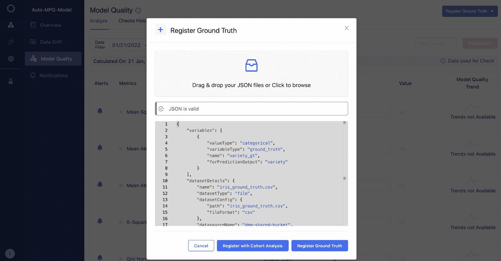
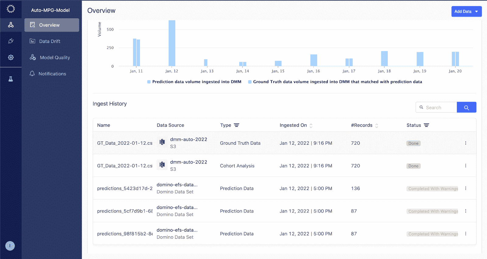
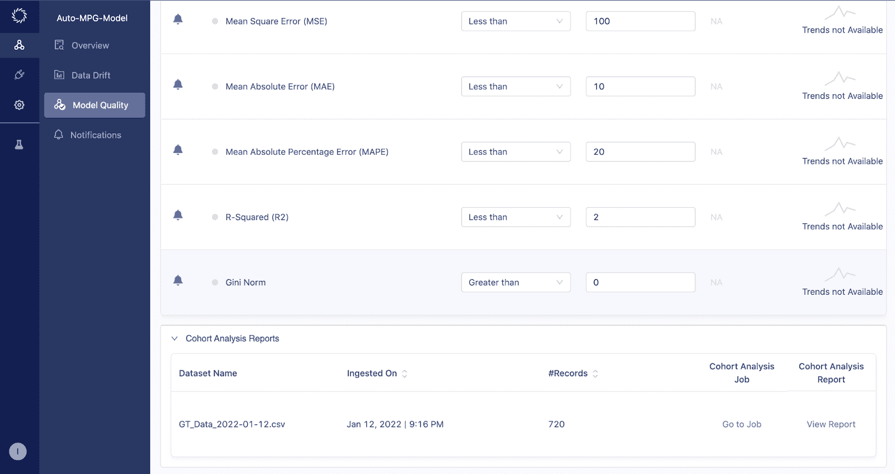
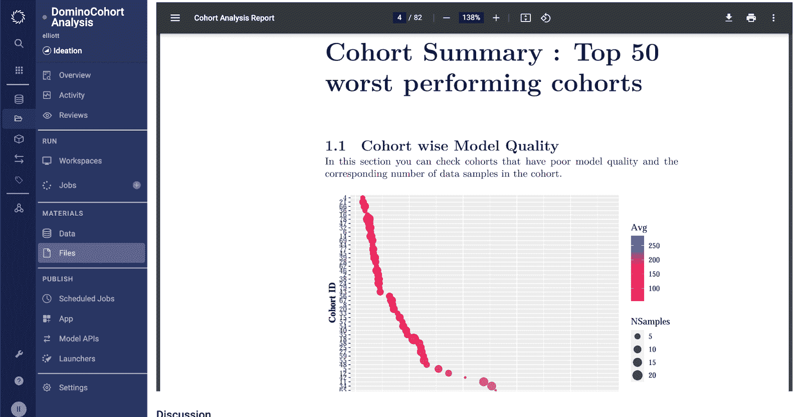
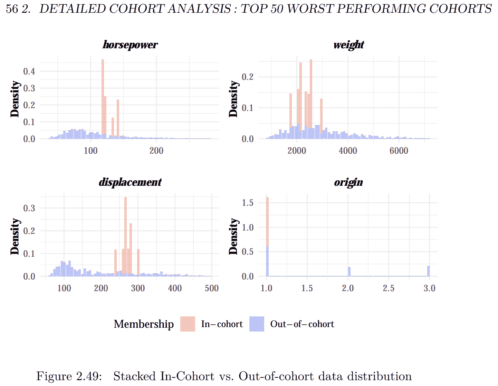
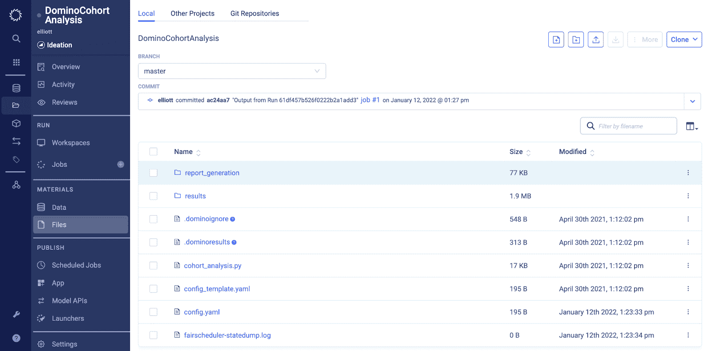

# Domino 5.0:加速模型漂移的根本原因分析

> 原文：<https://www.dominodatalab.com/blog/automated-model-insights>

## 在 Domino 5.0 中引入自动化模型质量洞察

模型经常被部署到处理大量数据的应用程序中。它们通常包含数百或数千个具有高度基数的特性。当这种复杂程度的模型没有按预期执行时，很难诊断根本原因。Domino 通过帮助数据科学家找到影响模型质量的输入数据组来解决这个问题。这使得数据科学家能够快速重新训练模型以考虑这些群组，从而提高模型的整体性能。

## 群组分析报告

Domino 自动生成一个报告，根据模型质量突出表现最差的群组(或部分)。对于每个群组，报告详细描述了该群组中形成影响模型准确性的热点的特征。通过将对比分数分配给群组中的每个特征，用户可以辨别模型质量与该群组之外的其余数据相比的差异。这有助于用户对群组和群组内的特征进行优先排序，以进一步调查并采取补救措施。

## 群组分析统计和定制

除了报告之外，Domino 还会自动建立一个项目，其中包括:

*   用于执行群组分析的 Python 代码
*   群组分析结果以 JSON 文件的形式呈现，这些文件代表了跨群组的汇总统计数据以及带有对比分数的每个群组的表现细节

数据科学家可以轻松定制群组分析代码以生成定制报告，或者使用这些报告的输出对模型进行深入的定制分析，然后进入补救步骤。

Domino 是 [企业 MLOps](https://www.dominodatalab.com/resources/a-guide-to-enterprise-mlops/) 平台，它无缝集成了代码驱动的模型开发、部署和监控，以支持快速迭代和最佳模型性能，因此公司可以确保从其数据科学模型中实现最大价值。

## 它是如何工作的

#### 注册数据以支持模型质量分析

### **登记预测**

为了生成模型质量分析，Domino 首先需要您注册预测数据和基本事实数据。对于在 [Domino 5.0](/resources/introducing-domino-5.0) 中构建并自动监控的模型，Domino 会自动为您注册预测数据。对于所有其他型号，请遵循此处 提供的 [说明。](https://docs.dominodatalab.com/en/latest/reference/model-monitoring/20-set-up-model-monitor/10-register-a-model.html)

### **用群组分析记录真实情况**

接下来，注册基础事实并触发模型质量分析。按照 [这里](https://docs.dominodatalab.com/en/latest/reference/model-monitoring/20-set-up-model-monitor/40-set-up-cohort-analysis-mm.html) 提供的步骤，用 Domino 注册地面真实数据，并触发群组分析。

### 访问群组分析报告

一旦地面真实数据集被成功摄取，群组分析报告将被创建。您可以在模型的概览页面中跟踪数据接收和群组分析生成的进度。

一旦基础数据和群组分析完成，您可以在模型的“模型质量”页面中访问报告。

点击“查看报告”链接，您可以看到包含详细群组分析的 PDF。

在此报告中，您可以深入到摘要页面中确定的每个群组，以了解影响模型性能的主要特征。

### 自定义报告和分析

除了易于访问和下载的报告之外，Domino 还允许您访问用于执行分析的代码以及 JSON 文件形式的群组统计数据。您可以复制代码和附带的统计数据，以创建自定义报告或作为模型修复工作的一部分。

### 结论

这些新功能通过提供可操作的见解，继续让经验丰富的数据科学家轻松构建高质量的模型。在自动化模型质量分析的帮助下，数据科学家可以了解数据中的数据段以及这些数据段中的特征，以便在继续优化模型时进行进一步调查。有了这些关键信息，他们可以选择用更新的数据集重新训练他们的模型，或者调整模型本身。