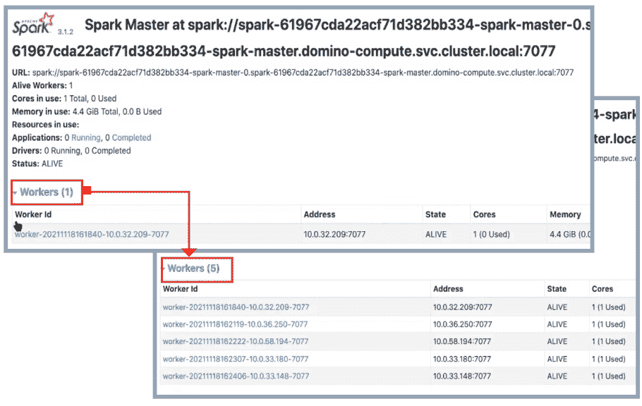

# Domino 5.0:利用自动扩展的分布式计算更快地开发更好的模型

> 原文：<https://www.dominodatalab.com/blog/autoscaling-compute-clusters>

## 在 Domino 5.0 中引入按需自动伸缩集群

由 Domino 的现场工程师 Alireza Mounesisohi 和 Domino 的解决方案架构师 Lakshmi Narayanan 于 2022 年 2 月 9 日在 [的产品更新](/blog/tag/product-updates)上发表

分布式计算集群为数据科学家提供了巨大的处理能力，通过更快地测试更多想法来解决复杂问题。然而，利用这种能力具有挑战性，因为:

*   数据科学家不得不等待集群变得可用，即使它通常在项目中处于闲置状态。
*   为分布式计算框架调配计算资源和管理包既复杂又耗时，并且需要丰富的开发运维技能。

[Domino 5.0](https://www.dominodatalab.com/resources/introducing-domino-5.0) 通过分布式计算自动伸缩帮助组织克服这些障碍。对于 Domino 5.0:

*   计算集群，包括最流行的分布式计算集群类型 Spark、Ray 和 Dask，可根据工作负载动态扩展和收缩，通过确保计算资源可用于任何需要它们的项目来提高数据科学家的工作效率。
*   消除根据预期峰值负载提交资源的需求，从而节约成本。

### 它是如何工作的

#### 计算节点的自动扩展

Domino 中最常见的自动伸缩用例之一是当用户有不同的机器学习工作负载并需要不同的计算资源时。借助 Kubernetes，用户可以拥有不同的节点池，每个节点池包含不同类型的实例。Domino 利用 Kubernetes 的功能来自动缩放计算节点，因此它们只在使用时才是活动的。

对于向外扩展，Domino 以给定的频率不断地寻找不可用的资源。如果没有可用的资源，Domino 会增加节点数量来满足资源请求。

举例来说，在下面的图 1 中，在 Domino 中创建的非 GPU 工作区将在“默认”节点池上运行。请注意，此处列出的实例属于“m5.2xlarge”类型，节点池仅为“default”和“platform”。

***图 1:使用中节点的 Domino 仪表盘***

对于“dominodatalab . com/Node-Pool”[Kubernetes 节点标签](https://kubernetes.io/docs/concepts/configuration/assign-pod-node/) 具有相同值的节点形成节点池。节点池字段中具有匹配值的执行将在这些节点上运行。Domino 依赖与 Kubernetes 集群相关的底层节点池中的节点标签来扩展计算节点。此外，硬件层控制 Domino 执行将在其上运行的底层机器类型。

现在，想象开始一个新的 GPU 工作空间(图 2)。Domino 将在底层节点池标记为“default-gpu”的节点上运行工作区。

***图 2:使用 GPU 硬件层*** 创建新的工作空间

创建此工作空间将触发 GPU 计算节点从 0 -> 1 向上扩展。(图 3)

***图 3:集群自动缩放器将触发 GPU 节点从 0->1*向上扩展**

一旦集群自动扩展了新节点并将其连接到 Kubernetes 集群(图 4 ), workspace pod 就会被调度到新节点

***图 4:Domino***的基础设施部分下面列出的新节点

集群自动缩放器跟踪节点上的资源请求。如果一个节点在 10 分钟(可配置)内未被利用，它将被终止。

如果满足以下所有条件，则节点被视为不需要:

*   在此节点上运行的所有 pod 的 CPU 和内存请求的总和小于节点可分配容量的 50%(注意:此阈值是可配置的)
*   在该节点上运行的所有窗格都可以移动到另一个节点
*   没有注释设置为禁用缩小( [参考](https://github.com/kubernetes/autoscaler/blob/master/cluster-autoscaler/FAQ.md#how-can-i-prevent-cluster-autoscaler-from-scaling-down-a-particular-node) )

因此，Domino 在任何给定时间都可以有效地平衡资源数量和需求。

#### 跨分布式计算框架自动扩展

除了使用集群自动缩放器自动缩放计算节点之外，Domino 5.0 还具有自动缩放 Spark、Ray 和 Dask 按需集群的能力。这将使数据科学家能够从小型集群开始，并根据工作需求的波动按需扩展。

Domino 利用了 Kubernetes 提供的水平 pod 自动伸缩功能，并支持针对[射线](https://ray.io/) 和 [Dask](https://dask.org/) 集群的分布式集群自动伸缩。当所有工作线程的平均 CPU/内存利用率超过 80 %(或管理员设置的目标[时),将触发一个扩展操作，直到达到为集群配置的最大工作线程数。当平均利用率低于目标时，就会触发缩减。](https://admin.dominodatalab.com/en/5.0.1/configuration/Central_configuration.html#compute-cluster-auto-scaling)

用户只需点击几下鼠标，就可以设置具有自动扩展分布式计算的集群。如图 5 所示，Domino 将启动一个包含三个 Dask workers 的集群，如果平均 CPU/内存利用率超过配置值，那么 worker 的数量将增加到最多五个 worker。

***图 5:在 Domino*** 中启用分布式集群的自动伸缩

Domino 将继续添加工作进程，直到达到最大工作进程限制。图 6 显示了一个示例，其中一个集群从一个工作线程开始，随着资源利用率阈值的超出，扩展到五个工作线程。

***图 6:在 Spark 集群*** 上放大资源的例子

### 结论

访问可扩展的计算基础架构对于数据科学家做他们最擅长的事情至关重要。Domino 通过满足底层计算需求，使用 Kubernetes 来扩展分布式计算集群，从而增强了数据科学家的能力。此外，管理基础架构的 IT 团队可以高枕无忧，因为他们知道 Kubernetes Cluster Autoscaler 只会在必要时加速节点，从而避免组织在未充分利用的资源上浪费资金。

提高 [模型速度](https://www.dominodatalab.com/blog/model-velocity) 的一个关键组成部分是精简集群的利用率。Domino 根据工作负载自动扩展计算集群，以简化配置、优化利用率和管理计算成本，从而最大化团队的生产力和计算投资的回报。

Domino 是 [企业 MLOps](https://www.dominodatalab.com/resources/a-guide-to-enterprise-mlops/) 平台，它无缝集成了代码驱动的模型开发、部署和监控，以支持快速迭代和最佳模型性能，因此公司可以确保从其数据科学模型中实现最大价值。

### 关于作者

|  | Alireza Mounesisohi 是 Domino 客户成功团队的现场工程师。他拥有加州大学戴维斯分校的机械和航空航天工程博士学位，在数据科学和机器学习方面有着广泛的背景。 |

|  | Lakshmi Narayanan 是 Domino 客户成功团队的解决方案架构师。他主要服务于 Domino 客户，为新的和现有的 Domino 安装/升级提供架构指导和最佳实践建议。工作之余，他喜欢户外活动，比如徒步旅行，并且痴迷于国际足联。 |