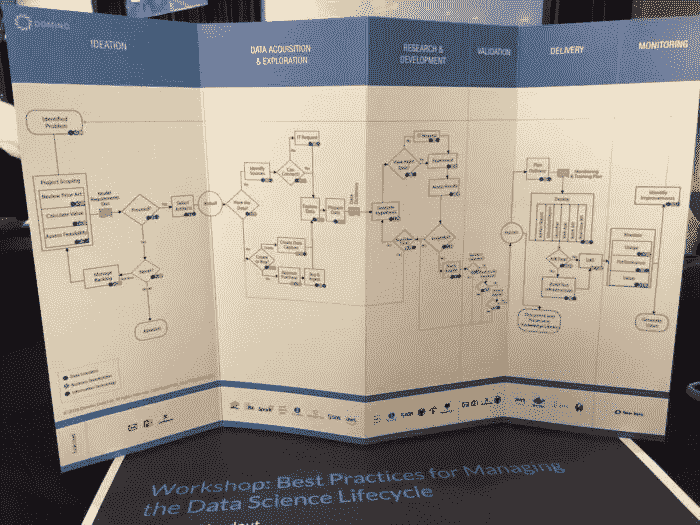

# 模型驱动:Rev 数据科学峰会的经验

> 原文：<https://www.dominodatalab.com/blog/being-model-driven-lessons-from-rev-data-science-summit>

By Angela Tran Kingyens, PhD, version one ventures on June 19, 2018 in

感谢 version one ventures 的 Angela Tran Kingyens 博士贡献了这篇客座博文。它最初发布到版本一站点[这里](https://versionone.vc/model-driven-ds/)。

几周前，我参加了由 [Domino](https://www.dominodatalab.com) 组织的 [Rev](https://rev.dominodatalab.com) 数据科学领导者和从业者峰会。我之前在博客上分享了去年活动(这是我参加过的最好的数据科学会议之一)的主要收获，包括如何[定义数据科学家](https://versionone.vc/domino-data-takeaways/)以及[数据科学和数据工程](https://versionone.vc/need-data-engineering-data-science/)之间的差异。

今年的核心主题之一是数据科学项目的管理。我以前从未这样想过，但事实上，模型是数据科学家的工作成果。

我最大的收获是认识到，当涉及到构建产品和业务时，重要的不仅是数据驱动，还有模型驱动。

> 模型驱动是什么意思？

如果数据是油，那么模型就是引擎。数据和代码可以被单位化，而模型则更复杂。模型是用数据和代码作为构建块有效地创建的。因此，不能像对待数据或代码一样对待模型，管理数据科学生命周期肯定有最佳实践。

一般来说，数据科学的整个生命周期可以分为以下几个阶段:

1.  **构思:**评估项目可行性和优先级时
2.  **数据采集和准备:**了解数据的可用性、可访问性和数据采集的成本
3.  **研发:**建立迭代的实验方法(包括假设生成、模型选择、KPI、标准)
4.  **验证:**严格评估数据假设、代码库、模型性能和预测结果
5.  **交付:**将模型的数学结果产品化(即，将模型部署到产品本身或作为报告和仪表板)
6.  **监控:**测量模型上线后对用户实际行为的影响

我们大多数人很可能只是有意策划了其中的几个阶段。虽然像这样建立一个全面的工作流程可能需要大量的工作，但最大的好处是我们可以真正衡量一切。这有望转化为所有利益相关者之间更高的效率和更有效的协作，以及更多的可审计性和可再现性。

[Twitter](/#twitter) [Facebook](/#facebook) [Gmail](/#google_gmail) [Share](https://www.addtoany.com/share#url=https%3A%2F%2Fwww.dominodatalab.com%2Fblog%2Fbeing-model-driven-lessons-from-rev-data-science-summit%2F&title=Being%20Model-Driven%3A%20Lessons%20from%20Rev%20Data%20Science%20Summit)