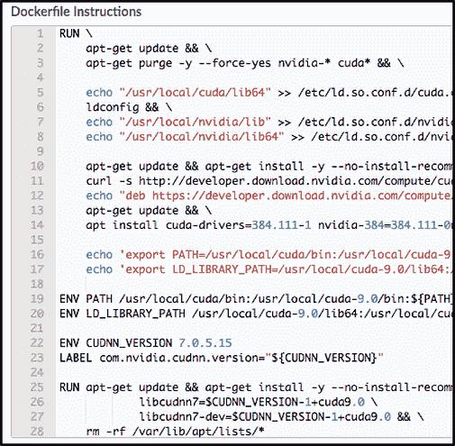
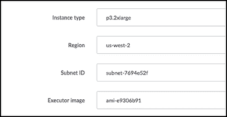

# 使用时尚 MNIST 对英伟达 CUDA 9 和亚马逊 EC2 P3 实例进行基准测试

> 原文：<https://www.dominodatalab.com/blog/benchmarking-nvidia-cuda-9-amazon-ec2-p3-instances-using-fashion-mnist>

*在这篇文章中，[Domino 数据实验室的首席数据科学家 Josh Poduska](https://www.linkedin.com/in/joshpoduska/) 写了关于使用时尚 MNIST 对 NVIDIA CUDA 9 和亚马逊 EC2 P3 实例进行基准测试的文章。如果对 Poduska 的其他见解感兴趣，他还将在 Strata New York 2018 上发表“[管理企业中的数据科学](https://conferences.oreilly.com/strata/strata-ny/public/schedule/detail/68930)”。*

## 介绍

也许你已经听说过 NVIDIA 的 CUDA 9 软件和亚马逊 EC2 P3 实例。据说，当被投入到训练深度学习网络的任务中时，它们快如闪电。

CUDA 是 NVIDIA 为 GPU 上的通用计算开发的并行计算平台和编程模型。CUDA 9 是下一个提升各种应用和产品性能的迭代。 [NVIDIA 声称 CUDA 9](https://developer.nvidia.com/cuda-toolkit/whatsnew) 提供了一些显著的优势，例如:

*   利用 [cuBLAS](https://developer.nvidia.com/cublas) 中的新 GEMM 内核加速深度学习。
*   为灵活的线程管理提供了新的编程模型。
*   改进的编译器和开发工具。
*   能够使用张量内核更快地执行人工智能应用，5X 比 Pascal GPUs 更快。

[亚马逊 P3 EC2](https://aws.amazon.com/ec2/instance-types/p3/) 实例使用新的[Volta GPU(NVIDIA Tesla V100)](https://www.nvidia.com/en-us/data-center/tesla-v100/)。亚马逊声称每个 P3 实例可以提供高达 1 petaflop 的混合精度性能。在内部基准测试中，与 CPU 相比，大型工作的深度学习培训从几天缩短到几分钟。

我决定让这两项技术在深度学习图像分类问题上进行测试，看看与上一代选项相比，我可以实现多大的性能提升。

## 决定方法

在寻找一个好的神经网络的过程中，数据科学家必须优化一个大的参数空间，包括网络类型、节点数量、层数、辍学率、数据扩充和学习率。在这个领域训练网络需要很多时间。此外，随着深度学习领域的发展，趋势是向更复杂的更深网络发展(例如，正在进行的关于[基因变异大型网络](https://arxiv.org/abs/1712.06563)的研究)。底线是计算性能是影响数据科学家构建精确神经网络能力的主要因素。

我选择在[时尚 MNIST](https://github.com/zalandoresearch/fashion-mnist) 数据集上运行我的测试，这是手写数字 MNIST 数据集的流行替代品，它提供了更大的准确性挑战。每个图像都是一件衣服，目标是正确地对图像进行分类。这是我的 Jupyter 笔记本中一些图片的快照。


大多数 MNIST 时尚的第一次尝试的网络可以达到大约 90%的准确率，并且只需要几分钟的训练时间。我想找到一个网络，将推动信封一点——一个需要更长的时间来训练，并提供更大的准确性比一个简单的 CNN。我看到了丹尼尔·科斯拉维(Danial Khosraivy)的一篇文章，他在文章中从 T2 的 VGG 有线电视新闻网(CNN)获得了灵感，并创建了一个类似 VGG 的有线电视新闻网(CNN)，在时尚 MNIST 的数据集上进行批量标准化和数据扩充。Mathew Cord 的这个[演示有一些有用的结构图来形象化 VGG 网络的样子。](http://thoth.inrialpes.fr/workshop/thoth2016/slides/cord.pdf)

我对丹尼尔的代码做了如下修改。

1.  添加了代码来传递一个用户参数，以方便运行实验。
2.  添加了一个计时器来记录构建模型所需的时间。
3.  添加了一个混淆矩阵，以查看哪里可以提高精确度。
4.  导出包含精确度和时间的 JSON 文件，以便可以轻松比较运行。
5.  为 CUDA 8 / P2 测试对 TF 1.4.1 进行了小的代码修改。¹

为了在 P3 实例上比较 CUDA 9，我在 P2 测试了 CUDA 8，在 P2 测试了 CUDA 9。该代码将原始训练数据分成 80/20 训练/验证，以检查过度拟合。该模型以 0.001 的学习率训练 10 个时期，然后以 0.0001 训练另外 10 个时期。在最初的 20 个时期之后，添加数据扩充，通过旋转、移动和缩放原始训练样本来生成新的训练样本。然后，根据这些新数据对其进行新一轮的训练。这种关于扩充数据的训练是基准测试中最长的部分。我想测试数据扩充对准确性和性能的影响，所以我将数据扩充下训练的历元数作为用户提供的参数。对于每个 CUDA/实例组合，我的测试计划涵盖了无增强、25 个增强时期和 50 个增强时期。

这是我的测试计划的布局。


您可以在 Domino Data Lab 试用网站上免费查看、运行和下载整个项目，包括代码(Domino 包含 AWS 成本)。除了查看项目文件，您还需要登录或注册。登录后，查看自述文件了解更多详细信息。

下面是构建类似 VGG 的 CNN 的代码快照。

```py
vgg_cnn = Sequential([

    Lambda(norm_input, input_shape=(28,28, 1)),

    Conv2D(32, kernel_size=(3, 3), activation='relu', padding='same', input_shape=input_shape),

    Conv2D(32, kernel_size=(3, 3), activation='relu', padding='same'),

    BatchNormalization(),Dropout(0.25),

    Conv2D(64, kernel_size=(3, 3), activation='relu', padding='same'),

    Conv2D(64, kernel_size=(3, 3), activation='relu', padding='same'),

    MaxPooling2D(pool_size=(2, 2)),Dropout(0.25),

    Conv2D(128, kernel_size=(3, 3), activation='relu', padding='same'),

    Conv2D(128, kernel_size=(3, 3), activation='relu', padding='same'),

    BatchNormalization(),Dropout(0.25),

    Conv2D(256, kernel_size=(3, 3), activation='relu', padding='same'),

    Conv2D(256, kernel_size=(3, 3), activation='relu', padding='same'),

    Conv2D(256, kernel_size=(3, 3), activation='relu', padding='same'),

    MaxPooling2D(pool_size=(2, 2)),

    Flatten(),

    Dense(512, activation='relu'),

    BatchNormalization(),

    Dropout(0.5),

    Dense(512, activation='relu'),

    BatchNormalization(),

    Dropout(0.5),Dense(10, activation='softmax')

])

```

### 在 Domino 中构建计算环境


### 在 Domino 中输入 Dockerfile 指令



### 在 Domino 中设置硬件层




### 在 Domino 中启动运行并传递参数


### 在 Domino
上并行运行(P3 C9 和 P2 C8 各有 50 个纪元同时运行)


### 运行时间和准确性记录在 Domino 中，以便于比较


### Domino 中自动捕获的配置细节

这是使用 Domino 进行基准测试的最有用的方面之一。当我运行基准测试并解决了一些问题(特别是让代码在 CUDA8 和 P2 上运行 TF 1.4.1)时，能够返回到之前的运行并查看运行所使用的确切环境和硬件层细节是非常有帮助的。这对再现性和导航我的项目是非常宝贵的。


## 基准测试结果

在每个设置下进行两次运行，总共 18 次运行。这两次运行的平均最终结果如下所示。在每个测试中，两次运行的模型训练时间几乎相同(这是该基准的主要目的)。准确性数字随着时代的增加而上升，但略有波动。


## 使用 domino 从木星内部进行视频比较

[https://fast.wistia.net/embed/iframe/2hy38hbw4o](https://fast.wistia.net/embed/iframe/2hy38hbw4o)