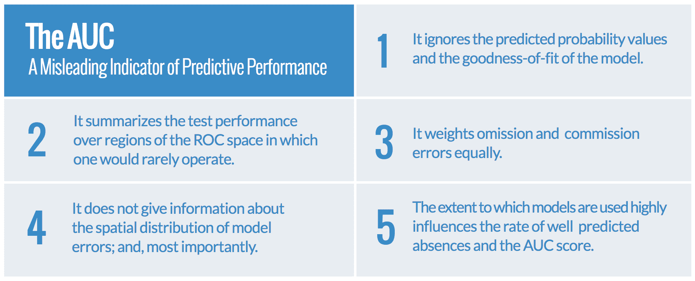
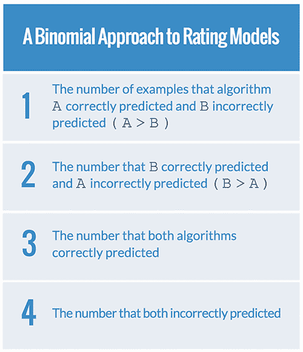

# 基准预测模型

> 原文：<https://www.dominodatalab.com/blog/benchmarking-predictive-models>

据说调试比编程更难。如果我们，作为数据科学家，在我们理解的极限下开发模型(“编程”)，那么我们可能不够聪明来有效地验证这些模型(“调试”)。

有大量令人眼花缭乱的预测建模技术和软件库可供我们构建模型。结果，在试图解决一个问题的过程中，我们很可能以多个模型告终。理解这些模型的性能是很重要的，并且提供一些关于它们中的哪一个将实现建模练习的业务目标的信心。这就是标杆管理的用武之地。

基准总是不完整和不全面的，但是如果我们小心的话，它们会在方向上是正确的:足够正确以至于我们可以做出正确的选择，并且通过这样做，使我们的组织更聪明、更高效，并且更受洞察力的驱动。

专门对机器学习模型进行基准测试是一项具有挑战性的工作。即使是使用、软件库、[超参数调整](/blog/towards-predictive-accuracy-tuning-hyperparameters-and-pipelines)或计算环境的简单变化也会导致行为的剧烈变化。**在本文中，我们将概述比较机器学习模型、执行基准测试以及确保实验可重复性的最佳实践。**

## 基准和系统特征

虽然对机器学习模型的预测性能进行基准测试很重要，但也有一些重要的操作约束需要考虑。这些包括模型的训练和运行时性能特征。也就是说，训练一个模型需要多长时间，对新数据进行评分需要多长时间，以及完成这两项所需的计算资源。

基准操作特性通常可能与评估模型的预测特性一样重要。例如，考虑在广告购买网络上的实时竞价的问题。bid 的总延迟预算(包括网络访问、数据库查询和预测)为 100 毫秒。在深度学习模型中计算预测花费的 80 毫秒可能意味着该模型不符合业务要求。尽管深度学习模型的预测能力有所提高，但在 5 毫秒内返回结果的逻辑回归模型可能更合适。只关注模型预测性能的基准会忽略将模型投入生产的这一重要方面。

## 实验环境

基准要求实验具有可比性、可测量性和可重复性。有了如此多的数据、[预测建模技术](/blog/introduction-to-predictive-modeling)、软件和超参数的潜在组合，数据科学家如何接近实验环境是很重要的。

容器为执行建模或评分过程的多次运行提供了一个框架，所有这些都使用完全相同的实验设置。这使得数据科学家可以使用聚合和平均来开发关于所需属性的更可靠的统计数据。实验的各个方面也可以以可控的方式逐渐改变。借助合适的计算硬件，可以同时运行多个实验，从而显著减少迭代时间。除了评估预测能力之外，许多容器技术还提供了记录训练模型和运行预测的操作特征的工具。这些包括使用的内存、存储 IO 性能和 CPU 利用率。

通常，机器学习模型在给定环境变化的情况下会表现不同。例如，当可用 CPU 内核、[GPU](https://www.dominodatalab.com/data-science-dictionary/gpu)或可用系统内存的数量发生变化时，依赖矩阵计算的模型将表现不同。如果底层 BLAS 库，如 OpenBLAS、Atlas 或英特尔 MKL 互换，也是如此。

容器允许数据科学家测试多个基准配置，所有这些配置都在计算环境中采用了不同的假设，并且以可重复的方式进行测试。

如果配置错误或使用不当，机器学习库使用的许多底层技术可能会扭曲实验结果。经常被误解的是并行性可能在机器学习软件栈中的何处以及如何表现。如果适当配置，许多 BLAS 和其他数学库可以利用多核 CPU。如果不小心确保所有 BLAS 库候选都配置了多线程，基准测试结果将会产生误导。

类似地，例如，如果底层 BLAS 库本身配置为多线程，则在模型级别试验并行化重采样的策略可能会导致 CPU 内核的操作线程超额预订。结果可能是运行时性能严重下降。

在设计实验时，应该考虑运行基准测试的底层硬件。与直接在专用硬件上运行实验相反，基准测试可以在共享的虚拟化资源上进行，如 [Amazon Web Services](/partners/sagemaker) 或企业数据中心的私有云。

虽然访问大量强大的 CPU 和近乎无限的存储可能很方便，但共享计算、网络和磁盘 IO 资源的性质要求我们在构建实验时进行一些思考。

基准流程可能需要运行多次，并使用一个聚合平滑度量(如中值)进行比较。

## 播种

值得重复的是，根据科学方法，基准应该是可重复的。许多机器学习模型利用来自随机数生成器的熵来启动解空间的搜索。

自动化分割训练、维持、测试数据集的库也是如此。出于基准测试的目的，这些随机数需要在所有运行中保持一致。大多数随机数生成器都支持设置一个种子，这就满足了这个目的。在 R 中，这是通过`set.seed`完成的，而在 Python 中，使用来自`random`包的`random.seed`。

## 挑选数据集

确保用于测试机器学习算法的数据集代表模型在生产中会遇到的数据，并在整个数据管道中保持这一点很重要。数据收集或转换过程中引入的任何偏差都可能导致选择在生产中表现不佳的模型。

通常，这种错误会被无意中引入到流水线中。例如，如果数据最初驻留在关系数据库中，那么应该注意不要从预先过滤的源中采样。例如，提取样本的分析数据库中的数据摄取过程可能已经删除了异常值或记录，以减少编码错误或满足业务规则。

基准必须包含训练集和测试集中未筛选的数据，这一点很重要。在所有数据都经过非代表性的清理过程之后，对模型的行为进行基准测试可能会导致较差的实际性能。

数据集泄漏是基准测试可能提供误导性结果的最隐蔽的方式之一。如果更复杂的模型，如梯度增强机器、随机森林或[深度神经网络](/blog/deep-learning-introduction)在有泄漏的数据集上训练，它们可能比更简单的模型在维持集上表现得更好。尽管没有对生产数据提供任何更大的预测能力。

实际上，更复杂的模型可能具有更大的能力来过度拟合在实际使用期间不会出现的泄漏趋势。基准数据集中如何引入这种泄漏的一个例子是使用不正确的测试/训练分割。给定一个时间序列数据集，使用简单的测试/训练分割，而不考虑时间序列本身，可能会引入泄漏。

在试图确定潜在的制造商质量缺陷时，应注意排除制造商接到质量问题通知之日后的数据。该数据的预测者可能已经对质量缺陷的一些潜在方面进行了编码，例如批号或零件类型，这可能以不对称的方式不适当地影响模型。对于这种泄漏，复杂模型可能比简单模型更健壮或更不健壮，并导致基准测试不能反映生产中的实际行为。

## 设定适当指标的基准

基准测试中经常犯的一个错误是测试和优化不能解决业务问题的指标。例如，在欺诈检测和医疗诊断中，假阴性可能比假阳性昂贵(或致命)许多倍。使用 AUC 进行基准测试可能会导致一些非常误导的结果。AUC 总结了一个模型在所有阈值上的预测能力，而在生产中，该模型将只使用一个阈值进行预测。在 *[AUC:预测分布模型性能的误导性度量](https://www.researchgate.net/publication/251768704_AUC_a_misleading_measure_of_the_predictive_distribution_models_Global_Ecol_Biogeogr)* 中，作者提供了 AUC 为何是评估模型预测能力的潜在不良指标的五个原因。

*对于许多机器学习问题来说，AUC 是一个弱的，而且经常误导的，真实世界预测性能的指标。*

因此，重要的是不要仅仅依赖 AUC 等指标，而是选择一个更准确地反映模型在生产中的行为的真实影响的指标。在 *[关于比较分类器:要避免的陷阱和推荐的方法](http://web.cs.iastate.edu/~honavar/salzberg.pdf) (PDF)* 中，萨尔茨伯格建议数据科学家应该使用二项式测试来对两个不同的模型进行评级。测试的细节超出了本文档的范围，但是对于任何计划比较不同分类器和模型的人来说，这篇文章都是值得一读的。

## 创建良好的基线

在 Quora 回答中，Peter Skomoroch 指出，比较简化基线模型的模型改进通常是有价值的，例如分类数据的 kNN 或朴素贝叶斯，或者时间序列数据中某个值的 EWMA。这些基线提供了对数据集可能的预测能力的理解。

这些模型通常需要少得多的时间和计算能力来训练和预测，这使它们成为一个有用的交叉检查答案的可行性。kNN 和朴素贝叶斯模型都不可能捕捉复杂的交互。然而，它们将提供对基准模型预测能力的最小界限的合理估计。

此外，本练习还提供了测试基准管道的机会。重要的是，基准管线为具有已知性能特征的模型提供稳定的结果。原始数据集上的 kNN 或朴素贝叶斯，或通过列居中或缩放进行的最低程度的操作，通常会提供弱但足够的学习器，其特征对于比较的目的是有用的。更复杂模型的特征可能不太为人所知，并被证明是具有挑战性的。

## 结论

随着大量的[建模技术](/blog/7-machine-learning-algorithms)和软件库可供数据科学家使用，人们倾向于开发一小组“常用”算法和工具，而不整体评估更大范围模型的优点。这就产生了采用次优解决方案的风险，这种解决方案可能无法实施，可能导致收入损失，甚至危及生命。pre

在本文中，我们探索了许多有效的基准测试模型的最佳实践:实验环境、数据管理、选择适当的度量标准，以及超越预测特性来研究模型如何在生产中使用。

我们希望这有助于构建一种谨慎、有条不紊且高效的基准模型方法，以实现数据科学的使命:帮助人们和组织通过数据做出更好的决策。