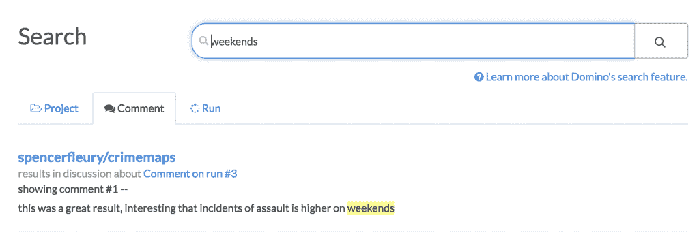
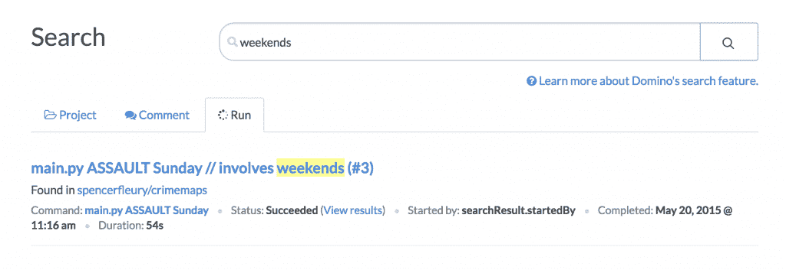

# 数据科学团队更好的知识管理

> 原文：<https://www.dominodatalab.com/blog/better-knowledge-management-data-science-teams>

我们很高兴地宣布了一系列重大的新功能，使您能够更轻松地在您的团队和组织中查找和重用过去的数据科学工作。我们将这些特性称为“可发现性”，它们包含了搜索、标记和获得相关分析工作建议的强大方法。

在本帖中，我们描述了这些特性在高层次上是如何工作的，并深入探究了它们背后的动机以及我们认为它们解决的常见挑战。这些特性在 [Domino](https://www.dominodatalab.com/?utm_source=blog&utm_medium=post&utm_campaign=better-knowledge-management-data-science-teams) 中都有；如果你有兴趣看他们的行动，注册一个[现场演示](https://www.dominodatalab.com/demo?utm_source=blog&utm_medium=post&utm_campaign=better-knowledge-management-data-science-teams)。

## 背景和动机:复合研究

任何在团队中工作过，看到同事来来去去，或者看到项目成倍增加的人都知道，当没有标准的地方放东西，没有“记录系统”时，找到过去的工作是多么令人沮丧你应该在 Dropbox 里找吗？谷歌文档？Github？也许只需搜索我的电子邮件或公司的维基页面？

这浪费时间。在某些情况下，很多。根据《知识世界》的一篇文章:

> 一些研究表明，知识工作者花在创建新报告或其他产品上的 90%的时间都花在了重新创建已经存在的信息上。1999 年，IDC 的一项欧洲研究考察了这一现象，称之为“知识工作赤字”，并得出结论，智力返工、不合标准的绩效和无法找到知识资源的成本为每个工人每年 5000 美元。

根据麦肯锡的一份报告“员工每天花 1.8 小时——平均每周 9.3 小时——搜索和收集信息。”

浪费时间对生产力的影响是一回事，但当你的工作对你的业务和竞争优势至关重要时，无法找到和重用过去的工作会导致更大的问题:它会降低你的研究改进速度。

为了说明原因，我们将使用 [finance](https://www.dominodatalab.com/finance/?utm_source=blog&utm_medium=post&utm_campaign=better-knowledge-management-data-science-teams) 中的一个概念:复利。复利导致投资呈指数增长，因为每增加一美元都会反馈到正在增长的基础金额中。

(来源:http://financesolutions.org/about-compound-interest/)

同样的概念也适用于您的分析工作:如果每个项目和工作产品都成为您公司集体知识的一部分，以便未来的同事可以轻松地构建、改进它或在它的基础上进行构建，那么您正在以指数速度混合您的知识并改进您的模型。

所以问题就变成了:你如何保证你的分析工作会被作为后续改进的起点，这样人们就不会再从头开始了？

## 搜索和浏览

为了让人们能够在过去的工作基础上更进一步，我们首先需要让他们找到过去的工作。有两种经典的方法:让人们组织或管理工作；让人们去寻找工作。(把这个想成“雅虎 vs 谷歌”的问题。)我们决定两者都允许:Domino 允许您用一组可定制的标记来标记您的项目，还允许您搜索所有项目的内容。

### 搜索

搜索是不言自明的，令人惊讶的强大。Domino 现在将索引您项目中的所有文件，以及元数据，如您的实验标题，以及关于您的结果的所有注释。

例如，假设我想尝试使用 matplotlib Python 包，我想找到可以复制或借鉴的示例来帮助我学习:

或者，如果我们希望找到过去的犯罪数据分析，这些数据与工作日和周末的犯罪事件之间的差异有关，我们可以搜索实验以及对结果的讨论:

当然，搜索尊重权限:你只能看到你被授权访问的项目的结果。安全性(只能看到允许您看到的内容)与可发现性(能够找到并重用相关工作)之间存在天然的矛盾。为了让组织在实施访问控制的同时最大限度地提高可发现性，我们提供了一种将项目设置为“可搜索”的方法，这样没有访问权限的人仍然可以通过搜索找到它们(从而知道它们的存在)，但需要请求访问权限才能查看项目内容。

### 磨尖

让用户标记东西听起来总是一个好主意——直到你手头有一大堆乱七八糟的东西。标签会很快成为不受管理的、冗余的、低质量的信息的沼泽。

为了解决这个问题，Domino 的标签解决方案支持“图书管理员”或“馆长”角色:一种特殊类型的管理员，可以管理标签并将某些标签指定为“受祝福的”，从而赋予它们特殊的地位。它是这样工作的:

正如你所料，研究人员可以标记他们的项目:

图书管理员可以管理整个标签列表，合并重复标签，将关键标签标记为“已批准”等。

“批准的”标签以不同的方式出现在用户界面中，以向用户发出他们更受信任的信号。例如，如果您正在标记一个项目，您的自动完成的建议将以绿色显示批准的标记:

当您搜索给定的标签时，已批准的标签将再次显示为绿色，因此您可以对该分类更有信心:

我们认为这种“监管”能力提供了两个世界的最佳之处:它允许自下而上的概念和层次结构的创建，以及自上而下的管理，以确保混乱不会失控。

### 背景和建议

如果你认为你应该寻找一些东西，搜索和浏览(通过标签或其他方式)是很棒的。然而，通常情况下，你甚至不会想到可能会有相关的工作需要你去做。

为了解决这个问题，我们的 discovery 特性集的最后一部分是一个更高级的项目门户，它不仅会显示您自己的项目，还会显示可能与您正在进行的工作相关的项目。因为我们知道你与谁合作过，以及你的项目涉及哪些主题，所以我们可以就可能与你相关的其他工作提出一些基本建议。

## 了解更多信息

我们听说越来越多的组织希望加快模型改进的步伐，以保持领先于竞争对手并更快地推动业务改进。随着这些组织的成长，我们相信“复合研究”将成为这些努力的关键。为此，我们计划继续投资于 Domino 中的“可发现性”和知识管理特性

目前，这些特性在 Domino 企业版中可用，您可以在自己的 AWS 虚拟私有云或自己的服务器上使用。如果你有兴趣试用它们，[请告诉我们](https://www.dominodatalab.com/demo?utm_source=blog&utm_campaign=demo&utm_medium=post&utm_content=discovery-post)。