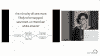

# 警察工作中的种族偏见:对伊利诺伊州交通拦截数据的分析

> 原文：<https://www.dominodatalab.com/blog/bias-policing-analysis-traffic-stop-data>

*[Mollie Pettit](https://www.linkedin.com/in/molliempettit/) ，Metis 的数据科学家和 D3.js 数据可视化讲师，带领数据科学家分析伊利诺伊州警察交通停车数据，呈现 2016 年芝加哥的故事叙事。Pettit 还讨论了数据科学家在分析数据和呈现故事叙述时，如何以及为什么需要深思熟虑并意识到假设。*

## 会话摘要

在芝加哥举行的[数据科学 PopUp](https://popup.dominodatalab.com/?utm_source=blog&utm_medium=post&utm_campaign=racial-bias-policing-analysis-illinois-traffic-stop-data) 上，Mollie Pettit 介绍了对 2016 年伊利诺伊州警察交通拦截数据进行的数据分析。佩迪特回顾了数据是如何收集的，如何在分析数据时挑战假设，以及在 2016 年芝加哥的数据中发现或没有发现偏差的情况。

会议的主要亮点包括

*   在芝加哥，黑人和西班牙裔司机的搜索率明显高于其他群体，但违禁品“命中”率最低
*   在芝加哥，黑人司机比其他种族的司机更不容易收到传票
*   在伊利诺伊州，黑人和西班牙裔司机通常更有可能被搜查，亚裔司机不太可能被搜查，而西班牙裔司机更有可能被引用
*   数据科学是一个迭代过程，包括通过不断提问来挑战假设

佩迪特在会议结束时提醒数据科学家考虑假设

“我只是想提醒人们，在做分析时，应该非常仔细地考虑他们对数据所做的假设。如果假设被忽略，那么讲述一个数据本身并不完全支持的故事是非常容易的，这是所有行业都要记住的事情，无论是与非营利组织还是保险公司合作。”

如需从会议中获得更多见解，请观看视频或通读演示文稿。

## 演示文稿的视频记录

大家好。我叫莫莉·佩迪特。我的推特账号是@MollzMP。如果你想对我发微博，请自便。我目前是 Metis 的 D3.js 数据可视化讲师。我也是一名数据科学家。我以前在 Datascope Analytics 工作，现在是 IDEO 的一部分。实际上，我就是用 Datascope 做了一个项目，今天我将向你们介绍这个项目。我们将关注警务中的种族偏见，特别是在分析伊利诺伊州的交通站数据时。

2016 年，伊利诺伊州发生了超过 200 万次警察交通拦截。每停一次，就有一名官员填写这张表格。我将带您浏览一下这个表格，因为它将帮助您了解我们正在处理的数据是什么样的。他们[军官]填了这张表格。他们猜到了比赛的车手；记录下司机被拦下的原因——超速行驶、系安全带、违反设备规定等等——警官是否进行了搜查；如果搜查，是否发现违禁品-违禁品可能是毒品、武器、赃物-然后采取什么行动。他们收到传票了吗？他们得到口头警告还是书面警告？这是我们必须处理的数据。

其他城市也研究了类似的数据——纽约时报、华盛顿邮报、德克萨斯论坛报、迈阿密新时报——来自其他城市的报告显示了交通堵塞的偏见。伊利诺伊州的数据反映了这一点吗？交通站数据中有种族偏见的证据吗？换句话说，少数族裔司机比白人司机更容易被拦下、搜查或传讯吗？我们对整个伊利诺伊州进行了分析，但对于这次演讲，我将专注于芝加哥，特别是 2016 年的数据。我们也考虑了其他年份，但是现在我们只考虑 2016 年。

同样，这个问题——实际上你可以把它想象成——这个图表——我们的议程。我们首先要看看谁被拦住了。稍后，我们将查看搜索和引用。那么，2016 年谁被停了？在此之前，我们先来看看芝加哥的人口。

在这个图形中，每种颜色代表一个不同的种族或民族。这里看到的比例反映了芝加哥人口的比例。在一个没有偏见的完美世界中，如果我们假设驾车人口反映了城市人口，我们会希望这两者看起来一样，停靠点会反映这一点。下图中看到的比例反映了停止人口的比例。停靠站人口中黑人司机的比例是城市中黑人司机比例的两倍……对不起，城市中的黑人居民。停靠站人口中白人司机的比例是该市白人居民比例的一半。

这里可能会出现一个问题——因为这本身就是一个有趣的图形，对吗？在底部，黑人司机停车加油的数量相比之下非常大…但是仅仅看这个就意味着偏见吗？我们认为，就其本身而言，并不完全是这样，我们将讨论为什么不是这样。

这里有几样东西。首先，我们看的是城市人口和停靠点人口。现在，为了暗示偏见，我们假设芝加哥的居住人口的人口统计数据与芝加哥的驾车人口的人口统计数据相同。事实是，我们实际上并不知道驾驶人口是多少。我们可以猜测，有很多种方法可以让这些猜测更准确，但这里有很多事情要考虑。

首先，谁使用公交？谁开车去上班？谁住得离工作地点近，谁住得离工作地点远，因此花在路上的时间更多？当查看芝加哥以外的城镇时，一个相关的问题可能是，这是一个免下车城镇吗？

也许这个城镇的大部分人口是白人，但经常有少数民族人口较多的邻近城镇的居民在上下班途中经过。这些因素使得驾驶人口很难确切知道，也很难直接与城市人口进行比较。此外，需要指出的另一点是，这些交通站点数据是由官员而不是司机报告的。人口普查数据由每个人报告，每个人是驾驶人口的子集。所以，因为这两个数据集是由完全不同的人群记录的，你不可能完全知道它们有多好或者没有关联。

更令人困惑的是，这两种形式对种族的定义略有不同。西班牙裔和拉丁裔是交通站表格上的种族，在人口普查表格上是种族。这使得数据匹配更加复杂。

好的。所以，当然，我到目前为止所说的是，就我到目前为止向你们展示的内容而言，还不足以暗示任何形式的偏见。当然，我们不知道确切的驾驶人数，这使得仅凭停车次数来推断偏见是不明智的。然而，我们确实有被拦下的人，我们知道警察对每个被拦下的人采取的策略，以及他们被拦下后发生了什么。

他们被搜查了吗？他们没有被搜查吗？他们被开罚单了吗？某个特定的群体更有可能被搜查或被开罚单吗？这就是我们认为可以更准确地检测出偏差并具有更大意义的地方。

我们将深入调查，看看谁被搜索过。从现在开始，当我谈论种族时，这是警官假设的种族。正如我们在这里看到的，在被拦下的黑人司机中，1.7%被搜查，西班牙裔司机 4.3%，白人司机 0.8%，亚裔司机 0.6%。

当一名警察在 2016 年让一个人靠边停车时，如果一个人是西班牙裔或黑人，他们肯定更有可能搜查他。

我想用另一种方式来描绘它，这样我们就可以和伊利诺伊州的其他地方进行比较。在 x 轴上，你会看到白色搜索率。在 y 轴上，少数民族搜索率，如果当我画一个部门时一切都相等，首先我们会显示芝加哥，然后如果一切都相等，那么它会落在相等的线上。如果高于这条线，少数族裔司机会被搜索到更高的搜索率，低于这条线，他们会被搜索到更低的搜索率。

芝加哥在哪里？芝加哥和这些价值观，特别是针对西班牙裔和黑人的价值观，确实表明了芝加哥警方在选择搜查对象时的种族偏见。是的，在你问之前，我们确实检查了统计显著性。黑人和西班牙人的搜索率明显不同于零，而亚洲人的搜索率差异较小，更接近你在公平系统中的预期。所以，让我们把整个芝加哥都吐出来。抱歉，整个伊利诺伊州。正如你所看到的，几乎所有警察部门搜查黑人和西班牙裔司机的比率都高于白人和亚裔司机。

对这种特殊测试的一个普遍批评是，它没有考虑是否有任何发现。一些批评家可能会说，如果这个群体的点击率也更高，那么这些更高的点击率是合理的，这是一些人可能会说的。我所说的命中率是指是否发现了违禁品。我们可以看看哪里发现了违禁品。

黑人和西班牙裔司机的违禁品发现率较低，尽管 2016 年黑人和西班牙裔司机更有可能被搜查。我会把它和伊利诺伊州的其他数据放在一起。它比我给你看的上一组稍微少了一点戏剧性，更多的部门聚集在平等线周围，但值得注意的是，伊利诺伊州的大多数部门在搜索黑人和西班牙裔司机时发现违禁品的比率确实低于白人司机。

最后一个我想探究的是谁被引用了。西班牙裔和白人司机更有可能被传讯，亚裔司机紧随其后。在被拦下的黑人司机中，他们不太可能收到传票。但仍然值得注意的是，由于黑人司机靠边停车的数量，他们收到了芝加哥超过一半的传票。如果我们把这些放在和以前一样的地块上，看看整个伊利诺伊州，总的来说，这里的情况更接近相等。在整个伊利诺伊州，西班牙裔司机是被引用最多的，芝加哥在这方面比其他部门更接近平等。

我今天给大家的主要总结是，2016 年在芝加哥，黑人司机在停车站人口中的比例是黑人居民在城市人口中比例的两倍。对黑人司机的搜查比任何其他群体都多，但违禁品命中率最低。与其他种族的司机相比，黑人司机收到的罚单比例要低得多。西班牙裔司机在芝加哥被搜索的可能性明显更大，在伊利诺伊州被引用的可能性也明显更大。还有很多其他的因素需要探索，其中很多我们都有，我只是没有展示给你们，还有一些我们希望继续挖掘的。

结论，我只是想提醒人们，在做分析时，应该非常仔细地考虑他们对数据所做的假设。如果假设被忽略，讲述一个数据本身并不完全支持的故事是非常容易的，这是所有行业都要记住的事情，无论是与非营利组织还是保险公司合作。这并不是说永远不应该做假设——有时候假设是必要的。见鬼，它们经常是必要的——但是明确它们是非常重要的。如果你想了解更多这方面的工作，这里有几个地方你可以找到——斯坦福开放政策项目和开放数据政策。这些是在这个领域做事情的其他人。如果你想查看伊利诺伊州的数据或了解更多，请随时联系我。感谢伊利诺伊州美国公民自由联盟为我们提供数据，并在这方面与我们合作。感谢 Datascope 的帮助和反馈。谢谢你听我说。

Domino 编辑注意:为了可读性，这篇文字经过了轻微的编辑。