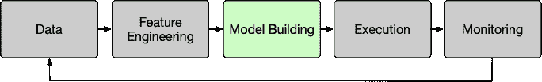
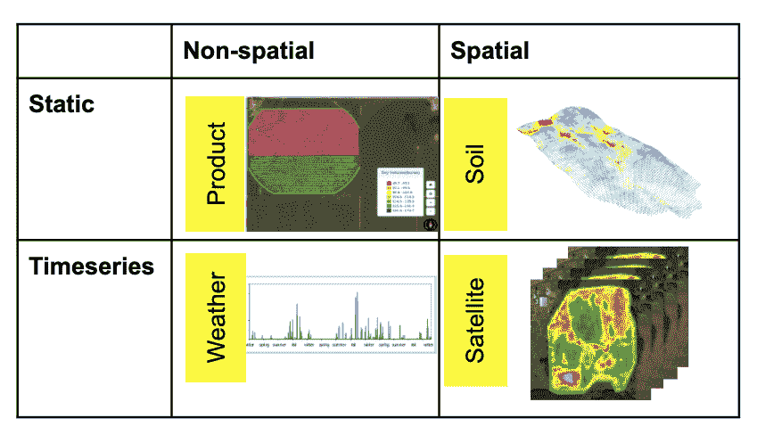
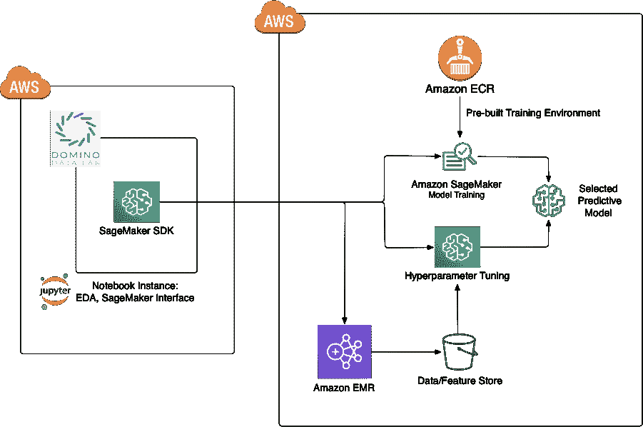
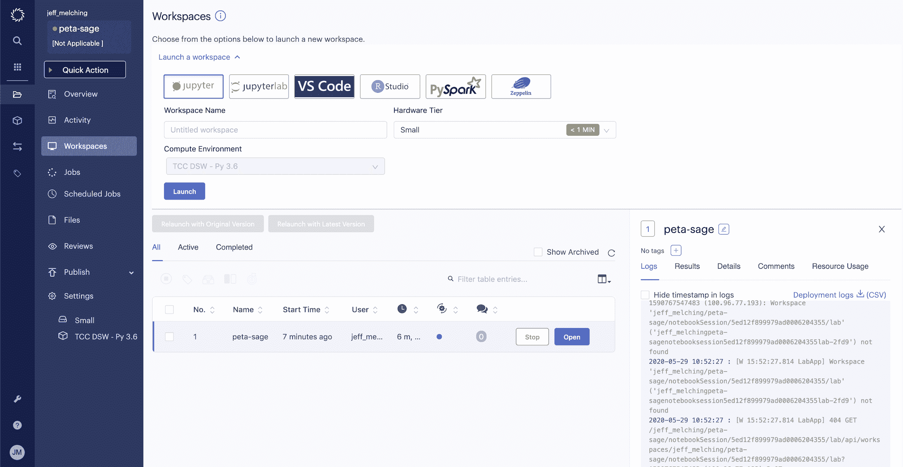

# 将机器学习引入农业

> 原文：<https://www.dominodatalab.com/blog/bringing-ml-to-agriculture>

在气候公司，我们的目标是帮助农民更好地理解他们的经营，做出更好的决策，以可持续的方式提高他们的作物产量。我们开发了一个模型驱动的软件平台，名为 [Climate FieldView](https://climate.com/) ，它可以为农民捕获、可视化和分析大量数据，并提供新的见解和个性化建议，以最大限度地提高作物产量。FieldView 可以整合特定于种植者的数据，例如从特殊设备流入的历史收获数据和操作数据，包括安装在拖拉机、联合收割机和其他农业设备上的(我们的 [FieldView Drive](https://climate.com/blog/introducing-climate-fieldview-drivetrade) )。它整合了公共和第三方数据集，如天气、土壤、卫星、海拔数据和专有数据，如我们从母公司拜耳获得的杂交种子的遗传信息。

通过我们的平台，农民可以了解特定施肥策略的影响，并根据需要进行调整。他们可以更早地发现潜在的问题区域，比如一块受到作物病害影响的土地，这样他们就可以迅速采取行动。农民可以确定他们应该在农场的哪个区域种植哪些种子，以获得每英亩的最大收益。

这些建议不仅对农民的钱包有好处；它们对环境也有好处。例如，我们的模型可以向农民展示如何在使用更少化肥的同时提高产量。

## 加速农业知识的获取

将机器学习引入农业领域是相对较新的事情。为了实现农业的数字化转型，我们必须在[整个模型生命周期](https://www.dominodatalab.com/blog/how-enterprise-mlops-works-throughout-the-data-science-lifecycle)中快速试验和学习。为此，我们制定了公司战略和架构，以加速从概念到商业化的整个模型流程。



^(图 1:模型生命周期)

*   **数据** -为公司的数据资产带来结构和组织，以支持 EDA(探索性数据分析)
*   **特性工程** -通过一套可重用的工具、库和基础设施，在整个公司范围内创建、共享和发现特性。
*   **模型构建** -高效、有效地训练和验证大规模模型
*   **执行** -通过尽快完成从发现到生产的过渡，深入了解客户的想法
*   **监控** -确保模型的行为符合预期，并了解何时需要改进

本文主要关注加速模型开发。

加速机器学习模型开发围绕两个主要因素:获取新知识的能力和发现他人产生的知识的能力。通过使发现新的见解和利用他人的见解变得简单和容易，网络效应被创建以加速未来的发现。

我们进行的每个实验、生成的每个功能和构建的每个模型都必须是公司的每个科学家都可以发现和使用的。其次，由于我们必须汇集的数据的多样性和数量，从种子的基因组、天气、土壤类型、管理实践、卫星和无人机图像(见图 2)的一切。)-数据和培训基础设施必须灵活、可扩展，同时消除不会增加知识获取周期的耗时任务。我们的目标是让数据科学家成为数据科学家，而不是数据或基础架构工程师。



^(图 2:气候公司的各种数据)

我们选择利用 Domino Data Lab、Amazon Web Services (AWS)和开源社区的最佳特性来解决这个知识加速问题。

## Domino 擅长可用性和发现

在 Climate Corporation，我们采用了预构建的 Domino 容器，并将其扩展到我们的环境中。从身份和访问管理(IAM)策略到通用包安装，再到 Amazon EMR 上 Spark 的连接，一切都可供科学家使用。只需点击一个按钮，他们就有了一个准备就绪的环境，Domino 为科学家提供了一个简单的扩展点来定制环境，而不需要了解 Docker 的复杂性。

多米诺在再现性和发现性方面大放异彩。一个项目的每一次运行都被记录和调用。实验和协作是该平台的核心。然而，真正的知识加速是通过发现平台上其他人的研究来实现的。通过简单的关键字搜索，科学家可以扫描项目、文件、合作评论、以前的运行、用户创建的标签等，以找到其他相关的研究或主题专家。

## 亚马逊 Sagemaker、亚马逊 EMR 上的 Spark 和 Petastorm speed 知识获取

如前所述，我们的领域包含大量各种形状和大小的数据，我们需要一种能够处理这种复杂性和规模的数据格式和培训平台。我们希望这个平台简单，能够与多种框架和我们现有的基础设施协同工作。我们需要一个[“可进化架构”](https://evolutionaryarchitecture.com/)，它将与下一个深度学习框架或计算平台一起工作。模型框架的选择或者在 1 台机器或 50 台机器之间的选择不需要任何额外的工作，对于科学家来说应该是相对无缝的。同样，一组特性应该可以被其他框架和技术重用，而不需要昂贵的格式转换。

### 为什么是 Sagemaker？

*   准备运行和可扩展的培训容器

如果您曾经尝试从头构建 TensorFlow 环境，您就会知道让所有依赖项和驱动程序的正确版本正常工作是多么困难。现在我们可以简单地选择一个[预建环境](https://github.com/aws/sagemaker-tensorflow-container)或者甚至扩展一个容器来添加[petastom](https://github.com/uber/petastorm)或者其他库，就像我们在这里[做的那样](https://github.com/TheClimateCorporation/peta-sage)。

*   即时培训基础设施

通过简单地更改对 SageMaker 的 API 调用中的配置，您可以创建具有不同 CPU、GPU、内存和网络容量组合的培训基础设施，从而为您提供选择适当资源组合的灵活性。这种能力提高了运营管理的效率，优化了实验成本。

*   [超参数调谐](https://docs.aws.amazon.com/sagemaker/latest/dg/automatic-model-tuning-how-it-works.html)

并行尝试超参数的多种组合而不是串行执行这些测试的内置能力通过提高实验效率极大地加速了模型构建过程。

### 为什么是 Petastorm？

我们的科学家和团队熟悉在 Spark 中处理 EMR，以及使用我们现有的[功能存储](https://www.dominodatalab.com/blog/an-introductory-guide-to-feature-stores)和数据仓库中的数据。Petastorm 使创建可互操作的数据集变得容易，这些数据集可以用于多种目的，而不必学习一套新的工具或以多种格式编写数据集(即 TFRecord 和 Parquet)。通过在 parquet 上创建一个薄层，Petastorm 数据可以用于 Spark SQL 查询或在深度学习培训工作流中工作，无需修改。因为它是 parquet，我们获得了 parquet 的所有好处，包括自描述模式和 IO 优化。为了全面了解 Petastorm 的好处，请查看这个[博客](https://eng.uber.com/petastorm/)。

## 把所有的放在一起

下面是使用 Domino、Petastorm 和 SageMaker 并使用 MNIST 数据集的示例工作流的摘录。完整示例可在[此处获得。](https://github.com/TheClimateCorporation/peta-sage)



*   在 Domino 中创建一个项目并启动一个工作区:



*   创建我们的 Petastorm 功能:

| 

```py
# Get training and test data

if mnist_data is None:
    mnist_data = {'train': download_mnist_data(download_dir, train=True),
'test': download_mnist_data(download_dir, train=False)}
```

```py
# The MNIST data is small enough to do everything here in Pythonfor dset, data in mnist_data.items():

    dset_output_url = '{}/{}'.format(output_url, dset)

    # Using row_group_size_mb=1 to avoid having just a single rowgroup in this example. In a real store, the value

    # should be similar to an HDFS block size.

    with materialize_dataset(spark, dset_output_url, MnistSchema, row_group_size_mb=1):

    # List of [(idx, image, digit), ...]

    # where image is shaped as a 28x28 numpy matrix

        idx_image_digit_list = map(lambda idx_image_digit: {

        MnistSchema.idx.name: idx_image_digit[0],

        MnistSchema.digit.name: idx_image_digit[1][1],

        MnistSchema.image.name: np.array(list(idx_image_digit[1][0].getdata()), dtype=np.uint8).reshape(28, 28)

        }, enumerate(data))

    # Convert to pyspark.sql.Row

    sql_rows = map(lambda r: dict_to_spark_row(MnistSchema, r), idx_image_digit_list)

    # Write out the result

    spark.createDataFrame(sql_rows, MnistSchema.as_spark_schema()) \

    .coalesce(parquet_files_count) \

    .write \

    .option('compression', 'none') \

    .parquet(dset_output_url)
```

 |

*   使用五台机器在 SageMaker 上训练:

| 

```py
kwargs = dict(entry_point=entry_point,

image_name=IMAGE_NAME,

role=IAM_ROLE,

sagemaker_session=sagemaker.Session(boto_session=boto_session),

train_instance_count=5,train_instance_type='ml.m5.xlarge',

framework_version='1.13',

hyperparameters={'dataset-url': DATASET_URL,'training_steps': training_step_count,'batch_size': batch_size,'evaluation_steps': 10,},

py_version = 'py3',

output_path = output_path,

code_location=code_location,

distributions={'parameter_server': {'enabled': True}})

mnist_estimator = TensorFlow(**kwargs)

# we're bypassing the conventional sagemaker input methods because we are using petastorm. We will show this in a moment.

mnist_estimator.fit(inputs=None)
```

 |

*   我们的 entry_point 脚本的关键部分，在这里我们读取 petastorm 数据集并将其转换为张量。

| 

```py
def streaming_parser(serialized_example):

    """Parses a single tf.Example into image and label tensors."""

    # 28 x 28 is size of MNIST example

    image = tf.cast(tf.reshape(serialized_example.image, [28 * 28]), tf.float32)

    label = serialized_example.digit

    return {"image": image}, label

def _input_fn<(reader, batch_size, num_parallel_batches):

    dataset = (make_petastorm_dataset(reader)

    # Per Petastorm docs, do not add a .repeat(num_epochs) here

    # Petastorm will cycle indefinitely through the data given `num_epochs=None`

    # provided to make_reader

    .apply(tf.contrib.data.map_and_batch(streaming_parser,

    batch_size=batch_size,

    num_parallel_batches=num_parallel_batches)))

    return dataset
```

 |

*   运行的结果自动保存在我的 Domino workspace 中，以实现可重复性，模型保存到亚马逊 S3，以便以后由我们的基础设施堆栈的其他部分推广到生产中。

## 下一步是什么？

通过遵循这种使基础设施与模型生命周期保持一致的模式，并通过数据、特性、模型和实验的民主化来关注加速知识获取过程，我们已经能够快速增加部署模型的数量以及年复一年部署它们所需的时间。对我们来说，下一个大胆的步骤将是减少围绕组合各种类型的时间、空间和非空间数据的特征工程挑战，以便我们的科学家在训练模型中使用。一旦创建了训练集，我们就有了在模型上快速迭代的基础设施，但是我们希望进一步从数据科学家的角色中消除数据工程任务，让他们成为数据科学家。

#### 附加链接

*   [花瓣风暴](https://github.com/uber/petastorm)
*   [https://github.com/TheClimateCorporation/peta-sage](https://github.com/TheClimateCorporation/peta-sage)