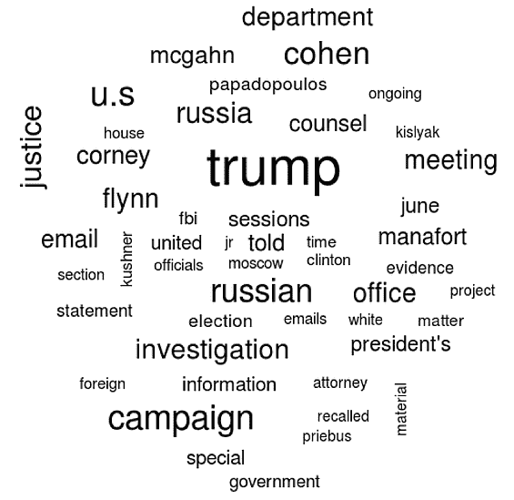

# 数据科学能帮助我们理解穆勒报告吗？

> 原文：<https://www.dominodatalab.com/blog/can-data-science-help-us-make-sense-of-the-mueller-report>

这篇博文提供了关于如何应用自然语言处理(NLP)技术的见解。

## 穆勒报告

[穆勒报告](https://en.wikipedia.org/wiki/Mueller_Report)，官方称为 ***关于调查** ***R* 俄罗斯干涉 2016 年总统选举*** 的报告，最近发布，给了公众比他们可能预期的更多的空间来得出自己的结论。在这篇博文中，我们提出了这个问题:“*数据科学能帮助我们理解穆勒报告吗？”*

丹尼尔·卡内曼， [Rev 主旨发言人，](https://rev.dominodatalab.com/?utm_source=google&utm_medium=cpc&utm_campaign=1676380239&utm_content=324864567101&utm_term=%2Bdomino%20%2Brev&device=c&group=70695718688)诺奖得主，[思考，快与慢](https://www.goodreads.com/work/quotes/16402639-thinking-fast-and-slow) *的作者，指出:“我们对世界有意义的令人欣慰的信念建立在一个安全的基础上:我们几乎无限的忽略自己无知的能力。”*以科学的方式收集和分析数据是战胜无知并得出自己结论的好方法。

顺便说一下，仍然有[个海报时段](https://domino-data-lab.typeform.com/to/RMhNXF)为 Rev. Rev 开放，欢迎提交涵盖从这份重要报告中提取的 NLP 见解的海报。还有，有兴趣参加 Rev 的可以在报名时使用折扣代码 Rev2019_100。

## 应用自然语言处理(NLP)

让我们通过遍历项目的 R 文件 boilerplate.R 开始我们的分析。那些喜欢 Python 的人可以使用 Domino 启动 Jupyter 会话，并使用 Mueller Report.ipynb 访问 Python 入门。特别感谢 Garrick Aden-Buie 的 [GitHub repo](https://github.com/gadenbuie/mueller-report) 提供的数据和一些数据科学同事提供的代码。

这里我们使用 R 及其 tidytext 和 tidyverse 库来开始我们的分析。首先，阅读通过这里的 R 代码预处理过的 csv 文件。处理后，每行代表报告中的一行文本。

```py
install.packages(c('tidytext', 'wordcloud', 'ggraph'))
library(tidytext)
library(tidyverse)
library(stringr)
library(wordcloud)
library(igraph)

muller_report <- read_csv("mueller_report.csv")
```

接下来，加载我们将从要分析的单词总列表中排除的常见停用词的数据集。将“trump”和“intelligence”添加到自定义停用词列表中，我们将在以后需要时使用。

```py
data("stop_words")

custom_stop_words <- bind_rows(data_frame(word=c("trump", "intelligence"),
lexicon=c("custom")),
stop_words)
```

通过 unnest_tokens()创建整洁的数据帧，该函数将带有文本列的数据帧转换为每行一个标记。也删除原来的停用词，并使用正则表达式过滤掉坏的行。

```py
tidy_muller <- muller_report %>% unnest_tokens(word, text) %>%
anti_join(stop_words) %>%
filter(!str_detect(word, "^\\d+$"))
```



创建前 50 个单词的数据框架和单词云。

```py
top_words <- tidy_muller %>% count(word, sort=TRUE)

top_words %>% with(wordcloud(word, n, max.words=50))
```

使用通用情感词典来获取报告中单个单词的情感，并显示排名靠前的负面和正面单词的图表。

```py
bing_word_counts <- tidy_muller %>% inner_join(get_sentiments("bing")) %>%
count(word, sentiment, sort=TRUE) %>%
ungroup()

bing_word_counts %>%
anti_join(custom_stop_words) %>%
group_by(sentiment) %>%
top_n(10) %>%
ungroup() %>%
mutate(word=reorder(word, n)) %>%
ggplot(aes(word, n, fill=sentiment)) +
geom_col(show.legend = FALSE) +
facet_wrap(~sentiment, scales="free_y") +
labs(y="Contribution to sentiment",
x=NULL) +
coord_flip() + theme_minimal() +
ggtitle("Sentiment Analysis of Words in the Muller Report",
"Basic Single Word Method, using Bing Lexicon")
```


通过从原始 csv 文件开始并再次调用 unnest_tokens()来创建二元图。这一次使用 ngrams 选项和 n=2 来给出二元模型。删除原来的停用词，并再次使用 regex 过滤坏行。添加计数列。建立图表。

```py
muller_bigrams <- muller_report %>%
unnest_tokens(bigram, text, token="ngrams", n=2) %>%
separate(bigram, c("word1", "word2"), sep = " ") %>%
filter(!word1 %in% stop_words$word) %>%
filter(!word2 %in% stop_words$word) %>%
filter(!str_detect(word1, "^\\d+$")) %>%
filter(!str_detect(word2, "^\\d+$"))

muller_bigrams_count <- muller_bigrams %>%
count(word1, word2, sort=TRUE)

bigram_graph <- muller_bigrams_count %>%
filter(n > 20) %>%
graph_from_data_frame()

bigram_graph

library(ggraph)

a <- grid::arrow(type="closed", length=unit(.15, "inches"))

ggraph(bigram_graph, layout="fr") +
geom_edge_link(aes(edge_alpha=n), show.legend=FALSE,
arrow=a, end_cap=circle(.07, "inches")) +
geom_node_point() +
geom_node_text(aes(label=name), vjust=1, hjust=1) +
theme_void()
```


接下来，我们通过页码来查看一个单词情绪的趋势。使用相同的单个单词情感词典，将每页的正面单词减去负面单词的总数相加，默认值为 0，并根据该页面的总数进行着色。

```py
muller_sentiment <- tidy_muller %>%
anti_join(custom_stop_words) %>%
inner_join(get_sentiments("bing")) %>%
count(page,index = line %/% 80, sentiment) %>%
spread(sentiment, n, fill = 0) %>%
mutate(sentiment = positive - negative)

ggplot(muller_sentiment, aes(page, sentiment, fill=sentiment)) +
geom_col(show.legend = FALSE) +
xlab("Page Number") +
ylab("Sentiment Score") +
ggtitle("Per Page Sentiment of Muller Report",
"Single word sentiment, Bing lexicon") +
theme_minimal()
```


最后看一下每个单词的 [tf-idf](https://www.tidytextmining.com/tfidf) 来确定哪些是最重要的。我们将根据报告的章节和卷进行细分，使用 regex 查找章节分隔符。

```py
muller_volume_1 <- muller_report %>% filter(page >= 19) %>% filter(page < 208)
muller_volume_2 <- muller_report %>% filter(page >= 221) %>% filter(page < 395)

muller_v1_tfidf <- muller_volume_1 %>%
filter(!is.na(text)) %>%
mutate(chapter=cumsum(str_detect(text,regex("^[IVX]+\\.", ignore_case=FALSE)))) %>%
unnest_tokens(word, text) %>%
filter(!str_detect(word, "^\\d+$")) %>%
count(chapter, word, sort=TRUE) %>%
bind_tf_idf(word, chapter, n)

muller_v1_tfidf %>%
filter(chapter != 0) %>%
group_by(chapter) %>%
top_n(7, tf_idf) %>%
ungroup() %>%
mutate(word=reorder(word, tf_idf)) %>%
ggplot(aes(word, tf_idf)) +
geom_col(show.legend=FALSE, fill = 'steelblue') +
labs(x=NULL, y="tf-idf") +
facet_wrap(~chapter, ncol=3, scales="free") +
coord_flip() +
ggtitle("7 Highest tf-idf words in each section of Volume 1 of Muller's Report",
"Partitioned by Chapter") + theme_minimal()

muller_v2_tfidf <- muller_volume_2 %>%
filter(!is.na(text)) %>%
mutate(chapter=cumsum(str_detect(text,regex("^[IVX]+\\.", ignore_case=FALSE)))) %>%
unnest_tokens(word, text) %>%
filter(!str_detect(word, "^\\d+$")) %>%
count(chapter, word, sort=TRUE) %>%
bind_tf_idf(word, chapter, n)

muller_v2_tfidf %>%
filter(chapter != 0) %>%
group_by(chapter) %>%
top_n(7, tf_idf) %>%
ungroup() %>%
mutate(word=reorder(word, tf_idf)) %>%
ggplot(aes(word, tf_idf)) +
geom_col(show.legend=FALSE, fill = 'steelblue') +
labs(x=NULL, y="tf-idf") +
facet_wrap(~chapter, ncol=3, scales="free") +
coord_flip() +
ggtitle("7 Highest tf-idf words in each section of Volume 2 of Muller's Report",
"Partitioned by Section") + theme_minimal()
```


## 结论

这应该让你开始调查穆勒报告。如果你在寻找进一步分析的建议，考虑寻找公众心中问题的答案。例如，分析总结报告作者对特定主题的看法，如特朗普总统参与了公认的俄罗斯竞选干预。这是第二卷的重点。也许数据科学可以揭示报告作者在这个热门话题上的倾向。开心挖矿！

*^(多米诺编者按:[寻求真理，讲真话](https://www.dominodatalab.com/careers/)是多米诺的核心价值观之一，这也体现在我们严谨的内容分析上。如果对与本帖内容类似的其他见解和内容感兴趣，请考虑使用折扣代码 Rev2019_100 注册参加 [Rev、](https://rev.dominodatalab.com/)我们的数据科学领导者峰会。)*