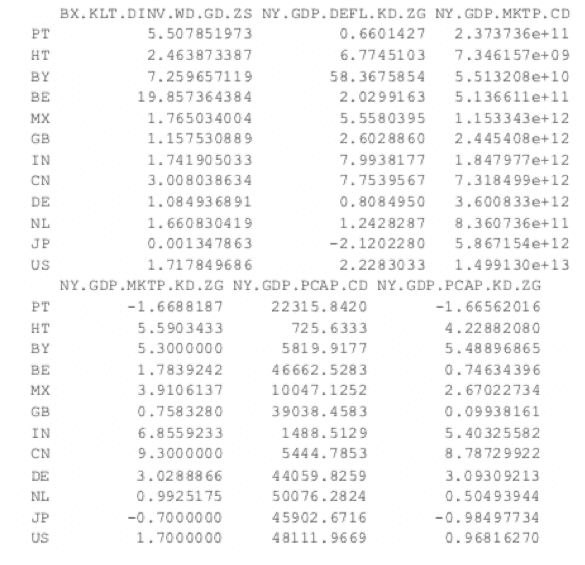

# R 中的聚类

> 原文：<https://www.dominodatalab.com/blog/clustering-in-r>

## 介绍

聚类是一种机器学习技术，使研究人员和数据科学家能够划分和分割数据。进行探索性分析时，将数据分成适当的组是一项核心任务。当 Domino 寻求支持加速数据科学工作(包括核心任务)时，Domino 联系了 Addison-Wesley Professional(AWP)Pearson，以获得适当的权限，从书中摘录“集群化”，*[R for every one:Advanced Analytics and Graphics，Second Edition](http://www.informit.com/store/r-for-everyone-advanced-analytics-and-graphics-9780134546926?utm_source=Referral&utm_medium=DominoLabs&utm_campaign=r4everyone)* 。AWP·皮尔逊提供了适当的许可来摘录这本书，并提供了一个补充的 Domino 项目。

[](https://cta-redirect.hubspot.com/cta/redirect/6816846/d8afdc5e-b3f5-45fc-a704-8e3101d4eda1) 

## 使聚集

聚类在现代机器学习中起着重要作用，它是将数据划分成组。这可以通过多种方式实现，最流行的两种方式是 [K-means](https://stanford.edu/~cpiech/cs221/handouts/kmeans.html) 和[层次聚类](https://nlp.stanford.edu/IR-book/html/htmledition/hierarchical-clustering-1.html)。就数据帧而言，聚类算法找出哪些行彼此相似。被分组在一起的行应该彼此具有高相似性，而与分组之外的行具有低相似性。

## R 中的 k-均值聚类

一种比较流行的聚类算法是 K-means。它根据某种距离度量将观察结果分成离散的组。对于这个例子，我们使用来自加州大学欧文分校机器学习知识库的葡萄酒数据集，该数据集可在[http://archive.ics.uci.edu/ml/datasets/Wine](ttp://archive.ics.uci.edu/ml/datasets/Wine)获得。

```py
> wineUrl <- 'http://archive.ics.uci.edu/ml/machine-learning-databases/wine/wine.data'

> wine <- read.table(wineUrl, header=FALSE, sep=',',

+                    stringsAsFactors=FALSE,

+                    col.names=c('Cultivar', 'Alcohol', 'Malic.acid',

+                    'Ash', 'Alcalinity.of.ash',

+                    'Magnesium', 'Total.phenols',

+                    'Flavanoids', 'Nonflavanoid.phenols',

+                    'Proanthocyanin', 'Color.intensity',

+                    'Hue', 'OD280.OD315.of.diluted.wines',

+                    'Proline'

+ ))
```

```py
> head(wine)
```


因为第一列是栽培品种，这可能与群体成员关系太密切，所以我们将其排除在分析之外。

```py
> wineTrain <- wine[, which(names(wine) != "Cultivar")]

```

对于 K-means，我们需要指定聚类的数量，然后算法将观察值分配到这些聚类中。有一些启发式规则可以用来确定聚类的数量，我们将在后面讨论。现在我们将选择三个。在`R`中，K-means 是通过名副其实的 **kmeans** 函数完成的。它的前两个参数是要聚类的数据，必须全部是`numeric` (K-means 不适用于分类数据)，以及中心(聚类)的数量。因为聚类中有随机成分，所以我们设置种子来生成可重复的结果。

```py
> set.seed(278613)

> wineK3 <- kmeans(x=wineTrain, centers=3)

```

打印 K-means 对象会显示分类的大小、每列的分类平均值、每行的分类成员以及相似性度量。

```py
> wineK3

```


绘制 K-means 聚类的结果可能很困难，因为数据的维数很高。为了克服这个问题，**有用的**中的`plot.kmeans`函数执行多维缩放，将数据投影到二维空间中，然后根据聚类成员对点进行颜色编码。这如图 25.1 所示。

```py
> library(useful)

> plot(wineK3, data=wineTrain)

```


如果我们传递原始的葡萄酒数据，并指定`Cultivar`是真正的会员资格列，点的形状将由`Cultivar`编码，因此我们可以看到它与图 25.2 中的颜色相比如何。颜色和形状之间的强相关性将指示良好的聚类。

```py
> plot(wineK3, data=wine, class="Cultivar")

```


K-means 可能会受到随机启动条件的影响，因此使用多次随机启动来运行 k-means 被认为是一种很好的做法。这是通过`nstart`参数实现的。

```py
> set.seed(278613)

> wineK3N25 <- kmeans(wineTrain, centers=3, nstart=25) > # see the cluster sizes with 1 start

> wineK3$size
```

```py
[1] 62 47 69
```

```py
> # see the cluster sizes with 25 starts

> wineK3N25$size
```

```py
[1] 62 47 69
```

对于我们的数据，结果没有变化。对于其他数据集，启动次数会产生显著影响。

选择正确数量的簇对于获得良好的数据分区非常重要。根据哥伦比亚大学统计系主任、现任文理学院院长和统计学教授大卫·马迪根(David Madigan)的说法，确定最佳聚类数的一个很好的指标是哈迪根规则(J. A .哈迪根是最流行的 K-means 算法的作者之一)。它本质上是比较具有 *k* 个聚类和具有 *k* + 1 个聚类的类内平方和的比率，说明行和类的数量。如果这个数字大于 10，那么就值得使用 *k* + 1 个集群。如果做得不正确，重复拟合可能是一件苦差事，而且计算效率很低。**有用的**包有`FitKMeans`功能来做这件事。结果绘制在图 25.3 中。

```py
> wineBest <- FitKMeans(wineTrain, max.clusters=20, nstart=25, + seed=278613) > wineBest

```


```py
> PlotHartigan(wineBest)

```


根据这一指标，我们应该使用 13 个集群。同样，这只是一个经验法则，不应该严格遵守。因为我们知道有三个品种，所以选择三个品种群是很自然的，因为有三个品种。然而，三个聚类的聚类结果只是很好地将聚类与栽培品种进行了对比，因此可能不太适合。图 25.4 显示了左侧向下的聚类分配和顶部的品种。栽培品种 1 在它自己的簇中大多是单独的，栽培品种 2 只是稍微差一点，而栽培品种 3 一点也不聚在一起。如果这真是一个很好的拟合，对角线将是最大的部分。

```py
> table(wine$Cultivar, wineK3N25$cluster)

```


```py
> plot(table(wine$Cultivar, wineK3N25$cluster),

+      main="Confusion Matrix for Wine Clustering",

+      xlab="Cultivar", ylab="Cluster")

```


哈蒂根规则的替代方法是间隙统计，它将数据聚类的类内相异度与数据自举样本的类内相异度进行比较。它在衡量现实和期望之间的差距。这可以使用集群中的 clusGap 来计算(仅适用于数字数据)。这需要一点时间来运行，因为它正在做大量的模拟。

```py
> library(cluster)

> theGap <- clusGap(wineTrain, FUNcluster=pam, K.max=20) > gapDF <- as.data.frame(theGap$Tab) > gapDF

```


图 25.5 显示了一些不同集群的差距统计。最佳聚类数是在最小化间隙的聚类数的一个标准误差内产生间隙的最小数。


```py
> # logW curves

> ggplot(gapDF, aes(x=1:nrow(gapDF))) +

+     geom_line(aes(y=logW), color="blue") +

+     geom_point(aes(y=logW), color="blue") +

+     geom_line(aes(y=E.logW), color="green") +

+     geom_point(aes(y=E.logW), color="green") +

+     labs(x="Number of Clusters")

>

> # gap curve

> ggplot(gapDF, aes(x=1:nrow(gapDF))) +

+     geom_line(aes(y=gap), color="red") +

+     geom_point(aes(y=gap), color="red") +

+     geom_errorbar(aes(ymin=gap-SE.sim, ymax=gap+SE.sim), color="red") +

+     labs(x="Number of Clusters", y="Gap")

```

对于该数据，0.1952376 的最小间隙是用于具有五个聚类的聚类。在这种情况下，在最小值的一个标准误差内不存在具有较少聚类的聚类。因此，根据差距统计，五个聚类对于该数据集是最佳的。

## 围绕水母的分割(PAM)

K-means 聚类的两个问题是它不能处理分类数据，并且容易受到离群值的影响。另一种选择是 K-medoids。聚类的中心不是聚类的平均值，而是聚类中的一个实际观测值。这类似于中位数，中位数同样对异常值具有鲁棒性。

最常见的 K-medoids 算法是围绕 medoids 划分(PAM)。**集群**包包含 **pam** 函数，用于在 Medoids 周围执行分区。在这个例子中，我们查看了世界银行的一些数据，既包括 GDP 等数字指标，也包括地区和收入水平等分类信息。

现在，我们使用国家代码从世界银行下载一些使用 **WDI** 的指标。

```py
> indicators <- c("BX.KLT.DVNV.WD.GD.ZS", "NY.GDP.DEFL.KD.ZG", + "NY.GDP.MKTP.CD", "NY.GDP.MKTP.KD.ZG" + "NY.GDP.MKTP.CD", "NY.GDP.MKTP.KD.ZG" + "TG.VAL.TOTL.GD.ZS") > library(WDI)

>

> # pull info on these indicators for all countries in our list

> # not all countries have information for every indicator

> # some countries do not have any data

> wbInfo <- WDI(country="all", indicator=indicators, start=2011, + end=2011, extra=TRUE) > # get rid of aggregated info

> wbInfo <- wbInfo[wbInfo$region != "Aggregates", ] > # get rid of countries where all the indicators are NA

> wbInfo <- wbInfo[which(rowSums(!is.na(wbInfo[, indicators])) > 0), ]

> # get rid of any rows where the iso is missing

> wbInfo <- wbInfo[!is.na(wbInfo$iso2c), ]

```

数据有一些缺失值，但幸运的是 **pam** 很好地处理了缺失值。在运行聚类算法之前，我们进一步清理数据，使用国家名称作为`data.frame`的行名，并确保分类变量是具有适当`levels`的`factors`。

```py
> # set rownames so we know the country without using that for clustering

> rownames(wbInfo) <- wbInfo$iso2c > # refactorize region, income and lending

> # this accounts for any changes in the levels

> wbInfo$region <- factor(wbInfo$region) > wbInfo$income <- factor(wbInfo$income) > wbInfo$lending <- factor(wbInfo$lending)

```

现在，我们使用集群包中的 **pam** 来拟合集群。图 25.6 显示了结果的轮廓图。与 K-means 一样，使用 PAM 时需要指定聚类数。我们可以使用 Gap statistic 之类的方法，尽管我们将选择 12 个聚类，因为这略小于数据行数的平方根，这是聚类数的一个简单启发式方法。每条线代表一个观察值，每组线就是一个聚类。很好地符合聚类的观察值具有大的正线，而不太符合聚类的观察值具有小的或负的线。聚类的平均宽度越大，意味着聚类越好。

```py
> # find which columns to keep

> # not those in this vector

> keep.cols <- which(!names(wbInfo) %in% c("iso2c", "country", "year", + "capital", "iso3c")) > # fit the clustering

> wbPam <- pam(x=wbInfo[, keep.cols], k=12, + keep.diss=TRUE, keep.data=TRUE) >

> # show the medoid observations

> wbPam$medoids

```




```py
> # make a silhouette plot

> plot(wbPam, which.plots=2, main="")

```


因为我们处理的是国家级别的信息，所以在世界地图上查看聚类会很有帮助。由于我们正在使用世界银行的数据，我们将使用世界银行的世界形状文件。它可以像下载其他文件一样在浏览器中下载，也可以使用`R`下载。虽然这可能比使用浏览器慢，但如果我们必须以编程方式下载许多文件，这可能会很好。

```py
> download.file(url="http://jaredlander.com/data/worldmap.zip",

+ destfile="data/worldmap.zip", method="curl")

```

文件需要解压，可以通过操作系统或者在`R`中完成。

```py
> unzip(zipfile="data/worldmap.zip", exdir="data")

```

在这四个文件中，我们只需要担心以`.shp`结尾的那一个，因为 R 会处理其余的。我们使用来自 **maptools** 的**readshapespacific**来读取它。


```py
> library(maptools)

> world <- readShapeSpatial( + "data/world_country_admin_boundary_shapefile_with_fips_codes.shp" + ) > head(world@data)

```

世界银行 shapefile 中的两位数代码和使用 **WDI** 提取的世界银行数据中的两位数代码之间存在明显的差异。值得注意的是，奥地利应该是“AT”，澳大利亚应该是“AU”，缅甸应该是“MM”，越南应该是“VN”等等。

```py
> library(dplyr)

> world@data$FipsCntry <- as.character(

+     recode(world@data$FipsCntry,

+            AU="AT", AS="AU", VM="VN", BM="MM", SP="ES",

+            PO="PT", IC="IL", SF="ZA", TU="TR", IZ="IQ",

+            UK="GB", EI="IE", SU="SD", MA="MG", MO="MA",

+            JA="JP", SW="SE", SN="SG")

+ )

```

为了使用 [**ggplot2**](https://www.dominodatalab.com/data-science-dictionary/ggplot) 我们需要将这个 shapefile 对象转换成一个`data.frame`，这需要几个步骤。首先，我们根据数据的行名创建一个名为`id`的新列。然后我们使用大卫·罗宾逊写的扫帚包中的整洁函数，将它转换成一个`data.frame`。扫帚包是一个伟大的通用工具，用于将 R 对象，如`lm`模型和`kmeans`簇，转换成漂亮的矩形`data.frames`。

```py
> # make an id column using the rownames

> world@data$id <- rownames(world@data) > # convert into a data.frame

> library(broom)

> world.df <- tidy(world, region="id") > head(world.df)

```


现在，我们可以采取步骤加入来自聚类和原始世界银行数据的数据。

```py
> clusterMembership <- data.frame(FipsCntry=names(wbPam$clustering), + Cluster=wbPam$clustering, + stringsAsFactors=FALSE) > head(clusterMembership)

```


```py
> world.df <- left_join(world.df, clusterMembership, by="FipsCntry") > world.df$Cluster <- as.character(world.df$Cluster) > world.df$Cluster <- factor(world.df$Cluster, levels=1:12)

```

构建绘图本身需要一些 **ggplot2** 命令来正确格式化。图 25.7 显示了地图，颜色编码的集群成员；灰色国家要么没有世界银行的信息，要么没有正确匹配
的两个数据集。


```py
> ggplot() +

+    geom_polygon(data=world.df, aes(x=long, y=lat, group=group,

+                                    fill=Cluster, color=Cluster))

+    labs(x=NULL, y=NULL) + coord_equal() +

+    theme(panel.grid.major=element_blank(),

+          panel.grid.minor=element_blank(),

+          axis.text.x=element_blank(), axis.text.y=element_blank(),

+          axis.ticks=element_blank(), panel.background=element_blank())

```

与 K-means 非常相似，必须指定 K-medoids 聚类中的聚类数。使用由 **pam** 返回的相异信息，可以构建类似于哈迪根规则的东西。


## R 中的层次聚类

层次聚类在聚类中构建聚类，不像 K-means 和 K-medoids 那样需要预先指定数量的聚类。分层聚类可以被认为是一棵树，并显示为一个树状图；在顶部，只有一个由所有观察值组成的聚类，而在底部，每个观察值都是一个完整的聚类。介于两者之间的是不同层次的聚类。
使用葡萄酒数据，我们可以建立与 **hclust** 的聚类。结果如图 25.8 中的树状图所示。虽然文本很难看到，但它在末端节点标记了观察结果。

```py
> wineH <- hclust(d=dist(wineTrain)) > plot(wineH)

```


层次聚类也适用于分类数据，如国家信息数据。但是，它的相异度`matrix`必须有不同的计算方法。树状图如图 25.9 所示。

```py
> # calculate distance

> keep.cols <- which(!names(wbInfo) %in% c("iso2c", "country", "year", + "capital", "iso3c")) > wbDaisy <- daisy(x=wbInfo[, keep.cols]) >

> wbH <- hclust(wbDaisy) > plot(wbH)

```


有许多不同的方法可以计算聚类之间的距离，它们会对层次聚类的结果产生重大影响。图 25.10 显示了四种不同连接方法的结果树:单一、完全、平均和质心。一般认为平均联系是最合适的。

```py
> wineH1 <- hclust(dist(wineTrain), method="single") > wineH2 <- hclust(dist(wineTrain), method="complete") > wineH3 <- hclust(dist(wineTrain), method="average") > wineH4 <- hclust(dist(wineTrain), method="centroid") >

> plot(wineH1, labels=FALSE, main="Single")

> plot(wineH2, labels=FALSE, main="Complete")

> plot(wineH3, labels=FALSE, main="Average")

> plot(wineH4, labels=FALSE, main="Centroid")

```


切割由分层聚类产生的结果树将观察结果分成定义的组。有两种方法可以剪切它:要么指定簇的数量，这决定了剪切发生的位置，要么指定在哪里进行剪切，这决定了簇的数量。图 25.11 演示了通过指定聚类数来切割树。

```py
> # plot the tree

> plot(wineH)

> # split into 3 clusters

> rect.hclust(wineH, k=3, border="red") > # split into 13 clusters

> rect.hclust(wineH, k=13, border="blue")

```


```py
> # plot the tree

> plot(wineH)

> # split into 3 clusters

> rect.hclust(wineH, h=200, border="red") > # split into 13 clusters

> rect.hclust(wineH, h=800, border="blue")

```


## 结论

聚类是一种用于分割数据的流行技术。`R`中用于聚类的主要选项是用于 K-means 的 **kmeans** ，用于 K-medoids 的 **cluster** 中的 **pam** ，以及用于层次聚类的 **hclust** 。速度有时会成为集群的一个问题，特别是分层集群，因此值得考虑像`fastcluster`这样的替换包，它有一个插入替换功能， **hclust** ，它的操作就像标准的 **hclust** 一样，只是更快。