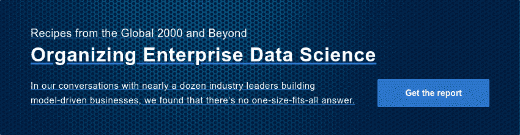

# 大规模协作不会凭空发生

> 原文：<https://www.dominodatalab.com/blog/collaboration-at-scale-doesnt-just-happen>

大多数数据科学领导者可能都记得这样一个例子:几个数据科学家之间的合作激发了一个新想法，加速了新团队成员的加入，或者帮助加快了新模型的开发或部署。

他们还可能指出缺乏协作会损害他们团队的生产力和进展的实例，数据科学家重新创建其他人已经创建的代码、实验和流程。

这导致一些数据科学领导者开始以编程方式思考协作。这是数据科学领导者 Matt Cornett(来自一家领先的保险解决方案提供商)、Patrick Harrison(来自一家全球金融情报公司)和 Brian Loyal(来自 Bayer Crop Science)在他们的网络研讨会中讨论的几个主题之一:[利用数据科学推动成果的最佳实践](https://go.dominodatalab.com/dsle-best-practices-for-driving-outcomes)。

在他们的谈话中，他们分享了一些加强数据科学家之间合作的最佳实践。其中包括:

*   **开发数据科学支持网络**,促进数据科学家在业务和软件团队之间的协作。Patrick Harrison 解释说，将这些团队的数据科学家联系起来，使他们能够获得所需的支持和指导，分享技巧和诀窍，讨论共同的挑战，并倡导共同的兴趣。他说:“使用通用工具和平台确实有助于这一点，所以如果你能够，即使在联合或中心辐射模型中，标准化完成工作的通用方法和使用的通用工具，可以真正铺平通往有效数据科学支持网络的道路。”
*   牢记可重用性来构建。在拜耳，数据科学领导者要求团队在开始项目时牢记重用。“我们已经多次看到，一个成功的数据科学项目可以多么迅速地在意想不到的地方找到应用，”Brian Loyal 说。“通过尽早设定和强化最佳实践，您可以让潜在合作者的生活变得轻松许多。像 Domino 这样的标准化工具可以从一开始就帮助提高可重用性。”
*   定期进行同行评审。【Matt Cornett 和他的团队喜欢做的一项活动是鼓励数据科学家分享正在进行的工作。“这将培养更大的创造力，并真正有助于消除容易偏离轨道的孤立工作，”他说。“在工作过程中，你分享的越多，你得到的反馈就越多，我认为最终的结果就越好。”

    他在每周的员工会议 **—** 上为这些评审安排了时间，每周指派一名数据科学家讨论他们的项目，并从团队的其他成员那里获得反馈。科内特说，多米诺骨牌在这方面也帮了大忙。“Domino 中有许多不同的协作特性，”他解释道。“如果你只是在自己的电脑上运行 RStudio 或 Jupyter Notebook，如果你想让别人运行你的代码，他们的电脑必须和你的电脑配置得差不多。Domino 有助于解决这一问题，这样人们就可以跳到其他人的代码中，并在协作时与代码进行交互，同时思考“我下一步需要做什么？”"

*   将多个数据科学家分配到一个项目中。Matt Cornett 说:“我在过去的几个角色中发现的一件事是，每当有一个以上的数据科学家在一个项目上工作时，你的成果真的会成倍增加。“这不一定是一条直线路径。我认为这是一种指数式的增长，你发现的洞察力、你能够提出的东西和你能够开发的东西都是如此。”

*听 Matt Cornett、Patrick Harrison 和 Brian Loyal 讨论如何促进数据科学家之间的合作。*

[https://www.youtube.com/embed/AFt3wsjDAnI](https://www.youtube.com/embed/AFt3wsjDAnI)

聆听[全面讨论](https://go.dominodatalab.com/dsle-best-practices-for-driving-outcomes)以听取 Matt、Patrick 和 Brian 关于加强协作和推动成果的最佳实践的更多信息。正如这些领导者所展示的，大规模的合作不会凭空发生。无论现有的组织模式是集中式、分布式还是使用轴辐式模式，数据科学领导者都需要在模型开发的日常节奏中建立实践，以促进思想和知识的共享，从而成功创新。

####  

#### 了解更多信息

观看由数据科学领导者 Matt Cornett、Patrick Harrison 和 Brian Loyal 主讲的名为“利用最佳科学推动成果的最佳实践”的网络研讨会。

阅读报告“[组织企业数据科学](https://www.dominodatalab.com/resources/organizing-enterprise-data-science/)”，了解数据科学领导者用于构建企业数据科学战略的最佳实践的更多信息。

利用我们的[模型速度评估](/resources/data-science-process-lifecycle-assessment)来确定您的组织在成熟道路上的位置。

[Twitter](/#twitter) [Facebook](/#facebook) [Gmail](/#google_gmail) [Share](https://www.addtoany.com/share#url=https%3A%2F%2Fwww.dominodatalab.com%2Fblog%2Fcollaboration-at-scale-doesnt-just-happen%2F&title=Collaboration%20at%20Scale%20Doesn%27t%20Just%20Happen)