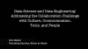
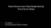

# 数据科学和数据工程之间的合作:对还是错？

> 原文：<https://www.dominodatalab.com/blog/collaboration-data-science-data-engineering-true-false>

*这篇博文包含了关于解决人们在协作开发和部署模型时出现的紧张点的坦率见解。Domino 的内容主管与[唐·迈纳](https://www.linkedin.com/in/donaldminer/)和[马歇尔·普雷斯](https://www.linkedin.com/in/marshallpresser/)坐下来讨论数据科学和数据工程之间的合作状态。这篇博文提供了精粹的见解、音频剪辑、摘录的引文以及完整的音频和书面文字记录。其他行业专家将提供有关该主题的更多内容。*

## 介绍

在过去的五年、[中，我们](https://www.dominodatalab.com/careers/?utm_source=blog&utm_medium=post&utm_campaign=)已经从[的数据科学团队那里听到了许多关于他们在构建、部署和监控模型时的成功和挑战的故事](https://blog.dominodatalab.com/managing-data-science-as-a-capability/)。不幸的是，我们也听说许多公司已经内化了[模型神话](https://blog.dominodatalab.com/model-management-era-model-driven-business/)，或者数据科学应该像软件开发或数据资产一样被对待的误解。这种误解完全可以理解。数据科学涉及代码和数据。然而，人们利用数据科学来发现以前无法解决的问题的答案。因此，数据科学工作比软件开发更具实验性、迭代性和探索性。数据科学工作涉及受益于可扩展计算的计算密集型算法，有时需要专门的硬件，如 GPU。数据科学工作也需要数据，比典型的软件产品需要的数据多得多。所有这些需求(以及更多)凸显了数据科学工作与软件开发的不同之处。这些需求也凸显了数据科学和工程之间合作的至关重要性，特别是对于寻求保持或发展竞争优势的创新型模型驱动型公司而言。

然而，数据科学和工程之间的协作是一个众所周知的挑战。

由于“寻求真相，说出真相”只是达美乐的核心价值观之一，达美乐的内容负责人与 Don Miner 和 Marshall Presser 坐下来，就不同的优先事项、已知的协作挑战以及应对这些挑战的潜在方法进行了尊重和坦诚的对话。Miner 和 Presser 都在数据科学和工程领域拥有丰富的实践经验。Miner 是一家数据科学和人工智能公司的创始合伙人，代表了数据科学的观点。Presser 是 Pivotal 数据工程团队的成员，他代表了数据工程的观点。这篇博客文章涵盖了精华、关键摘录、音频剪辑，以及对话的完整回放和文字记录。其他行业专家也将提供关于该主题的其他内容。这篇博客文章和未来内容的目的是为围绕协作挑战的公共对话做出贡献，这一挑战一直缺乏从多个角度进行的深入分析性论述。

## 数据科学 vs 数据工程:我们是如何走到这一步的？

坦诚的讨论以对当前状态的检查开始，我们在数据科学中是如何达到当前状态的？似乎有无数的术语来描述与模型互动的人。目前使用的几个术语包括研究人员、数据科学家、机器学习研究人员、机器学习工程师、数据工程师、基础设施工程师、DataOps、DevOps 等。矿工和记者都评论并同意，在任何期限的任何转让之前，工作本身就已经存在。Presser 将数据工程定义为包含获取数据、构建数据存储、管理数据流(包括 ETL)以及将数据提供给数据科学家进行分析的技能。Presser 还指出，大型企业组织中的数据工程师也必须精通从乍看之下可能不会提供数据的部门“哄骗”数据。Miner 同意并指出，围绕数据科学与数据工程的定义有更多的思想领导力，这导致了市场中的模糊性。

***Marshall Presser:** “我认为，在我们有数据科学家之前，我们就有了数据工程师。数据工程师做的事情包括建立数据仓库，人们可以从这些数据仓库中获得基本的商业智能，切片和切块，对过去的状态进行分析，以及对未来状态进行某种最低限度的分析，了解业务昨天是什么样的，不管是什么业务。然后人们得出了一个聪明的结论，我们实际上可以用数据做更多的事情，而不仅仅是报告过去。从我的角度来看，数据科学家进入了现代分析思维，如果你愿意，10 年或 15 年前，我想我甚至没有听说过数据科学家这个术语。我不记得我第一次听到它是什么时候，但那是很久以前了。我甚至不确定我当时是否听过数据工程师这个词。我们发展出了这两种不同的专业，Don，我马上就要告诉你，但我对这两者区别的理解是，数据工程师的工作是从各种来源获取数据。按摩它，让它进入一个地方，然后数据科学家可以用它做有趣的机器学习。所以，我认为目前的状态是这样的。*

唐·迈纳:“我基本上同意马歇尔所说的一切……仅仅因为我们创造了数据工程师、数据科学家这些术语，并不意味着它以前就不存在。[这些术语达到了]一个临界质量，人们在某个点上，“你知道，我们可能应该叫它什么。“有足够多的数据科学家跑来跑去，”哦，你知道吗？那应该有个名字。“或者，现在有足够多的数据工程师在工作，他们应该有一个名字…人们花更多的时间来定义数据科学的含义，而不是定义数据工程的含义。从大学课程开始，我从未听说过有人开设数据工程本科课程，但你开始听到数据科学课程的出现。…我知道这是为什么，但我认为我们现在所处的位置是，数据科学是一个非常明确的职业道路和职业。人们通常知道这意味着什么。…炒作的影响仍然很大，现在已经开始有所减弱。但是在数据工程方面…已经远离了典型的固执己见的人，他们会帮助定义这些东西，在会议上谈论它。这仍然给那里的市场留下了许多不确定性。所以，我认为这就是我们现在的处境。”

## 这些差异在现实生活中是如何转化的？例如招聘数据科学家和数据工程师？

由于矿工和记者的观点都基于实践经验，讨论转向了数据科学家和数据工程师之间的差异如何转化为在雇用和招聘中优先考虑哪些措施和技能。Miner 表示，当他招募数据科学家时，他会寻找技术能力(即机器学习)以及潜在的领域专业知识。Miner 还反驳说，当他招聘数据工程师时，他经常会寻找那些碰巧拥有数据库经验、各种技术通用性信号(即与 Kaftka 合作)以及“某种类型的态度”的软件工程师

*“这对于不同的组织来说是不同的，但是……数据工程师需要真正的多面手，他们需要有能力在许多不同类型的角色中工作。他们需要能够编写软件，他们需要能够使用数据库，他们需要能够做 DBA 的事情，他们需要关心安全性，他们需要关心网络。这是一个非常跨学科的角色，所以当我寻找一名优秀的数据工程师时，我最看重的是他们技术技能的灵活性和多面性。此外，就像你提到的，你需要有某种态度才能在数据组织内部成功工作。在处理令人沮丧的问题时，他们需要非常有弹性。与此同时，作为一名数据科学家，我通常会寻找机器学习经验等技术技能。我正在寻找的特定技能，也许是他们过去工作过的某些领域。所以，实际上我会说，现在对于数据科学家来说，我通常在寻找特定的技术能力。对于数据工程师来说，更多的是态度和多面性，而不是具体的技术技能。”*

Presser 和 Miner 都认为数据工程的功能很重要，尤其是获取数据的导航技能。Miner 特别指出

*“在我们的咨询项目中，以及我认识并与之合作的另外两家数据科学咨询公司中，如果我们有一个纯粹的数据科学项目，这意味着数据工程不在范围内，客户说他们将负责此事，在我们有证据证明数据已经加载之前，我们不会开始工作。我们已经被他们烧伤很多次了，他们说，“哦，你知道吗？你们可以周一开始。我们将在下周的某个时候加载数据。“在数据出来之前，我们甚至不会开始……这也是数据工程师的另一个问题。我真的碰到了这个问题…在年轻的数据工程师方面，我们遇到的一个问题是，他们没有足够的资历来对抗那些不愿意友好相处的 Oracle 数据库管理员。…这是一个很难胜任的角色，因为，你是对的，…人际交往技能和政治导航技能对数据工程师来说非常重要。”*

## 合作的现状:坦诚的见解

在探讨了技能、技术能力和工作流优先级的差异之后，对话转向了关于数据科学和数据工程之间协作的非常坦率的见解。在对话过程中出现的挑战包括一般沟通方面的挑战、缺乏双向尊重、可能缺乏良好的项目管理，以及期望数据科学工作流像软件开发工作流一样。当被问及“协作的当前状态如何？Miner 指出:“鉴于各个方面都在不断涌现，并且可能因组织而异。”

“对此我有两个答案。一个是，我不认为我工作的大多数组织中的数据科学家和数据工程师已经知道如何与任何人沟通。因此，甚至不是相互之间，而是数据科学家和数据工程师如何融入正在构建一些新系统的现代系统，他们如何与不同的业务线进行交互？他们如何与营销、销售互动？他们如何与产品设计互动？….即使从根本上来说，这个行业也存在重大问题。以及它们是如何相互作用的？…这很难说，因为我真的不能说，至少在过去几年里，我和他有过很多交流，比如，他是数据科学家，他是数据工程师。我们的角色被明确定义，他们在沟通。所以我想我会给出一个否定的答案，说，我不知道，现在说还为时过早…..从我的角度来看，我可以说一些关于不同的人在不同的场景中扮演不同的角色以及他们如何沟通的事情。

*但总的来说，我认为角色还没有明确定义，还不能真正说出他们是如何沟通的……*

*在一些地方，我看到它非常实用，有负责数据的职能数据工程师，也有数据科学家……在很多情况下，双方都没有得到足够的尊重……数据工程师就像是，“这个数据科学家不知道他在做什么。他不知道如何处理数据。数据科学家不知道数据工程有多难。”另一方面，数据科学家对数据工程师不能足够快地完成工作感到沮丧。没有以他们想要的方式完成…我在两个方向上合作过的最好的数据人员都对其他人的情况感同身受。数据工程师对数据科学家在寻找什么和他们需要什么有直觉。数据科学家对数据工程师来说什么是困难的，什么是不合理的有直觉…这是我见过的最好的情况。最糟糕的情况，也是我通常看到的情况，是数据工程师只是处理数据，而不担心重复数据、编码错误的数据以及不适合数据科学的电缆布置方式。然后数据科学家看到这些东西，他们就像，“这是垃圾。你在做什么?我现在就要自己动手了。”他们会遇到一大堆问题，因为他们不知道如何访问数据和其他东西。我认为真正重要的是理解彼此的处境，理解他们都很艰难，并努力克服。"*

Presser 还提供了关于在项目开始时让人们团结一致是建立同理心和解决协作紧张的重要方式的见解，以及矿工的观点

“一点也不罕见，[它]是真正糟糕的项目管理的症状。在我看来，解决这个问题的方法是在设计项目时让每个人都在房间里...这有点像人寿保险。你知道，直到你需要它的时候你才真正需要它，但是你必须一直拥有它，即使你不需要它。我见过的最成功的项目是这样的项目，数据科学家、数据工程师和应用程序开发人员从一开始就在房间里，与客户谈论他们想要解决的问题是什么，最小产品是什么，最终解决方案应该是什么，用户对此有什么期望。如果你从那个地方开始，你更有可能产生共鸣。…这是第一件事。

第二件事是，我发现唐描述的困难并不存在，至少在我从事的许多项目中，数据科学家和数据工程师之间的困难与数据科学家、数据工程师和应用程序开发人员之间的困难一样多。因为应用程序开发人员，我不想说对数据的蔑视，这太强烈了，但我想说的是，他们没有我和 don 那么多的经验和对数据的热爱。

对他们来说，数据库就是数据库，数据就是数据，石油就是石油。你知道，都一样。总的来说，他们对思考数据收集的种类和解决问题所需的问题不感兴趣。他们是这样的，“让我很快拿出一个最小的、可行的应用程序。”顺便说一句，我真的听过一个项目经理说，“你知道，我的开发人员写的任何一行代码，用来审计他们正在做的事情，把东西放进数据库，都是他们在开发应用程序时没有放进去的一行代码。”因此，他们经常鼓励巨额技术债务，因为他们现在已经有了这个伟大的应用程序，但当项目的第二阶段到来时，要用这个应用程序应该存储在某个地方但没有存储的数据做一些有趣的事情，我们有点像是在背黑锅，因为应用程序开发人员有点目光短浅。在我看来，这种短期思维阻碍了真正优秀的数据科学。"

Miner 指出，另一个潜在的紧张点包括将数据科学类似于软件开发的组织

*“我们一直建议我们的客户，并且我认为有时会让人们感到惊讶的一个主要部分是，大多数组织默认将他们的数据科学项目视为他们目前正在组织中运行的软件工程项目。因此，如果他们希望他们的数据科学家填写吉拉门票，进行冲刺。不仅是数据科学家，数据工程也不是类似的任务。平台架构也是类似的。他们都有一些共同点。在数据科学、数据工程和平台架构中，这是那些你可以永远花在某件事情上而不会完成的事情之一。所以，这就是“我什么时候想停下来？或者，“我什么时候没钱了？”而不是，“好了，这个应用程序完成了。我会运送它，它在一个盒子里。去了就好了。我们把它发布给全世界，然后销售出去。太棒了。“从数据科学的角度来看，除非你去做，否则很难判断一件事要花多长时间。所以有这个鸡和蛋的问题。我不能写吉拉机票，这需要两个星期，直到我真的花了两个星期，并意识到它实际上需要四个星期。所以当你试图在这些项目上应用这些传统的软件工程项目管理的东西时，它不起作用。事实上，在很多情况下，它会造成伤害。实际上，有一门新的学科需要诞生。”*

## 应对协作挑战

数据科学和数据工程之间的合作是一个很难解决的问题。虽然人们一致认为问题的难度导致缺乏广泛的公共讨论，但 Miner 和 Presser 深入研究了有可能缓解围绕合作的紧张点的各个方面。在对话之前，支持自然产生的协作的方面包括早期的利益相关者联盟，以及关于各种责任的相互尊重和直觉。此外，当被直接问及解决协作紧张点的潜在方法时，会出现关于企业文化、协作工具和“数据联络”的其他建议，协作紧张点是开发和部署模型的障碍。

普莱塞指出，企业文化有助于协作，特别是

“我认为在很多方面，这是一种企业文化。有些组织合作得很好，有些则不然，我在联邦政府部门工作了很长时间，这个项目由来自不同组织的人组成，这些组织不属于联邦政府。外包项目管理，外包数据库管理，外包这个，外包那个。这里有一点关于封地的争斗，客户要么因为合同原因不能做任何事情，要么选择不做任何事情。但这与 Don 所说的移情和尊重是相反的，在很多方面，这是由收入来源决定的。所以，我发现有些组织我喜欢一起工作，有些组织我不喜欢一起工作，因为企业文化不是分享、同情和尊重的文化。所以好好选择你的伴侣。”

Miner 也认同企业文化的贡献:

“我认为我工作过的最好的组织是那些鼓励公开交流，而不是内部竞争的组织。没有太多的自我…你可以在很多其他事情上逃脱，数据项目不是其中之一。这就是问题所在，……一个组织可能发现[许多自我]在他们所做的其他类型的工作中取得了成功，但在这种情况下，它并不是非常成功……对于我所看到的哪些工作很好的问题，我认为对我来说最重要的一个问题是，每个人都精力充沛，知道目标是什么。我认为这也与企业文化有关。一个企业文化有非常明确的目标，或者一个领导者有非常明确的目标，这些目标是非常透明的，允许每个人调整自己，他们一天中的微小互动，成为这些目标的一部分。此外，数据科学的目标通常很奇怪。有时他们并不直截了当。”

虽然 Presser 提倡优先考虑面对面协作以加快工作和解决协作问题，但 Miner 提倡配备“数据联络员”以及协作工具，因为数据科学工作的性质决定了这一点:

*“关于马歇尔所说的基本沟通，我想补充的另一件事是，因为我确实同意，并非所有的利益相关者和所有的人都会以不同的身份在早期参与讨论。这实际上是首席数据科学联络员这种角色在公司中的合适位置，在公司中，您不一定需要您的数据科学家(如在大型组织中)参与每个决策，但有一位数据科学领导者，即首席数据官或首席数据科学家，或者不管头衔是什么，我不认为这是真正确定的，会参与这些范围界定会议。我们已经看到这是成功的。从沟通的角度来看，另一件事可能也是如此，实际上，我将为工作中的实时远程协作工具投票…..我同意，在项目开始时，让每个人都在房间里真的很好，因为需要进行大量的沟通。但同样，对于这些项目来说，电子邮件感觉太慢了。数据科学家正在慢慢地获得见解，数据工程师也一样，在他们积极工作时，会以一种特别的方式遇到不同的问题。所以我们经常使用 Slack，我认为现在很多人都在使用它，而且它非常成功，因为你不必把一堆东西塞进一封电子邮件，比如，“这是我今天的问题清单。“也许你可能有两个数据科学家在谈论一个问题，而数据工程师正在偷听，并说，“哦，嘿，顺便说一句，这是我如何设计它的，”或者说，“哦，嘿，是的，我可以很快为你解决这个问题。不会花我太多时间。“所以这种更实时的交流是好的，我也认为，在某些情况下，这几乎比在物理办公室里更好。即使你坐在办公桌前，离数据工程师有三张桌子远，你还是要起身去打扰那个人。在这里，我想我实际上是在论证，随着项目的进行，我认为 Slack 和其他类似的东西实际上可能是目前最好的工具之一。”*

当被问及如何进一步解释“数据联络员”的概念，并提供额外的澄清，以及这个人是否可以成为“项目经理”时，Miner 指出

“…在一些大型项目中，我和尼尔斯[联合创始人]都提供咨询服务。这是一个非常必要的角色，我们与其他一些客户合作，我们建议他们这样做，这实际上有两个原因。一个是，数据科学需要大量的关注。当你在处理数据科学问题时，你正在摸索一些机器学习的东西，你正在处理数据，一个中断可能会打破你头脑中几个小时建立的卡片房子，如果你负责参加随机会议来讨论用例和事情，你永远不会完成任何事情…你需要做的是，你需要选择一些人。我的意思是，老实说，这些人的个性比其他人更好，但真的需要有人在必要时能够做到这一点，了解真正的问题，能够代表数据科学家在这些会议上实际开展工作。但是由于专注的要求，你需要选择一个人作为牺牲者来做这件事，四处走动并根据经验说话是可以的，这样其他人就可以专注了。这是一个非常重要的角色……在一个拥有庞大团队的大组织中。”

## 对潜在未来状态的思考

在解决了可能有助于缓解协作紧张的潜在问题后，讨论转移到了协作的潜在未来状态。讨论的潜在未来状态场景包括角色的日益专业化，以及对帮助管理协作的规程或过程的需求。

马歇尔出版社:“……从未来国家的角度来看，我认为角色的专业化只会增加。我们将会有纯粹的数据科学家、纯粹的应用程序开发人员、纯粹的数据工程师、纯粹的平台架构师、纯粹的联络人员、纯粹的项目管理人员，这些人可能会与联络角色联系在一起，并保持这些人的协调，以便他们可以说共同的语言，并相互同情和尊重，我认为这是未来的挑战。但是一旦我们解决了这个问题，那就太好了。”

***唐·迈纳:**“我认为就马歇尔的观点而言，……这里最大的问题是缺乏围绕管理、围绕数据工程、数据工程和数据科学之间的沟通的过程，缺乏管理，如果你想专业化，你就需要一个数据联络员...你想有一个数据工程师专家吗，因为最早的数据科学项目，像最小的项目，数据科学家也在做数据工程工作。可能还有平台架构工作，以及应用程序开发。*

*一旦开始专业化，这也是我们现在有数据工程师和数据科学家的原因，这两个人需要有一个沟通的过程。*

*当你有了一个应用程序开发人员，现在他们需要一个过程来沟通和一起工作。*

你有平台架构，你有管理层，你有顾问联络员，你有业务的其余部分，所有的都是关于过程，老实说，我认为没有人真正知道他们在做什么。我认为阻碍我们在这个行业发展的第一件事是建立大型数据科学团队和组织。我现在看到的最成功的数据科学团队就像三个人……这可能是一个巨大的组织，但这三个人要做很多工作，如果他们想扩大到 20 人或 40 人，那是行不通的。事实上，我有一天看到了一个特殊的异常现象，我正在丹佛招聘一名新的数据科学家。我特别想要一名丹佛的高级数据科学家，所以我在 LinkedIn 上发布了一个丹佛数据科学家的职位空缺。几天之内我收到了大约 30 份申请。11 个来自一家公司…我问一些在丹佛的同事，“X 公司怎么了？我刚刚收到了这家公司数据科学家的 11 份申请。”首先，我甚至不知道他们有很多数据科学家，他们说...因为[他们]是数据科学家，他们[说]“是的，他们到处都是职位空缺。他们雇佣了数量惊人的...过去两年里，数百名数据科学家。”…现在很明显他们在大出血，因为他们可能没有真正考虑如何沟通。我认为这是我希望看到的世界走向，如果我们有更好的过程，就像我们在软件工程方面所做的那样，持续集成和测试，良好的 UX 原则等等。我们现在可以建立真正可扩展的软件团队。

*数据科学还没有出现…...不过，数据工程和数据科学的主题只是这支矛的尖端。"*

## 管理数据科学:困难，但并非不可能

***唐·迈纳:**“没有多少从业者会问:“我如何管理好一个数据科学项目？"….总得有人在某个时候谈论它。”*
***安斯潘塞:**“你认为是为什么？你认为人们为什么不谈论它，或者不解决它？”*
***马歇尔出版社:**“嗯，对一个人来说，很难。”*

达美乐[的核心价值观](https://www.dominodatalab.com/careers/?utm_source=blog&utm_medium=post&utm_campaign=)之一包括“寻求真理，说出真理”。我们在内容中利用这一核心价值来支持人们解决数据科学中难以解决的问题。这篇博客文章涵盖了当人们围绕模型的开发和部署进行合作时出现的紧张点的坦率讨论中提炼出的见解、音频剪辑和摘录。如果对更深入的见解感兴趣，可以考虑听 45 分钟以上的录音或通读全文。两者都在下面提供。我们也意识到，关于合作还有其他的情况、细微差别和纹理没有在这篇博文中涉及，我们正在与其他行业专家合作[阐述不同的观点](https://www.eventbrite.com/e/data-science-versus-engineering-does-it-really-have-to-be-this-way-tickets-50454045408)。我们将继续提供更多即将推出的内容，涵盖数据科学和工程之间的合作。如果你有兴趣为这一公共讨论做出贡献，请联系我们。

## 全音频记录

如果感兴趣，这部分提供了超过 45 分钟的讨论。

