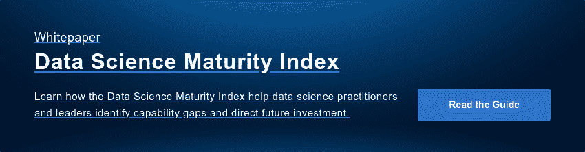

# 数据科学中的合作原则

> 原文：<https://www.dominodatalab.com/blog/collaboration-data-science>

数据科学不再是一个人或一个小团体的专业。它现在是竞争优势的一个关键来源，因此，项目的规模继续增长。协作至关重要，因为它使团队能够比任何个人承担更大的问题。它还允许专业化和共享环境，减少对“独角兽”员工的依赖，这些员工无法扩展，是关键人员风险的主要来源。问题是协作是一个模糊的术语，模糊了多个概念和最佳实践。在本帖中，我们澄清了**重复性**、**再现性**以及尽可能的**再现性**的黄金标准之间的区别。通过建立无摩擦团队内和跨团队协作的最佳实践，您可以显著提高数据科学工作的效率和影响。

## 可重复性

从基础开始，**可重复性**是协作数据科学流程的关键组成部分。可重复性是指给定的过程(无论是数据清理脚本、功能工程管道还是建模算法)在给定相似输入的情况下将产生相同(或几乎相同)的输出。为了让数据科学家能够协作，他们必须能够依赖他们一直保持一致的工具和程序。这通常表现为环境和数据不稳定性对数据科学协作的挑战。

我经常和有“它在我的电脑上工作”问题的科学家和研究人员交谈更糟糕的是，一些底层系统库或依赖关系会导致算法在一个科学家的机器上产生一个信号，而当在另一个科学家的机器或生产环境中运行时，它会产生完全不同的信号。

在金融领域一家公司的定量研究会议上，我分享了一个我们见过的最可怕的例子，说明没有保证可重复性的环境是多么危险。他们建立了一个产生交易策略的模型，并对其进行了广泛的回溯测试。该模型在原作者的笔记本电脑上运行时，给出了一个信号，即某一特定证券不应交易，因为这几乎肯定会导致重大资本损失。当研究人员将代码交给一名负责实际交易的分析师时，他们在笔记本电脑上运行代码，代码为许多资产生成了强烈的买入信号。由于信号存在根本缺陷，这最终导致该组织花费了大量资金。

经过大量的相互指责之后，他们发现这两位数据科学家发布了一个不同的底层数据解析库。对于第一个科学家，格式错误的日期被解析为 NA，而对于第二个科学家，它们被解析为 1970-01-01。这意味着他们生成的模型在行为上是不同的，甚至对相同的数据生成完全不同的输出。

尝试诊断计算堆栈是否可重复可能是一项重大挑战。现代计算环境是一个难以想象的庞大的抽象层堆栈，要找到一个更新到不同版本的库依赖项(即使有像 conda 这样试图确定性地构建精确环境的工具)可能是一项徒劳的任务。

任何没有完全可重复环境的协作实践都不太可能证明自己有价值或被采用，因为这些行为和期望的细微差异和变化会削弱对系统的信心，并为采用提供很高的障碍。

## 再现性

下一步是**再现性**。伊利诺伊大学信息科学学院的副教授维多利亚·斯托登描述了一个强大的再现性分类法，它描述了它的三个方面:统计再现性、经验再现性和计算再现性。

### 统计再现性

当提供关于统计检验、模型参数、阈值等选择的详细信息时，分析在统计上是可重复的。这主要与研究设计的预注册有关，以防止 p 值黑客攻击和其他操纵。统计再现性应该通过自上而下的命令，以及通过同行评审和文档来强制执行。团队应该能够访问关于统计选项的组织最佳实践的知识库，并获得关于什么是适当的指导。当选择改进验证程序或统计测试时，为研究中心提供与组织内部同行的联系，可以提供关于在实验和统计设计中所做选择的“探测板”,通常可以缩短数百小时的浪费。

### 经验再现性

当提供了关于非计算性的经验科学实验和观察的详细信息时，分析在经验上是可重复的。在实践中，这是通过免费提供数据以及如何收集数据的细节来实现的。在数据科学中，这通常与研究的底层业务驱动因素以及用于构建模型和分析的数据源的真实数据生成过程相关的知识相关。

在 Domino，我们经常说数据科学过程始于并止于来自业务驱动因素的问题和数据，因此团队记录这些原始问题和想法是什么、它们是如何产生的、是谁提出的，并以完全确定和可重复的方式提供分析中使用的数据集的数字出处是非常重要的。我们的“数据项目”架构支持许多这种功能，允许团队定义完全修订和组件化的规范数据集，允许合作者确切了解哪些分析从哪些数据集获得灵感，以及在数据收集过程中这些数据集中编码了哪些偏见。

### 计算再现性

如果有一组特定的计算函数/分析(在数据科学中，几乎总是以源代码的形式指定)精确地再现了分析中的所有结果，则分析在计算上是可再现的。我倾向于将可再现性理解为一系列可重复步骤以确定的方式编排。

值得注意的是，这不仅仅是源代码，然而，对于计算上可重复的分析，序列化的“元组”远远大于源文件的磁盘上字节数。计算可再现性包括底层数据、软件、操作序列以及执行它的底层硬件的可再现性。rOpensci 组织的可再现性研究的良好特性列表有助于理解什么构成了良好的计算可再现性。

以下是从 Sandve、Nekrutenko、Taylor 和 Hovig 的可复制计算研究规则中摘录的关于良好可复制性以及团队内和跨团队合作的八条原则:

1.  **跟踪结果** -每当一个结果可能是潜在的利益，保持跟踪它是如何产生的。至少，你应该记录足够多的程序、参数和手工操作的细节，这样你就可以在一年左右的时间里大致重现结果。
2.  **编写脚本** -只要有可能，依靠程序的执行而不是手动程序来修改数据。如果无法避免手动操作，您至少应该记下修改或移动了哪些数据文件，以及出于什么目的。
3.  **创建可再现的环境** -为了准确地再现给定的结果，可能需要使用与最初使用的版本完全相同的程序。利用像 [Docker](//blog.dominodatalab.com/data-science-docker/) 和配置管理系统这样的工具来保证可重复性。至少，你应该记下你使用的主要程序的确切名称和版本。
4.  使用版本控制——即使是对计算机程序最微小的改变也会产生意想不到的后果。至少，您应该不时地存档脚本的副本，这样您就可以粗略地记录代码在开发过程中所经历的各种状态。然而，我们发现最低限度往往是不够的。自动化版本控制系统的使用消除了围绕版本控制最佳实践的许多摩擦。您应该努力拥有一个系统，保证任何程序执行都有一个完全可再现的快照。当您有一个想要重现的情节，但在生成可视化时碰巧没有提交代码时，会有一种特别的挫败感。
5.  **存储数据和中间结果** -原则上，只要用于产生给定结果的整个过程被跟踪，所有中间数据也可以重新生成。在实践中，容易获得的中间结果可能具有很大的价值。make 和 drake 等系统可以管理复杂的结果依赖图。至少，对运行分析时产生的任何中间结果文件进行存档。然而，最好使用一个系统，可以很容易地记录所有的中间结果，并向您展示它们进行分析，而不会产生明显的摩擦。
6.  **设置一个随机数种子** -许多分析和预测都包含一些随机性元素，这意味着同一程序每次执行时通常会给出略微不同的结果。例如，聚类算法通常可以找到不同的聚类，并且对初始条件很敏感。作为最低要求，请注意哪些分析步骤包含随机性，以便在重现结果时可以预计到一定程度的差异。
7.  **存储数据可视化输入** -从图形首次生成到成为分析的一部分，存储数据和生成数据的过程至关重要。随着数据可视化变得越来越复杂，不仅仅是一个图表，而是整个应用程序或交互式仪表板，将可视化管道作为完全可再现的工件进行管理非常重要。作为最低要求，应注意哪些数据构成了给定绘图的基础，以及如何重建这些数据。
8.  **允许分析层次** -为了验证和完全理解主要结果，检查摘要下的详细值通常是有用的。使这些数据具有流动性和可探索性，至少一次生成、检查和验证摘要背后的详细值。数据科学是一项团队运动，通常你的团队中会有一些非常有才华的人，他们拥有与构建模型所需的编码或数学不一定重叠的专业知识。在这种情况下，为那些非技术用户提供易接近的界面。理想的方法是启用这些接口和分析级别，以便团队中技术含量较低的成员可以参与分析，并根据他们的专业知识帮助纠正过程。

再现性让数据科学团队充满信心。如果没有真正的无摩擦再现性，在生产中推进算法或模型的艺术状态通常会非常具有挑战性。衡量一个模型的新迭代是否实际上是对生产中的模型的改进，或者仅仅是根据更近的数据训练的等效模型，甚至可能是一个挑战。

在 Domino，我们相信知识的无摩擦再现和复合是良好协作过程的基石，并围绕这一观点构建了我们的平台。关于这方面的更多想法，请观看我关于在用户处提供数字出处的演讲！2016 在斯坦福。

## 可复制性

一旦你建立了可重复性和再现性的实践，协作数据科学过程的黄金标准就是可复制性。可复制性强于可复制性。一项研究只有在你进行完全相同的实验(至少)两次，两次都以相同的方式收集数据，进行相同的数据分析，并得出相同的结论时才是可复制的。可复制性是一种实践，它允许生产中的模型由审计员独立验证，由工程组织重新实现以用于实时系统，并且最重要的是，它可以让我们相信，随着协变量的变化，用新数据随时更新模型仍会提供与原始工作方向和实质上一致的结果。

数据科学中的可复制性经常被误解，因为当涉及到前沿突破时，它的作用主要被认为是在物理和生物科学中。由于一项研究的不可复制性，整个职业生涯都毁了，从著名的弗莱施曼-庞斯崩溃到失败的复制鲍梅斯特和沃斯关于自我损耗的工作的 T2 和其他许多研究。

然而，在协作数据科学中，可复制性往往是数据科学真正推动模型或洞察力发展的原因。数据科学家必须能够采用预先存在的管道或模型，在没有重大摩擦的情况下将其组件化，并使用新数据、新算法或新方法重新运行整个实验或其中的重要部分。要做到这一点，必须能够与原始分析(或当前数据的重新运行)进行并排比较，以获得对实验设计的信心，以及所述设计中的变化如何影响测试期间的行为以及可能影响生产期间的行为。

## 结论

数据科学团队拥有:

1.  受过重复性、再现性和可复制性实践培训的人员
2.  鼓励使用这些最佳实践的适当流程
3.  允许这些最佳实践被无摩擦地利用的工具

在团队中，分析、模型、指标或见解方面的协作成为第二天性和“捷径”，而不是难以实施的自上而下的命令。数据科学家，即使是单独工作的，也至少在与两方合作，他们过去的自己和未来的自己。

为可再现的数据科学构建 Domino 数据实验室平台让我们与几乎所有行业的数据科学客户进行了大量的互动。我们一次又一次地看到协作对数据科学团队的成功是多么重要，以及无摩擦地建立共享环境对促成这种协作是多么重要。事实上，我们基于对客户的研究开发了[数据科学成熟度模型](https://www.dominodatalab.com/resources/data-science-maturity-model/?utm_source=blog&utm_medium=post&utm_campaign=collaboration-data-science)框架。为数据科学家提供一个平台，使他们能够进行“良好的”协作数据科学，这不仅可以在短期内提高他们的工作效率，还可以为组织提供复合知识的优势，以及更可预测的透明成果和量化研究投资的投资回报。

