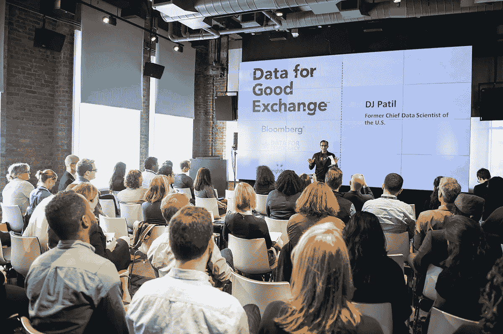

# 在彭博数据促进良好交换会议上介绍了关于道德数据共享的社区原则

> 原文：<https://www.dominodatalab.com/blog/community-principles-ethical-data-sharing-presented-bloombergs-data-good-exchange>

随着这个世界变得越来越受模型驱动，数据伦理是一个日益重要的问题，必须始终放在首位。Domino 积极参与了多项数据伦理计划，这些计划让我们能够贡献我们的专业知识，并与其他有相同热情的领导者交流想法。

本着这种精神，我们很荣幸能够帮助创建关于道德数据共享的社区原则 (CPEDS):这是一项众包工作，旨在为整个数据科学界的数据共享制定道德准则。

这是到目前为止已经完成的工作的简要总结。

*   CPEDS 于 2017 年 9 月在纽约举行的第三届年度[彭博良好交换数据](https://www.bloomberg.com/company/d4gx/#about) (D4GX)会议上拉开帷幕。
*   在那次事件之后，我们一群人合作起草了第一份原则草案。我很荣幸能成为这个团队的一员，和这些了不起的人一起工作。
*   2 月 6 日，彭博举办了另一场 D4GX 活动——这是第一次在他们的三藩市办公室举办——我们几十人亲自聚集在一起，还有数百人收听直播节目，聆听鼓舞人心的演讲者，如[吉迪恩·曼](https://twitter.com/gideonmann)、 [DJ 帕蒂尔](https://twitter.com/dpatil)、[娜塔莉·埃文斯·哈里斯](https://www.linkedin.com/in/nevansharris/)、[乔伊·博纳古罗](https://www.linkedin.com/in/joybonaguro/)和[宝拉·戈德曼](https://twitter.com/pdgoldman)。但那次活动的亮点，至少对我来说，是我们能够与社区分享 CPEDS 的第一稿，并通过面对面的研讨会和与远程观众的闲聊来征求他们的实时反馈。你可以在这里观看录制的视频。第一套原则涉及七个主题，您可以在 CPEDS 网站上了解更多信息:
*   思想多样性*
*   偏见
*   隐私和安全
*   负责任的沟通*
*   出处和所有权
*   透明度和公开性*
*   问题和答案*
*   *Domino contributed to four of the seven.* So what’s next? The CPEDS work is ongoing and we need you! Please join the conversation by joining #p-code-of-ethics conversation on [Slack](https://datafordemocracy.slack.com) or [sign up to contribute](https://d4d.typeform.com/to/qQMVMr) to the next version of principles. It is important that a large number of people from the data science community collaborate to shape the principles that will ensure ethical use and sharing of data.

    