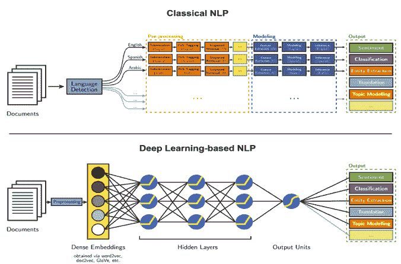
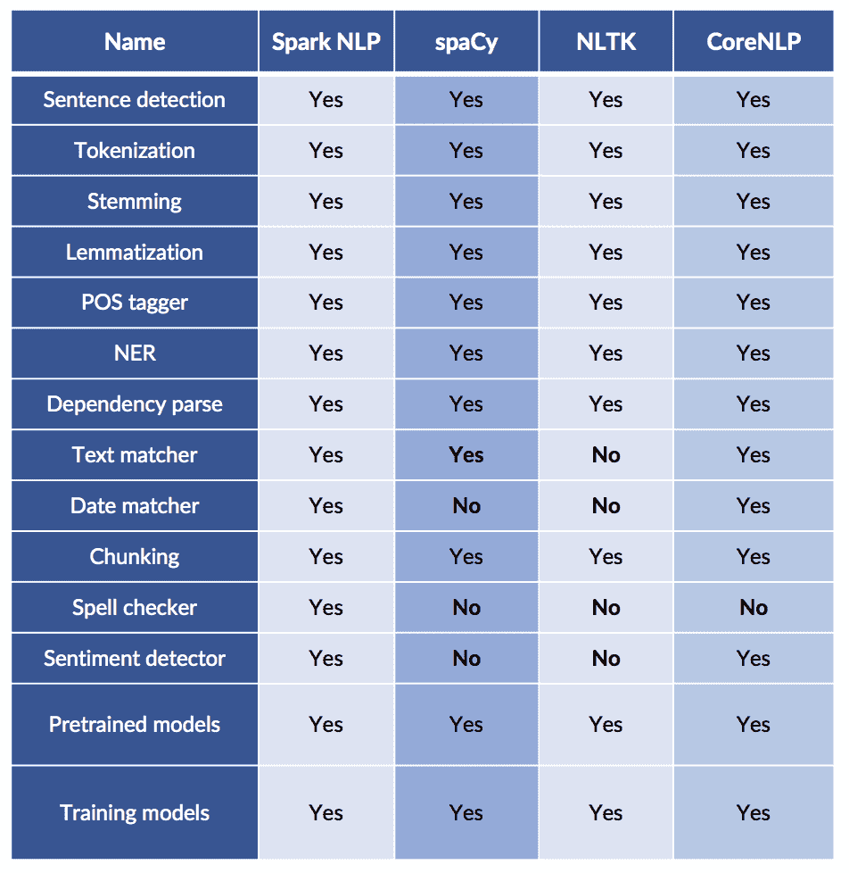
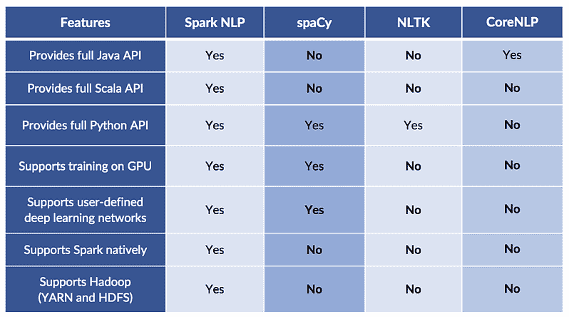
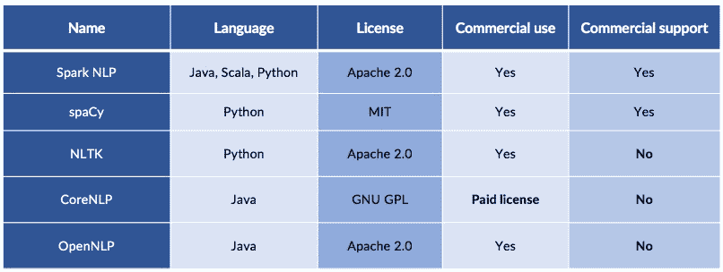
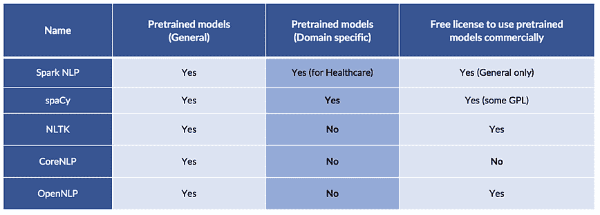
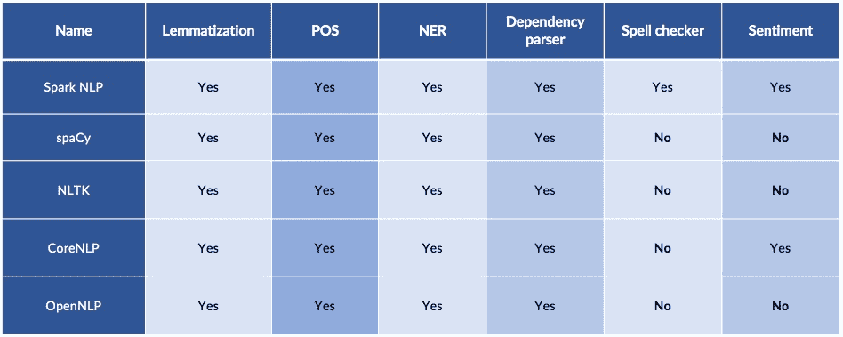

# 比较开源 NLP 库的功能

> 原文：<https://www.dominodatalab.com/blog/comparing-nlp-libraries-in-python>

*在这篇客座博文中，[马齐亚尔·帕纳西](https://twitter.com/maziyarpanahi)和[大卫·塔尔比](https://twitter.com/davidtalby)提供了一份选择开源 NLP 库的备忘单。*

## 自然语言处理库是做什么的？

自然语言处理(NLP)在越来越多的人工智能应用中是必不可少的。如果你正在建立一个聊天机器人，搜索专利数据库，将病人与临床试验相匹配，给客户服务或销售电话评分，从财务报告中提取事实或解决 17 个行业的 44 个用例中的任何一个，从自由文本中提取准确的信息是必不可少的。

要构建这样的系统，你的软件必须理解文本中人类语言的词汇、语法和语义。它需要知道句子是如何组成的——以便“每小时 7.25 美元”中的句号不会开始一个新句子。它需要知道动词是如何变化的——以推断违约是否已经发生、将要发生或可能发生。它需要知道否定是如何表达的——以了解患者是否患有糖尿病。它甚至需要理解社会背景——推断出一条写着“滚开”的信息是暴力威胁还是朋友间友好的戳戳。

例如，一个好的 NLP 库将正确地将自由文本句子转换为结构化特征(如*每小时成本和糖尿病*)，这些特征很容易进入机器学习(ML)或深度学习(DL)管道(如*预测每月成本和对高风险患者进行分类*)。其他用例可能涉及返回问题的最合适的答案、为查询找到最相关的文档或对输入文档本身进行分类。一个好的 NLP 库将使训练你自己的 NLP 模型和与下游的 ML 或 DL 管道集成变得容易。

一个好的 NLP 库还应该实现最新最棒的算法和模型——这并不容易，因为 [NLP 正在经历它的 ImageNet 时刻](https://thegradient.pub/nlp-imagenet/)并且最先进的模型正被[一个月两次超越](https://rajpurkar.github.io/SQuAD-explorer/)。它应该有一个简单易学的 API，可以使用你最喜欢的编程语言，支持你需要的人类语言，非常快，并且可以扩展到大型数据集，包括流和分布式用例。

我们提到过它也应该是免费和开源的吗？

## 开源 NLP 候选名单

这篇文章旨在帮助你为你的下一个项目选择合适的开源 NLP 库。我们假设您需要构建生产级软件。如果你在做研究，像 Allen NLP 和 NLP Architect 这样优秀的库可以让实验变得更容易，尽管代价是功能的完整性、速度和健壮性。

我们假设您正在寻找广泛使用的、业经验证的生产中的 NLP 库——因为许多其他人已经测试过它，所以这些代码就可以工作。你也在寻找一个有活跃社区的图书馆——一个可以回答你的问题，解决错误，最重要的是不断增加功能，提高准确性和速度的图书馆。因此，我们将候选名单缩小到这五个库:

*   [火花 NLP](https://github.com/JohnSnowLabs/spark-nlp)
*   [空间](https://spacy.io/)
*   [NLTK](https://www.nltk.org/)
*   [OpenNLP](http://opennlp.apache.org/)
*   斯坦福大学核心课程

显然，在 NLP 的一般领域中有更多的库——但是我们在这里关注的是通用库，而不是迎合特定用例的库。例如， [gensim](https://radimrehurek.com/gensim/) 是一个流行的 NLP 库，最初是为主题建模而创建的，不能用于构建完整的 NLP 管道。

更具体地说，我们的候选名单只包括提供这一核心功能集的库:

*   句子检测
*   标记化
*   堵塞物
*   词汇化
*   词性
*   [命名实体识别](https://www.dominodatalab.com/blog/named-entity-recognition-ner-challenges-and-model) (NER)
*   依存解析器
*   训练特定领域模型

它们还提供以下部分或全部功能:

*   拼写检查
*   情感分析
*   文字匹配
*   日期匹配
*   组块
*   其他功能

这里比较的所有五个库都有一些可以定义的 NLP 管道的概念——因为大多数 NLP 任务需要组合这些特性中的几个来获得有用的结果。这些可以是经典的或基于深度学习的管道。

 Image Credit: Parsa Ghaffari on the [Aylien Blog](http://blog.aylien.com/)

## 功能比较备忘单:sPacy 与 NTLK、Spark NLP 与 CoreNLP

最流行的 NLP 库的功能比较如下:

以下是技术功能的对比——对现代计算平台和流行编程语言的支持:

## 许可和支持

开源并不意味着在任何地方都是一样的——例如，斯坦福大学的 CoreNLP 要求商业使用的付费许可证，而该许可证仍然不提供具有定义的 SLA 的商业支持。希望构建商业、生产级 NLP 解决方案的团队既需要一个不断改进核心库的活跃社区，也需要付费的企业级支持选项。

以下是这些库在许可和支持方面的比较:

斯坦福为 CoreNLP 出售商业许可证，这是商业使用该库所必需的。spaCy 的商业许可和支持由 [explosion.ai](https://explosion.ai/) 提供，它还许可 [prodigy](https://prodi.gy/) 进行快速注释和迭代循环，以及 [thinc](https://github.com/explosion/thinc) 机器学习库。John Snow Labs 提供了 [Spark NLP Enterprise](http://www.johnsnowlabs.com/spark-nlp/) ，其中包括 onboarding、24x7 支持和高级功能，如实体解析、断言状态检测和取消标识。它还为医疗保健行业提供了[Spark NLP](http://www.johnsnowlabs.com/spark-nlp-health/)，其中包括一套针对医疗保健行业的先进模型和生物医学 NLP 数据集。

## 预训练模型

尽管大多数 NLP 库支持用户训练新模型，但对于任何 NLP 库来说，提供现有的预训练的高质量模型都是很重要的。然而，大多数 NLP 库只支持通用的预训练模型(POS，NER 等)。).由于模型的许可方式，一些人不允许他们的预训练模型用于商业目的。

以下是每个库附带的通用预训练模型:

并非所有开源 NLP 库都是平等的。考虑到您的编程语言、平台、许可和支持需求，并非所有这些都可以用于您的项目。这篇文章旨在成为缩小选择范围的有用的备忘单。当您了解到新的库或版本应该反映在这里时，请告诉我们，以帮助我们保持更新。

除了功能性，您的下一个标准是比较[准确性、速度和可扩展性](https://www.oreilly.com/ideas/comparing-production-grade-nlp-libraries-accuracy-performance-and-scalability)。祝你在 NLP 的努力中好运！