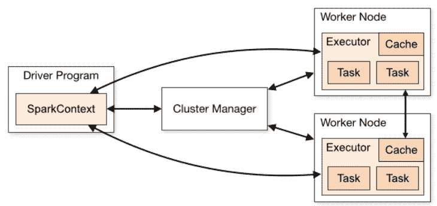
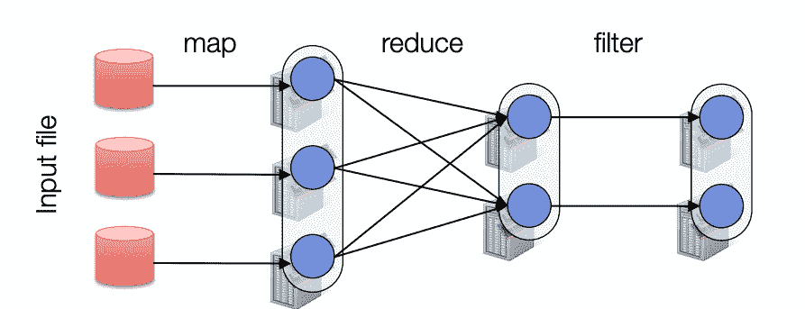
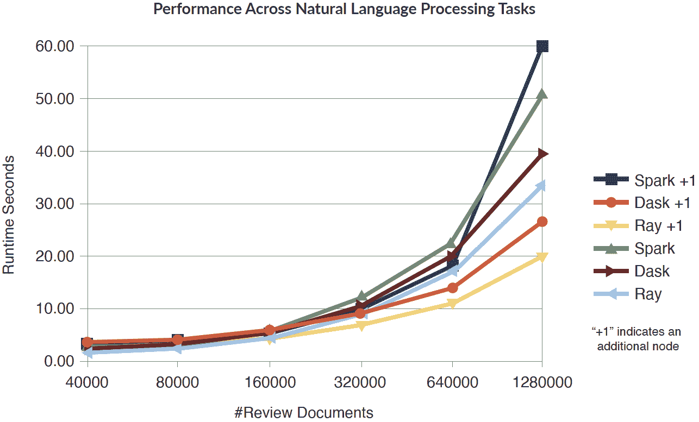
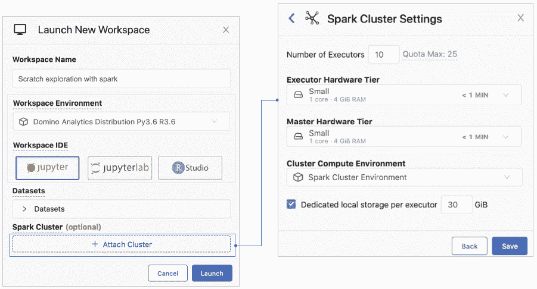

# 在数据科学堆栈中使用 Spark 的注意事项

> 原文：<https://www.dominodatalab.com/blog/considerations-for-using-spark-in-your-data-science-stack>

*This article covers the considerations to assess if Spark is the right technology for your data science needs. It also covers Spark’s architecture, alternative frameworks, and Domino’s support for on-demand Spark.*

您可能听说过 Apache Spark，甚至可能使用过它。Spark 是一个用于并行数据处理的框架和一组库。它创建于 2014 年，旨在解决 Apache Hadoop 的许多缺点，在分析工作负载方面比 Hadoop 快得多，因为它将数据存储在内存(RAM)中，而不是磁盘上。它还有许多内置的库，将机器学习算法实现为 MapReduce 作业(稍后描述)，使它们易于在许多计算资源上并行化。Spark 是开发最活跃的用于大规模数据处理的开源框架。

亚伯拉罕·马斯洛有一句名言:“如果你只有一把锤子，那么一切看起来都像钉子。”就 Spark 而言，许多用户最初被它在非常大的非结构化数据集上进行数据工程/ ETL 工作的能力所吸引。在 Spark 取得初步成功后，他们获得了将它用于其他任务的信心，并很快遇到了它的局限性。例如，许多数据科学家报告说，Spark 在其分布式计算框架中消耗了大量资源，与使用更传统的方法处理多个用例相比，实际上会降低数据处理速度。

本博客探讨了 Spark 的优势和劣势，特别是在现代数据科学和机器学习工作流的背景下，以帮助企业明智地将 Spark 纳入其分析技术战略。

## 火花建筑

为了理解适当的 Spark 用例的细节，首先理解基本的 Spark 架构是很重要的。Spark 应用程序由一个驱动程序进程和一组执行程序进程组成。驱动程序进程负责三件事:

1.  维护关于 Spark 应用的信息；
2.  响应用户的程序或输入；
3.  在执行者之间分析、分配和调度工作。

执行器负责执行驱动程序分配给它的代码，并向驱动程序节点报告该执行器上的计算状态。

*来源:[阿帕奇火花](https://spark.apache.org/docs/latest/cluster-overview.html)*

Spark 的计算模型基于弹性分布式数据集(RDDs)，这是一个跨集群的对象集合，具有用户控制的分区和存储。Spark 构建 rdd 的方法大量借鉴了 Hadoop 的 MapReduce 设计。“映射”任务将输入数据集分割成独立的块，这些块以完全并行的方式进行处理，然后“缩减”任务对映射的数据进行分组和分区。Spark 的 MapReduce 方法基于一种更先进的模型，称为有向无环图(DAG)，它比 Hadoop 中的 MapReduce 更有效地支持迭代。但是它仍然并行处理数据，其中有一个阻塞步骤，然后是一个等待步骤，在这个步骤中所有的东西都同步。

*来源:[斯坦福大学](https://stanford.edu/~rezab/sparkclass/slides/reza_introtalk.pdf)*

## 评估 Spark 时要考虑的因素

什么时候使用 Spark 是“正确的”答案，并没有固定的公式。通常，您首先需要确定在使用您选择的编程语言的非 Spark 环境中需要什么处理逻辑以及需要多少时间和资源。然后，您需要权衡添加 Spark 等分布式计算框架的利弊(例如，更多开销、更复杂的设置)。一般来说，当您的数据无法放入单台机器的内存中时，Spark 将是最合适的选择——例如，数据超过数百 GB。

Spark 最受欢迎的一些用例包括:

*   **流数据:** Spark Streaming 统一了不同的数据处理能力，允许开发人员使用单一框架在将数据推入数据存储之前不断清理和聚合数据。Spark Streaming 还支持触发事件检测、数据丰富和复杂的会话分析。
*   **交互分析:** Spark 的速度足够快，可以在非常大的数据集上进行探索性查询，无需采样。通过将 Spark 与可视化工具相结合，可以交互式地处理和可视化复杂的数据集。
*   **机器学习:** Spark 附带了一个用于执行高级分析的集成框架，可以帮助用户对数据集进行重复查询。该框架中的组件包括 Spark 的可扩展机器学习库(MLlib)。MLlib 可以在聚类、分类和降维等领域工作。

与其他数据处理选项相比，Spark 涉及更多的处理开销和更复杂的设置。以下是关于为什么 Spark 可能不是某些用例的正确框架的一些考虑因素:

### MapReduce 范例的有效性。

Spark 基本上基于 Hadoop 的设计架构，并利用 MapReduce 方法(DAG)在内存中创建数据块(rdd)。当每个块/任务需要大约相同的处理时间时，这种设计模式可能非常有效，但是对于许多由非常异构的任务组成的机器学习工作流来说，这种设计模式可能会很慢。例如，使用 MapReduce 方法训练深度神经网络可能非常低效，因为每一步的算法复杂性都可能存在极大的差异。¹

### 激发您的数据科学团队的复杂性。

Spark 是用 Scala 编写的，有 Scala、Python、Java 和 r 的 API。Scala 开发人员可以很快学会 Spark 的基础知识，但是要让 Spark 正常工作，他们还需要学习与内存和性能相关的主题，例如:

*   划分
*   节点
*   序列化
*   执行者、JVM 等等…

采用 Spark 通常需要重新培训您的数据科学组织。

### 团队的调试能力。

调试 Spark 可能会令人沮丧，因为内存错误和用户定义函数中发生的错误可能很难跟踪。分布式计算系统天生复杂，Spark 也是如此。错误消息可能具有误导性或被隐藏，有时通过本地测试的函数在集群上运行时会失败。找出这些情况的根本原因是具有挑战性的。此外，由于 Spark 是用 Scala 编写的，而大多数数据科学家只知道 Python 和/或 R，因此调试一个 [PySpark](/data-science-dictionary/pyspark) 应用程序可能相当困难。PySpark 错误将显示 Java 堆栈跟踪错误以及对 Python 代码的引用。

### 保持活力是 IT 面临的挑战。

众所周知，Spark 很难调整和维护。IT 部门通常在 Spark 专用内存和集群管理方面没有深厚的专业知识，因此确保集群不会在繁重的数据科学工作负载和许多并发用户的情况下崩溃是一项挑战。如果您的集群没有得到专业的管理，性能可能会非常糟糕，并且经常会出现因内存不足而导致的作业失败。

## 火花替代品正在出现

就在五年前，Hadoop 还是分布式数据处理的首选框架。世界上最大的分析会议甚至以它命名。如今，随着许多企业迁移出 Hadoop，集群处于闲置状态。

Hadoop 的迅速崛起和衰落是企业分析技术趋势变化速度的绝佳例子。考虑到这一点，今天有思想的 IT 领导者必须问，“Spark 会留下来吗，或者它会在几年内走上 Hadoop 的道路吗？”

已经有多种分布式计算框架为 Spark 提供了引人注目的成熟替代方案。

## Dask

2018 年，Dask 发布，创建了一个强大的并行计算框架，对 Python 用户来说非常有用，可以在单台笔记本电脑或集群上很好地运行。Dask 比 Spark 重量更轻，更容易集成到现有代码和硬件中。

Spark 增加了一个重要的学习曲线，涉及新的 API 和执行模型， [Dask](/data-science-dictionary/dask) 是一个纯 Python 框架，因此大多数数据科学家几乎可以立即开始使用 Dask。Dask 支持 Pandas dataframes 和 Numpy 数组数据结构，因此数据科学家可以继续使用他们熟悉和喜爱的工具。Dask 还与 Scikit-learn 的 JobLib 并行计算库紧密集成，能够以最小的代码更改并行处理 Scikit-learn 代码。

## 光线

加州大学伯克利分校 RISELab 的研究人员与 Spark 的最初开发有关联，他们指出，现有的数据处理和分布式计算框架无法满足今天复杂的机器学习要求。例如，Spark 和 Hadoop 不支持毫秒级的细粒度计算或动态执行。他们正在[从头开始创建 Ray](https://arxiv.org/pdf/1712.05889.pdf)以支持主要的机器学习用例，包括模拟、分布式训练、即时/快速计算以及在交互式场景中的部署，同时保留 Hadoop 和 Spark 的所有可取功能。

最初的[基准测试结果](https://towardsdatascience.com/benchmarking-python-distributed-ai-backends-with-wordbatch-9872457b785c)非常积极，表明 Ray 在某些应用中胜过 Spark 和 Dask。例如， [Ray 和 Dask 在常见自然语言处理任务的基准测试中均优于 Spark](https://blog.dominodatalab.com/spark-dask-ray-choosing-the-right-framework) ，从文本规范化和词干提取到计算词频表。

*来源:[走向数据科学](https://towardsdatascience.com/benchmarking-python-distributed-ai-backends-with-wordbatch-9872457b785c)*

## Domino:一个易于访问 Spark 和其他框架的平台

数据科学的创新发生得很快。十年前，每个人都在谈论 Hadoop 的潜力。五年前是火花。今天，我们正处于另一个十字路口，新的分布式计算框架变得越来越普遍。就像你的工具箱中需要的不仅仅是一把锤子，你还需要使用正确的语言、IDE、环境等的灵活性。手头的项目。选择一条道路至关重要，它允许您采用当今最强大的工具，同时具有支持未来新工具的灵活性。

Domino 是一个专门为大型组织的 IT 和数据科学部门构建的平台。它允许[数据科学组织](/resources/field-guide/managing-data-science-teams/)使用他们熟悉和喜爱的工具来构建、部署和共享模型。在底层，Domino 直接管理您首选的分布式计算框架，以及您的基础设施资源、工具和 ide。这使得数据科学团队能够以最小的 IT 开销使用他们想要的工具，同时满足 IT 需求。专门针对分布式计算和高性能机器学习，Domino 支持几个框架，包括 Spark 和 TensorFlow，并计划在它们变得更加突出时支持 Dask、Ray 和其他框架。

与一些基于 Spark 的平台不同，Domino 可以将 Spark 和非 Spark 工作负载统一在一个平台上——创建一种技术无关的方法，支持跨内核的并行处理。例如，一名在 Domino 工作的数据科学家可以为分布式计算工作负载(如图像转换)启动 Spark 集群；他们的同事可以使用 GPU 来进行机器学习训练，从而构建 TensorFlow 实例。他们的工作将统一在同一个 Domino 平台上，这样他们就可以协作、评论和复制彼此的工作。

Domino 还简化了集群和实例的设置，因此数据科学家不需要争夺 IT 资源。他们所要做的就是选择所需的计算能力，只需点击一下，Domino 就会自动将集群连接到他们的工作区(例如 Jupyter)或批处理脚本。没有开发运维或依赖性管理的痛苦；使用 Domino 在集群中自动加载包。

有了 Domino 对按需 Spark 集群的支持，数据科学家现在可以获得运行突发工作负载所需的能力、速度和灵活性，IT 团队也可以更轻松地支持他们，而无需承担管理单独 Spark 集群的负担。效率和治理已融入其中，IT 可以通过自动取消集群配置来降低计算成本。只需管理一个空间，不需要多个集群或特别请求。它可以消除依赖关系管理的麻烦，这种麻烦会随着不同的包和 Spark 二进制文件而来；Domino 完全管理集群中的包。最重要的是，您可以放心地知道 Domino 是技术无关的，并且将支持硬件集群上并行数据处理的最佳技术。

## 结论

Spark 有其优势，但它并不是一些供应商让您相信的数据科学的全部。了解它的优点和缺点是很重要的，这样你就可以在有意义的时候使用 Spark，在没有意义的时候避免使用它。但更重要的是，投资那些让你有更多选择的平台，这样你就不会被局限在一个生态系统中，并且可以在新的数据处理框架成熟时采用它们。

 

¹ *参见[“大规模分布式深度网络”](http://papers.nips.cc/paper/4687-large-scale-distributed-deep-networks.pdf)Jeffrey Dean 等人*

[Twitter](/#twitter) [Facebook](/#facebook) [Gmail](/#google_gmail) [Share](https://www.addtoany.com/share#url=https%3A%2F%2Fwww.dominodatalab.com%2Fblog%2Fconsiderations-for-using-spark-in-your-data-science-stack%2F&title=Considerations%20for%20Using%20Spark%20in%20Your%20Data%20Science%20Stack)