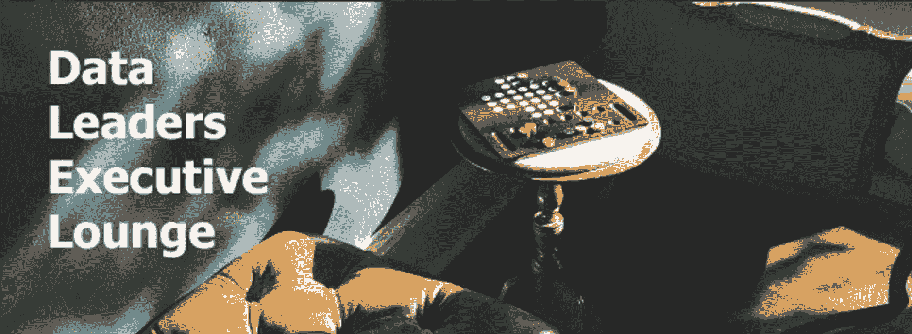

# 在锁定期间创建一个有影响力的数据领导者社区

> 原文：<https://www.dominodatalab.com/blog/creating-a-community-of-impactful-data-leaders-during-a-lockdown>

*本文最初发表于 [LinkedIn](https://www.linkedin.com/pulse/creating-community-impactful-data-leaders-during-lockdown-dan-harris/?trackingId=CnkiV%2BBp2swjf0N5Lm9WYA%3D%3D) 。感谢丹·哈里斯允许我们在这里重新发布它。*

今年 3 月，我们精心策划的商务活动、会议日历一夜之间消失了。在意识到虚拟世界将成为新常态之前，有一段短暂的不确定性。

在封锁之前，我的同事[尼古拉·曼切夫](https://www.linkedin.com/in/nikolaymanchev/)为数据科学从业者建立了[伦敦机器学习](https://www.meetup.com/London-Data-Science-and-Machine-Learning)会议，当他将会议转移到网上时，出席人数增加了。

我意识到我们需要某种东西来弥合从数据从业者到数据领导者之间的鸿沟。为了取得成功，它需要立即对数据主管有价值。这不是一件容易的事。

### 重新设想的想法

之前在 Dataiku 任职期间，我成立了一个名为*数据和鸡尾酒*的团队。我与伊登·史密斯合作，他帮助招募了我们的第一批代表。[彼得·杰克森](https://www.linkedin.com/in/peter-jackson-aa518711b/)是我们的开场发言人，当时他和[卡洛琳·卡鲁泽斯](https://www.linkedin.com/in/caroline-carruthers-22b9423/)正在完成[首席数据官行动手册](https://www.linkedin.com/company/cdosplaybook/)的终稿，这本书已经成为当前*(以及未来)*首席数据官的必读书目。

我带着十几个问题去参加了那个活动，在演讲结束后开始小组讨论。我不需要它们。也许是鸡尾酒的缘故，但谈话在彼得演讲后立即开始，并在接下来的两个小时里没有停止！

代表们愿意公开分享他们的挑战，尤其是他们在哪些方面遇到困难，这让我大吃一惊。许多人是他们公司雇佣的第一批数据领导者，并且正在为他们的公司建立全新的数据实践。他们得到了高管层的支持，高管们知道他们需要将数据作为数字化转型的核心，但往往缺乏需要交付什么的细节。

> 那张白纸既是祝福也是诅咒…

显而易见的是，这些数据领导者也有类似的经历，并希望有一个安全的环境，让他们可以与同行社区分享问题和交流想法。也许与我以前在数据库技术方面的角色相比，这是数据科学相对较新的一面，但这种坦诚的交流是我从未见过的。

当时我知道我们正在做一些事情，我知道我想在 2020 年在多米诺骨牌上复制类似的事情。

### 进入数据领导者行政休息室

我们需要为虚拟世界重新构思*‘数据和鸡尾酒’*的概念。我们作为一个团队集思广益，想出了给人们送一份礼物的主意，他们可以用这份礼物在会议期间与专家进行*“金钱买不到经验”*。

在我们 EMEA 负责人 [Colin Mitchell](https://www.linkedin.com/in/colin-d-mitchell/) 的高管支持下，我们推出了一个快速登陆页面、个人邀请函和 RSVP 表格。我们不知道人们是否愿意提供他们的家庭住址，或者他们是否感兴趣。我们不必担心，因为我们在 24 小时内超过了 12 名代表的目标，两周后有 30 人参加了我们的第一次活动。

> 我永远感谢 Graham Pymm 为我带来了一次独特的品酒体验，一次极具魅力的 Glaswegian 式的转变！

### 为什么数据领导者选择加入我们，而不是建立团体？

这个问题我已经纠结了一段时间。我想，也许我们是较早将互动礼物理念推向市场的，从那以后，我看到许多其他公司也在这么做。但我认为这不是主要原因。我认为我们所挖掘的，是一种真正的需要，那就是在不同的组织中处理类似挑战的同事之间的人类互动，把他们聚集在一起分享想法和挑战，有时是一个可以哭泣的肩膀！

进一步分析，我认为这些因素也起了作用。

### 1.排他性

我们让它只接受邀请，在发送之前审查每一份邀请，并在授予访问权限之前仔细检查我们的 RSVP，以确保我们保持小组的完整性，只有数据领导者才能访问。例如，你需要管理一个数据部门、业务或团队才能加入。这样，我们可以保持我们的话题具有战略性，谈话与领导力挑战相关。

> 这个小组是我曾经参加过的面对面会议的最佳替代方案之一！这里的想法确实帮助我在我的 60 名数据科学家团队中扩展和自动化了模型构建。你做得很好！

### 2.机密

虽然我们将使用 Zoom 作为交付平台，但我们从一开始就决定不录制会议，甚至不使用跟踪与会者的 Zoom 公司网络研讨会版本。相反，我们在我的个人 Zoom 帐户上运行它，所有需要的就是邀请链接和会议密码。我们宣布会议将按照查塔姆大厦规则**举行，目的是鼓励开放讨论，促进信息共享。**

 **### 3.特异性和相关性

我们为第一个活动创建了一个入口调查，在该调查中，我们询问小组成员他们面临的主要数据挑战是什么，以及他们认为应对这些挑战最有见地的方式是什么。虽然他们很高兴听到来自 Domino 和我们合作伙伴的消息，但他们最感兴趣的是听到来自他们同行的真实世界的谈话，以及我们为讨论和辩论创建一个开放的格式。

我们很喜欢来自数据领导者的演讲，如[哈文德·阿特瓦尔](https://www.linkedin.com/in/harvindersatwal/)和[本·迪亚斯](https://www.linkedin.com/in/bendias/)，但此后我们也加入了福布斯人工智能专栏作家和风险投资家[罗布·托尤斯](https://www.linkedin.com/in/robtoews/)，作者[卡洛琳·卡鲁泽斯](https://www.linkedin.com/in/caroline-carruthers-22b9423/)和数据人事首席执行官[杰斯·克拉克](https://www.linkedin.com/in/edensmithjezclark/)的观点。不过，最精彩的部分是我们放下话筒，向观众敞开心扉。我们从来不缺少生动的辩论！

我们很高兴收到我们的会员主动提供的话题和发言，因为这真的有助于保持事情的相关性，并确保我们的会员有很高的再次出席率。

### 4.社区和网络

在疫情期间，面对面的联系基本上已经不可能，商业模式已经被打乱，我们很遗憾地看到团队被解雇、裁员，甚至成员失去了自己的职位。Data Leaders 行政酒廊在此期间一直是风暴中的一个港口。与此同时，其他团队也在蓬勃发展并不断招聘，我们已经看到了成员组织之间的一些流动性。

每一版的休息室都扩大了一倍，这种增长很大程度上是由会员推荐他们网络中的同行推动的。

### **5。乐趣**

在开始的时候，我非常注意到 Zoom 电话的增加和个人接触的减少正在导致倦怠。随着几乎所有的面对面会议都转向在线，人们最不需要的就是*‘另一个放大电话’，*不管多么善意。

> 我个人最喜欢的是 ***【下班后酒吧锁定】*** 和令人捧腹的[詹姆斯·凯洛](https://www.linkedin.com/in/james-kellow-a43612b2/)，一半的人在会议结束后呆了一个多小时，谈论数据和品尝啤酒！

我们决定通过引入*“精选体验”*来开启每次会议，从而提升活动的档次。这种体验有适当的质量来反映观众的资历，但有一个物理元素，以便他们可以一起玩。我们向人们运送了葡萄酒、杜松子酒、精酿啤酒、巧克力和咖啡，并请来了专家来指导品尝会。这是通向会谈的一个奇妙的破冰方式。

### 这只是旅程的开始

我的共同主持人戴夫·布洛克和我正在计划下一次的休闲活动。如果你是一名数据领导者，并且认为成为这个小组的成员可能对你有价值，请给我发一条私信，我很乐意告诉你更多。

最初在英国发起的项目已经迅速扩展到欧洲大部分地区，上个月，我们在美国的团队也开始效仿。数据领导者高管休息室正在走向全球！我们希望你能参与其中！**