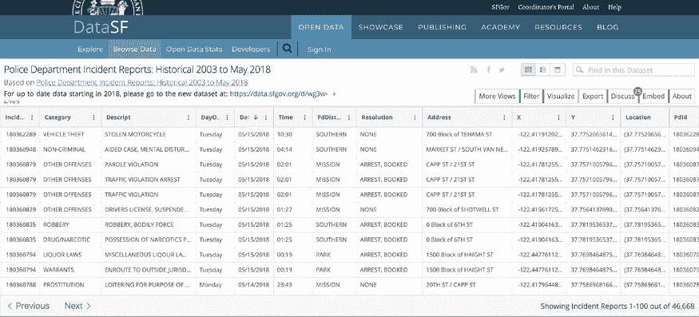
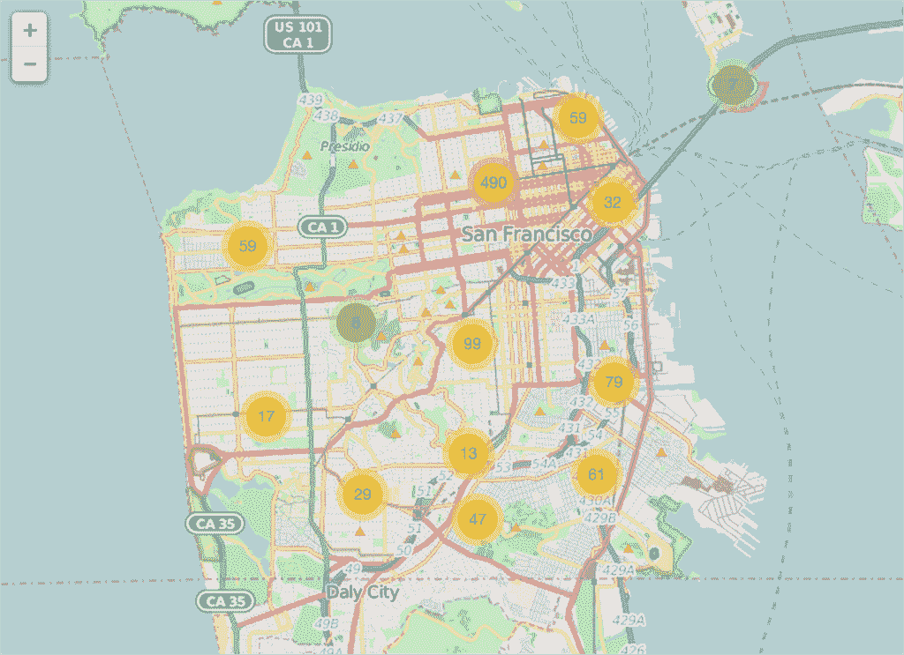
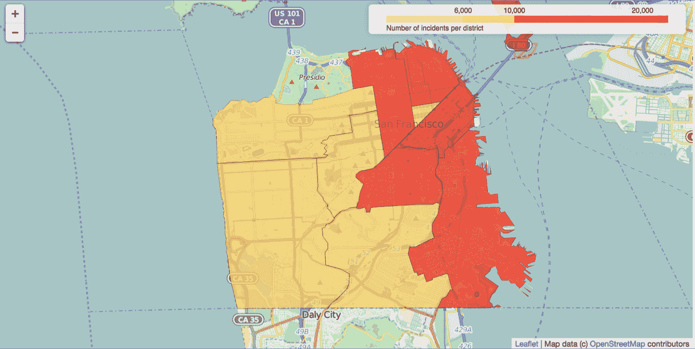
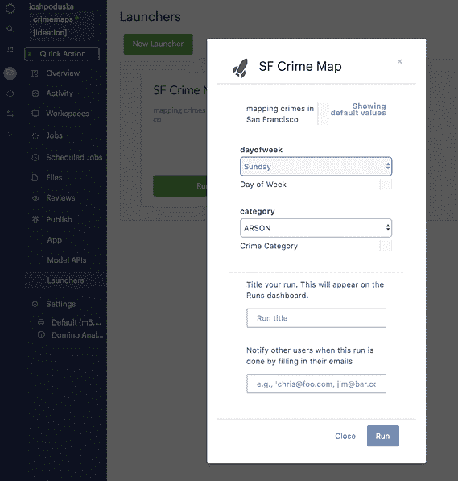
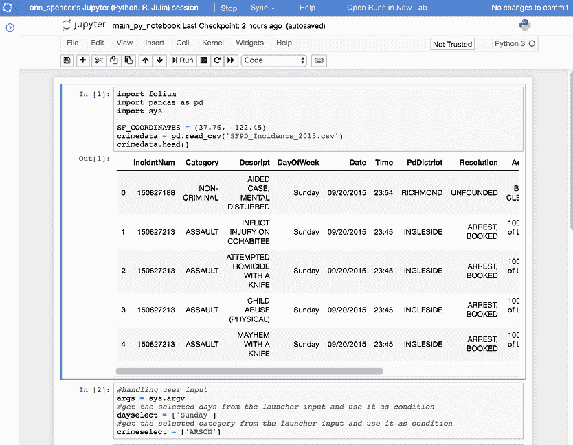
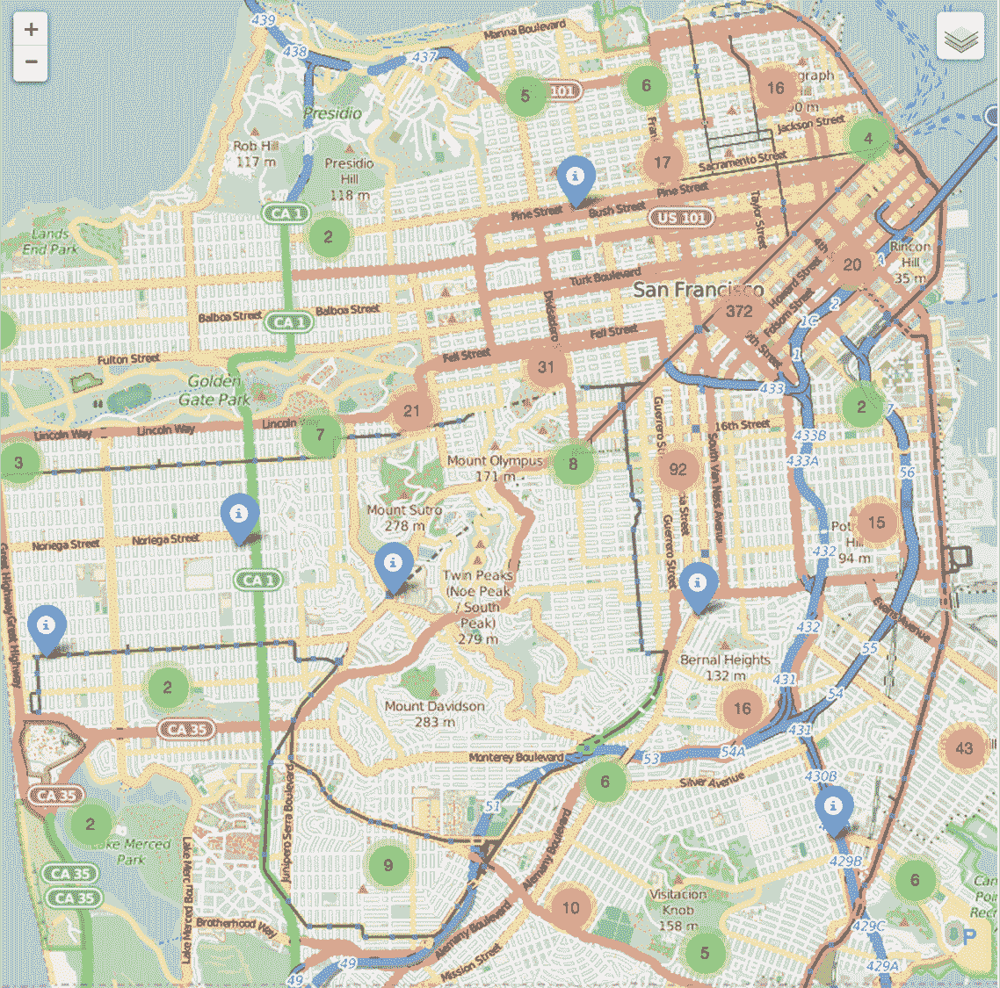
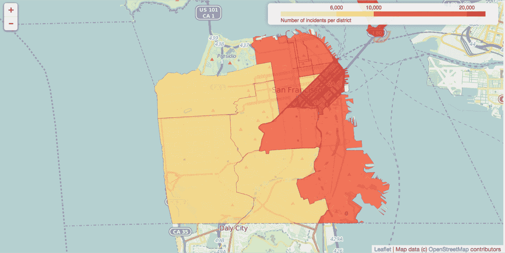
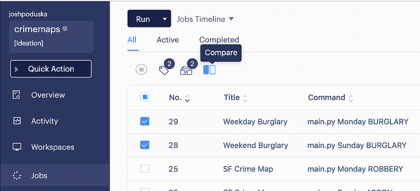
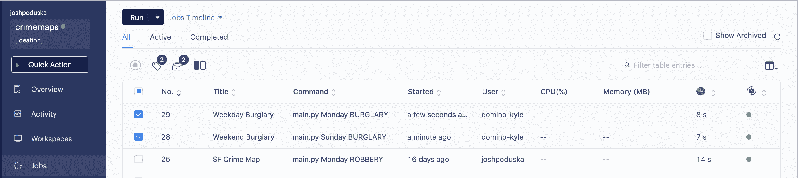

# 使用“叶子”创建交互式犯罪地图

> 原文：<https://www.dominodatalab.com/blog/creating-interactive-crime-maps-with-folium>

你可以在这里看到这个多米诺骨牌项目[。](https://try.dominodatalab.com/u/joshpoduska/crimemaps/overview)

一张漂亮的地图让我非常兴奋。但是当谈到用 Python 创建地图时，我一直在不断变化的 Python 库中寻找合适的库。经过一些研究，我发现了[叶](https://github.com/python-visualization/folium)，这使得用 Python 创建[叶](http://leafletjs.com/)地图变得很容易。这篇博文概述了我如何使用 fluous 可视化一个关于旧金山犯罪的数据集。然后，我描述了如何使用 Domino 将 Python 代码转换成自助报告工具。

## 什么是叶？

是一个强大的 Python 库，可以帮助你创建几种类型的传单地图。事实上，follow 结果是交互式的，这使得这个库对于仪表板的构建非常有用。要获得一个想法，只需在下一张地图上缩放/点击即可获得印象。《T2》中的 github 包含了许多其他的例子。

默认情况下，follow 在一个单独的 HTML 文件中创建一个地图。如果你使用 Jupyter(像我一样)，你可能更喜欢使用内嵌地图。这个 Jupyter 例子展示了如何内嵌显示地图。

## 收集数据

对于这个例子，我需要一些包含位置的有趣数据。我决定使用来自 SF OpenData 的 [SFPD 事件数据。使用导出功能(选择 csv)下载整个数据集。](https://data.sfgov.org/Public-Safety/Police-Department-Incident-Reports-Historical-2003/tmnf-yvry)



## 构建树叶地图

安装好数据后，我们可以开始编写脚本来可视化我们的数据。要开始设置，您需要在您的终端中运行`pip install folium`来安装 lyum。

Jupyter 笔记本只有几行代码。它将事件文件加载到 pandas 数据帧中，选择前 1000 条记录以加快速度，并创建一个包含交互式地图的内嵌地图，该地图带有基于结果数据集的标记。

```py
import folium
import pandas as pd

SF_COORDINATES = (37.76, -122.45)
crimedata = pd.read_csv("SFPD_Incidents_2015.csv")

# for speed purposes
MAX_RECORDS = 1000

# create empty map zoomed in  on San Francisco
_map = folium.Map(location=SF_COORDINATES, zoom_start=12)

# add a marker for every record in the filtered data, use a clustered view
for each in crimedata[0:MAX_RECORDS].iterrows():
    _map.simple_marker(
        location = [each[1]["Y"],each[1]["X"]],
        clustered_marker = True)

display(_map)
```

当运行这个程序时，它会创建一个带有位置标记的地图，如果位置标记靠得很近，就会聚集在一起(`clustered_marker = True`)。这里使用的 tileset 是 OpenStreetMap(这是默认设置)。leav 也可以和其他 tilesets 一起使用，比如 Mapbox 或者 Cloudmade。



通过使用`map.create_map(path='map.html')`而不是`display(map)`将地图保存为 html 文件

## 等值区域图

嗯，那很有趣！但是这可能不是比较地图的理想可视化方式。幸运的是，多亏了叶，还有一种创建 choropleth 地图的方法。

[维基百科](https://en.wikipedia.org/wiki/Choropleth_map):

> choropleth 地图(源自希腊语χώρο(“区域/地区”)+ πλήθος(“大众”))是一种专题地图，其中区域按照地图上显示的统计变量(如人口密度或人均收入)的度量值成比例地进行着色或图案化。

要创建 choropleth，我们需要一个 geojson 文件来创建与数据文件中的旧金山警区相匹配的区域/边界。在谷歌上搜索“旧金山警察局地区地理信息”，我找到了一个政府开放数据网站，它的 Shapefile 几乎符合我的需求。

下一步是将 Shapefile 转换为 geojson 文件。最简单的方法是使用一个 [ogr2ogr web 客户端](http://ogre.adc4gis.com/)。选择下载的 zip 文件，并将`crs:84`放入目标 SRS 字段。将结果保存为 sfpd zones . geo JSON，并将文件上传到 Domino 项目。

创建 choropleth 的额外 Python 代码如下。注意，我使用了整个数据集，而不是前面使用的 1000 条记录。因为 choropleth 基于聚合计数，所以速度不会受到大型数据集的影响。

```py
# definition of the boundaries in the map

district_geo = r"sfpddistricts.geojson"

# calculating total number of incidents per district
crimedata2 = pd.DataFrame(crimedata["PdDistrict"].value_counts().astype(float))
crimedata2.to_json("crimeagg.json")
crimedata2 = crimedata2.reset_index()
crimedata2.columns = ["District", "Number"]

# creation of the choropleth 
map1 = folium.Map(location=SF_COORDINATES, zoom_start=12)
map1.geo_json(geo_path = district_geo,
data_out = "crimeagg.json",
data = crimedata2,
columns = ["District", "Number"],
key_on = "feature.properties.DISTRICT",
fill_color = "YlOrRd",
fill_opacity = 0.7,
line_opacity = 0.2,
legend_name = "Number of incidents per district" 
```

它创建了一个如下的 choropleth 地图，在右上角有一个图例。[颜色调配器](http://colorbrewer2.org/)颜色方案是内置的，可以像`fill_color = 'YlOrRd'`一样添加。聚合计数存储在一个单独的 json 文件(`crimedata2.to_json('crimeagg.json')`)中，该文件稍后将在地图创建过程中用作数据源。



## 构建自助报告工具

犯罪事件数据不仅仅是地点和地区，而是更加丰富。它还包含类别、日期和时间等变量。例如，这为更好地了解特定类型的事件创造了机会。为了避免为所有的变量组合创建地图，我使用了 [Domino 的“Launcher”](https://www.dominodatalab.com/product/model-ops)特性，让其他人根据他们的参数创建他们自己的地图。



Domino 中的启动器是一个自助式 web 表单，允许非技术用户运行您的脚本。要创建一个，我们只需要指定通过 web 表单公开什么参数。

我的启动器将有两个参数:
1。“Dayofweek”是一个多选列表，包含一周中的所有日子。
2。“类别”是一个选择菜单，包含数据中的所有事件类别。

出于懒惰，我决定创建一个小脚本来创建数据中出现的类别列表。



我将第二个单元格的结果复制粘贴到新创建的启动器中的 Allowed Values 字段。

处理启动器请求的脚本是 [main.py](https://try.dominodatalab.com/u/joshpoduska/crimemaps/view/main.py) 。下一段代码处理用户输入，并使用它来过滤数据集:

```py
args = sys.argv
dayselect = args[1].split(",")
crimeselect = args[2]

daycond = crimedata["DayOfWeek"].isin(dayselect)
crimecond = crimedata["Category"] == (crimeselect)

filtered_crimedata = crimedata[crimecond & daycond]
```

既然我们有了类别和描述信息，为什么不用它作为标记的弹出窗口呢？只需将`popup=each[1]['Category'] + ": " + each[1]['Descript']`添加到标记放置功能的参数中。Main.py 包含标记映射代码和 choropleth 代码。

现在我们可以使用启动器创建地图。以下(静态)地图显示了周末(周六和周日)的毒品和麻醉品相关事件。放大创建的地图将使集群分裂。蓝色标记代表个别事件。看到大多数与毒品有关的事件发生在嫩腰区及其附近，可能并不奇怪。



它还创建了一个像这样的 choropleth 地图，讲述了一个类似于带有标记的地图的故事。


## 奖励:比较地图

现在我们已经创建了这样的代码和启动器，我们可以使用 Domino 比较特性将多个地图并排放置。

我有两次不同的经历，一次是在周末，一次是在工作日。两次运行都成功了。下一步是选择两个运行，并点击顶部的比较。



将打开一个页面，其中包含两次运行的比较。好的一面是它会把地图放在一起。这样我们可以很容易地看到，在我们的例子中，盗窃似乎在周末比在工作日更均匀地分布在旧金山。



这就是我们要做的，一个非常简单的创建和比较地图的方法。我还没有发现非常令人震惊的犯罪事件趋势。所以请在评论中分享你最感兴趣的发现。