# 使用 XGBoost、SMOTE 和阈值移动的信用卡欺诈检测

> 原文：<https://www.dominodatalab.com/blog/credit-card-fraud-detection-using-xgboost-smote-and-threshold-moving>

在本文中，我们将讨论组织在欺诈检测方面面临的挑战，以及如何使用机器学习来识别和发现人眼可能无法发现的异常情况。我们将通过 XGBoost 使用梯度增强技术来创建一个模型，我将向您介绍可以采取的步骤，以避免过度拟合，并构建一个适合目的并准备用于生产的模型。如果你想亲自尝试这个项目，你可以点击这里 注册一个 [免费账户。](https://www.dominodatalab.com/trial/)

信用卡欺诈是金融机构面临的一个重大问题，可靠的欺诈检测通常具有挑战性。在这里，我们展示了如何在现实世界的信用卡欺诈数据集上训练机器学习模型，以及如何采用过采样和阈值移动等技术来解决类别不平衡问题。

从历史上看，欺诈检测是由负责识别和跟踪数据中的可疑模式的分析师执行的。在线交易的快速增长，通常与在线购物、移动支付等相关联。，使得这种方法不可行。现代交易数据集有数百个维度、数百万条记录，并且以在线方式不断更新。像依靠持卡人报告欺诈交易这样的辅助技术不幸被证明是无效的[1]。

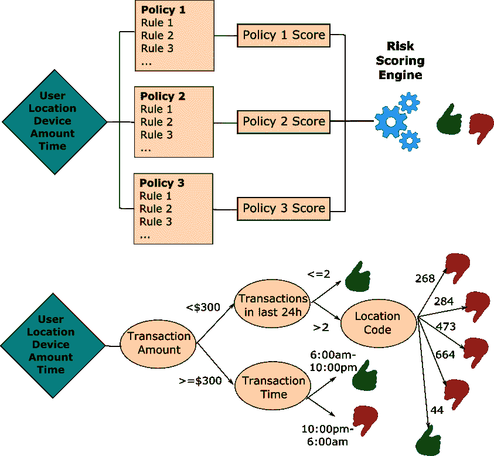

Rules-based fraud detection (top) vs. classification decision tree-based detection (bottom): The risk scoring in the former model is calculated using policy-based, manually crafted rules and their corresponding weights. In contrast, the decision tree classifies observations based on attribute splits learned from the statistical properties of the training data.

自动信用卡欺诈检测通常使用以下方法之一来实现:

**基于规则的检测** -基于硬编码的规则，这种方法需要大量的人工工作来定义大多数可能的欺诈条件，并制定触发警报或阻止可疑交易的规则。这种方法的一个优点是，它的决策本身是可以解释的——很容易识别将特定交易标记为欺诈的规则。缺点是基于规则的检测是计算密集型的，并且通常被实现为批量(或离线)评分。从维护的角度来看，保持规则更新并不断扫描漏网的假阴性也是一个挑战。

基于机器学习的检测 -使用统计学习是另一种越来越受欢迎的方法，主要是因为它不太费力。它可以实现为无监督(例如异常检测)或监督模型(分类)，并且需要较少的维护，因为模型可以自动重新训练以保持其关联最新。它也适用于在线应用，因为评分功能通常非常轻量级。ML 方法的一个缺点是，对于某些算法(例如深度学习)，没有保证的可解释性。

在这篇博文中，我们将展示一个基于 XGBoost 的基于 ML 的异常检测的实现。我们将经历一个典型的 ML 管道，在那里我们进行数据摄取、探索性数据分析、特征工程、模型训练和评估。

## 数据接收和探索性数据分析

我们从导入管道所需的 Python 库开始。然后，我们读取并检查样本数据集。该数据集包含匿名的信用卡交易数据，可从 [Kaggle](https://www.kaggle.com/mlg-ulb/creditcardfraud) 免费获取。这些数据是 Worldline 和布鲁塞尔自由大学的[机器学习小组合作研究的一部分。该数据集包含欧洲信用卡持有人在 2013 年 9 月进行的交易，并已被匿名化-功能 V1，V2，...、V28 是对原始数据应用 PCA 的结果。唯一完整的特征是时间和数量。类别标签的标题为 class，其中 0 表示真实交易，1 表示欺诈。](http://mlg.ulb.ac.be)

```py
import pandas as pd

import matplotlib.pyplot as plt

import numpy as np

import random

import seaborn as sns

from sklearn.model_selection import train_test_split
from sklearn.model_selection import StratifiedKFold
from sklearn.model_selection import GridSearchCV

from imblearn.over_sampling import SMOTE

from xgboost import XGBClassifier
from xgboost import Booster
from xgboost import DMatrix

from sklearn import metrics

from datetime import datetime

dataDF = pd.read_csv("dataset/creditcard.csv")
dataDF.head()
```

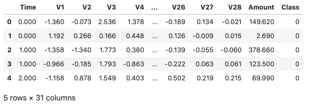

如果我们查看数据帧的维度，我们会注意到数据集总共包含 284，807 个样本。似乎也没有丢失值，但是，由于卡交易数据集通常包含大部分正常交易，只有一小部分欺诈交易，我们的预期是数据集将非常不平衡。我们可以通过检查目标类的分布来确认这一点。

```py
value_counts = dataDF["Class"].value_counts()

value_counts.plot(kind="bar", title="Class distribution of the target variable")
```

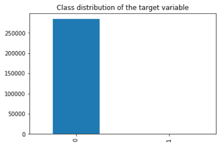

欺诈交易占整个数据集的 0.17%。正如所料，大多数样本都是合法交易。只有 0.17%的交易被标记为欺诈。让我们看看所有属性的基本描述性统计数据。

```py
pd.set_option("display.float_format", lambda x: "%.3f" % x)

dataDF.describe()
```

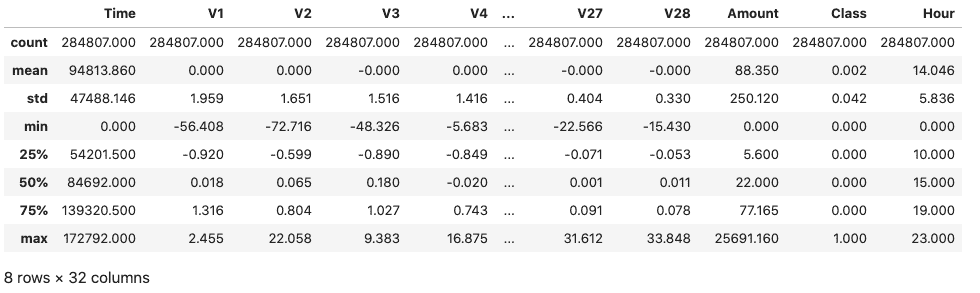

检查上面的统计数据可以发现，V1-V28 属性是以零为中心的，但是其他两个输入属性时间和数量却不是这样。

```py
dataDF[["Amount", "Time"]].describe()
```

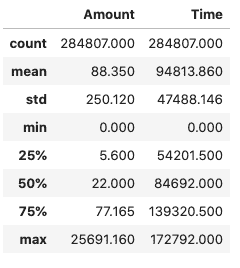

我们还可以绘制所有输入属性的直方图，并确保没有任何异常突出。

```py
ax = dataDF.drop("Class", axis=1).hist(figsize=(10,12),bins=100)

# We hide the axes' labels to make the plot neater and more compact

for axis in ax.flatten():

    axis.set_xticklabels([])

    axis.set_yticklabels([])
```

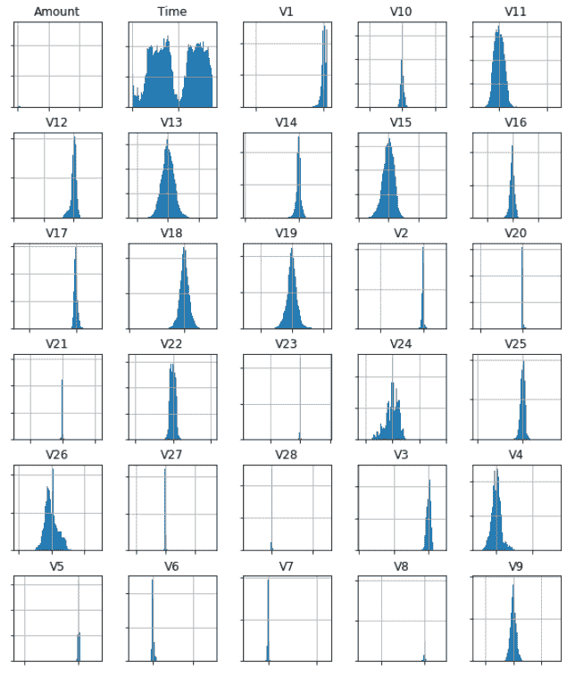

对于主成分我们无能为力，但是看起来数量和时间属性需要更详细的检查。

首先，时间的基本统计数据表明这个属性是以时间戳(秒)的形式给出的。我们可以将其转换为当地日期并提取小时数，以尝试确定交易的小时数是否与交易欺诈的可能性相关。

```py
dataDF["Hour"] = dataDF["Time"].apply(datetime.fromtimestamp).dt.hour

fig, ax = plt.subplots(2, figsize=(10,7))

for a in ax:

    a.set_xticks(range(24))

dataDF.loc[dataDF["Class"] == 0]["Hour"].hist(bins=np.arange(24)-0.5, ax=ax[0], grid=False)

dataDF.loc[dataDF["Class"] == 1]["Hour"].hist(bins=np.arange(24)-0.5, ax=ax[1], grid=False)

ax[0].title.set_text("Legitimate Transactions")

ax[1].title.set_text("Fraudulent Transactions")

plt.subplots_adjust(hspace=0.3)
```

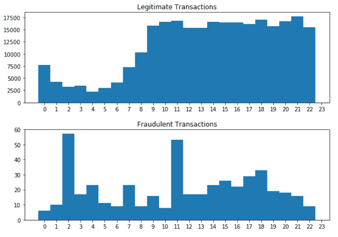

似乎合法交易在夜间急剧下降，随着工作日的开始，其比率增加。相比之下，凌晨 2 点左右是欺诈交易的高峰，这看起来很不寻常。此外，欺诈交易的数据看起来分布更加均匀。让我们编写一个简单的函数，它将允许我们在欺诈/非欺诈类之间比较单个属性的基本统计数据。

```py
def compare_leg_fraud(attribute):

    leg_trS = dataDF.loc[dataDF["Class"] == 0][attribute].rename("Legitimate").describe()

    frd_trS = dataDF.loc[dataDF["Class"] == 1][attribute].rename("Fraudulent").describe()

    tr_hourDF = leg_trS.to_frame().join(frd_trS.to_frame())

    return tr_hourDF

compare_leg_fraud("Hour")
```

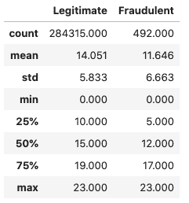

欺诈交易无疑具有较高的标准差，但鉴于其相对较低的数量，我们无法确定这是真实的模式还是只是统计上的巧合。

我们现在将注意力转移到交易金额上。让我们通过直方图直观显示欺诈交易与合法交易的分布。

```py
fig, ax = plt.subplots(2, figsize=(9,7))

dataDF.loc[dataDF["Class"] == 0]["Amount"].hist(bins=30, ax=ax[0])

dataDF.loc[dataDF["Class"] == 1]["Amount"].hist(bins=30, ax=ax[1])

ax[0].title.set_text("Legitimate Transactions")

ax[1].title.set_text("Fraudulent Transactions")

plt.subplots_adjust(hspace=0.3)
```

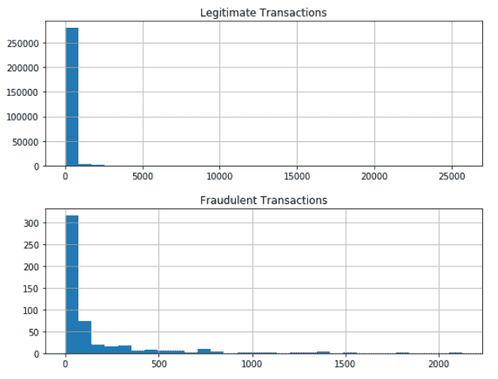

让我们看看 Amount 属性的基本统计信息。

```py
compare_leg_fraud("Amount")
```

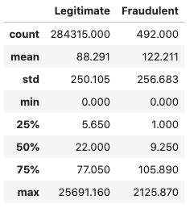

看起来欺诈交易的平均交易金额较高，尽管总交易金额的绝对值明显较低。我们还可以看看前 5 个最频繁的合法交易。

```py
(dataDF.loc[dataDF["Class"] == 0]["Amount"].value_counts(normalize=True)*100).head()
```

```py
1.000    4.775

1.980    2.126

0.890    1.714

9.990    1.669

15.000   1.154
```

对比前 5 大欺诈交易

```py
(dataDF.loc[dataDF["Class"] == 1]["Amount"].value_counts(normalize=True)*100).head()
```

```py
1.000    22.967

0.000     5.488

99.990    5.488

0.760     3.455

0.770     2.033
```

我们看到，所有欺诈交易中有近 23%的交易金额为 1.0，而合法交易中相同交易金额的百分比接近 5%。我们还看到大量的 0 值交易，这很可能是持卡人详细信息验证交易的结果。

## 特征工程

在尝试任何功能工程之前，我们要做的第一件事是创建一个维持集。这是为了防止任何信息泄露到我们的测试集中。

```py
trainDF, testDF = train_test_split(dataDF, test_size=0.2, random_state=1234, stratify=dataDF[["Class"]])

trainDF_norm["Amount"] = trainDF["Amount"].subtract(trainDF["Amount"].mean())

trainDF_norm["Hour"] = trainDF["Hour"].subtract(trainDF["Hour"].mean())

testDF_norm = testDF.copy()

testDF_norm["Amount"] = testDF["Amount"].subtract(testDF["Amount"].mean())

testDF_norm["Hour"] = testDF["Hour"].subtract(testDF["Hour"].mean())

trainDF = trainDF_norm

testDF = testDF_norm

tr_value_counts = trainDF["Class"].value_counts()
print("Fraudulent transactions are %.2f%% of the training set." % (tr_value_counts[1] * 100 / len(trainDF)))

tst_value_counts = testDF["Class"].value_counts()
print("Fraudulent transactions are %.2f%% of the test set." % (tst_value_counts[1] * 100 / len(testDF)))
```

```py
Fraudulent transactions are 0.17% of the training set.

Fraudulent transactions are 0.17% of the test set.
```

我们在探索性分析中注意到，Amount 列不是零均值居中的。让我们来解决这个问题，并且将小时属性居中，我们将使用它来代替时间。

```py
trainDF_norm = trainDF.copy()

trainDF_norm["Amount"] = trainDF["Amount"].subtract(trainDF["Amount"].mean())
trainDF_norm["Hour"] = trainDF["Hour"].subtract(trainDF["Hour"].mean())
testDF_norm = testDF.copy()
testDF_norm["Amount"] = testDF["Amount"].subtract(testDF["Amount"].mean())
testDF_norm["Hour"] = testDF["Hour"].subtract(testDF["Hour"].mean())

trainDF = trainDF_norm
testDF = testDF_norm
```

接下来，我们删除时间属性，因为我们将使用小时。

```py
trainDF = trainDF.drop(["Time"], axis=1)

testDF = testDF.drop(["Time"], axis=1)
```

现在，让我们将自变量和类变量分割到单独的数据框中。

```py
X_train = trainDF.iloc[:, trainDF.columns != "Class"]

y_train = trainDF.iloc[:, trainDF.columns == "Class"]

X_test = testDF.iloc[:, testDF.columns != "Class"]

y_test = testDF.iloc[:, testDF.columns == "Class"]

X_train.head()
```

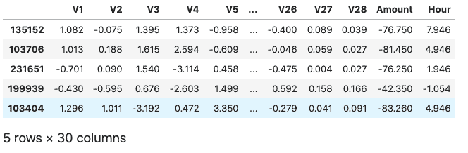

### 过采样

我们已经确定原始数据集是高度不平衡的。这通常是有问题的，因为基于这种数据训练的模型将很难识别少数类。当我们不只是对预测结果感兴趣时(我们知道如果我们假设交易不是欺诈性的，我们在 99.83%的时间里都是正确的)，而是检测少数类的实例(例如欺诈)，这就变成了一个更大的问题。

在实践中，有两种解决类不平衡的常用技术，这两种技术都会在数据集中引入偏差，以均衡所有类的表示。

**欠采样** -欠采样技术从优势阶层中移除观察值，以减少代表过多/代表不足的差距。例如，随机欠采样随机地移除样本(替换或不替换)，经常直到多数类中的观察值的数量变得与少数类中的观察值的数量相同。

过采样 -过采样也旨在减少类计数差异，但与欠采样不同，它通过增加少数类中的实例数量来实现这一点。这种策略有不同的方法，最常用的两种是随机过采样和 SMOTE。随机过采样是一个相当简单的解决方案，它简单地制作现有少数类观测值的多个副本，从而增加来自少数类的总观测值的数量。[另一方面，合成少数过采样技术(SMOTE)](https://blog.dominodatalab.com/smote-oversampling-technique/) 通过创建合成样本对少数类进行过采样。已经证明 SMOTE 优于简单的欠采样[2]

使用 SMOTE 来纠正我们数据集中的不平衡是相当容易的，这要感谢不平衡学习，这是一个 Python 包，提供了许多重采样技术，包括 SMOTE。

```py
X_train_smote, y_train_smote = SMOTE(random_state=1234).fit_resample(X_train, y_train)

smote_value_counts = y_train_smote["Class"].value_counts()

print("Fraudulent transactions are %.2f%% of the test set." % (smote_value_counts[0] * 100 / len(y_train_smote)))
```

```py
Fraudulent transactions are 50.00% of the test set.
```

现在，班级失衡问题已经解决，我们可以继续进行实际的模型培训了。

## 模特培训

我们现在将使用过采样训练集来训练 XGBoost 分类器。首先，我们定义一个函数，该函数将对分类器的最佳超参数执行网格搜索。该功能的亮点如下:

我们对 params 中给出的超参数进行参数搜索

*   每个模型的交叉验证策略在分层折叠中使用 3 个折叠
*   评估搜索中模型的度量是受试者工作特征曲线下的面积(ROC AUC)
*   该函数打印产生最高 AUC 分数的参数，并返回最佳估计值的参数作为其输出

```py
def xgboost_search(X, y, search_verbose=1):

    params = {

    "gamma":[0.5, 1, 1.5, 2, 5],

    "max_depth":[3,4,5,6],

    "min_child_weight": [100],

    "subsample": [0.6, 0.8, 1.0],

    "colsample_bytree": [0.6, 0.8, 1.0],

    "learning_rate": [0.1, 0.01, 0.001]

    }

    xgb = XGBClassifier(objective="binary:logistic", eval_metric="auc", use_label_encoder=False)

    skf = StratifiedKFold(n_splits=3, shuffle=True, random_state=1234)

    grid_search = GridSearchCV(estimator=xgb, param_grid=params, scoring="roc_auc", n_jobs=1, cv=skf.split(X,y), verbose=search_verbose)

    grid_search.fit(X, y)

    print("Best estimator: ")

    print(grid_search.best_estimator_)

    print("Parameters: ", grid_search.best_params_)

    print("Highest AUC: %.2f" % grid_search.best_score_)

    return grid_search.best_params_

```

由于训练集相当大，我们将网格搜索限制为 5000 个观察值的样本。在`xgboost_search`检查完所有可能的评估器后，它将打印出用于最佳执行评估器的参数，并将返回一个 XGBClassifier 对象，我们可以用它来检查模型的泛化能力。

请注意，尽管我们使用了相对较小的训练数据子集，但搜索仍需要训练超过 1，600 个模型，这将需要一段时间。

```py
rows = random.sample(np.arange(0,len(X_train_smote.index)).tolist(), 5000)

model_params = xgboost_search(X_train_smote.iloc[rows,], y_train_smote.iloc[rows,])
```

```py
Fitting 3 folds for each of 540 candidates, totalling 1620 fits

Best estimator:

XGBClassifier(base_score=0.5, booster='gbtree', colsample_bylevel=1,

              colsample_bynode=1, colsample_bytree=0.6, eval_metric='auc',

              gamma=1, gpu_id=-1, importance_type='gain',

              interaction_constraints='', learning_rate=0.1, max_delta_step=0,

              max_depth=4, min_child_weight=100, missing=nan,

              monotone_constraints='()', n_estimators=100, n_jobs=8,

              num_parallel_tree=1, random_state=0, reg_alpha=0, reg_lambda=1,

              scale_pos_weight=1, subsample=1.0, tree_method='exact',

              use_label_encoder=False, validate_parameters=1, verbosity=None)

Parameters:  {'colsample_bytree': 0.6, 'gamma': 1, 'learning_rate': 0.1, 'max_depth': 4, 'min_child_weight': 100, 'subsample': 1.0}

Highest AUC: 0.98
```

现在我们有了产生最高分数的参数集，我们可以使用它们在完整的过采样训练集上训练模型。

```py
model = XGBClassifier(objective="binary:logistic", eval_metric="auc", use_label_encoder=False)

model.set_params(**model_params)

model.fit(X_train_smote, y_train_smote)
```

```py
XGBClassifier(base_score=0.5, booster='gbtree', colsample_bylevel=1,

              colsample_bynode=1, colsample_bytree=0.6, eval_metric='auc',

              gamma=1, gpu_id=-1, importance_type='gain',

              interaction_constraints='', learning_rate=0.1, max_delta_step=0,

              max_depth=4, min_child_weight=100, missing=nan,

              monotone_constraints='()', n_estimators=100, n_jobs=8,

              num_parallel_tree=1, random_state=0, reg_alpha=0, reg_lambda=1,

              scale_pos_weight=1, subsample=1.0, tree_method='exact',

              use_label_encoder=False, validate_parameters=1, verbosity=None)
```

## 模型评估

我们将使用 ROC AUC 曲线来评估我们的模型在维持集(X_test，y_test)上的表现。为了生成 ROC 曲线，我们计算了不同阈值水平下维持集的真阳性(TP)和假阳性(FP)率。

对维持集调用`predict_proba(X_test)[:,1]`将给出样本[latex]{ Y _ I }[/latex]\ text { X \ _ test } _ I[/latex]属于第 1 类(欺诈)的估计概率。给定一个特定的阈值[latex]T[/latex]，如果[latex]T>\ hat { Y _ I }[/latex]，我们可以将[latex]\ text { X \ _ test } _ I[/latex]归类为欺诈。很明显，改变[latex]T[/latex]会影响 TP/FP 率，这就是 ROC 曲线所代表的。

我们还在图上显示了曲线下的面积(AUC ),因为它等于模型将均匀绘制的随机阳性排序高于均匀绘制的随机阴性的概率。

```py
y_pred = model.predict_proba(X_test)[:,1]

fp_r, tp_r, t = metrics.roc_curve(y_test, y_pred)

auc = metrics.auc(fp_r, tp_r)

plt.figure(figsize=(8, 6))

plt.plot(fp_r, tp_r, label="AUC = %.2f" % auc)
plt.plot([0,1],[0,1],"r--")

plt.ylabel("TP rate")
plt.xlabel("FP rate")

plt.legend(loc=4)
plt.title("ROC Curve")
plt.show()
```

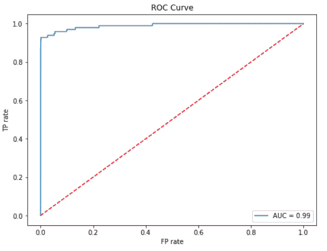

二元分类问题的标准方法是查看模型产生的概率，如果概率小于 0.5，则将观察值分类为 0 类，如果概率等于或大于 0.5，则将观察值分类为 1 类。在高度不平衡的数据集中，这种解释可能会导致糟糕的预测。偏移阈值(阈值移动)是一种标准技术，用于通过找到分类器产生的概率的最佳解释来改进预测。

欺诈检测中还有一个额外的因素，即一种错误分类的成本远远高于另一种。换句话说，将合法交易归类为欺诈最多是不方便的，但让欺诈交易溜走会带来更可怕的后果。在这种情况下，以减少假阳性为代价来抵消阈值成为一种可行的策略。

可以用多种方式来选择最佳阈值。查看 ROC 曲线，我们可以直观地看到，最佳性能(不考虑错误分类成本)将由位于曲线左上部分的阈值产生(即 TP 率高，FP 率低)。记住这个标准，我们可以定义一个到曲线左上角的距离度量，并找到一个最小化它的阈值。

[latex]T _ { optimal } = \ text { arg max } _ { T } \ sqrt { TP _ r-FP _ r }[/latex]

```py
t_opt_idx = np.argmax(tp_r - fp_r)

t_opt = t[t_opt_idx]

print("Threshold value is: %.2f" % t_opt)
```

```py
Threshold value is: 0.80
```

我们也可以手动检查不同阈值的混淆矩阵。

```py
y_pred = model.predict_proba(X_test)[:,1]

fig, axes = plt.subplots(3,3, figsize=(10,10))

for t, ax in enumerate(axes.flat):

    threshold = (t+1)/10

    y_pred_int = (y_pred > threshold).astype(int)

    c_matrix = metrics.confusion_matrix(y_test, y_pred_int)

    sns.heatmap(c_matrix, annot=True, cmap="Blues", fmt="d", ax=ax, cbar=False)

    ax.title.set_text("T=%.1f" % threshold)

plt.subplots_adjust(hspace=0.5, wspace=0.5)

plt.suptitle("Impact of threshold adjustment on the error matrix")

```

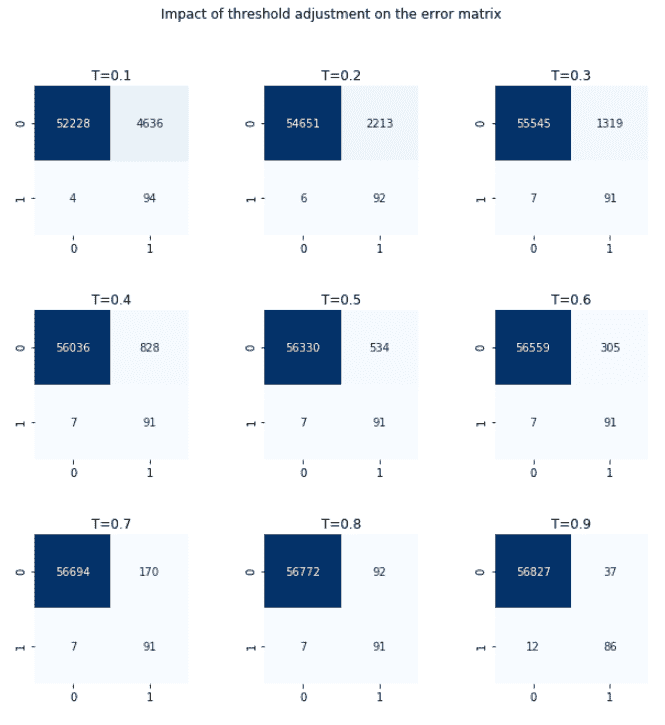

看上面的图，我们确实可以确认 T=0.8 给出了最好的解释。假阴性和假阳性都很低。提高阈值会导致遗漏更多欺诈交易，降低阈值会使误报数量翻倍。

既然我们对模型的表现感到满意，我们可以将它持久化，并从其他笔记本/评分脚本中使用它。

```py
model.save_model("smote_fraud.xgb")
```

## 摘要

在这篇博文中，我们查看了真实世界的信用卡交易数据集，并展示了如何使用机器学习来自动检测欺诈交易。随着新数据的到来，该模型可以自动更新，重新训练过程不需要人工干预。

数据集中的不平衡可以通过使用欠采样/过采样技术来解决，并且可以对概率的解释进行微调，以在错误警报和遗漏的欺诈交易之间产生更好的平衡。关于不平衡学习的含义和技巧的更正式的概述，你可以看[3]。

这篇博文中使用的完整数据集和代码可以在[try.dominodatalab.com、](https://try.dominodatalab.com/u/nmanchev/credit-card-fraud/overview)获得，这里显示的所有结果都是完全可再现的，这要感谢 Domino reproducibility engine，它是 Domino 数据科学平台的一部分。同样，如果你想自己实现，你可以点击这里注册一个[免费账户。](https://www.dominodatalab.com/trial/)

[](https://cta-redirect.hubspot.com/cta/redirect/6816846/f5406110-67c5-4d00-a931-9a6645238f5a) 

## 参考

[1] Jose M. Pavía，Ernesto J. Veres-Ferrer，Gabriel Foix-Escura，[信用卡事件和控制系统](https://www.sciencedirect.com/science/article/abs/pii/S0268401212000436)，《国际信息管理杂志》，第 32 卷，2012 年第 6 期，第 501-503 页，ISSN 0268-4012

[2]尼泰什诉舒拉、凯文·鲍耶、劳伦斯·霍尔和菲利普·凯格尔迈耶。2002. [SMOTE:合成少数过采样技术](https://arxiv.org/pdf/1106.1813.pdf)。j .阿提夫。里面的第 16 号决议，第 1 段(2002 年 1 月)，第 321-357 段。

[3]何和加西亚(2009 年)。[从不平衡数据中学习](https://ieeexplore.ieee.org/document/5128907)。知识与数据工程，IEEE 汇刊，21，1263-1284。doi: 10.1109/TKDE.2008.239