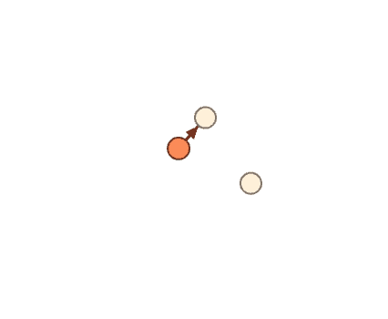
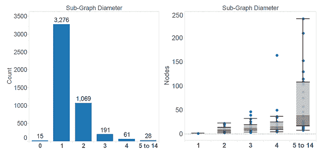
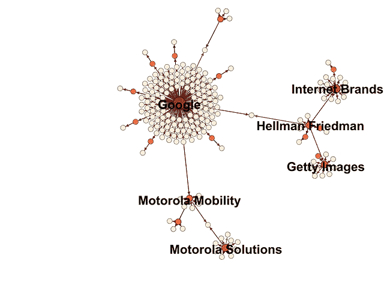

# 使用 Python 进行 Crunchbase 网络分析

> 原文：<https://www.dominodatalab.com/blog/crunchbase-network-analysis-with-python>

Crunchbase 最近将其后端数据库转换为一个 [Neo4j](http://nosql.mypopescu.com/post/84224779420/powered-by-neo4j-crunchbases-business-graph) 图形数据库。这将在未来给它带来很大的灵活性，但目前，数据的公开方式与以往类似:在进行任何图形分析之前，必须检索各个实体并使用属性数据来形成它们之间的边。除了在网页上手动遍历链接之外，没有提供图形分析。

为了能够对这些数据进行更强大的操作，我在 [Zipfian Academy](http://www.zipfianacademy.com/) 工作期间，创建了我的“可视连接”项目。“可视化连接”促进了 Crunchbase 数据的构建和网络分析，并额外提供了可在 NetworkX 或 Gephi 中使用的数据。

下面，我将对 Crunchbase 数据中的收购进行分析，并描述我所使用的技术。软件本身的技术细节记录在公共项目中。

### 现有数据

代表公司、金融机构和个人的整个数据库数据都存储在项目中。大多数人希望使用 NetworkX gpickle 文件来访问每种节点类型的数据。GraphML 文件也可以直接导入到 Gephi。

所提供的数据包含 24，000 多家金融机构、200，000 人和 200，000 家公司。其中，只有 9861 家公司参与了收购。

### 构建图表

Visibly Connected 是用 Python 编写的，依赖于 NetworkX 库进行网络存储和图形分析。使用 GraphBuilder 类构建图是最简单的，它是 NetworkX 的有向图的超类。实例化 graph 对象和读取节点相对容易，如下面的代码片段所示。完整的程序见`src/graph/build_acquisition_digraph.py`。完整的程序包含了一些从图表中删除不必要数据的技术。

```py
COMPANIES_COMPLETE = r'./data/company_complete.pkl'
x = gb.GraphBuilder()
x.read_gpickle(COMPANIES_COMPLETE)
```

使用每个节点的属性数据构建关系或边。您提供节点类型和关系列表。关系仅限于 Crunchbase 中定义的关系，目前还仅限于收购(被收购)、收购(收购他人)和投资(向公司提供资金)。请记住开源数据的一个重要偏见:如果有人不想公开信息，他们可以删除它。

```py
.add_relations_from_nodes('company', ['acquisitions', 'acquisition'])

x.summary()
```

恭喜你，你有人脉了。对于大多数分析来说，你会想要清理一下。不连接任何东西的节点往往对网络分析不感兴趣(个人判断。)小集群可能感兴趣，也可能不感兴趣。下面的行删除未连接的节点，然后是少于四个节点的子图。技术文档中解释的过滤可用于根据任意复杂的条件保留或删除节点。

```py
x.remove_nodes_from(x.isolates())

x.remove_small_components(min_size=4)

x.summary()
```

最后，如果你想保存或导出你的图表，这是一个单行的事情。GraphML 文件格式可以直接读入 Gephi。可以使用 GraphBuilder 类或 NetworkX 读取 gpickle 文件。

```py
ACQUISITIONS_GPICKLE = r'./data/full_acquisitions_digraph.pkl.gz'
x.write_gpickle(ACQUISITIONS_GPICKLE)
```

full_acquisitions_digraph_file 和相应的 GraphML 文件可以在项目数据目录以及其他一些目录中找到。

### 收购图表的结果

上面提到的 python 脚本的第二部分用于为图表生成多个网络和数据。可视化是在 Gephi 中生成的，尽管也可以使用 Matplotlib。在所提供的数据中，有 4640 个子图彼此之间没有联系。它们的大小从 1 到 242 个节点不等，直径从 1 到 14。直径是网络中从任何节点到任何其它节点的最长路径。下图显示了占采集子图 70%的两个图结构。



是的，没错:根据 Crunchbase 的数据，至少有 15 家公司收购了自己，从而产生了单节点 0 直径图。有两个节点的 3276 个图表示一家公司恰好收购了另一家公司。下图显示了每个子图中节点的数量以及它们与子图直径的关系。



显然，涉及少数公司的收购是最常见的。当公司开始吞并一直在吞并其他公司的公司时，事情变得更有趣了。谷歌和它的一些收购就是一个很好的例子。



然而，这张图并不是谷歌收购的所有公司。请注意，将 Mobility Solutions 和 Hellman Friedman 链接到谷歌的节点表明它们被两家公司收购。是的，只是时间不同。

直径为 14 的最大收购子图由两家主要公司组成。从社区的角度来看，他们只有一个脆弱的联系。想知道吗？试用这个软件。

## 讨论

在我看来，这些收购并不是 Crunchbase 中最有趣的数据。我鼓励你看看剩下的数据，并考虑利用各种基于图形的社区措施。有很多有趣的东西与风险投资、启动资金和人们从一家公司到另一家公司的转移有关。两个简单的想法:

*   哪些风投或天使投资人会先投资好公司？谁总是跟着别人？
*   哪些金融组织基于所资助的公司或参与的融资轮而彼此联系紧密？

请记住，存在明显的偏差。Jamie Davidson 和在 [GitHub](https://github.com/mode/blog/tree/master/2014-01-30-founder-experience) 上有相关软件的 [Benn Stancil](http://bennstancil.com/are-experienced-founders-better) 已经写了关于生存偏差的文章，并且在更传统的表格中有一组备用的 Crunchbase 数据。

在项目 README.md 中有更多关于软件、数据和文件的详细信息。如果您有任何问题，请随时与我联系。