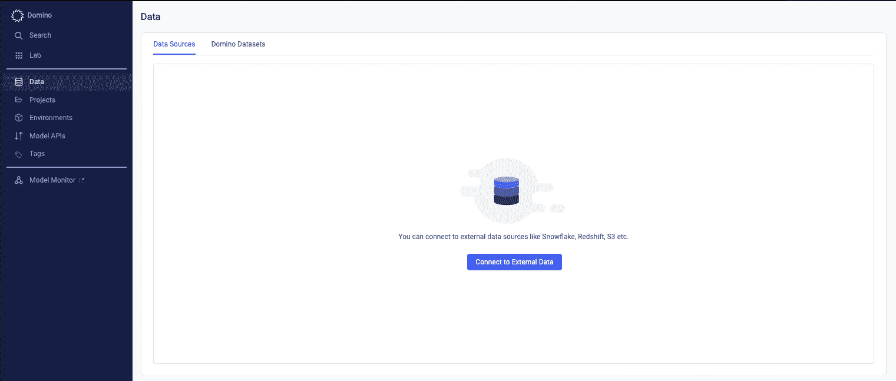
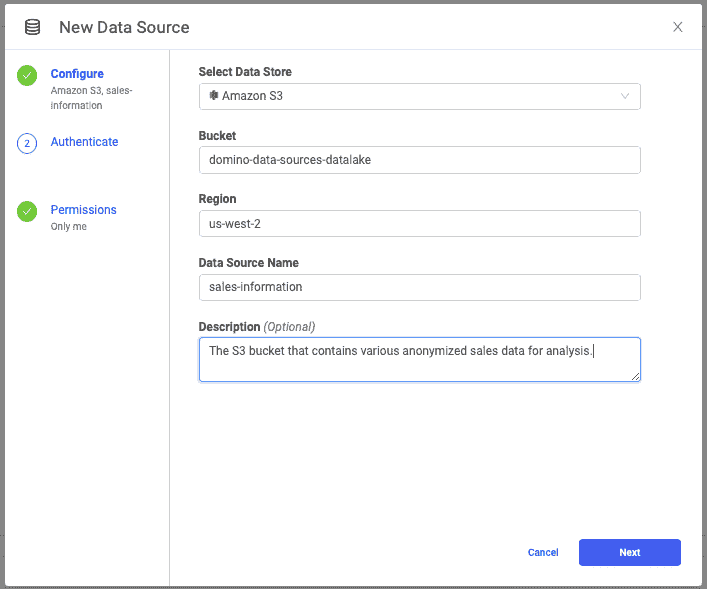
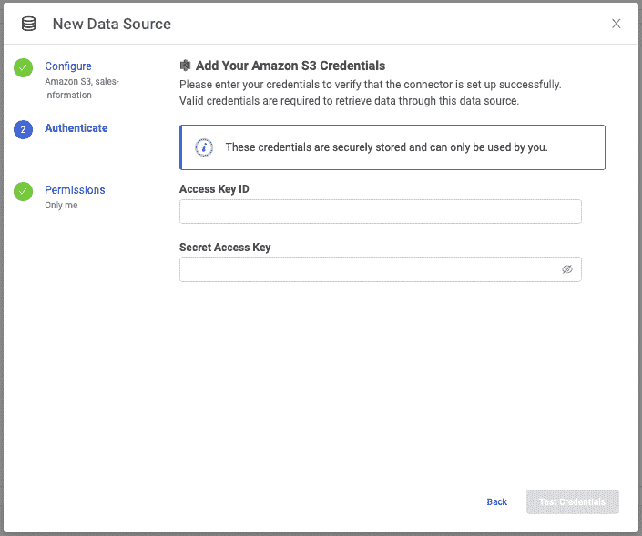
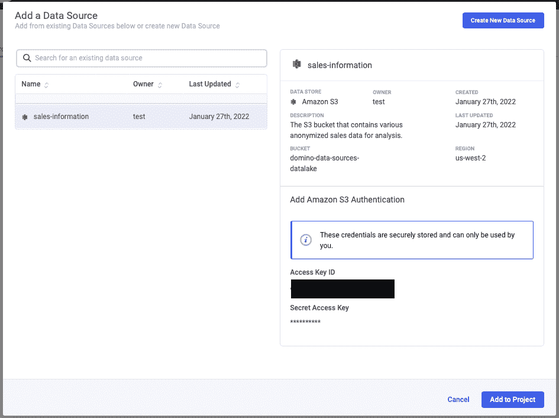
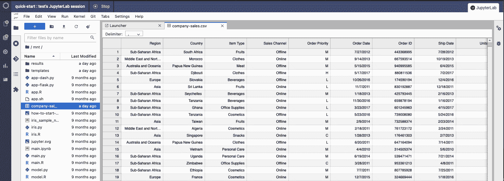
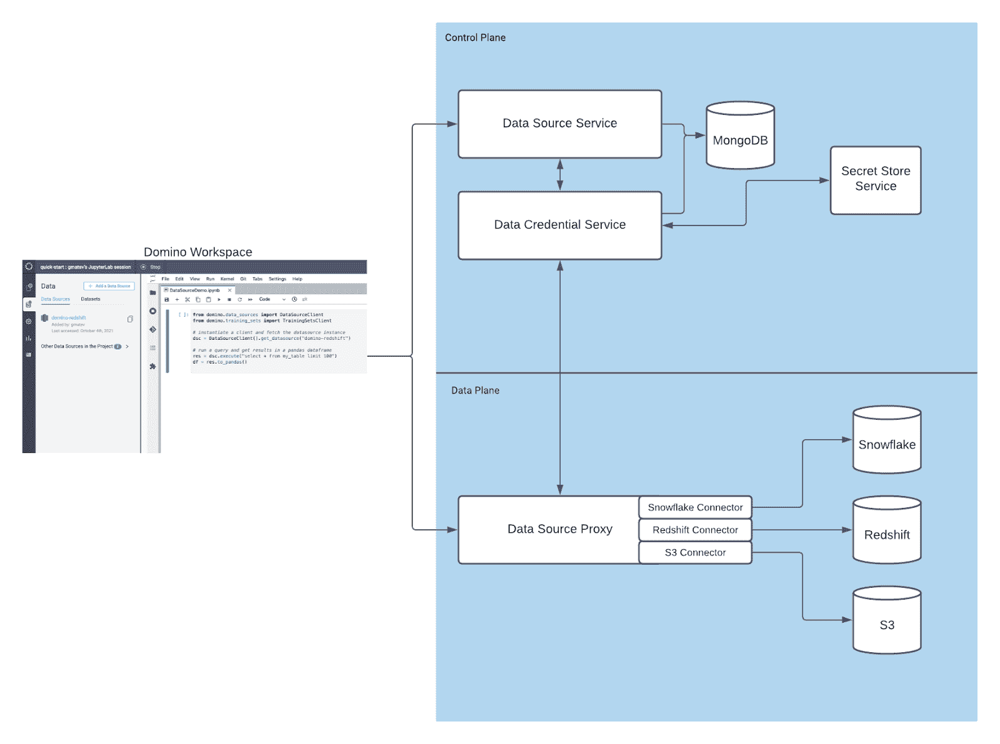

# Domino 5.0:共享和重用可信数据源以提高模型质量

> 原文：<https://www.dominodatalab.com/blog/data-connectors>

## Domino 5.0 中的数据源介绍

数据科学家浪费时间去弄清楚在哪里可以找到他们需要的数据，访问这些数据，并配置正确的工具来连接这些数据。 [Domino 5.0](https://www.dominodatalab.com/resources/introducing-domino-5.0) 通过数据连接器简化了整个流程，让数据科学团队安全地共享和重用通用数据访问模式。

Domino 数据源提供了一种机制来创建和管理受支持的外部数据服务的连接属性。连接属性被安全地存储，并且不需要安装特定于数据源的驱动程序或库。紧密耦合的库为基于表格和基于文件的数据提供了一致的访问模式。

使用 Domino 5.0，数据科学家团队可以注册和配置对外部数据源的访问，比如 Amazon Redshift、Amazon S3 和 Snowflake。一旦在 Domino 中注册了数据源，团队就可以开始利用数据访问 Python 库来列出和获取注册的外部数据源中的对象，甚至可以直接在 Pandas dataframes 中查询表格数据！

Domino 中的数据源通过消除与驱动程序安装、特定库等相关的 DevOps 障碍，使数据访问民主化。 通过与同事共享数据源连接器来增强团队协作。IT 团队将会很高兴地看到, 支持每个用户和服务帐户凭证的功能，以最大限度地提高灵活性，同时保持最高级别的数据安全性。

### 它是如何工作的

从 Domino 数据科学家的角度来看，只需点击几下鼠标，就可以为数据源配置一个新的连接器。在 Domino 中，导航到左侧导航栏上的“Data”部分，并选择“Connect to External Data”。

模式窗口出现后，从下拉菜单中选择数据存储的类型。出于演示的目的，我们将使用亚马逊 S3。

首先，您需要添加一些关于您将要连接的亚马逊 S3 桶的基本信息。

接下来，您需要将您的 AWS 凭证添加到 Domino。这个过程是完全安全的，只有您可以查看凭证。即使是 Domino 管理员也不能查看您的凭证。

您可以通过单击“测试凭据”来快速验证凭据是否有效。验证之后，您可以保存新的数据连接器，并开始在 Domino 中使用它。

现在导航到 Domino 中的一个项目，并单击“Data”部分。您将看到您有权访问的数据连接器列表。在我们的例子中，选择您之前配置的亚马逊 S3 连接器。

选择数据源的连接器后，单击“添加到项目”,然后启动一个工作区开始使用它。

正如你将在下面的截图和上面的演示视频中看到的，你可以通过 [Domino SDK](https://docs.dominodatalab.com/projects/domino-data-api/en/latest/install.html) 直接在亚马逊 S3 处理文件。

在这个例子中，我创建了一个到亚马逊 S3 的连接，然后使用 JupyterLab 下载销售数据 CSV 文件，该文件在我的 S3 存储桶中，以便在 Domino 中使用。

现在数据已经在 Domino 工作区中，我们可以继续编写代码来提取和使用这些数据！

#### 幕后强大的技术

既然我们已经介绍了这在实践中是如何工作的，那么让我们来探索技术细节。

虽然在上面的截图中有很多东西需要解开，但我们可以开始将其分成几个部分。从用户在 Domino 中启动他们的工作空间并开始使用 [Python 库](https://docs.dominodatalab.com/projects/domino-data-api/en/latest/) 建立到外部数据源的连接开始，我们有许多组件来帮助用户实现这种连接。

当用户从其工作空间或作业中启动查询时，最初会从运行的工作空间容器连接到数据源服务，数据源服务负责管理数据源元数据并促进与下游服务的连接。该服务将在 MongoDB 中执行查找，以收集关于数据源的元数据。MongoDB 不包含任何关于凭证的信息，而是包含关于数据源的元数据，这些元数据将帮助下游服务建立连接。

当您为数据源添加凭证时，它们作为访问密钥和秘密密钥存储在与 Domino 一起部署的 [Hashicorp Vault](https://www.vaultproject.io/) 的实例中。我们通过数据凭证服务安全地检索这些凭证，并将它们传递给数据源代理服务，这是一种无状态的微服务，充当上游服务和用户希望访问的数据源(如雪花、亚马逊 S3 或红移)之间的中间人。既然请求有了适当的元数据和凭证，它就被路由到高可用性数据源代理服务，以连接到亚马逊 S3(在我们的示例中)。

Domino 生产的各种连接器利用特定于供应商的 Go SDK，这有助于满足连接到各种数据源所需的先决条件，比如数据库驱动程序。这将连接数据源的复杂性从 Domino 中的数据科学家那里抽象出来，以便他们每次都可以使用熟悉的方式连接到他们的数据。

### 结论

访问适当的数据是任何数据科学项目的关键部分。过去，在 Domino 和其他平台上，用户或数据科学家团队很难设置、配置和维护连接到各种数据源所需的凭证和驱动程序。对于非超级用户来说尤其如此。有了 Domino 数据源，启动和运行数据的困难就减轻了。

Domino 是 [企业 MLOps](https://www.dominodatalab.com/resources/a-guide-to-enterprise-mlops/) 平台，它无缝集成了代码驱动的模型开发、部署和监控，以支持快速迭代和最佳模型性能，因此公司可以确保从其数据科学模型中实现最大价值。

