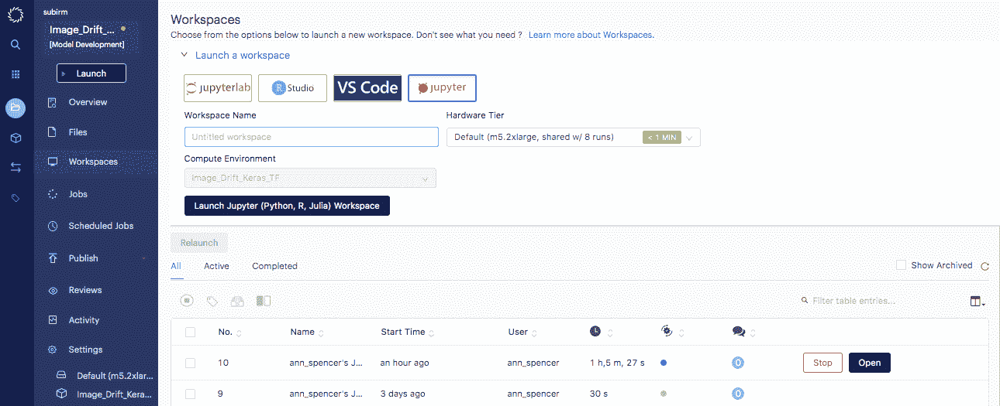
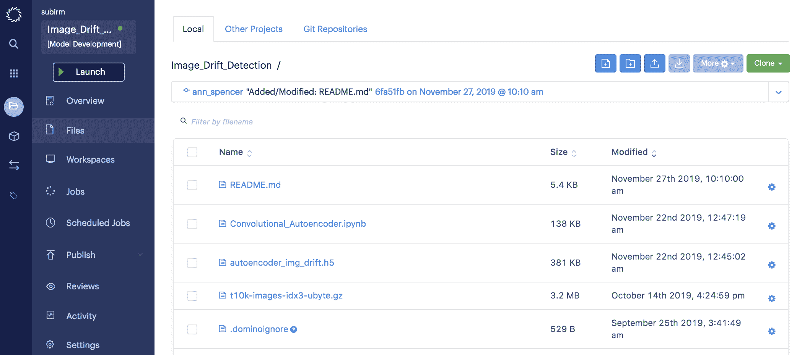
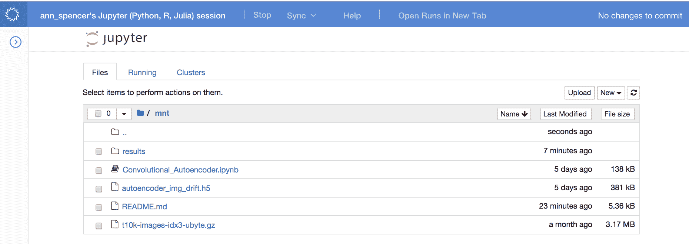
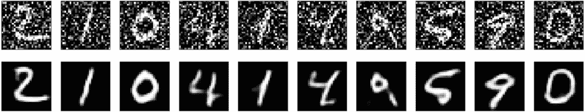
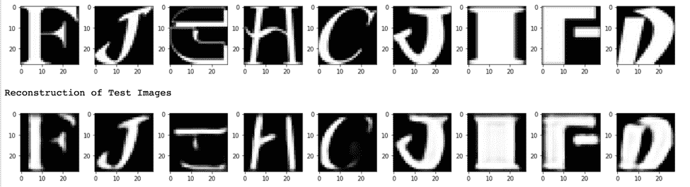

# 图像分类器的数据漂移检测

> 原文：<https://www.dominodatalab.com/blog/data-drift-detection-for-image-classifiers>

*本文介绍了如何检测将图像数据作为输入的模型的数据漂移，以防止它们在生产中无声地退化。在一个补充的 [Domino 项目](https://try.dominodatalab.com/u/subirm/Image_Drift_Detection/overview)中运行这个例子。*

## 防止生产中的静默模型退化

在现实世界中，数据是由不同的系统记录的，并且是不断变化的。数据的收集、处理和转换方式会影响数据。由于物理系统的机械磨损而引入噪音，或者如果基础生产过程发生根本变化(例如，监管机构的利率变化、自然灾害、市场中引入新的竞争对手或业务战略/流程的变化等)，可能会发生变化。).这种变化会影响预测的准确性，并且需要检查在模型开发期间做出的假设在模型投入生产时是否仍然有效。

在机器学习的背景下，我们认为数据漂移¹ 是导致模型性能下降的模型输入数据的变化。在本文的剩余部分，我们将讨论如何检测将图像数据作为输入的模型的数据漂移，以防止它们在生产中无声地退化。

## 检测图像漂移

鉴于企业中对深度学习的兴趣激增，将非传统形式的数据(如非结构化文本和图像)吸收到生产中的模型正在增加。在这种情况下，主要依赖数字数据的统计过程控制和运筹学方法很难采用，因此需要一种新的方法来监控生产中的模型。本文探索了一种方法，可用于检测对图像数据进行分类/评分的模型的数据漂移。

## 模型监控:方法

我们的方法不对已经部署的模型做出任何假设，但是它需要访问用于构建模型的训练数据和用于评分的预测数据。检测图像数据的数据漂移的直观方法是构建训练数据集的机器学习表示，并使用该表示来重建呈现给模型的数据。如果重建误差较高，则呈现给模型的数据与其被训练的数据不同。操作顺序如下:

1.  学习训练数据集的低维表示(编码器)
2.  使用步骤 1(解码器)中的表示重建验证数据集，并将重建损失存储为基线重建损失
3.  使用步骤 1 和 2 中的编码器和解码器重建正在发送的用于预测的一批数据；商店重建损失

如果用于预测的数据集的重建损失超过基线重建损失一个预定义的阈值，则发出警报。

## 图像数据漂移检测正在发挥作用

下面的步骤显示了涵盖上面详述的方法的相关代码片段。该项目的完整代码是可用的，可以从[https://try.dominodatalab.com](https://try.dominodatalab.com)上的 [*图像 _ 漂移 _ 检测*项目](https://try.dominodatalab.com/u/subirm/Image_Drift_Detection/overview)中分叉。





在[*Image _ Drift _ Detection*项目](https://try.dominodatalab.com/u/subirm/Image_Drift_Detection/overview)可用的笔记本(*Convolutional _ auto encoder . ipynb*)布局如下:

1.  在 MNIST 数据集² 上训练卷积自动编码器；使用验证损失作为基线来比较新数据集的漂移。
2.  向 MNIST 数据集添加噪声，并尝试重建有噪声的 MNIST 数据集；注意重建损失。(如有需要，用作替代基线)。
3.  使用步骤 1 中构建的卷积自动编码器重建 nonMNIST3 数据集，并将重建损失与 MNIST 数据集的验证损失或含噪 MNIST 数据集的重建损失进行比较。



我们现在深入相关的代码片段来检测图像数据的漂移。

***步骤 1*** :通过将以下内容添加到 docker 文件中来安装项目所需的依赖项。你也可以在[https://try.dominodatalab.com](https://try.dominodatalab.com)中使用 *Image_Drift_Keras_TF* 环境，因为它已经预装了所有的库/依赖项。

```py
RUN pip install numpy==1.13.1
RUN pip install tensorflow==1.2.1
RUN pip install Keras==2.0.6
```

***第二步:*** 启动 Jupyter 笔记本工作区，加载所需的库。

```py
#Load libraries

from keras.layers import Input, Dense, Conv2D, MaxPool2D, UpSampling2D, MaxPooling2D

from keras.models import Model

from keras import backend as K

from keras import regularizers

from keras.callbacks import ModelCheckpoint

from keras.datasets import mnist

import numpy as np

import matplotlib.pyplot as plt
```

***第三步:*** 为 autoencoder 指定架构。

```py
#Specify the architecture for the auto encoder

input_img = Input(shape=(28, 28, 1))

# Encoder

x = Conv2D(32, (3, 3), activation='relu', padding='same')(input_img)

x = MaxPooling2D((2, 2), padding='same')(x)

x = Conv2D(32, (3, 3), activation='relu', padding='same')(x)

encoded = MaxPooling2D((2, 2), padding='same')(x)

# Decoder

x = Conv2D(32, (3, 3), activation='relu', padding='same')(encoded)

x = UpSampling2D((2, 2))(x)

x = Conv2D(32, (3, 3), activation='relu', padding='same')(x)

x = UpSampling2D((2, 2))(x)

decoded = Conv2D(1, (3, 3), activation='sigmoid', padding='same')(x)
autoencoder = Model(input_img, decoded)

autoencoder.compile(optimizer='adadelta', loss='binary_crossentropy')
```

***第四步:*** 生成测试、训练和嘈杂的 MNIST 数据集。

```py
# Generate the train and test sets

(x_train, _), (x_test, _) = mnist.load_data()

x_train = x_train.astype('float32') / 255.

x_test = x_test.astype('float32') / 255.

x_train = np.reshape(x_train, (len(x_train), 28, 28, 1))

x_test = np.reshape(x_test, (len(x_test), 28, 28, 1))

# Generate some noisy data

noise_factor = 0.5

x_train_noisy = x_train + noise_factor * np.random.normal(loc=0.0, scale=1.0, size=x_train.shape)

x_test_noisy = x_test + noise_factor * np.random.normal(loc=0.0, scale=1.0, size=x_test.shape)

x_train_noisy = np.clip(x_train_noisy, 0., 1.)

x_test_noisy = np.clip(x_test_noisy, 0., 1.)
```

***第五步:*** 训练卷积自动编码器。

```py
# Checkpoint the model to retrieve it later

cp = ModelCheckpoint(filepath="autoencoder_img_drift.h5",

save_best_only=True,

verbose=0)

# Store training history

history = autoencoder.fit(x_train_noisy, x_train,epochs=10,

batch_size=128,

shuffle=True,

validation_data=(x_test_noisy, x_test),

callbacks = [cp, plot_losses]).history
```

我们得到的验证损失是 0.1011。

***第六步:*** 得到含噪 MNIST 数据集的重建损失。

```py
x_test_noisy_loss = autoencoder.evaluate(x_test_noisy,decoded_imgs)
```

Sample of noisy input data (top row) and reconstructed images (bottom row)

我们在有噪声的 MNIST 数据集上获得的重建误差为 **0.1024** 。与验证数据集的基线重建误差相比，误差增加了 **1.3%** 。

***第七步:*** 获取 nonMNIST 数据集的重建损失；比较 MNIST 数据集和噪声 MNIST 的验证损失。

```py
non_mnist_data_loss = autoencoder.evaluate(non_mnist_data,non_mnist_pred)
```

Sample of nonMNIST data (top row) and its corresponding reconstruction (bottom row)

我们在 nonMNIST 数据集上获得的重建误差为 **0.1458** 。与验证数据集上的基线重建误差相比，误差增加了 **44.2%** 。

从这个例子中可以清楚地看出，当卷积编码器重建不同于用于训练模型的数据集时，重建损失中存在尖峰。作为检测结果的下一步是用新数据重新训练模型，或者调查导致数据变化的原因。

## 结论

在本例中，我们看到卷积自动编码器能够根据重建误差量化图像数据集中的差异。使用这种比较重建误差的方法，我们可以检测呈现给图像分类器的输入的变化。但是，将来可以对这种方法进行改进。首先，虽然我们使用试错法来确定卷积自动编码器的架构，但通过使用神经架构搜索算法，我们可以获得更精确的自动编码器模型。另一个改进可以是在训练数据集上使用数据扩充策略，以使自动编码器对于噪声数据以及图像的旋转和平移的变化更加鲁棒。

* * *

如果您想了解更多关于如何使用 Domino 监控您的生产模型的信息，您可以观看我们关于“[监控大规模模型](https://go.dominodatalab.com/dmm-monitor-the-health-of-all-your-models)”的在线研讨会。它将包括对数据漂移和模型质量的持续监控。

### 参考

1.  伽马、若昂；Zliobait，Indre 艾伯特·比费特；佩赫尼茨基、米科拉；阿卜杜勒哈米德·布恰基亚。“概念漂移适应调查” *ACM 计算调查第 1 卷*，第 1 篇(2013 年 1 月)
2.  乐村，Yann 科琳娜·科尔特斯；克里斯托弗 J.C 伯吉斯。[MNIST 手写数字数据库](http://yann.lecun.com/exdb/mnist/)。
3.  [notMNIST 数据集](http://yaroslavvb.blogspot.com/2011/09/notmnist-dataset.html)