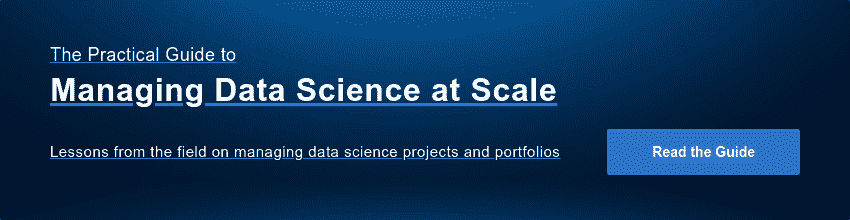

# 数据伦理:质疑真理和重新安排权力

> 原文：<https://www.dominodatalab.com/blog/data-ethics-contesting-truth-and-rearranging-power>

*这份多米诺数据科学领域笔记涵盖了[克里斯·维金斯](http://www.columbia.edu/~chw2/)最近在[柏克莱](https://twitter.com/fperez_org/status/1141881681172819968)举办的数据伦理研讨会。本文重点关注 1)定义和设计伦理的拟议框架，以及理解鼓励行业实施伦理的力量的拟议框架，以及 2)数据科学家在开发数据支持产品时应考虑的拟议伦理原则。非常感谢克里斯在这篇文章发表前提供反馈，并允许摘录他的[幻灯片](https://www.slideshare.net/chrishwiggins/history-and-ethics-of-data?from_action=save)。*

## 数据科学家、权衡和数据伦理

随着越来越多的公司成为[模型驱动的](https://blog.dominodatalab.com/model-management-era-model-driven-business/)，数据科学家在推动创新和帮助他们的公司保持[经济实力方面处于独特的地位](https://blog.dominodatalab.com/data-science-at-the-new-york-times/)。构建和使用模型时生成的知识产权、工件和见解(即[模型上下文](https://blog.dominodatalab.com/model-management-era-model-driven-business/))使数据科学家能够直接影响业务问题。数据科学家在其模型的整个生命周期中不断做出权衡决策。

最近关于公司是否将数据伦理纳入考虑的问题引发了公众讨论，来自[知名研究人员](https://ainowinstitute.org/about.html)(特别是[模型可解释性](https://blog.dominodatalab.com/tag/model-interpretability/))、[主流技术出版社](https://techcrunch.com/2019/07/12/as-ftc-cracks-down-data-ethics-is-now-a-strategic-business-weapon/)，以及知名全球机构的数据科学领导者都发表了意见。[克里斯·维金斯](http://www.columbia.edu/~chw2/)，《纽约时报》的首席数据科学家，同时也是哥伦比亚大学的教授[最近举办了](https://twitter.com/fperez_org/status/1141881681172819968)研讨会“未来的统计学家、首席执行官和参议员应该了解数据的历史和伦理？”在伯克利。在他的演讲中，克里斯提出了一个框架，原则和建议，以帮助在历史背景下操作伦理。他还鼓励数据科学家了解新的数据科学算法如何重新安排权力，以及数据的历史是如何讲述真理和权力的故事。这个演讲提出，为了理解未来，我们需要理解真理和力量是如何一直被争夺的。甚至自 19 世纪以来，当人们收集数据以建立能力时，他们经常“用它们来捍卫自己的权力，而不是赋予手无寸铁的人权力”。

我刚刚看过克里斯在纽约的演讲，他在纽约时报上讲述了他建立团队开发和部署数据科学中的机器学习的工作，我[也参加了](https://twitter.com/annkspencer/status/1144727326703284225?s=20)他最近的数据伦理演讲。虽然数据伦理演示涵盖了构建和部署一个将技术和关键数据方法相结合的课程，但这篇博客文章重点关注一个提议的伦理框架、现代数据伦理问题的示例(例如，偏见、伤害和重新识别)、要考虑的原则和建议。如果对更多的细节感兴趣，可以获得[的资料](https://www.slideshare.net/chrishwiggins/history-and-ethics-of-data)以及一段早期演讲的视频。课堂讲稿和 Jupyter 笔记本也通过 [GitHub](https://data-ppf.github.io/) 分发。非常感谢 Chris 在这篇文章发表前提供反馈，并允许摘录他的[幻灯片](https://www.slideshare.net/chrishwiggins/history-and-ethics-of-data)。

## 理解数据伦理的分析框架:作为重新安排权力的能力的数据科学

克里斯提出，历史为“思考将要做出的决定”提供了一个框架。他建议查看之前的问题，“历史上的垃圾箱火灾”，或之前确立的有争议的“真相”。通过回顾这些真理是如何被争论的，历史为工业提供了一种“我们可能创造的不同的未来”的感觉对于工业界来说，推断概率结果的想法是很常见的。然而，人们可能不太熟悉的是，创造一种新的数据算法会重新安排权力。Chris 认为，在构建一项能力时有意图，只有这项能力——而不是意图——才能“以某种技术的形式移植给其他人”。它对人们如何能够‘对谁做什么’产生影响，从而影响权力的动态变化。”克里斯表示，他之所以会有这种顿悟，是因为[本·雷希特](http://www.argmin.net/)寄给他菲利普·罗加威的论文“[密码作品的道德品质](https://web.cs.ucdavis.edu/~rogaway/papers/moral-fn.pdf)”，并建议克里斯在阅读时将“密码学”一词替换为“数据科学”。[的论文摘要](https://web.cs.ucdavis.edu/~rogaway/papers/moral-fn.pdf)以“密码术重组权力”为开篇。它配置谁可以从什么地方做什么。这使得加密成为一种固有的政治工具”。

然后，克里斯主张数据伦理应该成为公共话语的一部分，特别是当存在现代问题的影响时，包括[人才不愿意为特定公司工作](https://www.nytimes.com/2018/11/15/technology/jobs-facebook-computer-science-students.html)或者当一名工程师因“通过实施专门设计的软件来欺骗排放测试，从而欺骗美国监管机构和大众汽车客户”而被判入狱

克里斯鼓励人们讨论各种历史问题，他让人们回答“新能力如何重新安排权力？”以及考虑权利、伤害和正义的作用。

克里斯还谈到了现代文学是如何指出“互联网出了问题”，引用了凯茜·奥尼尔、T2、萨菲娅·诺布尔、T4、维吉纳·尤班克斯和肖莎娜·祖博夫的分析。Chris 主张，来自研究人员的质疑先入为主的“真理”的现代分析正在影响和塑造行业对数据伦理的认识。(当一名观众提到“所有女性！”在伯克利的演讲中，关于他的引用，他的回答是“没错。对此，我可以添加 Zeynep Tufekci、Hanna Wallach 和许多其他人的论文。这不是一个完整的列表”)。

## 数据伦理:重新识别和质疑真理(昂首阔步)

Chris 在他的研讨会上指出了许多消费者保护抗议的例子，以及行业如何争论和解决这些问题。然而，他在演讲中提到的两个重新识别的例子可能会引起数据科学家的特别共鸣，尤其是在寻找具有商业意义的例子时。2010 年，网飞取消了他们的第二次推荐竞赛，因为[提起了隐私诉讼](https://www.wired.com/2010/03/netflix-cancels-contest/)。相关论文“大型稀疏数据集的[稳健去匿名化”，作者](https://www.cs.utexas.edu/~shmat/shmat_oak08netflix.pdf)[阿夫林德·纳拉亚南](http://randomwalker.info/)和[维塔利·什马蒂科夫](https://tech.cornell.edu/people/vitaly-shmatikov/)

*“证明对单个订户知之甚少的对手可以很容易地在数据集中识别出该订户的记录。使用互联网电影数据库作为背景知识的来源，我们成功地确定了已知用户的网飞记录，揭示了他们明显的政治偏好和其他潜在的敏感信息。”*

Chris 提到的一个更早的重新鉴定的例子来自 [Latanya Sweeney](https://en.wikipedia.org/wiki/Latanya_Sweeney) ，在她的论文[中“只有你、你的医生和许多其他人可能知道](https://techscience.org/a/2015092903/)”。Latanya 指出，虽然一个数据集可能被认为是匿名的，因为一个人的“姓名”不包含在人口统计属性中，但其他数据列可能存在于与该人的姓名配对的列中具有相同人口统计属性的某处。相似的列变成了一个[连接键](https://en.wikipedia.org/wiki/Join_(SQL)#Inner_join)并发生重新识别。克里斯还提到，1997 年，拉坦雅通过电子邮件向马萨诸塞州州长发送了自己的健康记录，当时她还是麻省理工学院计算机系的研究生。

## 数据伦理:考虑采用贝尔蒙特原则

在他的研讨会上，克里斯指出，伦理不是一个简单的话题。具体来说，实施数据伦理包括技术、哲学和社会学组成部分的结合。这并不奇怪，因为数据科学需要关键素养(例如，对主观设计选择的认识)以及功能性技术素养(例如，数据管理、构建模型等)。).此外，数据科学工作本质上是实验性和概率性的。因此，应用确定性的伦理规则可能会挑战执行力。

Chris 建议行业考虑将道德规范阐述为一套原则，并理解将清楚地传达和考虑出现的紧张点。然后，他主张设计一个适应新社区或新公司的工作系统，以实施这些原则。克里斯在他的演讲中谈到了不同的原则，供人们思考。然而，这篇文章关注的是贝尔蒙特原则。

克里斯借鉴了贝尔蒙特原则，这些原则是为了回应 T2·塔斯基吉的研究而制定的。贝尔蒙特原则经久耐用，并且自 20 世纪 70 年代以来就经过了“压力测试”。人们继续将它们用于交互设计，并作为审核决策的一种手段(在你做出决策之前和之后)。然而，克里斯建议[根据公司如何使用数据和我们所处的时代来更新](https://boingboing.net/2019/06/26/breaking-goodharts-law.html)。

例如，在 70 年代，强调“知情同意”是达到“尊重人格”的一种手段。然而，今天，克里斯指出

“知情同意是一个模糊的概念，特别是在与私营公司打交道时，正如 [Eben Moglen](https://www.softwarefreedom.org/events/2010/isoc-ny/FreedomInTheCloud-transcript.html) 所说，他们对我们的数据所做的一切，以及我们使用他们的免费服务来换取免费监视我们的所有方式”。

克里斯建议在“自主性”后面加上知情同意，或者用肯定回答这个问题:“用户有机会自主决定如何使用他们的数据吗？”克里斯还建议重新考虑“不伤害”，最大化利益，因为一个人“永远不和你说话或和你交往也不会伤害你”。第三个原则是“公正”。克里斯建议用“公平”代替“合法”，比如“建立一个系统，让你乐意成为任何参与者，任何利益相关者。”例如，在拼车系统中，乘客、司机和公司都[同样快乐](https://deardesignstudent.com/ignorance-beats-empathy-9564f1dbb2e4)吗？无论答案是“是”还是“否”，它都提供了一个在审计期间和开发机器学习算法时要考虑的框架。

 *Checks and balances on corporate, state, and people power*

在一个社区——包括一家公司——定义和设计道德规范之前，他们必须首先意识到这是一个好主意。克里斯还提出了一个框架来理解推动行业首先考虑道德的力量，将制衡描述为国家权力、企业权力和人民权力之间的“三人不稳定游戏”。他简要回顾了当前国家权力围绕[消费者保护](https://defusingdis.info/2019/01/23/weve-diagnosed-the-disinformation-problem-now-whats-the-prescription/)和[反垄断法规](https://www.nytimes.com/2018/09/07/technology/monopoly-antitrust-lina-khan-amazon.html)重新参与的方式，以及人民权力如何以[集体机构](https://story.californiasunday.com/tech-revolt)的形式在包括数据科学家和软件工程师在内的员工中出现。

## 摘要

Chris 在他的演讲“未来的统计学家、首席执行官和参议员应该了解数据的历史和伦理吗？”中涉及了与数据伦理相关的广泛话题虽然这篇文章提供了他的研讨会的精华摘录，包括一个提议的框架，行业争议真理的具体例子，以及供数据科学家考虑的建议原则，但更多见解可在他演讲的早期版本的甲板或[视频](https://www.youtube.com/watch?v=0suLWheVji0)中获得。再次感谢 Chris 允许摘录[的幻灯片](https://www.slideshare.net/chrishwiggins/history-and-ethics-of-data)以及他在发表前对这篇文章的反馈。

