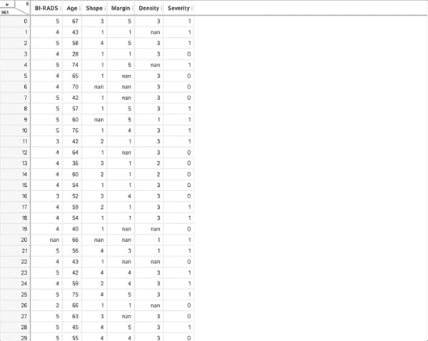
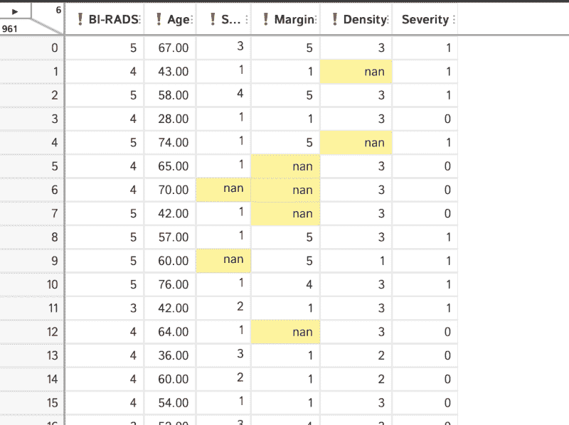

# 使用 Pandas Profiler 和 D-Tale 进行数据探索

> 原文：<https://www.dominodatalab.com/blog/data-exploration-with-pandas-profiler-and-d-tale>

我们都听说过数据是新的石油。我总是说，如果是这样的话，我们需要经过一些精炼过程，才能将原油转化为有用的产品。对于数据，这种细化包括进行一些清理和操作，以便更好地理解我们正在处理的信息。

在[之前的一篇博文](https://www.dominodatalab.com/blog/how-to-supercharge-data-exploration-with-pandas-profiling)中，我们已经报道了 Pandas Profiling 如何能够加速将我们的数据带入预测建模阶段所需的数据探索。我们讨论了探索性分析的重要性，包括观察缺失数据的频率和计算所有特征的交互作用。

在这篇博客中，我们将继续讨论使用 Pandas Profiler 进行数据探索，并包括另一个工具，对于我们这些更倾向于使用视觉线索的人来说，它可能会很方便。

## 数据探索的目的

在跳上机器学习马车之前，数据探索是非常重要的一步。它使我们能够围绕手头的数据构建上下文，并让我们开发适当的模型，然后可以正确地解释这些模型。此外，最初的探索还可以为机器学习管道中可能需要包含的一些转换的自动化铺平道路。

始终考虑数据所有者可以提供的关于数据的信息也很重要。例如，我们看到的数字实际上是指类别还是以特定格式提供的日期？探索的类型可能取决于其中一些问题的答案。

在项目的探索阶段，我们希望实现的一些典型目标包括:

*   检测错误数据。
*   确定有多少丢失的数据。
*   理解数据的结构。
*   识别数据中的重要变量。
*   检测数据的有效性。

## Python 和熊猫剖析

我们在之前的文章中已经介绍了熊猫烧香，在这篇文章中，我们想强调这个工具使我们能够做到的一些方面。然后，我们将工作流程与另一个:D 故事进行对比。

首先让我们来看看我们将要处理的数据:来自 UCI 机器学习知识库的乳房 x 线照相海量数据集。关于这个数据集的信息可以在这里获得[。](http://archive.ics.uci.edu/ml/datasets/mammographic+mass)

该数据集包含用于乳腺癌诊断的诊断性乳房 x 线照片的相关信息。乳房 x 光片实际上是乳房的 x 射线，用于检查或筛查可能没有疾病症状的人的癌症。在检测到异常的情况下，可能需要进一步的乳房 x 光检查来确定异常是否是良性的。

让我们将数据加载到 pandas 中，先在没有 Pandas Profiler 的情况下看一看，看看我们能告诉我们什么。

```py
import numpy as np

import pandas as pd

import matplotlib.pyplot as plt
```

根据 UCI 网站提供的描述，我们知道总共有 6 个属性:

*   BI-RADS 评估
*   年龄
*   形状
*   边缘
*   严重

我们可以用它来为数据框架中的列提供有用的名称。

```py
url = "http://archive.ics.uci.edu/ml/machine-learning-databases/mammographic-masses/mammographic_masses.data"

names = ['BI-RADS', 'Age', 'Shape', 'Margin', 'Density', 'Severity']

df = pd.read_csv(url, names=names)

masses = df.copy()
```

请注意，我已经创建了原始数据集(`df`)的副本，并将其命名为`masses`。万一我们实现的一些操作最终在我们的数据集中产生了意想不到的变化，我们总是可以回到最初的状态。在这种情况下，我们总是可以从 UCI 网站下载数据，但在许多情况下这可能是不可能的。

好，让我们先来看看我们的数据集:

```py
masses.head()
```


此外，我们可以检查数据是否具有预期的行数。根据我们掌握的信息，共有 961 个条目，其中 516 个为良性，445 个为恶性。利用`Severity`栏告诉我们肿块是良性还是恶性，我们可以检测数据是否符合预期:

```py
masses.shape
```

```py
(961, 6)
```

```py
masses['Severity'].groupby(df['Severity']).size()
```

```py
Severity

0    516

1    445

Name: Severity, dtype: int64
```

在这种情况下，我们使用了 pandas 的功能，根据列`Severity`中的值对数据进行分组，并查看组的大小。让我们继续看我们的数据。

我们可以检查每一列包含的信息类型，我们可以用`.dtypes`来完成:

```py
masses.dtypes
```

```py
BI-RADS     object

Age         object

Shape       object

Margin      object

Density     object

Severity     int64

dtype: object
```

我们可以看到，除了`Severity`之外，所有的列都有`object`类型。这是 pandas 告诉我们类型要么是字符串，要么是数值和非数值的混合。`Severity`由整数组成。

仔细查看数据，您会注意到一些列带有问号`?`。对于该数据集，这是数据收集表示缺失数据的方式。当通过`read_csv`用`na_values`参数加载数据集时，我们可以使用这些信息。让我们看看数据集中的一些数据示例:

```py
masses.iloc[[20, 456, 512],:]
```


我们现在可以使用`replace`函数来转换`nan`的缺失值。同时，我们可以利用这个机会将我们的列转换成数值，而不是将它们保留为`object`。

```py
masses = masses.replace('?', np.NAN)

masses.loc[:,names[:-1]] = masses.loc[:,names[:-1]].apply(pd.to_numeric)

masses.dtypes
```

```py
BI-RADS     float64

Age         float64

Shape       float64

Margin      float64

Density     float64

Severity      int64

dtype: object
```

正如我们看到的，现在列的类型是`float`。请注意，虽然原始数据看起来像整数，但我们在列中引入了`nan`值，这意味着 pandas 要求列至少是`float`。让我们来看一些缺失值已被替换的示例行:

```py
masses[masses['BI-RADS'].isna()]
```


很好，让我们来看看数据集的描述性统计数据。我们只需使用`pandas.describe()`功能，就可以一次看到所有信息:


我们可以看到，我们有年龄在 18 至 96 岁之间、平均年龄为 55 岁半的患者的数据。但是我们如何计算其他列的值呢？有一个 2.72 的`Shape`意味着什么？这有意义吗？这就是语境产生影响的时候了。

我们还可以通过替换平均值或中值的缺失值来开始处理缺失数据，或者甚至开始使用一些奇特的插补，例如使用最近邻算法。然而，对数据进行转换而不考虑所考虑的值的含义是完全错误的。

## 上下文中的数据

我们知道我们可以获得大量的数据，事实上我们可以盲目地获取像上面这样的数据集，并将其投入到机器学习管道中，以达到分类的目的。尽管如此，这样做的危险在于，我们可能会错过显而易见的东西，做出不符合目的的决定。处理这个问题的一个方法是停下来考虑数据的上下文。

在我们的工作示例中，我们可能能够安全地假设`Age`变量是以年为单位的患者年龄，但是我们能告诉其他变量什么呢？根据 UCI 页面中的信息，属性如下:

1.  `BI-RADS`评估:1 到 5(依次)
2.  `Age`:患者的年龄(整数)
3.  `Shape`:肿块形状:圆形=1 椭圆形=2 小叶形=3 不规则形=4(标称)
4.  `Margin`:质量余量:限定=1 微叶状=2 模糊=3 模糊=4 针状=5(标称)
5.  `Density`:质量密度高=1 iso=2 低=3 含脂=4(序数)
6.  `Severity`:良性=0 或恶性=1(二项式)

让我们也考虑一下乳房 x 光检查后会发生什么。我们可以预期，这些结果将由一名合格的放射科医师进行检查，该放射科医师接受过寻找组织中异常肿块的培训。大多数情况下可能是良性的，对于那些不是良性的，有一些迹象表明可能是癌症。在放射科医生查看病例后，他们会写一份报告，描述所发现的异常情况。医生描述结果的一种标准方法是双 rad。它通常从 0 到 6，但根据 UCI 的页面，我们可以看到他们认为他们只有 1-5 的范围。

除了 BI-RADS 评分，医生还使用其他属性，例如形状(圆形、椭圆形、小叶形或不规则形)、肿块中存在的脂肪细胞的数量以及可疑细胞的数量，即密度，以及肿块边缘的外观，即边缘。所有这些属性实际上都是绝对的，事实上其中一些是有序的。这意味着对这些值取平均值或标准偏差实际上没有意义。

现在让我们利用这些信息对数据进行更好的了解。

我们可以从寻找异常值开始。例如，我们不期望找到 1-5 范围之外的任何`BI-RADS`值。

```py
masses[(masses.loc[:,'BI-RADS']&lt;1) | (masses.loc[:,'BI-RADS']>5)]
```


啊哦！看来我们有一些惊喜。首先，数据中存在明显的异常值，因为行 340 的 BI-RADS 为 55！我们也有一些 0 和 6 的行。在这一点上，我们可以回到我们的放射科团队，并验证异常值是(或不是)打字错误，期望值实际上是 5。

对于其他人，我们可以尝试证实他们正在使用完整的 BI-RADS 分类，其中包括用于不完整读数的`0`和用于已知活检且已证实为恶性肿瘤的`6`。

在这种情况下，由于我们是从网上获得这些数据的，所以让我们考虑以下假设:

*   55 实际上是 5
*   0 必须更改为 1，6 必须更改为 5

请注意，这可能不是数据集原作者的真实意图。然而，它为我们提供了一些可以在这个练习中执行的清洁步骤。

```py
masses.loc[:,'BI-RADS'][masses.loc[:,'BI-RADS']==55] = 5

masses.loc[:,'BI-RADS'][masses.loc[:,'BI-RADS']==0] = 1

masses.loc[:,'BI-RADS'][masses.loc[:,'BI-RADS']==6] = 5

masses[(masses.loc[:,'BI-RADS']<1) | (masses.loc[:,'BI-RADS']>5)]
```


## 熊猫侧写师

```py
from pandas_profiling import ProfileReport

profile = ProfileReport(masses, title="Mammographic Mass Dataset Profiling Report")

profile.to_notebook_iframe()
```

其结果是一个交互式报告，提供了一个非常有用的数据集概述，包括一些总体统计数据。例如，我们可以看到配置文件认为我们有一个数字变量和 5 个分类变量。此外，它认为有 2.8%的丢失细胞。


然后，我们可以查看数据集中的每个变量，例如，让我们查看前两个变量的内容，即`BI-RADS`和`Age`:


在`BI-RADS`的例子中，我们可以看到最普遍的值是类别 4，超过 56%的数据，而类别 1 只有 0.5%。如果我们要在模型中使用这个列，我们现在意识到我们有一个不平衡的数据集。

对于`Age`，我们看到一个看起来正常的直方图，峰度为-0.31。请记住，这里使用的是 Fisher 的峰度定义，即正态分布的峰度为零。在这两种情况下，我们都有许多其他信息统计数据可以指导我们的探索。

我们可以查看变量之间的相关性，并能够在不同的相关性度量之间进行选择。我们甚至得到了所选相关性度量的描述。


我们还以不同的可视化格式获得关于缺失值的信息，例如如下所示的零矩阵:


我们可以从熊猫的角度来看这个问题，寻找缺失条目的数量:

```py
for name in names:

    missing = masses[masses[name].isna()].shape[0]

    print('{0} missing: {1}'.format(name, missing))
```

```py
BI-RADS missing: 2

Age missing: 5

Shape missing: 31

Margin missing: 48

Density missing: 76

Severity missing: 0
```

我们可以将报告保存为 HTML 文件以供将来参考:

```py
profile.to_file("mammographic_mass_report.html")
```

好的，看起来很棒！如果你是一个更加视觉化的人，并且愿意以那种方式去探索呢？嗯，D-Tale 对你来说可能是个不错的选择。我们来看看吧！

## 使用 D-Tale 进行数据探索

D-Tale 是一个可以帮助我们以可视化的方式获得数据集详细信息的模块。它支持代码导出。这意味着，如果您想要记录、复制或实际学习您的分析的某些部分，您可以获得由该工具创建的代码的导出，并从那里开始。

该模块生成一个报告，涵盖了数据集的概况，它让您应用通用和自定义过滤器，运行可视化，突出显示值等。

让我们试着做一些我们在博客第一部分做的步骤，但是现在使用 D-Tale。让我们导入模块并创建原始数据帧`df`的新副本。

```py
import dtale

masses2 = df.copy()
```

我们现在可以在笔记本中运行一个报告，我们将看看如何执行以下步骤:

*   转换'？'至`NaN`
*   移除异常值表单`BI-RADS`
*   获取预期范围内的`BI-RADS`值
*   检查变量的数据类型
*   浏览报告
*   导出清理后的数据

准备好了吗？

```py
dt = dtale.show(masses2, notebook=True)
```

该报告看起来非常像一个电子表格，当您将鼠标悬停在表格上时，您可以看到您可以采取的一些行动。


让我们把问号转换成`nan`。对于每一列，我们选择“替换”菜单并填写表格，告诉 D-Tale 进行更改变成了‘南’。请注意，您需要通过单击加号来添加操作。正如您在下面的动画中看到的，该工具生成的代码是可见的。我已经为一个单独的列做了这些，我们将需要对其他列应用相同的更改。


D-Tale 让我们直接修改表中的值，让我们对`BI-RADS`列中的异常值进行修改。


此列的其他替换可能更适合使用替换功能。请注意，您可以将各种步骤添加到上下文菜单中，如下所示:


我们可以使用提供的菜单来更改列中的数据类型。例如，我们可以将`Severity`列从`int`更改为分类。在这种情况下，我们需要告诉 D-Tale 先将值更改为字符串，然后再更改为类别:



我们可以像以前一样探索缺失的数据。在这种情况下，只需选择“缺失分析”菜单:


D-Tale 让我们可以做更多的事情，如查看相关性、创建图表或突出显示值。



我们可以通过从菜单中选择“代码导出”来导出生成的代码:


您还可以看到一个“导出”菜单，让我们将数据保存到 csv 或 tsv 文件中。

## 摘要

在这篇文章中，我们已经讨论了数据探索的重要性，并看到了上下文如何提供下一步的线索。我们不仅能够创建更好、更合适的转换，而且能够更好地解释我们的变量。

我们看到了如何用三个工具做到这一点:Pandas、Pandas Profiler 和 D-Tale。这些工具可以帮助我们用几行代码获得关于数据集的信息，对于 D-Tale，只需点击几下鼠标。我们探索的结果可以重复，并进一步用于构建适合目的的机器学习模型。