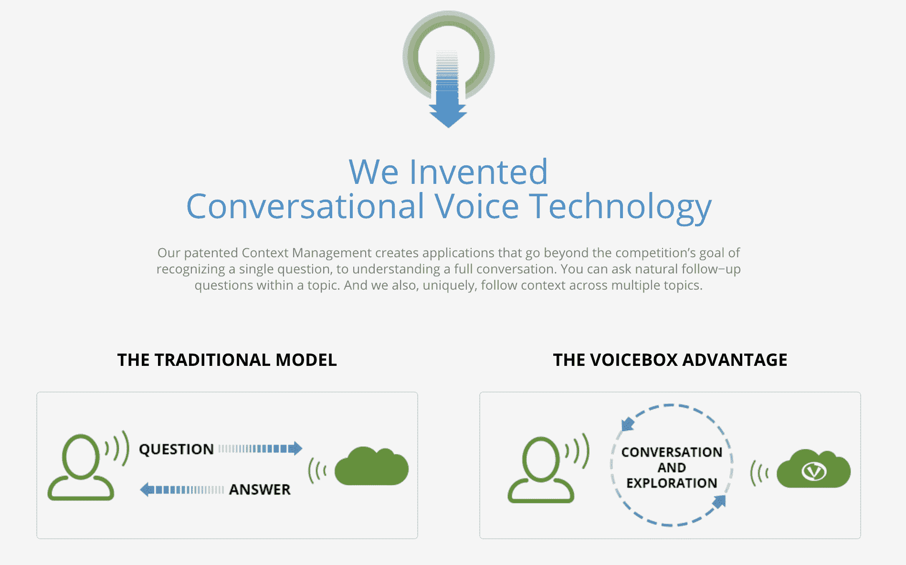

# Voicebox 的众包语言理解

> 原文：<https://www.dominodatalab.com/blog/data-science-at-voicebox>

*我们最近采访了 Voicebox 的数据科学和众包总监 Daniela Braga 博士。*

丹妮拉，谢谢你的面试。让我们从谈论你的背景开始我们在一起的时间。

我的背景是言语科学。我在这个地区工作了十五年。我在葡萄牙和西班牙的学术界呆了六年。在过去的九年里，我一直在这个行业工作，包括在葡萄牙、北京和华盛顿州雷德蒙的微软演讲小组工作了七年。最近，我一直专注于数据科学，在微软集团和最近的 Voicebox Technologies 将众包引入了演讲。这些努力为两家公司节省了近 50%-80%的成本。我一直致力于在数据驱动的技术世界中构建高质量的控制工作流程和可扩展的吞吐量，这需要无止境的数据供应。

你是如何对语音识别感兴趣的，更具体地说，是对自然语言理解感兴趣的？

这是一个有趣的故事，因为它是偶然发生的。当我获得语言学学士学位后，我在葡萄牙的大学里看到了一份招聘启事。Porto 的工程学院正在寻找一位语言学家来帮助他们开发欧洲葡萄牙语的首个文本到语音和自动语音识别系统。这发生在 2000 年 7 月中旬。求职截止日期已过，大学里空无一人。我的一个朋友鼓励我无论如何都要打这个号码，当场就打。我以为这毫无意义，但我做到了。一个低沉的男声拿起电话，原来还没人申请。所以我得到了这份工作。我采访了波尔图大学语音实验室的负责人，他告诉我，“在这个新领域(语音技术)，聘请语言学家与工程师合作已经成为一种新趋势。整个欧洲都在发生。我们还不知道语言学家如何以及为什么有用，但如果你能帮助我们搞清楚，你就有这份工作。”我在这里，仍然在语音技术领域工作。我想我找到了答案。

你有非常丰富的学术和专业背景，能分享一些职业亮点吗？

让我看看。我相信第一个是我博士论文的主题。这是在数据驱动技术完全成为语音科学主流之前。即使在今天，文本到语音(TTS)技术也有许多基于规则的技术。我是第一个为文本到语音转换开发完全基于规则的前端的人，并成功地将其应用于欧洲葡萄牙语、巴西葡萄牙语和加利西亚语，加利西亚语是西班牙使用的一种语言，与葡萄牙语有着共同的过去。这是非常独特的，考虑到在那之前，已经用数据驱动技术进行了几次尝试，但没有一次取得相同的结果。

第二个是能够说服微软的语音团队来处理 TTS 系统的开发和葡萄牙大部分欧洲语言的重要语言组件。在两年内，我的团队能够向他们发布 Project Exchange 14(包含 26 种语言)。

最新的亮点是能够说服 Voicebox Technologies，与机器学习相关的众包是扩大语音技术产品规模的最佳方式，可以更快、更具成本效益地覆盖全球，同时保持质量。

你在 Voicebox 做什么工作？

我已经重组了 Voicebox 的数据团队。我刚来的时候，这家公司曾经依赖客户提供数据。我改变了公司在数据方面的能力，使我们能够通过网络服务和 API 向客户公开数据服务，以及我们的对话理解产品。在过去的两年里，我一直在发展一个由 15 人组成的团队，服务于公司对多语言数据收集、数据清理/处理/标记、机器学习、数据评估、摄取、存储、数据库、安全、报告和分析的需求。

你发现的最令人惊讶的见解或发展是什么？

出于基于规则的思维模式(因为我的语言学背景)，我目睹的最令人惊讶的发展是语音技术的科学范式从基于规则到数据驱动技术的转变。现在这说得通了，但它并不总是显而易见的。我很快适应了从基于规则到众包的转变，这一切都是为了服务于数据驱动技术日益增长的需求。

**数据科学和语音识别的未来会是什么样子？众包如何融入这一切？**

它不再仅仅是语音识别；是语言理解。语音识别在语音层面处理命令和控制，而语言理解解释用户的意图，并以有意义的结果做出响应。语音技术需要大量的数据。虽然我们可以说自然语言理解在美国英语中相对成熟，但对于世界上其余的 7000 种口语来说，情况并非如此。

> 众包为语音技术使用的机器学习技术带来了必要的人类判断

国际上对支持语音的技术的市场需求正在增长。当前的数据驱动技术需要大量的数据来训练和测试语音识别和自然语言理解模块。数据永远不会完整，因为它需要持续更新的企业、兴趣点、名人、书籍和音乐发行等列表。众包为语音技术使用的机器学习技术带来了必要的人类判断。例如，为了训练一个声学模型(这是一个语音识别组件)，您需要至少 1000 个扬声器，每个扬声器讲一个小时。这些发言者需要在性别、年龄和地区方面保持平衡。你可以训练一个系统来识别不同的方言和社会学家。这就是众包的用武之地，在这种类型的变化中，仍然没有办法取代人类。

今年你在做什么个人/专业项目，为什么/如何让你感兴趣？

自动化我们的众包工作流程，通过报告和分析功能以及数据可发现性创建数据可视化。这是一项新的服务，允许内部和外部客户浏览和查询我们所有不同的数据库和数据类型，从声音到文本数据。

哪些出版物、网站、博客、会议和/或书籍对你的工作有帮助？

我关注并参加传统的语音技术活动，在这些活动中，您可以看到该领域的最新和最大的发展(如 Interspeech、ICASSP、ACL、LREC 等会议)。我阅读了谷歌研究博客(T0)和微软研究博客(T1)，Crowdsourcing.org 新闻，以及《企业家》、《商业内幕》和 TechCrunch 等出版物。我也一直在关注数据科学领域正在发生的事情，但我的注意力仍然非常分散。

你发现了哪些最有帮助的机器学习方法？你认为最有帮助的是什么？你最喜欢使用的工具/应用程序是什么？

目前，深度神经网络是语音技术的 ML 技术的圣杯。如果你将 DNNs 应用于你的主题，你可以在任何地方得到一篇被接受的论文。在我们的领域中，Word2vec 和其他技术也显示出非常有趣。

**对数据科学/机器学习的学生或从业者有什么忠告吗？**

在大数据世界中，开源数据正变得越来越流行，构建机器学习包并将其作为服务提供似乎是将你的技能集货币化的最佳方式之一。

丹妮拉，非常感谢你抽出时间！我们很高兴了解你和你在 Voicebox 所做的革命性工作。

*在 [Linkedin](https://www.linkedin.com/in/daniela-braga-b68570a) 上关注丹妮拉，并访问【语音信箱】(丹妮拉·布拉加语音信箱)。*