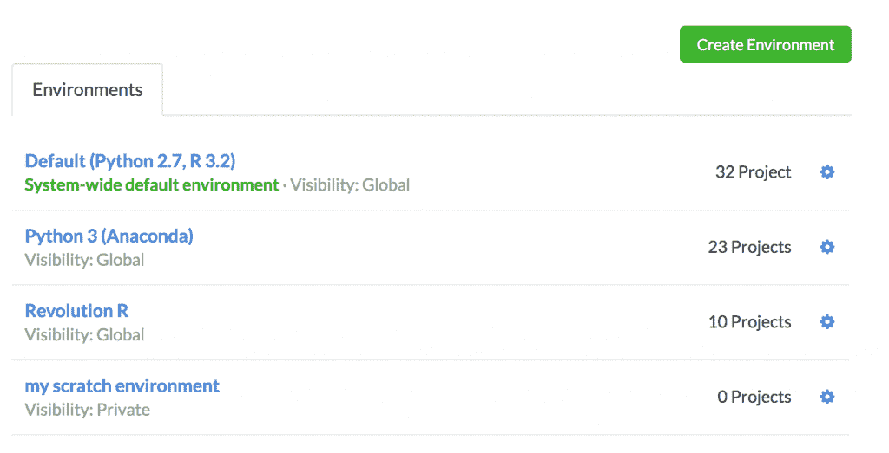
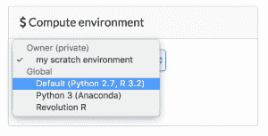
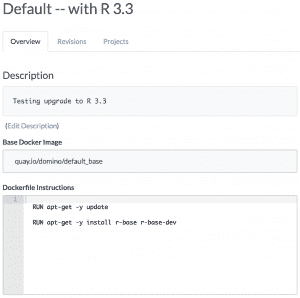
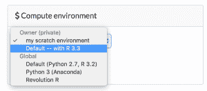
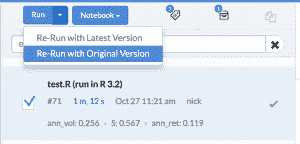
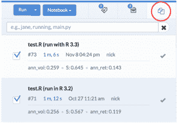
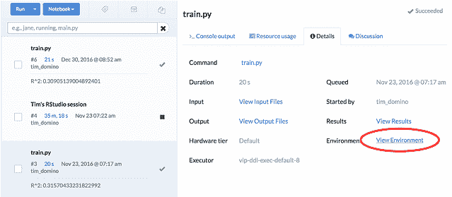
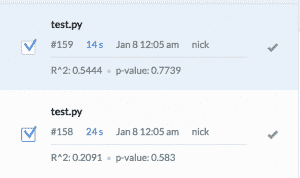
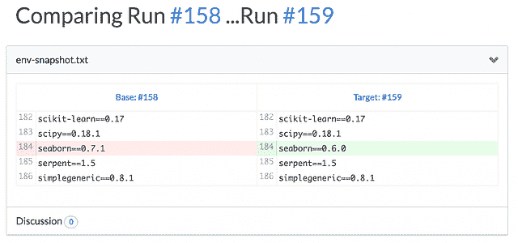

# 利用 Docker 实现数据科学敏捷性

> 原文：<https://www.dominodatalab.com/blog/data-science-docker>

这篇文章描述了 Domino 如何使用 Docker 为数据科学家和研究人员解决许多相互关联的问题，这些问题与环境敏捷性和工作的可重复性有关。

## 背景

在 Domino，我们非常依赖 Docker。但是，虽然大多数关于 Docker 的讨论都集中在工程师如何使用 Docker 来发布他们的软件，但我们在我们的产品本身中使用 Docker，以允许数据科学家轻松控制什么样的环境(包、库等)。)工作时使用。换句话说，我们将 Docker 公开为一个面向用户的特性(除了在内部将其用作 DevOps 工具之外)。

对于那些不熟悉 Domino 的人来说，快速了解一下背景:这是一个[平台](//blog.dominodatalab.com/what-is-a-data-science-platform/)，数据科学家在这里运行他们的代码(例如 R、Python 等)，跟踪他们的实验，分享他们的工作并部署模型。集中式基础架构和知识管理使数据科学家更具生产力，并支持更具可重复性的协作式数据科学。

## 环境管理问题

研究人员和数据科学家的一个共同难题是“环境管理”我用这个术语来描述与安装软件和软件包、配置设置、个人或团队进行分析工作相关的一系列问题。我们最常看到的一些问题是:

*   研究人员在安装新的软件包时经常受到中央 IT 资源的限制。如果这个过程太慢或太费时，组织就不能停留在现代技术和工具的前沿。开源生态系统比以往任何时候都发展迅速，组织需要测试和采用新技术和方法的灵活性。
*   撇开新的包不谈，缓慢或官僚的过程会延迟对标准工具和包(新版本的 R、Python 等)的更新，导致关键组件过时多年。
*   对于不同的人，代码的工作方式是不同的(或者有时根本不起作用)，因为他们的环境是不同的(例如，不同版本的包)。
*   新员工或团队成员难以入职，因为设置他们的环境需要很长时间。
*   旧的项目变得不可用，旧的结果变得不可能重现，因为自代码编写以来，环境已经发生了变化。
*   升级(例如，更改 R 或 Python 的底层版本，或者升级特定的包)是有风险的，因为很难知道什么会停止工作。

通常，公司在环境管理方面遵循两种途径之一。其中的每一个都解决了上面的一些问题，但是加剧了其他问题:

1.  公司让用户控制他们自己的环境。这给用户带来了灵活性和敏捷性，但不可避免地会导致不一致的环境。通常，这意味着工作被孤立在研究人员的机器上，使得共享和协作更加困难，也限制了用户的计算资源。
2.  公司锁定中央环境，例如大型共享“研究服务器”。它控制这些机器。用户可以访问一致的环境，但是这些环境很难改变。

## 基于 Docker 构建的计算环境

Domino 定义了计算环境的一级概念:一个包含一组软件和配置文件的环境，当分析代码运行时，这些文件应该在适当的位置。这是强大的，原因有几个:

*   环境附加到您的代码所在的项目。因此，如果有人在 12 个月后重访一个项目，或者一个新员工加入一个项目，您可以确保代码将按预期工作，不管您的计算机上安装了什么。
*   研究人员可以改变环境，升级或安装新的图书馆，而不需要通过它，关键是，不影响任何其他人的环境。
*   与研究人员操纵他们自己的机器的设计不同，Domino 的环境是集中存储和管理的。研究人员可以很容易地共享环境，并且环境可以一次为每个人升级。

实际上，计算环境是基于 Docker 映像构建的。当研究人员运行代码时，他们的代码是在一个从该图像开始的容器中运行的。

使用 Docker 是特别强大的，因为它让我们保存图像的过去版本，这样我们就可以记录用于生成任何过去结果的确切环境。

## 新功能

让我们来看看这种设计支持的一些工作流。

### 使用不同版本的常用工具

假设您的一些用户使用 Python 3，一些用户使用 Python 2。或者有些使用标准 R 分布，有些使用 R 的 Revolution Analytics 分布。您可以为每种配置创建环境，数据科学家可以选择他们工作时想要使用的环境:

创建尽可能多的环境，并管理它们的共享和许可方式，以便在您的组织内创建各种标准环境选择。

### 升级重要的库

在幕后，Domino 允许您通过运行 Docker 命令来指定环境的内容。要了解这一点，假设默认环境是 R 3.2，而您想升级 R 3.3。因为我们很谨慎，假设我们想在我们自己的项目中测试这种变化，以验证它在向所有人推广之前是否正常工作。

我们可以复制“默认”环境，并在其上添加我们想要运行的任何 Docker 命令。

现在，我们只需更改我们的项目以使用这个新环境，并重新运行我们的代码。

我有一个过去运行过的回归测试脚本，“test。r”。一旦我更改并选择了新环境，我就可以重新运行该脚本。至关重要的是，我可以重新运行上次运行的确切版本，因此我可以肯定，我在结果中看到的任何差异都将完全是由于 R 升级，而不是我的代码中的更改。

我们甚至可以比较在一个环境和另一个环境中运行的结果，以确保没有任何变化。

要深入了解如何比较 Domino 中不同实验的结果，请查看我们过去关于数据科学的[“单元测试”](//blog.dominodatalab.com/unit-testing-data-science/)和[模型调优和实验](//blog.dominodatalab.com/faster-model-tuning-experimentation/)的帖子。

### 复制过去的作品

除了给数据科学家带来更多的灵活性，Domino 为代码的每次执行保留了一个不可变的记录，包括它在哪个环境中运行的信息。因此，对于任何过去的结果，很容易找到并恢复用于重现任何过去结果的确切软件集。

我们可以更进一步。除了在改变环境后比较实验结果之外，还可以配置 Domino 在运行代码时保存环境状态的文本快照。这让您可以使用我们的区分功能来检查在同一个实验的两次不同运行之间哪些包或软件可能发生了变化。

在这个例子中，我们有一个在不同时间运行的 python 脚本，我们感兴趣的是识别底层环境中的任何变化。比较也能告诉我们这一点。

## 结论

Docker 是一项非常强大的技术。除了为 DevOps 团队启用新的工作流之外，它还可以优雅地解决数据科学家日常面临的许多问题。以 Docker 为基础，Domino 的“计算环境”功能使研究人员能够灵活地轻松试验新的包，而不会破坏同事环境的稳定性。与此同时，计算环境使研究人员能够重现结果，并审核已安装软件和软件包的变更。