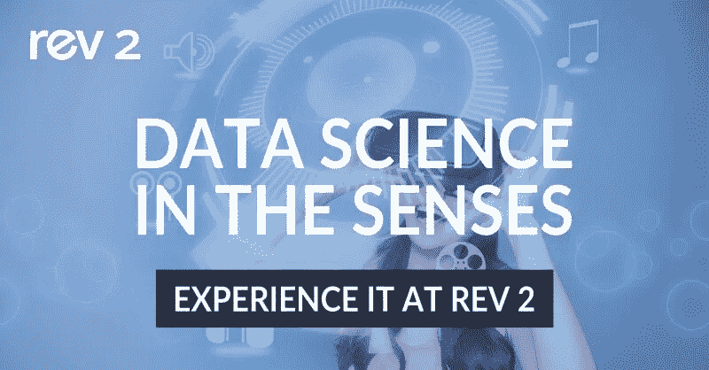
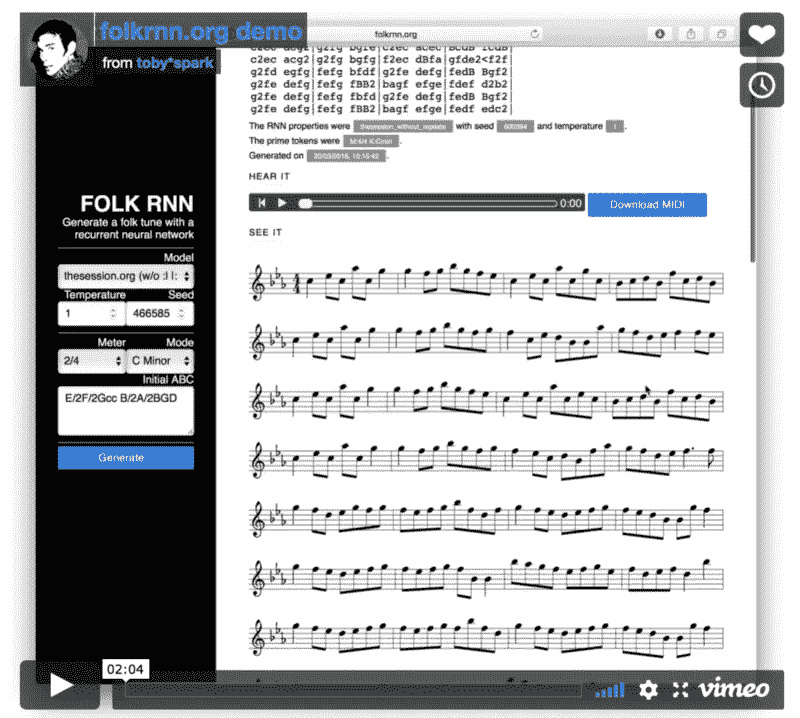
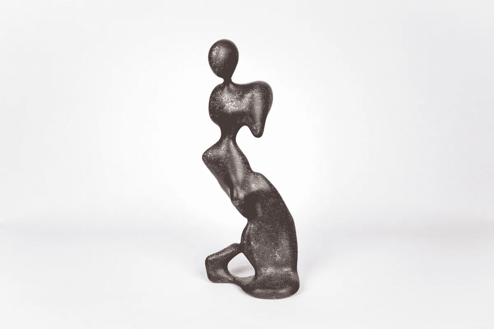
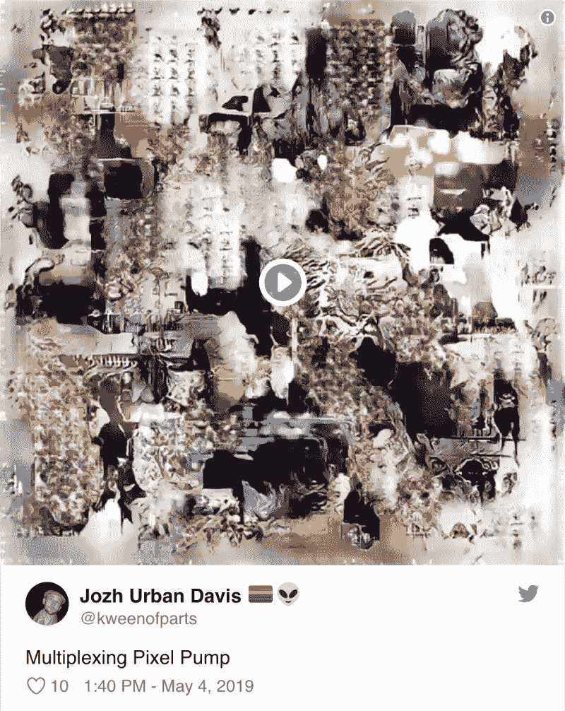
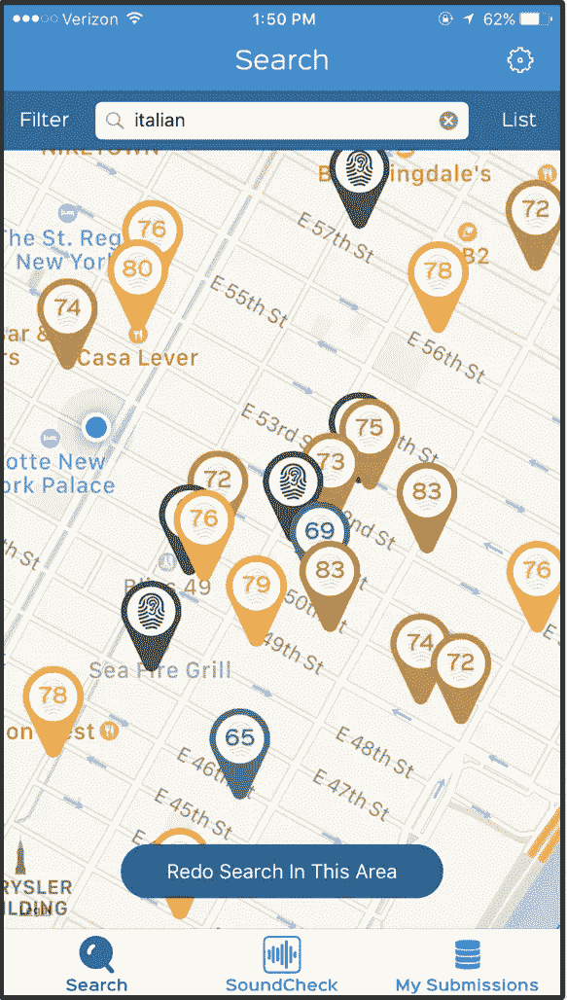
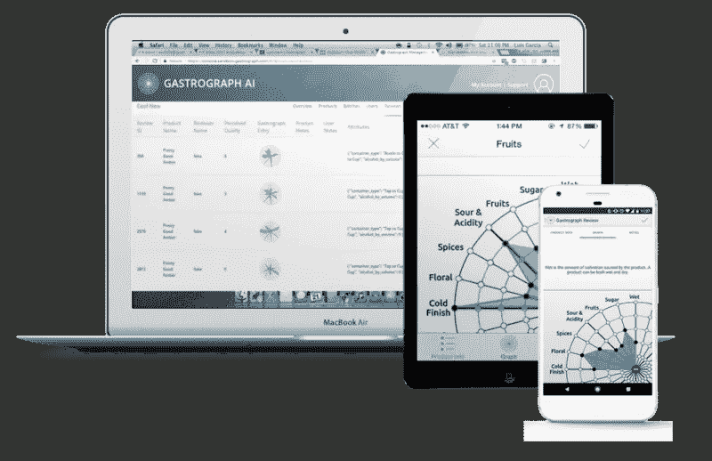
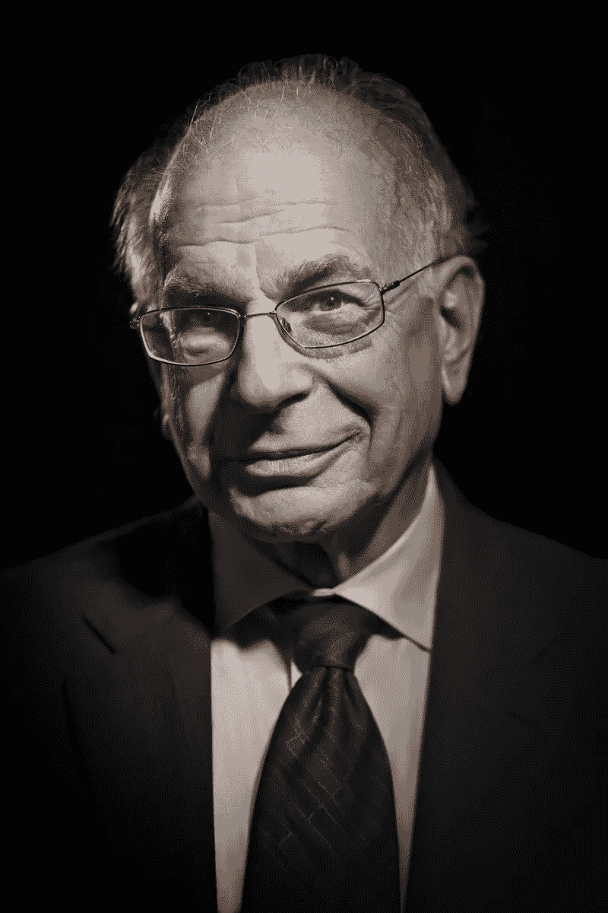

# 感官中的数据科学

> 原文：<https://www.dominodatalab.com/blog/data-science-in-the-senses>

By Paco Nathan, Managing Partner, Derwen, Inc. on May 10, 2019 in

*本博客最初发布于 KDnuggets* *[这里](https://www.kdnuggets.com/2019/05/domino-data-science-senses.html)。*

今年 [Rev 大会](https://rev.dominodatalab.com/)的晚间活动将是**意义上的数据科学**。那是在纽约，5 月 23 日星期四。

今天就注册 [Rev](https://rev.dominodatalab.com/) 并使用此代码获得折扣: **PACORev25** —参见本文末尾了解更多关于会议的详细信息。

**感官中的数据科学**活动将展示目前在人工智能艺术领域掀起波澜的惊人项目——**博特尼克、福克·RNN、本·斯内尔、乔希·厄本·戴维斯**等——利用数据和机器学习实现感官体验的项目。下面先睹为快:

**[Botnik](https://botnik.org/)** 是一个由作家、艺术家和软件开发人员组成的社区，他们使用机器来创造有趣的东西。例如，在网上查看他们的[画廊](https://www.facebook.com/groups/botnik)，比如由一个经过 70，000 多首现有乡村歌曲训练的模型生成的新鼻音曲调。或者[深度学习生成的言情小说](https://towardsdatascience.com/romance-novels-generated-by-artificial-intelligence-1b31d9c872b2)已经在超过 20，000 个丑角言情标题上进行了训练。谁能否认这样不可抗拒的罪恶快感，如*助产士牧牛人*或*医生丈夫的男人*，出于艾的礼貌？或者(我最喜欢的)这个超级有用的整理，把玛丽·近藤所有杂乱的剧集整理成一个浓缩的剧本:

现在，这无疑点燃了欢乐的火花。他们的作品是大数据、一些文本分析、概率和大量讽刺的结果，Botnik 将其作为现场表演，有时甚至是卡拉 ok 式的人工智能增强滑稽动作。在我们的**感官中的数据科学**活动中，他们将发表演讲来解释魔法并现场表演！

* * *

**[民谣 RNN](https://folkrnn.org/)** ，总部位于伦敦[金斯敦大学](https://www.kingston.ac.uk/staff/profile/dr-oded-ben-tal-592/)，利用深度学习从乐谱中学习凯尔特民谣音乐，然后生成新的乐谱供人演奏。查看他们的开源 [GitHub repo](https://github.com/IraKorshunova/folk-rnn) 。O'Reilly AI London 2018 大会在圣詹姆斯苏塞克斯花园举行的激动人心的 [AI 音乐:音乐制作的深度学习](https://conferences.oreilly.com/artificial-intelligence/ai-eu-2018/public/schedule/detail/72410)活动中展示了民谣 RNN。在**感官数据科学**上，民谣 RNN 将放映一段介绍他们作品的短片，此外他们还为活动的 DJ 提供了一份播放列表。他们还会有一个带耳机和显示器的展台来演示 https://folkrnn.org/软件，Rev 的与会者可以在那里创作他们自己的歌曲。

有传言说，博特尼克和民间 RNN 一直在合作的基础上介绍了通过 Rev 会议。一个用 AI 生成新的乐谱，另一个写歌词。我们渴望看到接下来会发生什么！

* * *

本·斯内尔 ，住在纽约，是一位研究计算的物质性和生态的人工智能艺术家。举一个有趣的例子，本训练他的电脑成为一名雕塑家:花几个月的时间筛选博物馆藏品，广泛研究大师作品，磨练技术，试图根据记忆重现它曾见过的每一件古典雕塑。机器学习应用程序被亲切地命名为 Dio(以希腊神狄俄尼索斯的名字命名)，它已经将其研究转化为组件的视觉词汇，并从中构建更复杂的形状和表情。作为所有这些工作之后的顶点项目，本向迪奥提出了一个简单的挑战:“闭上你的眼睛，然后梦见[一种新的形式](http://bensnell.io/dio)，一些以前从未存在过的东西。”

“计算机无形处理能力的痕迹存在于它的身体形态和包含其思想和记忆的物质碎片中。”在我们的**感官数据科学**活动中，来看看 Ben 的展览，体验 Dio 的梦想成真的物质性，这是 AI 创作的第一批雕塑之一。

* * *

 **

Josh 将介绍一个关于创建动画的简短演讲，并有一个以他的 GAN 生成的动画合成为特色的装置，在整个晚上循环播放。

* * *

**[声纹](https://www.soundprint.co/)**——上一次你在餐馆或酒吧时，你是否几乎听不到同桌其他人的声音？你一定要大喊大叫，只是为了互相交谈吗？是啊，我也是。我们都应该感谢臭名昭著的“顶级厨师”马雷欧·巴塔利[在美国餐馆建立了震耳欲聋的趋势。](https://www.vox.com/2018/4/18/17168504/restaurants-noise-levels-loud-decibels)

作为回应，SoundPrint 开始开发一款智能手机应用来测量和分析声音水平。他们建立了一个声纹“大使”网络(真的包括你的)，悄悄收集世界各地餐馆、酒吧、咖啡馆和其他公共场所的分贝测量值——收集到一个声音估计的地理空间数据库中，“像 Yelp！，而是为了噪音。”他们的众包解决方案非常适合检查一个场所是否适合谈话，是否对听力健康安全，非常适合寻找一个更安静的地点进行约会或商务会议。

最近，SoundPrint 一直在扩展他们的数据库工作，以包括听力健康分析、办公室和医院环境分析，以确保符合噪音指南、预测评分、声学取证等。SoundPrint 将在 **Data Science in the Senses** 上展示，此外，他们还将为与会者提供一个展台，让他们了解如何使用该应用程序及其数据集。顺便说一句，SoundPrint 正在寻找数据科学团队的合作伙伴——那些对数据有兴趣的用例的人。在 Rev 抓住他们！

* * *

**[分析风味系统](https://www.gastrograph.com/)**—**美食图 AI** 的制作者——利用机器学习为食品和饮料生产商创造服务，帮助他们为目标消费者人口统计数据建模、理解和优化风味/香气/质地。他们的创新量化了产品的风味特征及其原料成分。

在**感官中的数据科学**活动中，分析风味系统公司将设立一个展位，与会者可以使用一个应用程序根据他们的口味设置偏好，然后配制个性化的饮料。双份的！

* * *

**[Kineviz](https://www.kineviz.com/)** 利用其 GraphXR 平台开发视觉分析软件和解决方案，用于执法、医疗研究和知识管理等领域。GraphXR 使用 Neo4j 在统一的动画上下文中分析链接、属性、时间序列和空间数据。在**感官数据科学**活动上，Kineviz 将展示他们对 *[权力的游戏](https://www.hbo.com/game-of-thrones)* 数据的分析和可视化。说真的，托蒙德·巨人贝恩会是莱安娜·莫尔蒙的父亲吗？[# gameoftrones](https://www.theverge.com/2019/4/12/18307889/game-of-thrones-got-hope-chest-weirdest-fan-theories-varys-daenerys-ned-stark-season-8-hbo-final)

* * *

我对 Rev 会议、我们的**感官中的数据科学**晚间活动(作为会议讲座后的社交活动)、我们的[优秀演讲者阵容](https://www.kdnuggets.com/2019/03/domino-rev2-data-science-leaders-summit-nyc.html)介绍数据科学领域的领导力以及企业团队可以相互学习的内容感到非常兴奋。此外，我们将邀请诺贝尔奖获得者 **[丹尼尔·卡内曼](https://scholar.princeton.edu/kahneman/home)** 作为我们的主题演讲，展示“直觉判断和选择心理学”——通过现代行为经济学和长期以来关于人类理性在决策中的假设角色的假设，详细探索机器学习。

今天注册 [Rev](https://rev.dominodatalab.com/) 并使用此代码享受折扣: **PACORev25** 。

那里见！

[Twitter](/#twitter) [Facebook](/#facebook) [Gmail](/#google_gmail) [Share](https://www.addtoany.com/share#url=https%3A%2F%2Fwww.dominodatalab.com%2Fblog%2Fdata-science-in-the-senses%2F&title=Data%20Science%20in%20the%20Senses)**