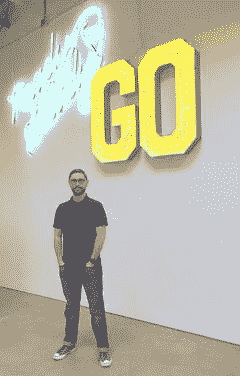

# Pinterest 的众包和机器学习

> 原文：<https://www.dominodatalab.com/blog/data-science-interview-james-rubinstein-disco-scientist-at-pinterest>

我们最近采访了 Pinterest 的数据科学家詹姆斯·鲁宾斯坦。詹姆斯，首先感谢你接受采访。让我们从你的背景和你如何对数据科学感兴趣开始。

### 你的 30 秒简历是什么？

我是 Pinterest 探索团队的数据科学家，但我更喜欢被称为“迪斯科科学家”。

在加入 Pinterest 之前，我是苹果地图和 iTunes 团队的统计学家。在此之前，我在易贝担任投标团队和搜索度量的产品经理，在那里我介绍了一个实验赌博市场、一个新的投标层、在线调查和众包搜索质量评估。

在我的空闲时间，我制作音频组件，破解干衣机，酿造啤酒，和家人一起出去玩。

### 你记得使用的第一个数据集是什么？你用它做了什么？

他们说你永远不会忘记你的第一次，这是完全错误的。然而，我确实记得自己是克莱姆森大学的本科生，在我工作的商店里向学生和顾客分发调查问卷。然后我会手动输入数据，并使用 t 检验或其他一些基本统计数据通过 SPSS 运行数据，以寻找人群中的差异。

### 你和一些最具创新性的公司合作过。有什么想分享的亮点吗？在你的职业生涯中，到目前为止你最自豪的是什么？

我为我(和我的团队，因为数据科学是一项团队运动)在易贝完成的工作感到非常自豪。我们通过创建调查平台，为易贝团队创造了倾听“客户声音”的新渠道。

我们还通过提供独立于实时网站指标(即相关性)的数据，推动了搜索团队内部的许多决策。这些见解现在仍在推动公司的决策，尽管是以不同的方式，由不同的团队来做。

我也很自豪能成为 Pinterest 团队的一员。我和了不起的人一起工作，把了不起的产品带给世界。我们的团队非常努力地工作，以确保 discovery 团队发布的每一个 algo 都是“Pinterest 质量”，对此我也感到自豪。

### 你认为众包和数据科学以及 ML 将走向何方？什么是近期然后是远期？

我们使用人工评估做两件事:驾驶和得分。转向是提供输入来告诉你哪里情况不好/好，提供 ML 的输入。评分是衡量事情进展的好坏。在短期内，我认为我们会看到更多的从得分到使用这些人为标记的数据进行指导的转变。

在未来，我们可能会看到人和机器之间更紧密的循环，机器学习、训练数据收集和测量都在近乎实时地进行。在遥远的未来，我们将在训练机器方面做得如此出色，以至于我们都可以在没有任何人工监督的情况下在海滩上放松。

### 你能告诉我们你在 Pinterest 做的工作吗？

我主要致力于测量各种发现算法的性能。探索团队负责帮助你在 Pinterest 上找到你喜欢的东西，无论是通过搜索、Homefeed 还是推荐。我们通过人工评估和现场实验来衡量这种体验。我还致力于测量引脚质量，试图训练 ML 算法区分什么是好引脚，什么是不太好的引脚。

### 你想解决的其他机会/问题领域有哪些？

一个很大的挑战是我们如何知道一个 Pin 什么时候是好的。什么使它变得好？为什么人们使用一些图钉而不使用其他图钉？当我们第一次看到一个图钉创作时，我们如何知道这个图钉是否会引起图钉爱好者的兴趣？

我最感兴趣的另一个主题是构建评估管道，以便公司中的任何人都可以轻松获得我们在网站上使用的所有不同算法的度量。

### 你在实验设计和统计方面有着有趣的背景，你能谈谈你的背景如何给你作为数据科学家的职业生涯带来一些优势吗？

我认为我所做的很多事情都是设计调查。在某种程度上，这和我在大学时在布莱凯特礼堂给学生发调查问卷没什么不同。

你需要适当的调查设计，不会让回答者产生偏见，你需要确保结果是因为数据，而不是因为用户的偏见。

建立适当的实验控制也是至关重要的，这并不总是被认为是实验的关键组成部分。

最后，还有统计数据——理解如何以及何时应用它们是很重要的。不过我承认，有很多人比我更擅长更广泛的统计数据，我很乐意寻求帮助或第二种意见。这是在 Pinterest 工作的好处之一:尽管我们的团队很小，但我们有一些在各自领域非常优秀的人，他们愿意帮我找到正确的答案。

### 你最喜欢使用的工具/应用程序是什么？

嗯，在众包方面，我们通常使用 Crowdflower 或 Mechanical Turk。不过，我们确实在不同的市场使用不同的供应商。你必须将正确的人群与正确的任务相匹配。

说到数据分析，我和 R 合作过很多事情。在过去的几年里，我学习了更多关于 Python 的知识，这很棒。

### 对数据科学/机器学习的学生或从业者有什么忠告吗？

是的，学习科学。去和真实的人做些真实的实验。找出混淆因素，询问噪音的来源，尝试从尽可能少的参与者那里获得意义。数据科学不会取代科学，而是补充科学。

* * *

*在 [Twitter](https://twitter.com/2late4aGoodName) 和 [Pinterest](https://www.pinterest.com/jrubinstein) 上关注詹姆斯。在 [Pinterest 工程博客](https://engineering.pinterest.com/blog)上关注 Pinterest 的数据科学。*