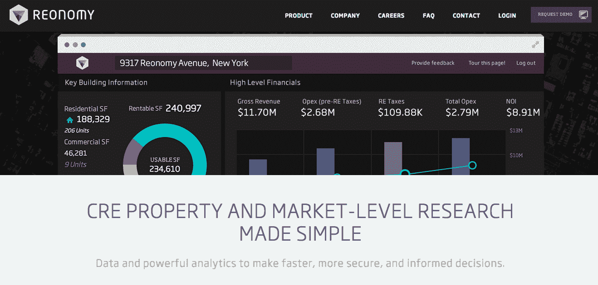

# 数据科学采访:Reonomy 首席数据科学家 Jason Dolatshahi

> 原文：<https://www.dominodatalab.com/blog/data-science-interview-jason-dolatshahi-head-data-scientist-reonomy>

我最近采访了 Reonomy 的首席数据科学家 Jason Dolatshahi。

**Jason，请告诉我们一些你的背景，以及你是如何对数据科学感兴趣的。**

我一直喜欢学习和解决问题，所以我学了数学和物理。我以前从事金融营销，数字广告，现在在 reonomy 工作。我最初来自圣地亚哥，现在我住在布鲁克林。

**你是如何对数据科学和机器学习产生兴趣的？**

在我人生的某个阶段，我有一份有点无聊的工作。所以我下定决心学习 Python，它帮助我建立了[金融模型](https://www.dominodatalab.com/finance/?utm_source=blog&utm_medium=post&utm_campaign=data-science-interview-jason-dolatshahi-head-data-scientist-reonomy)。我就是这样发现了数据科学和机器学习。这个话题似乎涉及了很多我不太了解的很酷的东西，所以我被吸引住了。

你还记得你是什么时候意识到数据的力量的吗？

第一次了解是在大学的时候；我第一次亲眼看到是在一个交易台上。在此期间，我的工作是自营交易。我从金融市场发现并驱动交易信号，收集数据，并根据这些见解执行策略。

你在经济学院做什么工作？

我们是商业地产市场的初创公司。我们业务的很大一部分是通过智能地使用数据来创造价值。我们的产品是为投资者、贷款人、经纪人和其他市场参与者提供的研究平台。像许多其他小公司一样，数据科学工作包括大量的后端工程。

你发现的最令人惊讶的见解或发展是什么？

到目前为止，我发现的最基本的物理模型是谐振子，例如钟摆的运动。此外，我喜欢套用一位最著名的物理学家的话，他说*“一个年轻的理论物理学家的职业生涯包括以不同的抽象程度对待谐振子”*。但类似地，数据科学家的职业生涯包括了解这样一个事实，即在不同的抽象程度上，“你 80%的问题解决发生在建模之前”。

> 数据科学家的职业生涯包括了解这样一个事实，即在不同的抽象程度上“80%的问题解决发生在建模之前”

**你认为商业地产和数据科学以及 ML 将何去何从？**

我认为商业地产将变得更加数据驱动。数据科学的应用领域也将越来越广。例如，我认为这将增加私人和公共部门对具有定量问题解决技能的人的需求。医学是头号关键领域，我希望在这个领域看到一些重要的突破。测序一个基因组的成本在 1000 美元左右，这比第一个人类基因组计划后的 20 年要少得多。

**在雇佣数据科学家时，你们有哪些方法(如果有的话)？一个成功的候选人最重要的是什么？**

我有兴趣看到候选人运用定量推理。我也喜欢了解他们对自己不知道的事情的态度。但对我来说最重要的技能是统计直觉。为此，我会给你一个实际的任务带回家，稍后展示结果。这将向我展示候选人是否具备所需的数据和沟通技巧。我现在正在应聘经济学的职位，如果你认为你具备所需要的条件，我们就来聊聊吧。

**在大会上教授数据科学时，您是如何应用自己的知识的？对实习学生有什么建议吗？**

未来的数据科学家应该专注于基本技能和统计推理。他们应该试着用简单的术语理解技术，例如*为什么*他们以*的方式工作*。不要被数学符号、编程语言、技术吓倒；这些都只是一种工具，或者达到目的的手段。数据科学是一门实践学科，它是围绕权衡取舍而构建的。你需要在自己的工作中认识到这些权衡，并做出明智的选择。这包括但不限于构建预测模型的环境。最后但同样重要的是:“深入思考简单的事情”——另一句名言。

> 试着用简单的术语理解技术，例如*为什么*它们以这样的方式工作。不要被数学符号、编程语言、技术吓倒；这些都只是一种工具，或者达到目的的手段

**你有如此丰富的数据科学背景，你能分享一些你做过的最有趣的工作吗？还是一两个有纪念意义/有意义的项目？**

我在一家移动广告初创公司建立了一个后端数据处理架构，基于 Python、redis 和亚马逊 EMR。即使在我们被收购后，它仍然存在于生产中。然后，我在一个大型广告合作项目中创建了可视化效果，获得了很大的吸引力，并最终被各种商业用途所采用。最近，我开发了一个功能，让 Reonomy 的用户在使用 ElasticSearch 时，可以获得某个人或公司所有权的整体情况。这是一个大项目，因为你必须建立简化的工作流程，许多市场参与者必须与一群人一起手动进行，这将洞察力的时间减少了几个数量级。

> 未来的数据科学家应该专注于基本技能和统计推理

到目前为止，在你的职业生涯中有什么让你感到最自豪的事情吗？

关于数据科学，我最喜欢的是学习新事物和创新的机会。我真的很喜欢我所做的工作，它带来了惊人的结果，我也很喜欢教学和帮助人们看透复杂性。

今年你在做什么个人/专业项目，为什么/如何让你感兴趣？

我目前专注于函数式编程或数学家编程。我最喜欢的科目之一是机器学习在生物和医学问题上的应用。

你发现了哪些机器学习方法，或者你认为这些方法最有帮助？你最喜欢使用的工具/应用程序是什么？

一般来说，越简单越好。我日常使用的工具是 Python、pandas、tmux、vim 和 unix。我也用 scikit-learn。

Jason——非常感谢你抽出时间！真的很高兴能更多地了解你在经济学院所取得的成就。

* * *

*了解更多关于[杰森·多拉特沙希](https://about.me/jasond137)或[雷诺米](http://reonomy.com)的信息。*