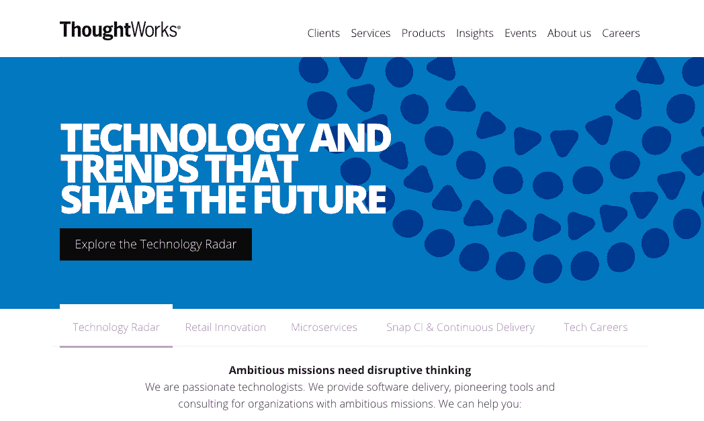

# 数据科学访谈:Thoughtworks 的资深数据科学家 Sean McClure

> 原文：<https://www.dominodatalab.com/blog/data-science-interview-sean-mcclure-sr-data-scientist-at-thoughtworks>

我们最近采访了 Thoughtworks 的高级数据科学家 Sean McClure 博士。肖恩，首先感谢你的采访。让我们从你的背景和你如何对数据科学感兴趣开始。

## 你的 30 秒简历是什么？

我的学术背景是科学计算，我曾用高性能计算机和尖端算法来计算基于纳米技术的设备的分子属性。我爱上了使用计算机和数据来解决非常具有挑战性的问题。获得博士学位后，我开始了自己的高级分析业务，利用机器学习和数据库技术帮助企业进行分析竞争。在做了几年之后，我加入了 T2 的 ThoughtWorks，成为了我现在工作的数据科学家。我喜欢写作和公开演讲，也喜欢弹钢琴。

## 你是如何对数据科学和机器学习产生兴趣的？

在我读博士期间，我接触了各种试图在计算机上解决挑战性问题的方法。我很快认识到机器学习技术在解决我的领域中的问题的力量。我看到，我作为一名科学研究人员的经验可以与机器学习中使用的方法相结合，以解决远远超出学术界的问题。当我毕业时，数据科学刚刚开始升温，我觉得这是我的技能和热情的自然延伸。

## 当你意识到数据的力量时，有没有一个特定的“啊哈”时刻？

我早期的一个项目是在医疗保健领域，涉及构建一个试图将各种症状与疾病结果关联起来的应用程序。尽管该产品远非完美，但它让我看到了数据的力量，以及它在世界上的变革性。这是我意识到我们可以用数据做很多重要工作的时刻之一，它可以对我们的人性产生积极的转变影响。

> 数据的力量可以改变世界

## 你在 ThoughtWorks 做什么工作？

在 TW，我构建自适应应用程序，通过从环境中学习来帮助自动化决策。我与软件开发人员合作，将我构建的模型集成到现实世界应用程序的工作代码库中。在 ThoughtWorks，我们认为这是下一代软件，其中敏捷性的理念超越了设计阶段，贯穿于软件的整个生命周期。

## 在你的职业生涯中，到目前为止你最自豪的是什么？

这是我第一次从企业领导那里得到证实，我的工作为组织增加了价值。从领域专家那里得到积极的反馈，说你的工作产生了真正的影响，这是一种很棒的感觉。

## 你发现的最令人惊讶的见解或发展是什么？

我在一家搜索引擎营销(SEM)公司工作，我们试图在大量的市场数据中寻找模式。我们发现，虽然许多营销活动被员工处理得很好，但也有其他一些活动与普遍持有的信念相去甚远。虽然这是我们在那里的核心原因，但在组织的数据中发现新的机会仍然是一个令人愉快的惊喜。

## 今年你做了哪些个人/专业项目，为什么/如何让你感兴趣？

今年，围绕将自动化构建到现有的业务流程中，充满了许多激动人心的事情。我最近完成了一个应用程序，它吸收了成千上万手动输入的文本描述，并呈现出正在讨论的核心主题。这被用来发现大型系统中出现的主要故障；多年来在文档中手工描述的故障。这是一个很好的例子，教一台机器做一些需要很多人和数千小时才能完成的事情。它使用了自然语言处理中的概念，我认为这将在未来的智能数据产品中扮演非常重要的角色。

## 数据科学的未来是什么样的？

我们仍处于定义这一领域的早期阶段，以及它对寻求分析竞争的组织意味着什么。我认为，在未来，我们将会看到大量的宣传逐渐消失，并成为一个坚实的学科，将数据转化为有价值的产品。将数据转化为价值的需求只会增加，而实现这一点的方法就是进行高质量的科学研究；导致模型的研究，这些模型捕捉驱动我们感兴趣的领域的潜在模式。我个人正在努力在我的写作和公开演讲中帮助定义这个领域，并确保炒作不会干扰对基于大量数据的伟大科学的需求。

> 我认为，在未来，我们将会看到大量的炒作逐渐平息，并成为一个坚实的学科，将数据转化为有价值的产品

## 哪些出版物、网站、博客、会议和/或书籍对你的工作有帮助？

亚塞尔·s·阿布·穆斯塔法的《从数据中学习》是一本值得不时阅读的好书。它很好地解释了制造机器的可行性，这些机器可以学习和描述我们作为数据科学家每天应用的许多核心概念。我也经常使用 [DeepDyve](https://www.deepdyve.com/) ，它允许人们租借学术文章。这样我们就可以了解最新的研究，而不必支付大量的期刊订阅费。

## 你发现了哪些机器学习方法，或者你认为这些方法最有帮助？你最喜欢使用的工具/应用程序是什么？

机器学习构成了我们作为数据科学家使用的各种算法的核心。我不认为你可以将任何一种方法置于另一种之上，直到你试图解决的特定挑战暴露了它的一些秘密。这些就像在发现过程中突然出现的标志，暗示可能证明可行的方法和途径。但最终，采用多种方法，让大自然告诉你什么可行，什么不可行，这才是关键。对于工具和应用程序，我首先使用 R 和 Python，因为它们拥有最丰富的科学计算库。这种多样性对于允许科学家从各种不同角度探索数据并揭示如何对感兴趣的系统建模的洞察力至关重要。我在使用 R 和 Python 的 IPython 时也使用 R studio。当缩放模型有意义时，我会寻找像 [Spark](https://www.sparksf.org/) 这样的工具，这些工具在使机器学习可扩展和快速方面取得了很大进展。H20 也开始看起来有希望成为扩展我们科学的工具。除此之外，我还负责 NoSQL 数据库和 Hadoop 生态系统。

## 对数据科学/机器学习的学生或从业者有什么忠告吗？

1.  关注核心概念，因为它们是永恒的
2.  投入并不断练习。失败是学习的唯一途径。我最近就此写了一篇文章，名为[你应该关注的唯一技能](https://www.linkedin.com/pulse/20141113191054-103457178-the-only-skill-you-should-be-concerned-with)。

> 失败是学习的唯一途径

肖恩-非常感谢你的时间！我非常喜欢深入了解你在 Thoughtworks 取得的成就。

*[肖恩·麦克卢尔](https://twitter.com/WorldOfDataSci)可以在这里在线找到，并访问 [Thoughtworks](http://www.thoughtworks.com/) 。*