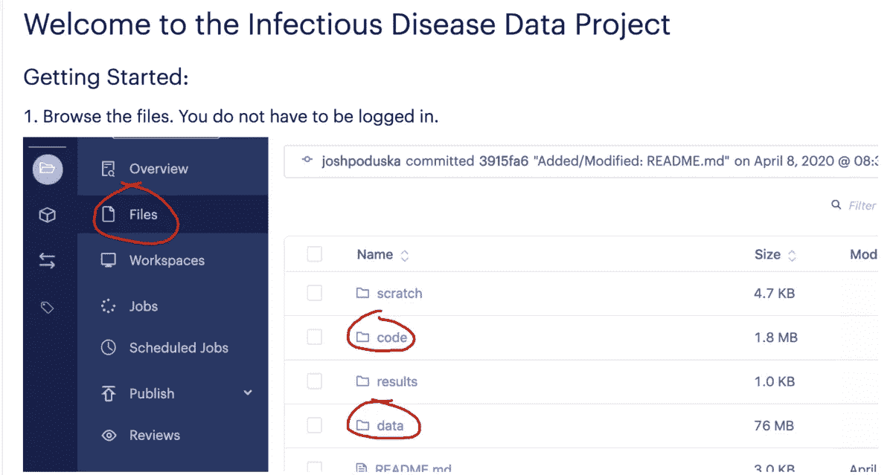
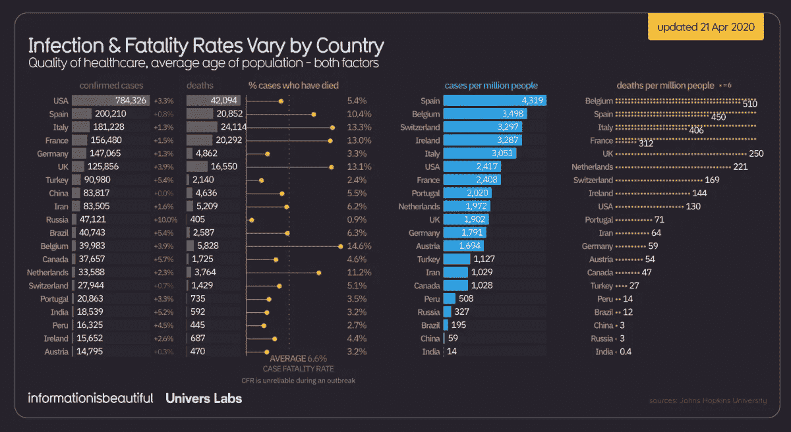
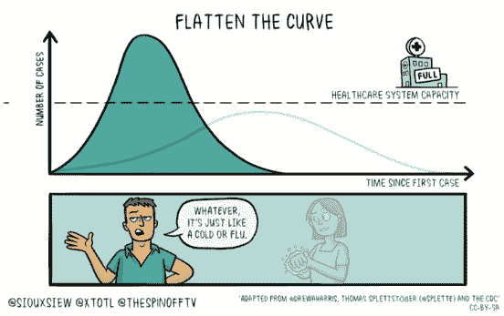

# 数据科学发起了一场全球对抗新冠肺炎的战斗

> 原文：<https://www.dominodatalab.com/blog/data-science-launched-a-global-fight-against-covid-19>

By David Bloch, Data Science Evangelist, Domino on April 21, 2020 in [Perspective](/blog/perspective/)

随着世界以疯狂的速度限制新冠肺炎的影响和传播，数据科学行业呼吁采取行动，帮助加快新预防措施和技术的研究，并就指数增长率和呆在家里限制传播的重要性等主题教育人们。

在前所未有的规模上，卫生、学术和政府组织开始公开数据集，以供分析、探索和研究。这些相同的数据集正被新闻媒体用来讲述新型冠状病毒的故事，并教育公众有关社交距离等措施，这些措施可以降低感染率，并帮助医院应对病毒。

在 Domino，[我们响应了](https://www.dominodatalab.com/news/data-science-propels-coronavirus-research-domino-data-lab-opens-platform-for-data-scientists-advancing-covid-19-research/)这一号召，为希望为新冠肺炎研究做出贡献的数据科学家提供了一个免费的环境。该环境已经预先配置了对数据的访问，许多代码片段使其易于开始。注册后，数据科学家可以请求访问更多计算。

我们希望提供这样的环境能让数据科学家更容易起步，并为新冠肺炎研究做出贡献。我们还在下面提供了一些资源，我们发现这些资源发人深省，对我们自己的探索和实验很有帮助。

## 如何在 Domino 中访问新冠肺炎项目

1.  参观 try.dominodatalab.com 并报名。
2.  完成入职培训后，[查看并注册访问新冠肺炎传染病数据项目](https://try.dominodatalab.com/u/joshpoduska/infectious-disease-data/overview)。
3.  请遵循项目中提供的 readme.md 文件，以获得有关所包含内容的更多信息。
4.  有关 Domino 环境的更多信息，请查看我们在 docs.dominodatalab.com[的](https://docs.dominodatalab.com/en/4.1/)[入门指南](https://docs.dominodatalab.com/en/4.1/get_started/index.html)。

`Source:`[`Domino Try`](https://try.dominodatalab.com/u/joshpoduska/infectious-disease-data/overview)

## 数据科学家如何帮助对抗传播

科学研究进程中的一个关键原则是“站在我面前的巨人的肩膀上”的能力。对于研究人员来说，获得以前的假设、实验和其他科学家的知识来帮助建立新的见解是很重要的。

云计算的采用以及笔记本工作解决方案的流行，使得研究人员可以轻松分享他们的工作笔记、算法和数据等底层资源。许多组织寻求利用其内部数据科学能力来帮助加快对该病毒的研究。例如:

*   阿里巴巴集团的科学研究院开发了一种 T2 新冠肺炎诊断模型 T3，利用计算机断层扫描(CT)和医学成像分类来诊断新冠肺炎病毒。该系统将由经验丰富的医生进行的典型的 10-15 分钟诊断缩短到 20 秒钟，这在医疗资源不堪重负的情况下是至关重要的时间节省。
*   **ka ggle**-一个举办一系列比赛的平台，在这些比赛中，企业提供挑战和数据，以找到财务奖励的解决方案-已经创建了[资源中心](https://www.kaggle.com/tags/covid19)和一系列起点文章，以帮助数据科学界在追求提供新智能的过程中轻松起步。
*   **Zindi**-一家总部位于南非的初创公司一直在连接非洲的数据科学家社区，[宣布向其 12，000 名数据科学家提供现金奖励](https://techcrunch.com/2020/03/26/zindi-taps-12000-african-data-scientists-for-solutions-on-covid-19/)，以参与寻找可用于帮助抗击新冠肺炎的新见解和信息。
*   **微软**与[分享了一系列学术论文，这些论文配有一些工具](https://www.microsoft.com/en-us/research/project/academic/articles/microsoft-academic-resources-and-their-application-to-covid-19-research/)，可以更容易地使用自然语言处理技术搜索文献，帮助研究人员快速找到相关信息。他们还结合了以前对与新冠肺炎病毒作用方式相似的病毒的研究实例，如 SARS 病毒。
*   再保险供应商 SCOR 专门成立了一个工作组来分析新冠肺炎疫情危机。该团队由来自其知识社区的专家组成，包括医生、流行病学家、精算师和数据科学家。基于约翰·霍普金斯大学提供的数据存储库，他们在 Domino 中构建并发布了一个[公共 web 应用程序，以帮助在基本信息的实际显示中可视化新冠肺炎趋势。最初成立的目的是建立生物特征风险模型，多专业工作组意识到共享数据有助于更好地向公众提供信息。](http://covidtrends.scor.com)
*   Bayer 数据科学家 Jeffrey Pobst 在 Domino 中开发了一个应用程序，来分析维基百科中与新冠肺炎相关的跨语言词汇的趋势——查看标题为“冠状病毒”、“疫情”、“新冠肺炎”的页面流量，以及有趣的“卫生纸”、“洗手液”、“抗病毒药物”、“远程办公”等相关页面。该应用程序强调了社会一直在研究什么，好奇心如何在不同的地理区域内上升和下降，并可能围绕这个疫情随着时间的推移在区域内看到的文化影响呈现有趣的相关性。
*   感受到数据科学和人工智能应用的潜力，白宫敦促技术机构为研究做出贡献。

科学界迫切需要发现有助于抗击病毒传播的新见解来源，这导致了前所未有的跨国和跨国信息共享。大型跨职能虚拟团队聚集在一起，更好地通知人们，提供更好的洞察力和清晰度，最终帮助政府共同努力解决问题。

## 数据可视化如何更好地传达故事

数据科学家应用数据可视化技术来探索信息，并在形成和测试假设之前获得大量数据集。

随着政府寻求实施各种政策，如社会距离和要求人们自我隔离，数据越来越多、也是最重要的用途之一是向人们提供政策原因以及为什么这些政策会有效的建议。

下面是一系列文章和博客帖子，它们使用数据可视化来创建新的见解，并清晰地传达给读者。它们也可以作为研究者可能寻求的不同方法和假设的思想启动器。

*   **信息是美丽的**发表了一系列[信息图表](https://informationisbeautiful.net/visualizations/covid-19-coronavirus-infographic-datapack/)，这些图表从大量数据中提炼出受病毒影响者的人口统计信息。
*   **纽约时报**为[提供了一系列模拟和滑块](https://www.nytimes.com/interactive/2020/03/16/upshot/coronavirus-best-worst-death-toll-scenario.html)；让人们能够根据疾病的传染性和死亡率轻松评估影响；按照国家和州提供信息，利用人口统计数据以及我们目前对病毒的了解。
*   约翰霍普金斯大学的团队已经在 T2 建立了一个惊人的资源中心，里面充满了数据集和信息，其中包括 T4 的一个综合仪表板，记录了与病毒及其在人群中传播有关的关键数据。
*   《华盛顿邮报》提供了一系列的 T2 动画，展示了疾病传播的不同场景。他们介绍了社会距离背后的目的，并展示了它如何帮助减缓病毒的传播，给卫生部门一个更好的机会来管理其影响。

    

    `Source:`[`Information is Beautiful`](https://informationisbeautiful.net/visualizations/covid-19-coronavirus-infographic-datapack/)

## 其他资源

*   **Fast AI** 为[提供了一系列关于数据科学在解决新冠肺炎问题中的作用的见解和想法](https://www.fast.ai/2020/03/09/coronavirus/)，有助于定义和描述手头的问题，并展示了数据科学家如何提供帮助。
*   **走向数据科学**发表了一篇博客，[帮助人们建立了一个与冠状病毒传播相关的仪表板](https://towardsdatascience.com/build-a-dashboard-to-track-the-spread-of-coronavirus-using-dash-90364f016764)，以及他们的[对 COVID 增长模式的探索性分析](https://towardsdatascience.com/classify-growth-patterns-for-covid-19-data-41af4c7adc55)，并访问了他们的底层代码库。
*   **约翰·霍普金斯大学**通过 GitHub 公开了其[数据集，全天发布多次数据更新，供数据科学家和分析师访问。](https://github.com/CSSEGISandData/COVID-19)
*   哈佛大学在其中国数据实验室网站上发布了 T2 的文献、学术案例研究、数据集和代码库。

    

    `Source:`[`Towards Data Science`](https://towardsdatascience.com/classify-growth-patterns-for-covid-19-data-41af4c7adc55)

[Twitter](/#twitter) [Facebook](/#facebook) [Gmail](/#google_gmail) [Share](https://www.addtoany.com/share#url=https%3A%2F%2Fwww.dominodatalab.com%2Fblog%2Fdata-science-launched-a-global-fight-against-covid-19%2F&title=Data%20Science%20launched%20a%20global%20fight%20against%20COVID-19)