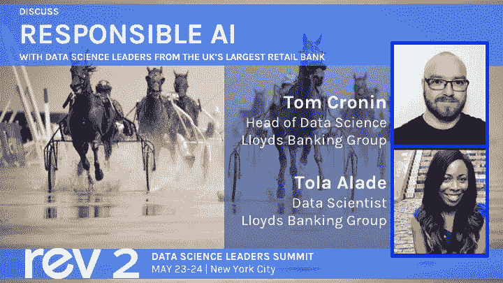

# 来自英国最大零售银行的数据科学领导者将在 Rev 2 中讨论负责任的人工智能

> 原文：<https://www.dominodatalab.com/blog/data-science-leaders-from-uk-s-largest-retail-bank-will-discuss-responsible-ai-at-rev-2>

By Karina Babcock, Director Corporate Marketing, Domino on March 27, 2019 in [Perspective](/blog/perspective/)

随着组织越来越多地将大量模型部署到生产中，以及这些模型影响重要的商业决策，“可解释的人工智能”已经成为一个热门的讨论话题。至关重要的是，要了解每种模型的基础、演变和使用，以确保它们正在做它们在野外应该做的事情，并且如果它们偏离了轨道，能够有效地识别和排除故障。

Domino 首席数据科学家 Josh Poduska 解释说，“在更广泛的模型管理框架的背景下，我们将允许组织掌握每个模型的活动、成本和影响的支柱称为‘模型治理’。”"

在处理金融服务等受监管行业时，这一概念尤为重要。英国最大的零售银行劳埃德银行集团(Lloyds Banking Group)将于今年 5 月派遣其数据科学负责人汤姆·克罗宁(Tom Cronin)和数据科学家托拉·孙心怡(Tola Schmidt)前往纽约，在数据科学领导者峰会上深入探讨这一主题。

汤姆领导着一个由 50 多名“探路者和开拓者”组成的团队，他们正在向劳埃德的同事和客户提供人工智能产品。作为 Tom 团队的一员，Tola 在最近于伦敦举行的[数据科学会议](https://popup.dominodatalab.com/london/)上发表了评价最高的演讲；她的个人使命是通过统计技术在现实生活中的应用来激励年轻一代，从而“将数学带入生活”。

以下是他们 Rev 演讲的简短概要，题为“负责任的人工智能”:

> 随着统计模型在决策中的使用在生活的各个领域变得越来越普遍，从我们可以获得的抵押贷款到我们可以在 Tinder 上向左滑动的人，我们解释这些模型的能力从未如此重要。在本次会议中，我们将向您介绍可解释人工智能(XAI)的概念，它使我们能够解释机器学习模型做出的决定。

[Twitter](/#twitter) [Facebook](/#facebook) [Gmail](/#google_gmail) [Share](https://www.addtoany.com/share#url=https%3A%2F%2Fwww.dominodatalab.com%2Fblog%2Fdata-science-leaders-from-uk-s-largest-retail-bank-will-discuss-responsible-ai-at-rev-2%2F&title=Data%20Science%20Leaders%20from%20UK%E2%80%99s%20Largest%20Retail%20Bank%20Will%20Discuss%20Responsible%20AI%20at%20Rev%202)