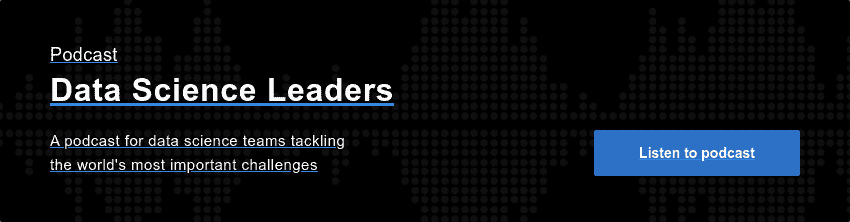

# 数据科学领袖播客探讨了 MLOps、数据道德、团队结构等

> 原文：<https://www.dominodatalab.com/blog/data-science-leaders-podcast-probes-mlops-data-ethics-team-structures-and-more-key-trends-powering-today-s-model-driven-businesses>

今天，我们推出了“数据科学领导者”，这是一个新的播客系列，致力于通过记录和分享真实故事、突破性战略和关键见解，帮助团队扩展蓬勃发展的数据科学实践，构建企业数据科学成功模型，这些都来自那些已经做到的人。

我们最近采访了“数据科学领导者”的主持人戴夫·科尔(Dave Cole)，听听他在采访领导者时学到了什么，并希望听众能够了解，这些领导者的丰富经验推动了数据科学团队所能实现的极限。

### 你为什么要启动数据科学领袖播客？

科尔:我曾经是首席分析官，当时，我作为一名从业者，在分析和理解数据科学方面有着丰富的经验。但我不太明白的是，成为数据科学领导者意味着什么。这意味着理解诸如你的数据科学家应该在你的组织中的什么位置；如何衡量数据科学团队；团队应该如何与业务用户互动。

我觉得成为数据科学领域的领导者有点与众不同，关于这一领域伟大领导者的报道很少。这个角色有一些非常独特的方面，我只是想解释一下。我们的目标是帮助所有的数据科学领导者以及有抱负的数据科学领导者相互学习。

这一点尤其重要，因为有很多不同的方法可以成功胜任这一角色，而且很多取决于各种变量，比如你所处的行业、你所在的组织类型、你的团队规模等等。这也是我喜欢跨行业跟各种领导对话的格式的原因。这是一种有助于理解不同的方法的格式，这些方法适用于不同的高管构建高绩效团队。

### 你的第一集是《纽约时报》首席数据科学家克里斯·维金斯。关于那次谈话，你印象最深刻的是什么？

科尔:对于像《纽约时报》首席数据科学家这样的人来说，数据伦理是一个重要的问题，我认为这并不奇怪。但真正有趣的是，意识到——坦率地说，定义——作为一名有道德的数据科学家意味着什么，被视为时报数据科学团队的一项重要职责和一个方面。听到 Chris 谈论他如何处理数据伦理，他们如何写下道路规则，甚至创建角色和委员会来支持数据伦理工作，我很感兴趣。

回答数据伦理问题很有意思。我希望在数据科学家中看到更多。这是一个非常重要的话题，尤其是考虑到像欧盟一般数据保护条例或加州消费者隐私法案这样的法规。我在本期播客中采访了另一位嘉宾，我们就数据的未来进行了一些数据伦理的讨论。虽然《纽约时报》可能对数据伦理有独特的强调，但这应该是每个数据科学家都必须真正思考的问题。

关于克里斯的领导风格，有趣的是他对自己团队的期望。你会听到他在播客中谈到他期望他的数据科学家可能会不时向他们的首席执行官展示。所以，他们必须是伟大的沟通者；他们必须能够回答问题，并将他们所做的工作转化为 CEO 能够接受的清晰而简明的建议。这是我在整个对话中看到的一个主题:理解代码和统计数据还不够好；你也必须能够翻译它。

### 通过采访这些嘉宾，您对数据科学的当前或未来状态有什么了解？

Cole:首先，我了解到数据科学领导者面临一些共同的挑战。例如，围绕数据科学家是否应该集中或嵌入到各个业务部门，或者是否应该有某种混合模式，有这样的对话。关于这场辩论的利弊，我学到了很多，我们也谈了很多。

此外，数据科学领域的领导者强烈希望宣传数据科学的成功，并衡量不仅仅是 ROI。人们一致认为，成功不仅仅在于我们将这种模式投入生产后节省了多少成本。数据科学的领导者需要考虑一些措施，例如数据科学团队应该进行的适量研究，或者如何为可以获得资金的项目寻找好主意。有趣的是，这些想法不一定总是来自你的传统业务领域。他们可以来自您的数据科学团队本身。对我来说，了解不同的公司是如何做到这一点的真的很有趣。

最后，我惊讶地了解到各行各业的数据科学领导者是如何专注于提供业务影响的。我了解到没有一个行业能引领他们所有人。总的来说，各行业似乎都有一种对数据幻灭的共同情绪，这促使我采访的领导者确保他们将模型放在公司业务的最前沿。我希望这个播客能帮助更多的人做好这件事。

### 你能告诉我们一些你很想让观众听到的即将播出的剧集中的瞬间吗？

科尔:我和赛默飞世尔公司 DNA 测序部门的生物信息学主管菲奥娜·海兰谈过，在那次谈话之前，我从来不知道什么是生物统计学家，什么是生物信息学。我们包括了一本“生物学 101”入门书，以更好地理解一些基本的人类 DNA 概念如何转化为数据科学，这真是一场令人着迷的对话。我们甚至继续谈论冠状病毒以及数据科学本身是如何被用来制造疫苗的；我们略微谈到了测试，这是一个热门话题，非常有趣。

此外，我和作家约翰·汤姆逊的谈话非常激动人心。他是一名作家，已经写了两本书，他正在写第三本，围绕着数据的未来。我们讨论了他关于如何使用数据、数据隐私以及数据伦理的哲学。

最后，我和 Paylocity 的首席数据科学官 Adam McElhinney 就 people analytics 进行了一次非常有趣的谈话。每个公司都有一个人力资源部门，从他那里听到一些数据科学如何被用来试图限制面试过程中的偏见、公平薪酬和类似性质的事情的使用案例真的很有趣。

### 你希望在以后的剧集中回答哪些问题？

Cole:每次与新的数据科学领导者交谈时，我都会发现有不同的方法适合他们。虽然我认为有一些方法绝对更好，但我发现每种方法都有利弊。

我得出的结论是，数据科学领导者的风格，以及他们的数据科学团队所处的阶段，可以真正决定他们如何最好地管理和构建他们的团队。而且，那将会进化。因此，在某个时候，退一步谈谈数据科学团队随着规模和责任的增长而发生的演变将是一件好事。

