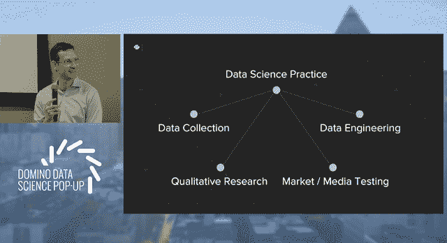

# 数据科学模型互为基础

> 原文：<https://www.dominodatalab.com/blog/data-science-models-build-on-each-other>

*[亚历克斯·利兹](https://www.linkedin.com/in/alexleeds/)，在多米诺数据科学弹出窗口上展示了“[建立本地客户模型](https://dominodatalab.wistia.com/medias/ugthc3r2fi)”。Leeds 讨论了 Squarespace 数据科学团队如何构建模型来解决关键的业务挑战，以及如何利用复杂的组织结构来加速数据科学工作。这份 Domino 数据科学领域笔记提供了他演讲的亮点和视频剪辑。完整的视频记录也可用于[观看](https://dominodatalab.wistia.com/medias/ugthc3r2fi)。此外，如果您想了解关于在整体数据科学实践中构建和管理模型的更多信息，那么可以考虑 [Domino 的模型管理论文](https://www.dominodatalab.com/model-management/?utm_source=blog&utm_medium=post&utm_campaign=data-science-models-build)或[大规模管理数据科学的实践指南](https://www.dominodatalab.com/resources/managing-data-science/?utm_source=blog&utm_medium=post&utm_campaign=)。*

## 数据科学实践

在“[建立本地客户模型](https://dominodatalab.wistia.com/medias/ugthc3r2fi)”中，Alex Leeds 讨论了 Squarespace 数据科学团队如何应对业务挑战，或者说，“我们应该在哪里、在哪些城市进行有针对性的本地化营销”？在几周内，数据科学团队通过构建一个模型来解决业务问题，该模型可以预测成功，并使业务利益相关方能够确定关注哪些城市。数据科学团队能够在几周内构建预测模型(和许多其他模型)，因为他们已经有了一个生态系统。包括但不限于数据科学实践的生态系统。

Leeds 指出“数据科学实践依赖于大量其他步骤”，包括数据收集、定性研究和市场测试(即每年 30 多次实验)，这些步骤“也为我们在模型中进行的分析提供了素材”。利兹还指出，数据科学家和数据工程师“并肩”工作是“公司的巨大优势”，因为它使数据科学家能够“非常快速地获得数据”，并“对我们正在利用的信息充满信心，甚至只是开始”。在演讲的结论中，利兹还指出，“有许多模型进入了分析”，如何“数据科学模型相互建立”，“模型多样性迫使技能集多样性”，“并与组织流程互动”。

## 处理业务问题或挑战

在演讲中，Leeds 概述了数据科学团队解决业务问题的方法。该方法包括确定 Squarespace 表现良好的城市，“收集特定地点的数据”，“确定绩效的驱动因素”，以及“利用这些驱动因素来制定商业战略”。这种方法使该团队发现，在城市层面“重要”或预测成功的一些因素包括 30-44 岁之间的人口比例。潜在的上下文含义是，这个年龄范围内的人正在建立业务，并使用网站开展业务。这是一个有趣的发现，因为利益相关者的假设是更年轻的人口统计将是成功的预测者。利兹还指出，有许多预测成功的附加指标，但只有两个附加指标包括拥有研究生学位的人的百分比和食品车的数量。

虽然预测指标很有趣，但是 Squarespace 是如何利用这些结果来影响业务战略的呢？利兹指出，这些结果有助于 Squarespace 确定关注哪些地点。

## 数据科学实践的意义

Leeds 以这个项目作为讨论“在实践中做数据科学”的载体来结束他的演讲。利兹指出，虽然该团队建立了一个模型来预测成功，但“有许多模型进入了这一分析。”

他指出“模型建立在彼此的基础上”,并使团队能够“进行非常快速的分析”,并为组织提供具体的建议。利兹还主张在模型集合中有“一些有趣的多样性”。他还指出

这些数据来源和模型来源将会创造出这个有趣的组织过程。您需要有足够接近您的组织的某些分支的数据科学家来构建知情的模型。甚至在这个非常干净、非常简单、非常普通的问题中，我们在不同的城市做得怎么样？我们下一步应该关注哪里？….我们实际上描述了一个系统，它在组织结构和实践方面都非常复杂。”

## 结论

在“[构建本地客户模型”](https://dominodatalab.wistia.com/medias/ugthc3r2fi)中，Alex Leeds 深入探讨了 Squarespace 数据科学团队如何通过构建模型和组织结构来加速数据科学工作，从而解决关键的业务挑战。虽然这份 Domino 数据科学领域笔记提供了演讲的亮点，但[的完整视频可供观看](https://dominodatalab.wistia.com/medias/ugthc3r2fi)。此外，如果您想了解在整体数据科学实践中构建和管理模型的更多信息，那么可以考虑 [Domino 的模型管理论文](https://www.dominodatalab.com/model-management/?utm_source=blog&utm_medium=post&utm_campaign=data-science-models-build-on-each-other)或[大规模管理数据科学的实践指南](https://www.dominodatalab.com/resources/managing-data-science?utm_source=blog&utm_medium=post&utm_campaign=)。

*^(Domino 数据科学领域笔记提供数据科学研究、趋势、技术等亮点，支持数据科学家和数据科学领导者加快工作或职业发展。如果您对本博客系列中涉及的数据科学工作感兴趣，请发送电子邮件至 writeforus(at)dominodatalab(dot)com。)*