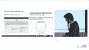

# 数据科学不仅仅是机器学习

> 原文：<https://www.dominodatalab.com/blog/data-science-more-than-machine-learning>

*本 Domino 数据科学领域笔记提供了来自 [Addhyan Pandey 的](https://www.linkedin.com/in/addhyan-pandey-2a00a930/) Domino 数据弹出式演讲“[在汽车行业利用数据科学](https://dominodatalab.wistia.com/medias/b1gmig2wkm)”的亮点和视频剪辑。Addhyan Pandey 是 Cars.com 的首席数据科学家。这篇博文中的亮点包括 Pandey 使用 [word2vec](https://en.wikipedia.org/wiki/Word2vec) 来识别平台上的重复车辆，他的数据科学团队如何将预测模型称为“数据产品”，以及该公司的整体数据科学方法。虽然这篇文章涵盖了亮点和视频摘录，但他的演讲的完整视频[是可用的](https://dominodatalab.wistia.com/medias/b1gmig2wkm)。如果您对此类内容感兴趣，请访问 [Domino 数据科学弹出播放列表](https://dominodatalab.wistia.com/projects/pxqx1u53sr)或考虑参加 [Rev](https://rev.dominodatalab.com/?utm_source=blog&utm_medium=post&utm_campaign=data-science-more-than-machine-learning) 。*

## 汽车行业的数据科学

Cars.com 首席数据科学家 Addhyan Pandey 在他的演讲中探讨了数据科学如何在整个公司实施，以及数据科学如何不仅仅是机器学习，“[在汽车行业利用数据科学](https://dominodatalab.wistia.com/medias/b1gmig2wkm)”。潘迪报道如何

*   一个电子商务网站的核心价值主张是他们的[推荐系统](http://infolab.stanford.edu/~ullman/mmds/ch9.pdf)的相关性
*   他在公司开始工作时，使用了 word 2 vec T1 来识别平台上的重复车辆
*   数据科学团队将预测模型称为“数据产品”
*   该公司目前的数据科学工作方法包括建立“一个强大的产品，建立一个可扩展的、准确的、真正具有非常低的计算时间的模型”。

## 当问题不仅仅是联系买家和卖家时

Pandey 以讨论 Cars.com 的收入流如何包括订阅和广告模式开始了他的演讲。因此，数据科学团队试图解决的问题不仅仅是连接买家和卖家。目标是“管理汽车的整个生命周期”,与电子商务市场中的买家和卖家进行多点接触。Pandey 指出，推荐系统，尤其是其相关性，是确保用户继续参与电子商务市场的核心价值主张。

## 使用 word2vec 进行关联

潘迪指出，当他开始在 Cars.com 工作时，他看到“一大堆文字”的卖家信息，“如果我要买车，我永远不会去读这些信息，因为我在一个能给我提供精确信息的网站上接受过培训……”甚至要弄清楚“两辆相似的车，真的很难”。这是一个相关的建议问题。潘迪决定通过“把所有这些单词放在一个向量空间中……”来解决这个问题。将所有这些词聚集在向量空间中，并得到特定车辆的向量”。这使得数据科学家可以“计算两者之间的余弦相似度”。此外，识别平台上的重复车辆是使用 [word2vec](https://www.youtube.com/watch?v=fwcJpSYNsNs) 的额外好处。

## 作为数据产品的预测模型

Pandey 还在演讲中指出，“当你谈论数据科学时，只谈论特定的模型是不公平的…如果我只是建立一个模型，而不知道如何实现它，我就没有公平对待整个系统。我们把所有的预测模型都称为数据产品”。他讨论了三种数据产品，包括

*   *“数据管道化，基本上是聚合，为数据科学家做大量的数据准备，这样他们就不会浪费 80%的时间，而且还能很快提高整体实时推荐预测。”*
*   *“算法本身。数据科学家真的花了很多时间试图为给定的问题建立最佳模型。这是我们第二大技术产品。”*
*   *“第三个问题是，一旦你有了这个，你如何扩展它？你如何确保你的系统完美无缺？或者如果不是完美无缺，你怎么能达到艺术完美的特定状态？这就是我们的机器学习平台。这基本上是扩展所有这些预测模型，供每个人使用，这是我们在组织内民主化或去中心化数据科学的另一种方式。”*

## 数据科学的“全貌”。很复杂。

在演讲的最后，Pandey 讨论了他对数据科学的观点是如何在这些年里发生变化的。2011 年，他认为数据科学是一种预测模型。然后，随着他与更多的团队合作，他扩展了自己的视角。2017 年，他指出数据科学的“全貌”更加“复杂”，数据科学团队需要“构建一个强大的产品……构建一个可扩展、准确、计算时间非常短的模型。”

虽然这篇博文涵盖了潘迪演讲的一些重点内容，但完整视频可供观看。多米诺数据科学事件的其他录音演讲也可在[获得](https://dominodatalab.wistia.com/projects/pxqx1u53sr)。但是，如果您更喜欢亲自参加活动，那么可以考虑参加即将到来的 [Rev](https://rev.dominodatalab.com/?utm_source=blog&utm_medium=post&utm_campaign=data-science-more-than-machine-learning) 。

*^(Domino 数据科学领域笔记提供数据科学研究、趋势、技术等亮点，支持数据科学家和数据科学领导者加快工作或职业发展。如果您对本博客系列中涉及的数据科学工作感兴趣，请发送电子邮件至 writeforus(at)dominodatalab(dot)com。)*