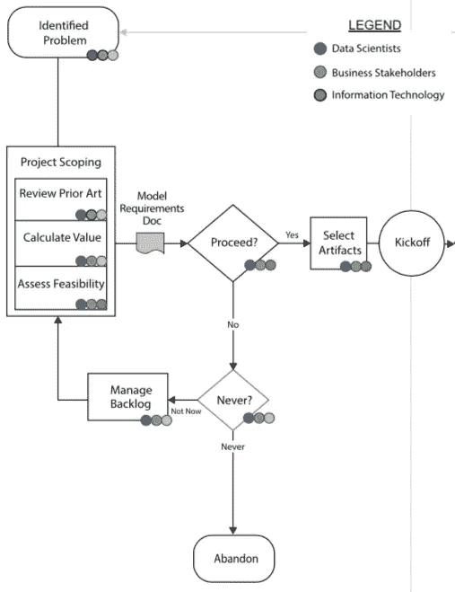

# 新手的数据科学问题解决

> 原文：<https://www.dominodatalab.com/blog/data-science-problem-solving-for-novices>

*本文概述了数据科学，然后介绍了一个将数据科学应用于交通规划的真实示例。*

* * *

## 什么是数据科学？

目前围绕数据科学，尤其是 AI(人工智能)有很多炒作。根据我 20 年的数据科学经验，我发现以下定义很有帮助:

*   **数据科学**:在复杂的数据集中寻找模式，以建立预测未来可能发生的事情和/或解释系统的模型的学科。
*   **机器学习**:应用算法和技术建立数据科学模型的过程。
*   **深度学习**:一类机器学习算法，使用具有许多隐藏层的神经网络。深度学习通常用于图像分类和自然语言处理。
*   AI(人工智能):一类系统或解决方案，其运行方式在自主程度和范围上与人类不相上下。

要做好数据科学，你需要结合计算机/编程技能、数学和统计知识以及行业/领域专业知识。

如果没有数学和统计知识，数据科学模型可能会被误用，结果可能会被曲解。

## 分析的演变

在过去十年中，公司内部的数据科学发生了巨大的变化。大多数《财富》500 强公司现在都处于“主动”阶段，能够对其业务的某些领域做出准确的预测，例如预测对直邮营销活动的回应率。该行业现在渴望达到“动态”阶段，在这一阶段，他们的运营完全是模型驱动的。

## 数据科学生命周期

我经常看到数据科学生命周期的六个阶段。

*   **构思**:这是最初确定项目范围、确定价值/投资回报、决定是否投资[数据科学项目](/resources/field-guide/managing-data-science-projects/)的地方。
*   **数据获取和探索**:这是识别有前景的数据源、捕获和探索数据，然后准备数据(清理、组合等)的地方。).
*   **研发**:一旦准备好数据，团队就能够测试假设，用不同的模型进行实验，并评估结果。
*   **验证**:这是一个质量保证阶段，在投入生产之前，模型在技术上、伦理上和功能上都要经过企业的验证。高度监管行业中的公司通常有完整的团队负责模型验证，在某些情况下，还会任命一名首席合规官。
*   **交付**:这是模型发布的地方。模型实际上可以是任何数据产品。Web 应用程序、集成 API、仪表板、报告，甚至自动电子邮件都是流行的形式。
*   **监控**:数据和行为会随着时间的推移而变化，因此监控数据漂移、模型准确性、使用、性能和价值非常重要，这样可以尽早发现问题，并改进模型。

现在，我将介绍如何将这种[数据科学生命周期](https://blog.dominodatalab.com/how-enterprise-mlops-works-throughout-the-data-science-lifecycle)应用到现实世界的项目中。

## 真实世界示例:将数据科学应用于交通规划

几年前，我帮助一个大城市优化公交线路。他们试图鼓励市民使用公共交通，但偶尔会在一个车站排长队，乘客无法挤上巴士，会被滞留。我的任务是开发一个模型，这样可以提前两天优化路由表，大容量公交车可以与当天的高需求路线配对，人们不会被困。

客户要求除模型交付之外的整个项目在六周内完成，这对于这种性质的项目来说太短了。我在这段时间里尽了最大努力。在项目的事后分析中，我发现回顾我能交付什么和不能交付什么是非常有教育意义的。由于时间压力，我不得不跳过的步骤是经常被跳过的步骤，这些步骤提供了对数据科学项目中实际发生的事情的见解。

### 构思阶段

在构思阶段，我评估了可行性，并在与企业主的一系列会议中定义了问题陈述。我没有时间做一个彻底的现有技术审查。这是关键的一步，因为你很少是第一次处理一个问题，从内部和外部的同事那里可以学到很多东西。量化这个项目的价值/投资回报率也被忽略了。在这种情况下，估计滞留乘客的成本，然后随着滞留乘客的减少而合计价值是可行的。

## 数据采集和勘探阶段

完成构思阶段后，我开始探索和获取相关数据。最后，我收集了前两年以下方面的数据:

*   过去的骑手
*   总线容量
*   路线和站点详细信息
*   天气

根据这些数据源，我设计了以下附加功能来丰富数据集:

*   星期几
*   一天中的时间
*   季节
*   假日
*   温度
*   降雨
*   地理标识符

我从 BI 团队收集数据(我后来发现，他们的数据是从 BI 团队获得的)。事后看来，直接找到来源(IT)会更好，因为 BI 团队的数据并不像原始来源那样完整。

我准备数据的目标是让每一行都代表一个停止，以便尝试一个数字预测模型(回归模型而不是经典的时间序列)。该站点前几天的数据需要在该行上可见。下图显示了我设计的一些输入/列。最后三列用于绘图和作为预测的目标。其他列是模型的输入。

我希望当时能够使用像 Domino 这样的平台，因为我会受益于以下 Domino 特性:

*   **数据科学家可用的硬件灵活性和选择**。可以使用功能较弱的硬件在数据样本上编写数据准备代码以节省成本，然后使用功能更强的硬件在整个数据集上执行。不幸的是，客户端没有使用 Domino，所以我必须一直使用更强大(也更昂贵)的硬件。
*   **文件和再现性**。只有大量的商业和研究逻辑进入数据准备阶段。它是文献和机构知识最重要的地方之一。在代码文件的注释中，您只能写下这么多。而且实验血统几乎不可能人工追踪。不幸的是，如果没有 Domino，我们就无法访问任何早期的文档，未来参与该运输机构的数据科学家将无法全面了解数据准备工作是如何展开的。

## 研发阶段

在完成数据获取和探索阶段之后，我开始了研究和(模型)开发阶段。我特别使用一种机器学习软件解决方案，在建模环境中连续测试了大约 30 种算法。这是在具有数亿行的数据集上完成的。我捕获了每种方法的准确性度量，例如 RMSE、R 平方和残差分析。

最终的模型，一个带有正则化的回归模型，被证明是相当具有预测性的。80%的止损预测与实际发生的相差在+/-1%以内。

我对这些结果很满意，但是，我希望我那时能有像 Domino 这样的平台。在这个模型开发阶段，我会受益于更快的开发。Domino 支持对硬件、环境和代码包的弹性访问，所以我可以并行执行而不是串行执行模型。Domino 还支持各种各样的开源和专有算法以及 ide，这些对我的实验会有所帮助。如果没有这些限制，我可能会开发出一个更精确的模型。

## 验证、交付和监控阶段

由于时间限制，验证不在本项目的范围内。领导者应该确保为生命周期中这个越来越重要的步骤做好预算，以减少模型风险。BI 团队在企业数据仓库的基础上构建了一个 Power BI 仪表板，以提供预测的路线容量，并允许探索未来的预测以及过去的结果。

客户本可以从 Domino 这样的平台中获益，原因如下:

*   Domino 本来可以支持有用的工具，使从验证到交付的转换变得容易。对于这个客户来说，在验证和交付之间有一个清晰而痛苦的中断。从 BI 系统的角度来看，该模型是一个完全的黑箱。Domino 是解释黑盒是如何构建和工作的解码器。
*   交付团队不得不重新创建在初始建模中完成的大部分工作，并且只有代码和一个 Microsoft Word 文档来帮助他们。使用 Domino，工作的可再现性和版本控制被自动捕获，跨团队的协作得到了极大的改进。
*   此外，甚至没有人在任何团队会议上提出[模型监控](/blogs/model-monitoring-best-practices-maintaining-data-science-at-scale)。有了 Domino Model Monitor，监控工具就可以确保对模型性能的持续审查，并与业务目标保持一致。

## 结论

希望这篇博客能让你对数据科学有一个很好的概述，它是如何在现实世界的项目中应用的，以及当约束不考虑现实时，通常在哪里偷工减料。数据科学可以成为解决大型数据集预测问题的极其强大的工具。

随着团队的成长，像 Domino 这样的数据科学平台对于尽可能有效地应用数据科学来说是无价的。Domino 可以在整个过程中提供帮助，包括:

*   从灵活、有弹性的计算环境中加快数据准备和模型测试。
*   鼓励开发可以修改和部署的文件和机构知识。
*   为模型操作提供完整的沿袭，使从研究到验证再到部署的过渡变得无痛而透明。
*   通过单一平台简化所有数据科学模型的模型监控。