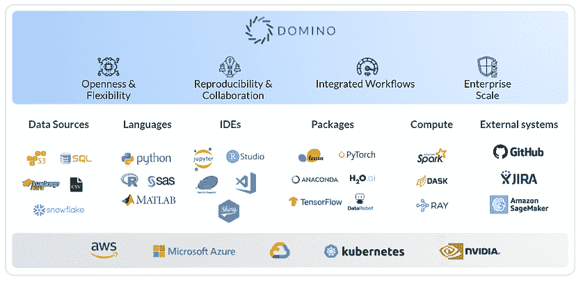

# 数据科学工具:理解多元宇宙

> 原文：<https://www.dominodatalab.com/blog/data-science-tools>

在数据科学的多元宇宙中，工具选项继续扩展和发展。虽然肯定有工程师和科学家可能固守在一个或另一个阵营中(例如，R 阵营与 Python，或者 SAS 与 MATLAB)，但数据科学工具的分散趋势越来越明显。

随着具有不同背景的新团队成员的加入，随着来自不同平台的新数据源的出现，或者利益相关者需要新的可交付成果，效忠于特定的阵营会适得其反。Domino 的 Enterprise MLOps 平台在设计时就考虑到了这种多样性，因此随着您的项目和数据科学工具生态系统的发展，您的团队可用的选项将不会局限于单一的方法。

 

## 什么是数据科学工具？

像大多数专业人员一样，数据科学家需要专业的工具来高效地工作。这些数据科学工具用于访问、清理和转换数据、探索性分析、创建模型、监控模型以及将模型嵌入外部系统。

## 数据科学工具的类型

工具可以是开源的，也可以是商业的。它们可能基于 GUI，或者需要丰富的编程经验。有些非常专业，有些则更像是“瑞士军刀”，可以执行多种功能。工具的主要类别和一些示例包括:

### 数据源

数据科学家使用的数据源几乎是无穷无尽的。从平面文件(如 csv)到关系数据库(如基于 SQL 的数据库)，再到大数据存储(如 Hadoop)和云数据库(如[雪花](https://www.dominodatalab.com/partners/snowflake/))。对于数据科学家来说，他们需要一种方法来轻松访问这些数据源，并清理、转换和组合数据。通常，数据库的处理能力可用于复杂的计算或记录评分。一旦发生数据访问，他们通常会在分析之前使用喜欢的语言/IDE 来处理数据。

### 数据语言

语言通常分为两类，商业语言和开源语言。SAS 和 MATLAB 是两大商业语言。 [MATLAB](https://www.mathworks.com/discovery/what-is-matlab.html) 既是一种专有的编程语言，也是一种用于集成大量数据、函数和算法的软件平台。同样， [SAS](https://www.sas.com/en_us/solutions/analytics.html) 是一个语言和软件平台，以其处理大量数据的能力和广泛的分析能力而闻名。

当今最流行的开源语言是 R 和 Python。r 是一种用于各种数据科学任务的编程语言，其功能可以通过包和不同的 ide 进行扩展。Python 最初是为软件开发而创建的，现在用于各种环境，包括深度学习研究和模型部署。对于不同类型的任务，数据科学家对于他们更喜欢哪种语言非常固执己见。至关重要的是，他们可以在最新版本中轻松访问它们，这样他们就可以高效地完成工作，而不必在每次想要做模型时手动构建环境。

### 集成开发环境(ide)

IDEs(有时也称为笔记本)是一种编码工具，它使开发和测试代码变得更加容易。它们提供了一个单一的地方，其中包括将不同的包放在一起，原型模型，与存储库集成和组织工作。一些常见的 ide 有 RStudio 和 Jupyter Notebook。RStudio 是 R 语言的 IDE，主要用于统计分析和数据可视化。Jupyter Notebook 是一个 Python IDE，允许数据科学家创建和共享代码、等式、可视化和叙述性文本。

与数据科学语言一样，程序员对他们喜欢使用的 ide 非常固执己见。

### 包装

包是一组代码模块，它们在 ide 或语言中提供专门的功能或编程构建块。通过消除每次构建模型时从头编写代码的需要，它们为数据科学家节省了大量时间。例子包括 Shiny、PyTorch 和 Tensorflow。闪亮的是一个 R 包，它支持构建交互式 web 应用程序，这些应用程序可以在后端执行 R 代码。  [PyTorch](https://www.dominodatalab.com/data-science-dictionary/pytorch/) 主要用于 Python 的高级功能，如多维数据数组上的计算，并提供强大的 GPU 支持。 [TensorFlow](https://www.dominodatalab.com/data-science-dictionary/tensorflow/) 是一个用于机器学习的开源框架，特别专注于深度神经网络的训练和推理。

### 计算

数据科学是计算密集型的，因此数据科学家需要轻松、快速地访问适当的计算环境——无论是在云中还是在本地。[图形处理单元](https://www.dominodatalab.com/data-science-dictionary/gpu/)(GPU)是专门为加速计算机图形和图像处理而设计的电路。它们已经成为并行处理大数据块的算法的关键要求。数据科学家的关键是创建对这些环境的自助访问，这样他们就不会浪费时间执行开发任务来设置他们的环境。

### 图书馆

Spark、Dask 和 Ray 等计算库和引擎旨在为各种数据科学用例加速大量数据的处理，提高工作效率和利用计算密集型算法的能力。

### 外部系统

大规模工作的数据科学家需要一种方法来跟踪工作并相互协作。应用程序开发界也使用的两个常见系统是 GitHub 和吉拉。

## 选择数据科学工具时的关键考虑因素

数据科学工具需要高效且相对易用。通常，编码必须手工完成，但是要求越少，工作就越快，效率就越高。因此，像 GUI 和数据可视化这样的特性实际上是大多数数据科学工具的标准。包和库通过消除日常任务也有助于提高工作速度。这种效率扩展到了工具之间的协同工作，避免了在工作继续之前重新编码模型或重新格式化数据。

当考虑自动化数据科学生命周期中主要步骤的工具(如 AutoML 工具)时，请确保您可以利用您的数据科学家来改进模型，以确保您可以获得最大的竞争优势。一种方法是使用自动化大部分工作的工具进行概念验证，然后用代码构建最终的生产就绪模型。

工具的普及性也很重要。新工具不断出现，并且可能具有吸引人的特性。但是在将产品添加到您的生态系统之前，您需要考虑支持、获得团队成员的能力以及更新和支持该产品的严格程度。

任何工具都有一个最重要的特点，那就是用户对它的喜爱，这一点从未在技术规格中列出。例如，你会注意到，那些使用 R 多年的人通常对 Python 有抵触情绪，而那些非常熟悉 MATLAB 的人会更喜欢它。与此同时，当一种不同的工具可以比他们一直使用的工具做得更好时，数据科学家本质上很少拒绝创新的号召。

## 数据科学工具:企业 MLOps 平台中的集成

在企业环境中，使用的数据科学工具能够相互协调工作至关重要，无论它们的基础语言或结构有何不同。如果工作必须重新编码才能投入生产，或者数据必须在使用前用中间程序重新格式化，这将是巨大的资源浪费，并且有可能引入错误和破坏沿袭。这就是企业 MLOps 平台的用武之地，它提供了一个可以在同一个项目中使用不同工具的地方，以获得无缝、高效的体验。

### Domino Enterprise MLOps 平台

将所有这些工具结合在一起是 Domino Enterprise MLOps 平台的好处之一。

它包括四个关键工具领域，用于在专为协作而构建的集中平台上构建、培训、部署和管理多个模型:

1.  **工作台:**允许您构建和运行不同的模型，同时比较它们之间的结果。
2.  **Launchpad:** 允许您以不同的格式发布您部署的模型。
3.  **Domino Model Monitor:** 允许您从单一门户监控生产中模型的性能。
4.  **知识中心:**允许您在整个企业中轻松查找和重用项目结果，同时在整个组织中保持一致的标准和最佳实践。

在企业环境中，有各种背景不同的优秀团队成员一起工作，他们能够专注于自己的专业知识，同时能够与他人合作，这一点很重要。有了 Domino 'sEnterprise MLOps platform，数据科学家就有了他们需要的平台，可以将项目的最佳工具整合在一起，确保高效的工作流程，并轻松地相互协作..

要亲自体验 Domino Enterprise MLOps 平台，您可以[注册免费试用](https://www.dominodatalab.com/product/domino-data-science-platform/)，或者[观看该平台的演示](https://www.dominodatalab.com/product/domino-data-science-platform/)。

David Weedmark 是一位出版作家，曾担任过项目经理、软件开发人员和网络安全顾问。