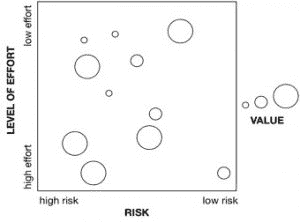
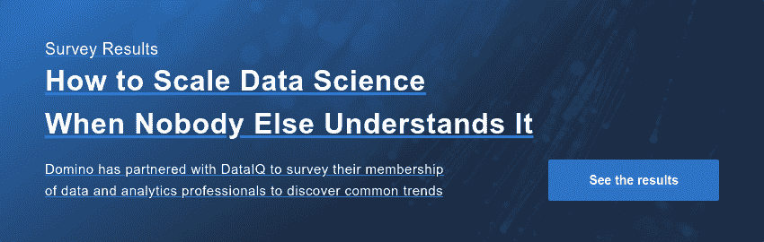

# 数据科学用例

> 原文：<https://www.dominodatalab.com/blog/data-science-use-cases>

*在这篇文章中，[唐·迈纳](https://www.linkedin.com/in/donaldminer/)讲述了如何识别、评估、优先处理和挑选下一步要解决的数据科学问题。*

## 评估数据科学用例的三个阶段

规划下一步要处理的数据科学用例与决定下一步在其他领域处理的用例没有太大区别。在计划任何用例之前，您需要理解您的总体业务策略和目标。然而，在数据科学中进行深思熟虑的规划是非常重要的，因为数据科学带来了其独特的挑战，商业世界仍在努力适应其现有的流程。这些挑战大多源于高风险、不确定的工作需求和多种潜在结果。在这篇文章中，我将分享一些关于如何决定首先或其次处理哪些数据科学用例的想法，这些想法基于我作为数据科学顾问帮助公司(从财富 500 强到初创公司)的成功经验。我喜欢将用例评估和选择过程分成三个阶段，使其更易于管理。我将在这篇文章中深入讨论的三个阶段是:

*   列出您的潜在用例
*   评估每个用例
*   区分用例的优先级

我将在这篇文章中描述的这个过程是为了能够足够灵活地适应你和你的企业所处的任何情况。在你列出、评估和优先化你的[用例](https://www.dominodatalab.com/blog/high-impact-machine-learning-use-cases)之后，你将能够绘制它们。整个过程旨在帮助您做出决策，同时以一种有效的方式与组织的其他成员分享决策。

## 绘制用例:风险与工作量

我的方法来自一些人可能熟悉的规划方法。它使用一个正方形的图表来描绘用例的风险和他们的努力程度，并使用气泡的大小作为值。一般来说，你想做的用例在右上角，是大气泡。不幸的是，对我们来说，通常最高价值的目标是高努力和高风险，所以这是一个决定你可以投入多少努力，你对风险的容忍度是多少，以及你今天需要多少价值的问题。

从一个用例列表到这个数据科学的图表，比一开始看起来更具挑战性，这也是本文的主题。首先，我将谈论构建一个良好的用例列表，然后我将谈论如何度量每个用例的工作量、价值和风险，然后剩下的就是制作我们的图表了！

## 列出您的潜在用例

什么是数据科学用例？通常是假设或者问题。有时它是在寻找一个答案，有时是一个解释，或者有时它只是确认一些事情是真实的。归根结底，这是一个可以用数据来回答的问题。

对于数据科学来说，列出潜在的用例似乎很容易。每个人都有很多想法，但有两个偏见的来源会导致他们留下好的想法。

*   ***偏爱自己亲身了解的事物。*** 没有人能够完全了解整个组织，尤其是在数据方面。有太多的数据需要每个人去了解。
*   ***对人们认为太难或不可能的事情抱有偏见。*** 数据科学中的新技术和方法从根本上改变了什么问题可以回答，但人们被他们的数据库管理员训练成有些问题不应该问。数据科学越来越受欢迎的整个原因是因为一系列新的技术和技巧，它们开辟了解决以前不可能解决的问题的方法——所以让我们利用这一点。

承认这种偏见确实是克服它所需要做的一切，但我确实一次又一次地在刚刚开始数据科学的组织中看到这种偏见。建立一个健康的列表将有助于把所有事情都放在桌面上，让每个人都在同一页面上，并且将让您比较和对比多个不同种类的用例的价值、风险和工作水平。

克服这些偏见的最佳方式是每个人之间的协作交流:数据科学家、遗留系统的 DBA、业务线所有者和最终用户。

每个角色都给画面带来了独特的视角。如果你把列出用例的工作留给任何一个角色，你可能会留下一些好的东西。DBA 可能对计算上不可能解决的“未解决问题”有很好的感觉，比如两个数据集之间的大规模连接，或者“不太适合”数据库技术，比如自然语言处理用例。业务线和最终用户会知道什么是重要的，但需要数据科学家的鼓励，以确认他们想要的是可能的。最终用户可能已经习惯于从他们的数据库管理员那里要求某种类型的查询是不可能的，但是数据科学家现在可以说“是”。

我发现最好的方法是让每个人在一个房间里呆一个小时，在白板上写尽可能多的用例！在本练习结束时，您应该知道每个用例的名称，以及该用例的简短描述。

## 评估用例

对于每一个用例，我们都希望对三个方面有一个好的认识:价值、努力程度和风险。每个用例都有不同的组合。一开始，评估数据科学中的用例对组织来说很难。主要原因是人们认为数据科学项目是软件或 IT 项目，而不是它自己独特的东西。一旦有人开始在 JIRA 制造“数据科学故事”，我会努力让他们停下来。[数据科学项目不是软件或 IT](https://www.dominodatalab.com/resources/field-guide/managing-data-science-projects/) 。

## 数据科学项目与软件工程项目

在软件工程中，你有一个想法，你对你想要构建什么有一个非常好的想法，你知道如何构建它，并且你猜测它需要多长时间。这仍然很难，但是这个项目有一个明确的目标和一条清晰的道路。软件项目因超出预算和延迟而臭名昭著，但如果不认真对待，数据科学可能会更糟。

在数据科学中，你可以在一个用例上工作多久都行。如果你做的时间“不够长”，你的结果会很糟糕。如果你在上面工作“太长时间”，你开始得到递减的回报，并且产出不值得努力。规划数据科学更多的是付出适当的努力，在特定的时间框架内做到最好，而不是达到某种目标。

在练习的这个阶段结束时，您将为每个用例分配一个价值分数，为每个用例分配一个工作量的数量级，以及为每个用例分配一个发生风险的可能性百分比。这些将为您提供构建我之前展示的图表所需的值。

### 价值

数据科学中的价值是通过**科学**从**数据**中获得的**知识**——而不是机器学习或某些应用程序或其他东西。机器学习或应用是我们通过数据科学获得的有价值的知识的应用。知识第一。

因此，要找出数据科学用例的价值，您需要考虑几个问题:

*   从对该用例进行数据科学研究中获得的知识的价值是什么？
*   你将从数据集中学到什么？
*   关于你将要测试的假设，你会学到什么？
*   如果你得到一个好的结果，这些知识的价值是什么？
*   如果你得到一个不好的结果，那知识的价值是什么？

为每个用例考虑所有这些问题，并把它们总结成获得这个特定问题的知识有多有价值的一般意义。

对于不同的人和不同的组织，价值也有不同的含义。一些组织可能更看重公司的价值而不是利润。一些组织处于竞争极其激烈的商业环境中，需要真正拓展有价值的东西。或者在政府组织或慈善组织的情况下，价值可以是非货币的。不管怎样，用例的价值必须考虑组织整体目标的环境。

我更喜欢用 0-10 的线性标度来衡量价值。使用像货币数字这样的东西工作量太大，容易出错。我们只是在寻找一个大概，更重要的是用例之间的相对价值。7 比 6 稍微值钱一点，但是比 2 值钱多了。

### 努力程度

就像我之前说的，在数据科学中，评估工作量确实很有挑战性。数据科学中的评估工作与其说是计算数据科学家的工作时间，不如说是让**了解问题的数量级**。我发现，估算一名数据科学家的时间量级要容易得多，同时还能向组织中的每个人解释获得结果有多难。

以下是我通常使用的“数量级”:

*   ***1 小时。*** 超级简单，我可以通过启动一个 SQL 查询并构建一个快速图表来完成。没有风险。我知道数据摆在那里，结果是可以预测的。如果这里用了机器学习，那是因为我知道数据是有预测性的，只是懒得自己写规则。
*   ***1 天。*** 相当容易，但我想确保我有适当的时间来测试和理解我的结果，建立一些关于结果的合理演示，并可能尝试一两种不同的方法。我有很好的预感，这些数据是有预测性的，或者已经准备好产生这样的结果。我要做的事情几乎没有风险。
*   ***1 周。*** 这种情况越来越严重，但仍处于谱的低端。可能会有一些风险，但如果这个问题无法解决，我会很快弄清楚。我们需要做一些[数据探索](https://www.dominodatalab.com/blog/faster-data-exploration-in-jupyter-through-the-lux-widget)，因为我不确定数据是否完全准备好了，但我很确定是这样的。我应该有一些时间来微调我的结果，提高准确率。
*   ***1 个月。*** 这是我们开始能够探索未知问题的时候，但我们有一种很好的感觉，如果问题是可以解决的，那么它应该很容易解决。我们不知道数据是否准备好了，我们可能需要花一周的时间来收集和整理一些数据。在第一周之后，做一个“检查”并做一个数据探索报告，以便与利益相关者重新同步，并重新估计工作的价值和水平，这可能是好的。我们也不确定哪种方法会奏效。如果有监督的标签不够好，我们可能需要对无监督学习进行某种黑客攻击，或者一种奇特的深度学习方法可能是合适的，但我们不确定会进入这种方法。
*   ***1 季度。*** 这是一个复杂的问题，我们不确定数据中有什么，我们将如何解决它，以及结果会是什么。一个季度应该给你足够的时间来获取数据，克服任何数据挑战，尝试几种方法，以及调整结果，提交报告，并在整个过程中进行分析。
*   ***1 年。*** 这就是事情变得有趣的地方。这是一个需要一些创新的方法来解决的问题。我们会做一些研究，发明新的算法或方法，如果有时间，我们可能会在研究杂志上发表。这越来越冒险，大多数组织没有胃口做这么长的事情。每当我把一个问题放进这个桶里，它几乎意味着你不应该在这个问题上工作，除非这个问题的价值是天文数字或者是你的企业生存的基石。
*   ***一生一世。*** 基本上解决这个问题会是某人一生的工作，是开玩笑的意思。我保留这个标签是为了当有人让我做我认为不可能的事情时。基本上，这个问题的解决方案很可能在解决问题本身上更有价值。

当评估每个用例时，尝试将它们放入其中一个类别。通常，要做到这一点，您需要终端用户或业务线向数据科学家解释他们想要做什么。也许数据科学家可能需要向了解数据的人询问一些问题。最后，数据科学家应该能够给你一个问题数量级的感觉。这就是资深的、更有经验的数据科学家的用武之地，因为他们对这类事情有更好的理解。

### 风险

很多时候，我们渴望仅仅停留在评估某件事情的价值和努力程度上。软件和 IT 项目很多时候没有太多的技术风险，所以我们通常可以忽略它。然而，在数据科学中，在某些情况下很可能出现负面结果，甚至更有可能出现这种情况。我用风险的度量来说明一个事实，即并不是所有的事情都会如我们所愿。

有两个主要方面的风险需要考虑。第一个是，**数据实际上有足够的预测性来找到我们正在寻找的答案的可能性有多大？**如果数据质量差或者问题很难回答，那么风险会更高。第二个是正在使用的技术中的**风险**。如果有一种全新的、未经证实的技术需要用来解决问题(比如深度学习)，那么风险就会增加。或者，如果数据量非常大，我们不确定我们的数据平台能否处理，那么风险就会增加。同样，与衡量价值一样，一名经验丰富的数据科学家或一些外部帮助将在适当评估风险方面发挥很大作用。

我喜欢给风险一个粗略的%分数，它告诉我们整个用例进展顺利的可能性有多大(例如，我们得到了一个有价值的结果)。就像价值的数量级和价值的线性标度一样，这些都有些武断，你应该关注数字的整体意义。例如，50%是一个掷硬币的机会，我们不确定会发生什么。99%意味着我们确信它会成功，但我们会为一些不好的事情发生留有余地。80%意味着我们非常确定会没事，但仍有一些未知的问题需要解决。10%的可能性很小，我们不指望它会起作用，但还是有机会的。

## 确定数据科学用例的优先级

既然我们已经有了一个好的用例列表，并且已经评估了每一个用例的价值、工作量和风险，那么我们现在可以弄清楚要做什么了。

优先级排序可能是三个阶段中最简单的，但是只有当你建立了一个潜在用例的良好列表并且正确地评估它们的时候。基本上，如果您在此之前做得很好，那么应该清楚应该首先处理哪些用例。优先化是考虑每一个潜在用例的价值、努力和风险，并看到哪一个应该首先完成。一般来说，我们应该向高价值、低努力和低风险的方向发展，但不幸的是，对我们来说，这些因素通常是相关的。很多时候，我们需要选择风险来获得一个非常有价值的结果，或者选择一个低努力和低价值的用例来展示一些增量价值和证明一个概念。

有一些显而易见的选择，应该首先处理用例。那些低工作量、高价值和低风险的。这些在正方形的右上角，有一个大泡泡。如果你有这些中的任何一个，先做它们。还有一个显而易见的选择是根本不考虑去做。这些是高努力、低价值和高风险。有时人们只是需要一个了结，并同意不值得花时间。一旦发生这种情况，你可以停止被它分散注意力，专注于更实际的用例。

一旦显而易见的用例被排除，选择首先做哪个用例可能会很复杂，因为这取决于您的个人情况。这取决于你有多厌恶风险，你有多需要一场胜利来证明价值，或者其他几个因素。从处理风险的能力、推动价值的需求以及需要投入多少人力资源来解决这个问题等方面考虑，现在对你的组织来说什么是重要的。

随着时间的推移，你的优先顺序可能会改变，因为你雇佣了更多的人，从高层获得了更多的信心，或者愿意承担更多的风险，所以要经常进行重新评估！

### 结论

我希望通过阅读这篇文章，你已经了解到，无论有没有我的特定过程，都有可能理性地思考接下来要解决哪些数据科学用例。归根结底，我认为任何好的流程都会做到以下几点:

*   尝试在列出潜在用例时消除偏见。敢于对你曾经认为不可能的事情说“是”。
*   不仅要评估用例的价值和努力程度，还要评估风险程度。
*   对自己诚实，你的组织的优先事项是什么，并调整你在风险和人力方面的限制，以及你需要从某事中获得多少价值。

