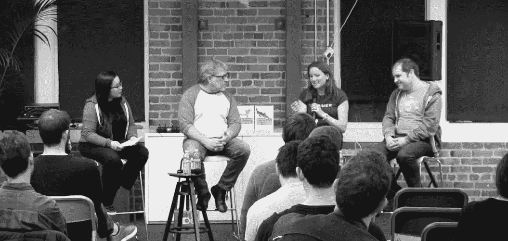

# 数据科学与工程:紧张点

> 原文：<https://www.dominodatalab.com/blog/data-science-vs-engineering-tension-points>

*这篇博文提供了亮点和来自专家组的完整文字记录，“[数据科学与工程:真的必须这样吗？](https://www.eventbrite.com/e/data-science-versus-engineering-does-it-really-have-to-be-this-way-tickets-50454045408)”与[艾米·海尼克](https://twitter.com/aheineike/status/1060944102429097984)、[帕科·内森](https://twitter.com/pacoid)和[皮特·沃顿](https://twitter.com/petewarden)在多米诺总部。讨论的主题包括围绕构建和部署模型的协作的当前状态、可能出现的紧张点，以及如何解决这些紧张点的实用建议。*

## 介绍

[最近](https://www.eventbrite.com/e/data-science-versus-engineering-does-it-really-have-to-be-this-way-tickets-50454045408)，我有机会主持了一个名为“[数据科学与工程:真的必须这样吗？](https://www.eventbrite.com/e/data-science-versus-engineering-does-it-really-have-to-be-this-way-tickets-50454045408)与[艾米·海内克](https://twitter.com/aheineike/status/1060944102429097984)、[帕科·内森](https://twitter.com/pacoid)和[皮特·沃顿](https://twitter.com/petewarden)在[多米诺总部](https://www.dominodatalab.com/careers/?utm_source=blog&utm_medium=post&utm_campaign=)。作为 Domino 的内容负责人，我的责任是确保我们的内容提供高度的价值、密度和分析严谨性，从而从多个角度激发出令人尊敬的坦诚的公共话语。直接应对挑战的演讲，包括未解决的高风险问题。也是为了帮助加速数据科学工作。

数据科学和工程之间的合作只是我在 Domino 任职期间以及之前在 O'Reilly Media 担任数据科学和数据工程方面的数据编辑期间听到的故事之一。正是在这个先前的角色中，我第一次见到了杰出的小组成员，他们友好地拨出最近的[周四晚上](https://www.eventbrite.com/e/data-science-versus-engineering-does-it-really-have-to-be-this-way-tickets-50454045408)来讨论在构建和部署模型时关于协作的不同观点。小组讨论中坦诚讨论的几个主题包括出现的潜在紧张点、解决紧张点的问题以及对潜在未来状态的乐观思考。这篇博客文章涵盖了小组讨论的要点以及一份完整的文字记录。[关于此主题的其他内容](https://blog.dominodatalab.com/collaboration-data-science-data-engineering-true-false/)已经发布，其他行业专家也将发布更多内容。

## 视角:围绕构建和部署模型的协作的当前状态

每位小组成员都在工程、数据科学、机器学习和研究领域拥有丰富的行业经验。我们从他们现在所看到的，以他们自己目前的状态开始讨论，为晚上的讨论提供一个基准。这也有助于我们每个人了解关键差异和观点，以便让我们所有投资于数据科学的人能够相互学习。

Amy Heineike 转述说，在她大约 55 人的初创公司 Primer

“我们最终引进了能够沟通数据科学和工程的人。我们将这个团队称为“产品工程”，其中包括知道如何构建机器学习模型、知道如何进行数据科学、有一点产品直觉以及知道如何将东西投入生产的人。”

皮特·沃顿赞同这一观点，并补充说

“当我和 Amy 早些时候就这个问题聊天时，我们讨论了全栈机器学习的想法。因为我也看到了，如果你没有最终用户体验的所有权，你最终只会构建学术模型，这些模型对于在 ImageNet 之类的东西中获取指标非常有用，但你不会学习所有你需要学习的东西，以将其转化为最终用户的真正有效的模型。拥有产品和研究技能的结合；这是一种超能力。你实际上能够以一种方式将产品提供给人们，这种方式是许多理论上不知道机器学习的团队，如果他们没有这种经验，可能会很难做到的。试图鼓励人们真正掌控整个过程非常重要。”

Paco Nathan 根据他对各公司的建议和 T2 在奥莱利地层和人工智能会议上的工作，看到了广泛的模型开发工作流程，他指出

“我可能会从另一个角度看问题，因为就像你说的，我认为这些都是很好的例子。我将从与我交谈过的许多公司和案例研究中了解一些观点，在企业内部，数据科学和数据工程团队之间存在很大的分歧。它们几乎是孤立的。好像一年前，我会听到这样的争论，比如说，数据科学团队中想使用 Python 或 R 的人和数据工程团队中想用 Java 重新编码的人之间的争论。这种情况已经持续了很长时间。我相信这种情况已经改变，我们正在看到一个大的上升，例如，Jupyter 正在被用于公平和乏味的环境中，并弥合了多语言之间的差距，我认为 Arrow 和其他人可能也对此有所贡献……我希望筒仓正在倒塌。”

尽管在开发和部署模型的过程中存在一些影响协作的细微差别，有趣的是，主人翁意识是一个共同的主题。不管模型开发是在一个新公司还是一个更大的组织。然而，这种对工作和成果的拥有感可能会导致跨职能的协作团队或筒仓。组织以不同的方式团结在协作周围，与构建和部署模型相关的大量工作可能会导致潜在的紧张点，团队需要解决这些问题。

## 张力点

在讨论了协作的当前状态之后，讨论转变为坦率地识别在开发和部署模型时出现的潜在紧张点。确定具体的紧张点以及潜在的“为什么？”在它们的背后，让我们所有数据科学领域的人都可以迭代和解决问题的方法，以解决紧张点。讨论中出现的潜在紧张点包括围绕模型开发的“大量工作”、不同技术的组织需求、不一致的期望以及缺乏可重复性。

喜力指出，有一个

“构建一个数据驱动的产品需要大量的工作……其中一小部分是构建机器学习模型。整个管道的其余部分是广阔的....它包括“我们如何定义我们实际上试图解决的问题？“，”我们将要运行的原始数据是什么？“我该如何清洗和准备呢？“，”我可以使用什么标记的数据来训练算法？我需要带一组人来做标记吗？我需要建立什么工具来实现它们？“所有那些东西。然后，有很多关于“这个模型如何适应我的整个应用程序和代码库”的问题。然后输出它“；”它属于用户体验的哪一部分？我需要展示什么东西，以便人们理解模型的输出，使它可以被解释？“这整个宇宙的东西并不是在构建模型，而是与构建模型密切相关。这是一个技术性和挑战性的问题。我认为思考谁对这些不同的部分负责是有用的。….我认为，如果你的团队视野非常狭窄，只对那块馅饼的一部分感到兴奋，并认为完成其余部分是其他人的工作……或者，如果你处于这样一种情况，他们不能接触其余部分，因为这是其他人的工作，他们不被允许进入，也许有一个他们不能接触的不同的代码库，这似乎将成为紧张局势的来源。”

Nathan 为工作量、需求和“为什么”提供了另一种视角在企业内部出现的潜在孤岛和紧张点背后

“这种跨团队是多学科的。这是正确的道路。我在企业中看到的另一个方向是，可能有一个根深蒂固的现任团队在做商业智能，并且已经做了很多年，他们拥有自己的数据仓库。一些团队尝试不同的技术，显然他们要做的是创建一个不同的团队，给他们不同的角色，不同的名字。然后你在同一个组织里有竞争的团队。现在，我们正在引入更多的学习和令人兴奋的事情，这些事情超出了企业中的数据科学家正在做的事情的范围。所以，现在他们为机器学习工程师引入了一个新的角色，有了一个新的团队，它将分成两部分。我认为这是企业中出现的一种紧张关系，但另一方面，由于合规性问题，组织选择孤立 it 是有原因的。在金融领域的一些地方，我们看到可能有一个团队处理数据并开发模型，他们必须将这些模型交给另一个团队进行审计。实际上，不同的人在它进入生产之前会查看它，他们会给团队设置防火墙，这样他们就不能一起工作了。这在某种程度上破坏了跨学科的东西，但这正是我们努力解决合规性问题的方式。”

在讨论过程中，我指出，在我之前担任 O'Reilly 的数据编辑时，我听到了许多最近毕业的数据科学家的故事，他们在比较他们在学术界的工作和他们在行业内的预期工作时遇到了紧张点。然后我询问小组，他们是否仍然看到不一致期望的例子，

典狱长:“我想，我们谈到了安德烈·卡帕西，他的滑球很棒。他是特斯拉的人工智能主管。他有一张他攻读博士学位时的幻灯片。他只是在展示他的饼状图...他 90%的时间都在考虑模型，10%的时间在考虑数据。他有这个图表，现在他在工业界，他花 80%的时间思考数据，纯粹是因为在学术环境中，数据集是给定的。你试图将你的结果与其他人进行比较，所以你必须在数据集和如何保持稳定上达成一致。然而，在这个行业的大部分时间里，你实际上可以通过更新、改进、改变你的数据集、改变标签来进行改进，这可能会对系统产生真正的冲击，因为这是一种完全不同的技能，在学术界很难掌握。我认为这是最大的冲击之一。”

***海尼克:**“对，没错。我认为这又回到了一个问题，要实现一个数据驱动的产品，需要预先做大量的工作。我想，我们以前谈过。有几个人已经成功地扮演了一个角色，他们真的花了所有的时间去思考更多的模型架构。只有少数人能做到这一点，我认为只有少数几个问题让人们超级专注地制作这些模型，但我认为大多数正在做的工作需要这种子问题的参与广度。我认为它们非常有趣，但它们与人们期待的不同。”*

这导致了关于可复制性或缺乏可复制性的讨论，这是学术界、整个科学界和行业内的一个紧张点

内森:“因为我相信你们很多人已经看过了，但是现在有一场关于科学中可重复性的大讨论。我们从这个数据和分析过程中开发的一些工具现在正在反馈到更传统的科学研究中，以帮助使研究报告更具可重复性。有一场对话，是关于我们如何不仅在科学中，而且在企业和行业中实现这一点，以使整个组织的结果具有可重复性，这样你就不会对你看到的结果争论不休。”

***典狱长:**“在再现性方面重复一下....对于现有的许多机器学习论文来说，这也是一个巨大的挑战。我想，如果你拿起一张机器学习的纸，试着从阅读开始，实际上复制结果，这通常会非常非常棘手。有时候，即使对谷歌内部的人来说，这也很棘手。我们也有自己的重复性问题，在机器学习方面，我们需要真正改进工具，提高期望值。挑战的一部分是，这些论文中的一些，数据集很难得到。所以，这确实阻碍了我们的许多尝试。”*

虽然完全有可能花整整一个小时的小组讨论来确定潜在的紧张点，但我们将讨论转移到了迭代和解决问题的方法上，以解决紧张点。

## 解决紧张点的实用建议

当迭代和解决问题的方法来解决与围绕构建和部署模型的协作相关的紧张点时，出现了许多主题。一个主题包括考虑心态的转变。心态的转变包括拥有一种主人翁意识，对子问题产生“好奇心”,并考虑采取“不断学习”的观点。另一个主题包括通过配对、产品原型(即“Ozzing 向导”)、技术讲座/每周研讨会和组织文化期望来建立或强化不同职能角色之间的沟通渠道。通过跨职能工作或交叉培训努力实现跨学科理解也是出现的另一个主题。

## 所有权

关于主人翁意识，海涅克指出

“如果你对自己所负责的事情有一个非常开阔的视野，如果你对许多难题感到好奇，并且在你看来，如果你拥有许多难题的所有权，...因此，如果你的最终目标是“我想建造并发布一些有趣的东西”，这就消除了一些紧张感。

典狱长还表示

“当你有一个围绕一组需求团结一致的团队，每个人都沉浸在所有这些需求中，你会从中获得非常惊人的结果。这是紧张的反义词，但对一切就绪的团队来说，这是一个很好的对比。”

## 好奇心和学习心态

完全透明，所有小组成员在小组会议开始前会面，就紧张点的协作和问题解决进行初步讨论。考虑“好奇”或“对问题空间好奇”最初是由 Heineike 提出的，当时所有的小组成员都表示兴奋。这让我询问海尼克，请他在面板上解释一下:

海涅克:“我真正喜欢的一件事是意识到从工程的角度看这些问题有多少种不同的方式；数学，机器学习镜头或 UX 镜头，并让它在 Primer 上工作。我们四年前就开始了。我们四个人在一个房间里，两台坏掉的电脑，不知何故现在我们有 55 个人了。我环顾房间，看到所有这些人都有深厚的技能，所有这些不同的领域，实际上，非常兼收并蓄，不同类型的背景。只是看到所有这些汇集在一起，并意识到当你回头看时，天体物理学家花了一年时间来优化这一点，工程师花了一年时间在百老汇上，然后她回到大师赛去思考语言的一代。这需要所有这些兼收并蓄的人走到一起去做。”….“我认为，当我们进入问题时，如果你能真正接受存在子问题的事实，一些很大的子问题，如果你能以此为乐，那么我认为你有一个非常伟大、快乐的职业生涯在你面前。我认为归根结底就是这样。这里有一个折衷的作品....我们实际上在 Primer 团队中有相当多的计算科学家，Anna 是计算化学工作的博士[指向观众]，这些人对算法感兴趣是因为他们想帮助解决一个问题。我认为，如果你把用户问题看作是需要解决的有趣的事情，如果你发现自己走在所有这些不同的道路上，有一段时间你沉浸在 UX，你会想，“哦，用户是如何看待机器学习输出的。“也许他们不像我理解他们那样理解他们，他们已经在这个模型上钻研了很长时间，并且已经解决了这个问题。或者，你突然发现你自己被桥接了，所以我们有你包装的文件，编码，贴在服务器上很快。你对这些作品越好奇，我觉得这很有趣。你可以让不同的人聚在一起，一起工作，一起娱乐。”

Nathan 讲述了他在为数据科学团队招聘时寻找的好奇心是一种怎样的品质:

“只是其中的一个片段....[为数据科学团队](https://www.dominodatalab.com/resources/field-guide/hiring-data-science-teams)招聘员工，这一直是我们招聘员工时做得更好的事情....是去特别是物理科学或物理工程领域，雇佣那些在某个领域的人，比如航空/航天，或者我雇佣了很多物理领域之外的人。因为他们有很多天生的好奇心。现在也有很多很好的方法让硬科学....我们在数据科学中看到的....正在帮助通知对方……”

进入一种学习的心态也与“好奇”有关，和海涅克有关

“我认为在这个行业里，一切都在不断变化，唯一不变的是感觉你不知道自己在做什么。你必须不断学习。我觉得每六个月我都会做一次总结，并意识到有一些我不知道如何去做的巨大的新事物要学。通常在关键时刻，你会说，“好吧。我明白了。“我认为如果你能接受这一点，”好吧，我会一直学习，我会做一些新的事情，这没关系。“也意识到其他人都在那条船上。会有一些你知道的事情，也会有一堆你不知道的事情。如果你能谦虚地说，“实际上我不知道你在说什么。“当他们告诉你他们非常兴奋的事情，而你在等待解释，这样你们可以很快地互相学习。我认为这是真正的关键。”

## 沟通

在解决面向协作的紧张点时，建立和强化沟通渠道非常重要。几个可行的执行方法包括配对、产品原型(即“Ozzing 向导”)、技术讲座/每周研讨会和组织文化期望。

喜力建议配对作为解决紧张点的一种方式

*“我们发现 Primer 的一个很好的做法是，在产品团队中，数据科学家、工程师和产品经理都在一个团队中。他们将每天相互交流，直接对话。我想可能会有一些组织方面的东西可以帮助你....所以你们坐在一起，这是件好事。实际上你只需要多说一点。您希望数据科学家不要害怕去阅读应用程序的代码，然后开始询问关于它的问题，并开始解释他们遇到的问题。然后，工程师将询问有关数据科学部分的问题，以及它们所依赖的是什么。然后让对话继续下去。”*

沃顿建议对合作持积极开放态度

*....我喜欢把类似“嘿，这是我的简单语音识别工具”的东西放在一起，所有的基础设施就像“嘿，这是我创建的数据集，这是我创建的一些指标”，然后就把它放在那里。当知道人们比我更关注模型时，他们的眼睛会亮起来，他们会说“啊，我们可以做得比这更好。“他们不必担心数据清理的所有棘手问题。数据收集，以及所有其他的东西。这是一种很好的激励方式。”*

沃顿还建议进行一次产品原型的练习，或“Ozzing 向导”，以帮助建立和强化沟通渠道:

“这有点不同，但我最喜欢的方法之一，尤其是当我们是一个小团队时，实际上产品原型是一种叫做 Ozzing 向导的东西，在那里你实际上有一个人在幕后而不是一个瓶子。另一端的东西，比如，聊天，或者你知道，谁得到了像一个屏幕截图，但实际上并没有进入。所以人们...根据他们在屏幕上看到的实际情况，基本上必须假装是模特。这就像是一个非常有趣的派对游戏。但它真的，就像你在实际产品上得到的迭代。因为通常情况下，产品团队或产品人员(如果是一家初创公司)不会真正理解他们必须考虑的所有问题，也不会像机器学习解决方案那样在头脑中建模。如果你能告诉他们，即使是一个在这个世界上活了 25 年的人，也不能用他们得到的信息解决这个问题，那么我们很可能无法训练一个模型来做到这一点。”

沃登还建议清楚地阐明这项工作对研究人员的回报和影响

“我看到的最鼓舞研究人员的事情之一是，人们非常清楚他们需要研究人员正在研究的东西，实际上给他们指明方向，并说，“看，如果你能解决这个问题，这将是一件非常重要的事情。“一个例子是，我在我的一些微控制器上做了很多工作，并喜欢尝试做一些非常小的负足迹设备。为了在上面进行图像识别，你只能使用 250 千字节的内存...你没有太多的空间。我真的很关心，“好吧，那么小的图像网络能有多好？一些研究人员在内部会说，“哦，是的，我确实想过用这样的东西来玩，但是我不知道是否有人会真的使用它，所以我不打算发表它。但这是我的结果。嘿，你想合作什么的吗？”这是满袋的另一面。不一定要把这整件事都强加给研究人员。也许我与之交流和交谈的只是研究人员，他们实际上愿意和我交谈。他们真的很兴奋听到他们的研究可以被使用的方法，并得到关于方向的想法，他们应该思考的重要的未解决的问题。这真的让他们的一天，当你喜欢，“哦，我们实际上采取了这一点，我们认为它很有趣，我们打开它，我们这样使用它。你的工作确实有所作为。你不仅仅是一个 PDF 创建者。”

Nathan 深入探讨了每周一次的研讨会或技术讲座如何成为解决协作紧张点的潜在解决方案

*“在一家规模较大的公司，比如 170 人，我们会把不同的数据科学家分配到不同的产品团队。但是我们想从那些不经常互相交谈或者看不到他们的项目的人们那里得到更多的反馈。所以我们做了每周一次的研讨会，我们会邀请利益相关者。我们会邀请财务负责人来听听。我们会要求人们不要在许多试探性的问题上过于咄咄逼人，但有点像，你可以参与，但不要试图让他们为难，因为我们真的想在这里分享。他们让我们开的更像是研究生研讨会。总体来说效果不错。通过这种方式，团队之间有很多很好的反馈。”*

内森还指出了组织文化期望是如何帮助像网飞这样的公司的

“我喜欢的另一个很好的例子是网飞的数据基础设施。米歇尔·乌福德是这方面的领导者之一。我想我们在 JupyterCon 就此进行了辩论。真正打动我的是米歇尔真正强调了文化对于解决这类问题的重要性。我认为这是我们在小组中讨论的广泛范围...他们的例子是，团队想出了某种文化方式来解决问题，并让很多人一起工作。我认为，尝试通过角色来发现这一点，或者清单是什么？我认为你真的需要在文化上传播这一点。”

Nathan 还指出，监管环境通常对合作有文化期望

“我认为这个行业有一个有趣的趋势，高度监管的环境有如此多的要求，但他们也有如此多的需要去尝试和完成一些事情，这成为一个明确的要求。 *我们在情报界、金融、医疗保健以及对隐私进行外部控制的地方看到了这一点。但是我们在开源领域看到了更多有趣的发展。一年前我绝不会想到这一点。但它正在发生。”*

## 交叉训练

在之前关于当前状态的对话中，Heineike 和 Warden 都提到自己是多学科跨职能团队的一员，或者目前正处于多学科跨职能团队中，而 Nathan 则提到了企业内部有意识的交叉培训是如何有效解决以协作为导向的紧张点的:

“我看到的一个建议是多做交叉训练。一个我可以参考的好例子...Richa Khandelwal 是波特兰耐克公司数据工程经理之一。她在 OSCON 大学做了一个非常棒的演讲，讲述了他们如何让数据工程团队的人参加数据科学训练营，以便他们能够体会到与数据科学家一起工作意味着什么，反之亦然。他们把一个团队的人带到另一个团队进行交叉训练。我认为这是一个很好的方法，可以打破一些障碍，也可以设定期望值，并有望让人们拥有更多筹码。”

这些只是解决紧张点的一些建议。如果感兴趣，在这篇博文的完整文字记录部分有更多的见解。

## 你希望未来的状态是什么样的？

在花了大部分时间反复讨论面向协作的紧张点的识别和问题解决之后。我们讨论了潜在的未来状态，结束了小组讨论。或者他们希望未来的国家是什么样子。毫不奇怪，尽管扮演着不同的角色，但每个小组成员对数据科学未来的希望都有相似之处。每个小组成员都提到了好奇心，并提供了额外的见解。

***海涅克:**“…当数据科学第一次被创造出来的时候，它正在成为一种东西。有很多人最终认同了这个术语。来自各种背景的人，因为对一些数据集好奇而走进来。我认为随着该领域的成熟，这有点有趣，因为你可以参加这些正式的项目，有很多人参加机器学习项目和计算机科学系。我很好奇这将如何发展。我们看到这个领域正在走向成熟，人们可以遵循一些更清晰的路径。从某种意义上说，这意味着人们进来时背景的缩小。另一方面，你有所有这些可用的工具、模型和方法，让真正广泛的人群参与进来，带来不同的观点。我真的希望我们能保持这种多样性，并利用这些工具的存在，这很好，而不是最终走上这样一条道路，即每个人都必须通过相同的项目和相同的公司，只有一条道路，这样我们就可以保持一些创造力。”*

内森:“我喜欢好奇心这部分。你认为你要去法学院并成为一名执业律师，你的职业就是持怀疑态度。我们需要另一种被认为是好奇的职业。他们可以互相制衡。我喜欢调查，我们做了很多调查，我看到一些有趣的谈话，关于人们做关于雇佣数据科学家的故事，以及分析数据需要什么。TapRecruit 已经做了很多这样的工作。他们发现一件有趣的事情是，寻找“高级数据科学家”的角色实际上不如试图让某人担任“数据科学家”的角色。因此，你会看到那些出色的环境科学家、天体物理学家或诸如此类的人转而申请后者。然后，尝试看看对初级数据科学家的要求真的很有趣，因为它们切入了基本的特质，比如好奇心，比如愿意花 80%的时间清理数据。我认为，我更愿意少关注高层，而更多地关注未来的发展道路和那里的特点。”

典狱长:“我也很喜欢好奇心这个主意。我在 Jetpac 花费大量时间试图寻找优秀的旅行照片，并试图浏览数十亿张 Instagram 照片、脸书照片和 Flickr 照片，以找到某个特定地方的完美照片的原因之一。我们做了一些事情，比如通过识别人们脸上的胡子来寻找潮人经常出没的地方，诸如此类。但是我意识到，我们团队中的一些人比程序员更善于找出指导应该是什么。但是他们必须通过我们给我们需求，让我们建立模型。我最自豪的事情之一...我能够建立一个系统，在一个预先训练好的图像分类器上进行转移学习，我们的营销人员可以给它 100 张照片，分为 10 个不同的类别，它实际上会学习识别，比如，“哦，你想在照片中识别狗吗？给它一堆有狗在的照片，一堆没有狗的照片就行了。“没有任何程序员的干预，他们可以在应用程序中部署并创建自己的模型。我真正希望的是，我可以帮助自己摆脱程序员的工作。我们有这种非常奇怪的结构，我们有懂得如何用这种非常神秘的语言写规则的神职人员。我们必须尽量减少这些琐事，以便能够与计算机对话。如果我们能改变一些事情，这样任何能给出一堆例子的人都可以选择正确的模型，然后给它一堆例子，得到一些像样的东西，然后快速迭代，这就是我未来真正兴奋的事情。我也是这么想的。我希望它能在整个组织中扩散，而不是如此孤立和条块分割。我有点希望 web 服务像 21 世纪初一样在企业中兴起。人们只需启动一个 web 服务器，其他人将在内部网内访问它，it 部门根本不参与。他们(它)变得非常恼火，然后他们不得不最终放弃，让人们去做。我有点希望机器学习成为销售、营销、支持和其他人都能轻松掌握并解决问题的东西。”

## 结论

数据科学和工程之间的协作是一个众所周知的挑战。这一挑战有可能阻碍创新，阻碍数据科学工作的加速。在数据科学领域，我们是否应该耸耸肩，说“*事情就是这样。*”或者说“*这是一个太难解决的问题。我宁愿去解决别的事情。”*然而，数据科学不正是基于解决以前无法解决的问题的理念吗？我从杰出的数据科学家和杰出的工程师那里听到了很多关于他们在开发和部署模型的合作中遇到挫折的故事。这不是一个不可克服的问题。例如，小组成员友好地提供了不同的见解来帮助解决这个问题。从我的角度来看，在这个问题上，缺乏从多个角度进行深入分析的严格公共话语。具体来说，分析严谨的话语是基于互相帮助和利用彼此想法的意图。主持该小组并提供来自多位行业专家[的其他](https://blog.dominodatalab.com/tag/data-science-and-data-engineering-alignment/)[见解](https://blog.dominodatalab.com/collaboration-data-science-data-engineering-true-false/)的目的是积极参与公共讨论，并致力于解决以协作为导向的紧张点。如果你有兴趣参与这次公开演讲，请随时联系我。

## 完整抄本

这部分提供了小组讨论的完整记录。为便于阅读，对文本进行了编辑。

安·斯潘塞，你好。非常感谢你和我们共度良宵。感谢您抽出时间，我还要特别感谢我们的小组成员。我叫安·斯潘塞，是达美乐的内容主管。Domino 是一个数据科学平台，致力于加速数据科学工作。我的责任是确保我们的内容反映我们的核心价值观之一。我们的核心价值观之一是寻求真理，讲真话。对我们来说极其重要的是，我们的内容注入了这种价值观，并且贯穿始终。因为我们的内容旨在提供高水平的价值，并引发关于如何推动数据科学发展的对话，真正诚实、坦率、尊重的对话。在前世，我是 O'Reilly Media 的数据编辑，专注于数据科学和数据工程，这就是我如何认识这些小组成员的。在过去的生活中，我与他们合作，我非常感谢今天我在 Domino 的当前角色，我可以继续与他们合作，并受到他们的启发。如果你们每个人能花点时间向观众介绍一下自己，我会很高兴的。

帕科·内森，德文:大家好，我叫帕科。帕科·内森。我在塞瓦斯托波尔的德文公司工作。直到最近，我还一直为奥赖利工作。我的背景是机器学习，并在该行业领导数据团队多年。然后我去了一段时间，成为 Apache Spark 的开源传道者。主要是我一直在和 Strata Data 大会和 AI 大会合作；世界各地的会议。我真的喜欢尝试鸟瞰这个行业正在发生的事情，并与许多不同的团队交谈，了解他们在做什么。

艾米·海尼克，Primer :大家好，我是艾米·海尼克，Primer 的产品工程副总裁。我的背景是数学，最初是一名数据科学家。我之前就在思考这个问题，我作为数学家的背景引导我进入 Quid，然后是 Primer，这是四年前开始的。我们正在建造可以读写文本的机器，包括大型语料库和非结构化数据，将见解汇总成有用的报告。

皮特·沃顿，谷歌:我是皮特·沃顿。TensorFlow 移动嵌入式方面的技术领导者和我有一家名为 JetPac 的初创公司，大约四年前被谷歌收购。我真的很喜欢 TensorFlow，我可以和很多谷歌团队以及很多外部团队一起工作，他们有各种非常有趣的数据问题，我可以学到各种东西，偶尔还可以帮助他们。

安·斯潘塞:非常感谢你们的自我介绍。所以，今晚小组的主题是关于合作。特别是在开发和部署模型上的协作。我们今晚谈话的结构；我们将从围绕模型开发和部署的当前协作状态开始。然后我们会稍微讨论一下潜在的未来状态，或者人们希望的未来状态。然后我们将向观众提问。只是一件家务事，我确实要求，如果你决定提出一个问题，如果你的问题能够一口气说完，并以一个问题结束，那就太好了。我觉得这对观众来说不成问题，但我想我们都经历过。此外，我们将在明天结束对拉科西娜的捐赠和抽奖活动，让每个人都有机会捐赠。我非常感谢我们迄今为止已经为 La Cocina 筹集了数百美元，如果您想参加抽奖赢取 Strata 的青铜级通行证，请在活动结束后自由活动。让我们从围绕模型开发和模型部署的当前协作状态的讨论开始。根据小组中每个人在数据科学和工程方面的丰富经验，您对当前状态有什么看法？

**Amy Heineike:** 我们在 Primer 所做的其中一件事，我们已经谈了很多次[向 Pete Warden 做了手势]，就是我们最终引进了能够沟通数据科学和工程的人。我们将这个团队称为“产品工程”，其中包括知道如何构建机器学习模型、知道如何进行数据科学、有一点产品直觉以及知道如何将东西投入生产的人。我认为对我们来说，我们真正考虑的是如何让团队(个人或分享他们技能的个人组成的小团队)能够解决有趣的数据问题，然后实际发布该功能，这实际上是一个非常简单的过程。我们有能力做出贡献，这真的很有趣，实际上也很自由。我应该说，这里有几个来自 Primer 的人。我们现在正在疯狂招聘，他们超级聪明，和他们聊天真的很有趣，如果你对任何事情都感兴趣，你应该在之后和他们聊天。

**Pete Warden:** 我想你之前提到过全栈机器学习。

艾米·海涅克:我确实说过，是的。

**Pete Warden:** 这是我和 Amy 早些时候讨论这个问题时非常喜欢的一个阶段，是关于全栈机器学习的想法。因为我也看到了，如果你没有最终用户体验的所有权，你最终只会构建学术模型，这些模型对于在 ImageNet 之类的东西中获取指标非常有用，但你不会学习所有你需要学习的东西，以将其转化为最终用户的真正有效的模型。拥有产品和研究技能的结合；这是一种超能力。你实际上能够以一种方式将产品提供给人们，这种方式是许多理论上不知道机器学习的团队，如果他们没有这种经验，可能会很难做到的。试图鼓励人们真正掌控整个过程非常重要。

Paco Nathan: 我可能会从另一个角度来看，因为就像你说的，我认为这些都是很好的例子。我将从与我交谈过的许多公司和案例研究中了解一些观点，在企业内部，数据科学和数据工程团队之间存在很大的分歧。它们几乎是孤立的。好像一年前，我会听到这样的争论，比如说，数据科学团队中想做 Python 或 R 的人和数据工程团队中想用 Java 重新编码的人之间的争论。这种情况已经持续了很长时间。我相信这种情况已经改变了，我们正在看到一个大的上升，例如，Jupyter 正在被用于公平和乏味的环境中，并弥合了多语言的差距，我认为 Arrow 和其他人可能也对此有所贡献。我希望筒仓正在倒塌。

**安·斯潘塞:**说到筒仓，听起来筒仓肯定存在潜在的协作紧张点。你愿意就此谈一谈吗？

艾米·海尼克:当然。我们真正学到的一件事是，如果你考虑构建一个数据产品…这是假设数据中会出现一些有趣的东西…构建一个数据驱动的产品需要大量的工作…其中一小部分是构建机器学习模型。整个管道的其余部分是广阔的....它包括“我们如何定义我们实际上试图解决的问题？”“我们将要运行的原始数据是什么？”“我该如何清洗和准备？”，“我可以使用哪些带标签的数据来训练算法？我是否必须引入一个团队来做标记，我需要构建什么工具来支持他们？”所有这些东西。然后，还有所有这些关于“这个模型如何适应我的整个应用程序和代码库？然后是它的输出它属于用户体验的哪一部分？我需要展示什么东西，以便人们理解模型的输出，使它可以被解释？“这整个宇宙的东西并不是在构建模型，而是与构建模型密切相关。这是一个技术性和挑战性的问题。我认为思考谁对这些不同的部分负责是有用的。…."我认为，如果你的团队视野非常狭窄，只对那块馅饼的一部分感兴趣，并认为完成其余部分是其他人的工作……或者，如果你处于这样一种情况，他们不能接触其余部分，因为这是其他人的工作，他们不被允许进入，也许有一个不同的代码库，他们不能接触，这似乎将是紧张局势的来源。我觉得光是反思他们就很有意思。思考这种广泛的问题和技能，这些都是整合一些东西所需要的。很有意思。我真正喜欢的一件事是意识到从工程的角度看这些问题有多少种不同的方式；数学，机器学习镜头或 UX 镜头，并让它在 Primer 上工作。我们四年前就开始了。我们四个人在一个房间里，两台坏掉的电脑，不知何故现在我们有 55 个人了。我环顾房间，看到所有这些人都有深厚的技能，所有这些不同的领域，实际上，非常兼收并蓄，不同类型的背景。只是看到所有这些汇集在一起，并意识到当你回头看时，天体物理学家花了一年时间来优化这一点，工程师花了一年时间在百老汇上，然后她回到大师赛去思考语言的一代。这需要所有这些兼收并蓄的人走到一起去做。

**Pete Warden:** 这实际上让我想到了我在谷歌认识的许多成功团队，即移动视觉团队，以及他们所做的工作；他们是开发 MobileNet 的团队，MobileNet 是业界领先的模型之一，实际上在非常非常小的空间内进行图像识别和图像分类，因此非常适合移动应用程序。但是他们的方法真正有趣的是他们是这样的...再次回到全堆栈的想法，他们有安德鲁·霍华德，他是提出这种真正突破性架构的人，他的驱动力是“嘿，我们需要尽可能精确、尽可能小和尽可能快的东西”。所以，相对工程权衡。但是他实际上是和收集新奇数据的团队坐在一起工作。他们实际上在试图找出更好的标注数据的方法，想出去除不正确标签的方法，获得更多数据，并找出他们何时需要更多数据。在同一个团队里，他和 Benoit Jacob 以及其他一些人一起工作，他们正在做这些低级的组装优化，以使这个东西在手机上运行得非常非常快。他们正在做所有这些 ARM NEON 工作，这实际上反馈到模型的设计中，因为他们喜欢，“嘿，如果这一层中有 8 的倍数，这意味着我的汇编例程实际上可以运行得更快一些”。另一方面，如果他们可以通过包括训练数据或填写标签来使模型更加准确，那么这意味着他们可以将准确性保持在同一水平，缩小模型，并看到准确性从更高的水平下降，因此他们可以通过改善数据集的标签来改善延迟。当你有一个围绕一组需求而统一的团队，并且每个人都沉浸在所有这些需求中时，你会从中获得非常惊人的结果。这是紧张的对立面，但对一切都准备好的团队来说，这是一个很好的对比。

Paco Nathan: 这种跨领域团队是多学科的。这是正确的道路。我在企业中看到的另一个方向是，可能有一个根深蒂固的现任团队在做商业智能，并且已经做了很多年，他们拥有自己的数据仓库。一些团队尝试不同的技术，显然他们要做的是创建一个不同的团队，给他们不同的角色，不同的名字。然后你在同一个组织里有竞争的团队。现在，我们正在引入更多的学习和令人兴奋的事情，这些事情超出了企业中的数据科学家正在做的事情的范围。所以，现在他们为机器学习工程师引入了一个新的角色，有了一个新的团队，它将分成两部分。我认为这是企业中出现的一种紧张关系，但另一方面，由于合规性问题，组织选择孤立 it 是有原因的。在金融领域的一些地方，我们看到可能有一个团队处理数据并开发模型，他们必须将这些模型交给另一个团队进行审计。实际上，不同的人在它进入生产之前会查看它，他们会给团队设置防火墙，这样他们就不能一起工作了。这在某种程度上破坏了跨学科的东西，但这正是我们努力应对合规性的方式。

**安·斯潘塞:**我想稍微解释一下这种紧张感，我记得几年前我在 O'Reilly 做数据编辑的时候，我记得当时有许多数据科学家来找我，他们表示他们刚刚获得博士学位，他们刚刚开始工作，有一段时间因为错误的期望而感到紧张。对吗？“我以为我会在这个项目上工作，但在开始日期，这不是我正在做的事情”。当时，我记得有像 Insight Fellows 这样的项目来帮助解决这个问题。你在目前的会议上有没有看到类似的事情，或者对真正进入这个领域的人的期望与他们开始后的经历有什么不同？

**皮特·沃顿:**我非常喜欢谷歌的一点是，它有一种非常好的文化，人们期待我们从事工程工作。在研究方面，很大程度上有一种工程文化，它不是关于“嘿，你不能做研究”，而是关于思考所有的权衡以实现最终目标。我认为这是一个非常有利的环境，你可以...我说的是安德鲁·霍华德，他在日本出版了一些东西。他在做这些开创性的架构，但他也花了很多时间倾听客户团队的意见，并与 NEON 汇编人员交谈，了解他们的目标是什么？我有什么选择来权衡呢？这可能很难向一个有学术背景的人解释。我认为，我们谈到了安德烈卡帕西，他有一个伟大的幻灯片。他是特斯拉的人工智能主管。他有一张他攻读博士学位时的精彩幻灯片。他只是在展示他的饼状图...他 90%的时间都在考虑模型，10%的时间在考虑数据。他有这个图表，现在他在工业界，他花 80%的时间思考数据，纯粹是因为在学术环境中，数据集是给定的。你试图将你的结果与其他人进行比较，所以你必须在数据集和如何保持稳定上达成一致。然而，在这个行业的大部分时间里，你实际上可以通过更新、改进、改变你的数据集、改变标签来进行改进，这可能会对系统产生真正的冲击，因为这是一种完全不同的技能，在学术界很难掌握。我认为这是最大的冲击之一。

**艾米·海尼克:**对，没错。我认为这又回到了一个问题，即要实现一个数据驱动的产品，需要做的工作范围非常广泛。我想我们以前谈过。有几个人已经成功地扮演了一个角色，他们真的花了所有的时间去思考更多的模型架构。只有少数人能够管理它，我认为只有少数几个问题需要人们超级专注地制作这些模型，但我认为大多数正在做的工作需要这种子问题的参与广度。我认为它们非常有趣，但它们与人们期待的不同。

Paco Nathan: 我看到的一个建议是多做交叉训练。一个我可以参考的好例子...Richa Khandelwal 是波特兰耐克公司数据工程经理之一。她在 OSCON 大学做了一个非常棒的演讲，讲述了他们如何让数据工程团队的人参加数据科学训练营，以便他们能够体会到与数据科学家一起工作意味着什么，反之亦然。他们把一个团队的人带到另一个团队进行交叉训练。我认为这是一个非常好的方法，可以打破一些障碍，也可以设定期望值，并有望让人们拥有更多筹码。

安·斯潘塞:我记得我们其他的一些对话...听起来我们肯定是在解决问题，解决一些紧张局势，对吗...我记得艾米有一个很好的“好奇”或“对问题空间更好奇”的框架。你能帮我打开包装吗？

Amy Heineike: 是的，我认为当我们进入问题时，如果你真的能接受存在子问题，一些很大的子问题的事实，如果你能以此为乐，那么我认为你有一个非常伟大、快乐的职业生涯在你面前。我认为归根结底就是这样。这里有一个折衷的作品....我们实际上在 Primer 团队中有相当多的计算科学家，Anna 是计算化学工作的博士[指向观众]，这些人对算法感兴趣是因为他们想帮助解决一个问题。我认为，如果你把用户问题看作是一件有趣的事情来解决，如果你发现自己走在所有这些不同的道路上，有一段时间你沉浸在 UX，你会想，“哦，用户是如何看待机器学习输出的。”也许他们不像我理解他们那样理解他们，我已经在这个模型上研究了很长时间，并且已经解决了这个问题。或者，您突然发现自己对如何更容易或可伸缩地部署代码感兴趣。你对这些作品越好奇，我觉得这很有趣。你可以让不同的人聚在一起，一起工作，一起娱乐。

帕科·内森:只是其中的一个片段....为数据科学团队招聘，这一直是我们配备人员时更好的做法....是去特别是物理科学或物理工程领域，雇佣那些在某个领域的人，比如航空/航天，或者我雇佣了很多物理领域之外的人。因为他们有很多天生的好奇心。现在也有很多很好的方法让硬科学....我们在数据科学中看到的....正在帮助彼此传递信息。因为我确信你们中的很多人已经看过了，但是现在有一个关于科学中可复制性的大讨论。我们从这个数据和分析过程中开发的一些工具现在正在反馈到更传统的科学研究中，以帮助使研究报告更具可重复性。有一个对话，是关于我们如何不仅在科学中，而且在企业和行业中实现这一点，使整个组织的结果具有可重复性，这样你就不会对你看到的结果争论不休。

皮特·沃顿:在再现性方面重复一下....对于现有的许多机器学习论文来说，这也是一个巨大的挑战。我想，如果你拿起一张机器学习的纸，试着从阅读开始，实际上复制结果，这通常会非常非常棘手。有时候，即使对谷歌内部的人来说，这也很棘手。我们也有自己的重复性问题，在机器学习方面，我们需要真正改进工具，提高期望值。挑战的一部分是，这些论文中的一些，数据集很难得到。所以，这确实阻碍了我们的很多尝试。

Paco Nathan: 那你有什么要求吗？如果人们在谷歌内部发布一些东西？他们需要附上他们的代码吗？或者有某个回购的网址？这是怎么回事？

皮特·沃顿:我总是喜欢他们使用 TensorFlow(带着微笑和咯咯的笑声),我的意思是，严肃地说，有某种代码工件是非常受鼓励的。我觉得甚至不一定要写下来。人们只知道，为了对世界有用，甚至对谷歌的其他人有用，这种事情需要发生。

**Paco Nathan:** 现在你越来越多地看到研究论文使用芝诺多[【https://guides.github.com/activities/citable-code/】]和其他方式作为参考，作为 Github 的书面回购，甚至作为媒体发布后可以更新的链接。我知道 Fernando Perez 最近发表了关于这一点的文章，这是保持报告可持续性的一些小技巧。

Amy Heineike: 我想对论文问题有一点不同的看法。因为我们发现的一件事是，有时会有一份非常酷的文件出来，当你打开它时，你会意识到里面有很多你不需要的复杂内容，你可以扔掉它们。阅读这篇论文的关键是试图找出他们有什么真知灼见？然后你即兴发挥。我觉得有很多想法都是因此而产生的。从某种程度上来说，再现性并不重要，如果你完全复制它。我们希望有更好的方法来知道我们是否会对一篇论文感到非常失望，或者它是否真的很酷。进入出版物没有什么酷的，实际上当你把它剥开的时候，没有任何东西可以让你继续下去。

**安·斯潘塞:**为了解决一些紧张点，特别是关于论文的问题，我记得以前的谈话中人们都在谈论取舍....关于发表论文和接触研究人员的支持网络之类的。你愿意打开一点吗？

**皮特·沃顿:**我看到的最鼓舞研究人员的事情之一是，人们非常清楚他们需要研究人员正在研究的东西，实际上给他们指明方向，并说，“看，如果你能解决这个问题，这将是一件非常大的事情。”一个例子是，我在我的一些微控制器上做了很多工作，并喜欢尝试做一些非常小的负足迹设备。为了在上面进行图像识别，你只能使用 250 千字节的内存...你没有太多的空间。我真的很关心，“好吧，那么小的图像网络能有多好？”一些研究人员在内部会说，“哦，是的，我确实想过用这样的东西来玩，但是我不知道是否有人会真的使用它，所以我不打算发表它。但这是我的结果。嘿，你想合作什么的吗？”这是全部筹码的另一面。不一定要把这整件事都强加给研究人员。也许我与之交流和交谈的只是研究人员，他们实际上愿意和我交谈。他们真的很兴奋听到他们的研究可以被使用的方法，并得到关于方向的想法，他们应该思考的重要的未解决的问题。这真的让他们的一天，当你喜欢，“哦，我们实际上采取了这一点，我们认为它很有趣，我们打开它，我们这样使用它。你的工作确实有所作为。你不仅仅是一个 PDF 创建者。”

Paco Nathan: 我们在一次 Jupyter 会议上看到了一个非常有趣的案例。是国防部发来的。我想提出来是因为这是一种不同的借款。从某种意义上说，这类似于人们在研究他们想要分享的东西。只是，在情报界，你不能直接走到隔壁房间的人面前分享结果，因为你可能会进监狱。他们必须想办法让我们继续进行这种交叉合作，而不违反真正严格的数据隐私控制。有一个产品叫做 nb gallery[[https://nbgallery.github.io/](https://nbgallery.github.io/)]出自 In-Q-Tel 的 41 号实验室。国防部的戴夫·斯图尔特一直在谈论这个问题。他们刚开始接触我们时有点害羞，因为他们说，“你认为国防部以外的人会感兴趣吗？”坦白说，任何银行都应该对此感兴趣。他们想出了在笔记本上记录问题陈述和解决方案的方法。然后能够自动地撕掉笔记本中的任何数据，以便其他团队可以查看和使用它。表面上，他们会放入其他数据，但仍然具有安全合规性。奇怪的是，现在你可以让情报部门将他们的代码提交回 GitHub。就像为 Jupyter 开发的东西被放回平台，然后像 Capital One 或其他公司进入并采用。我认为行业中有一个有趣的趋势，即高度监管的环境有如此多的要求，但他们也有如此多的尝试和完成一些事情的需求，这正是我们在情报界、金融、医疗保健以及完全控制隐私的地方看到的。这就是我们在开源中看到的更有趣的发展。一年前我绝不会想到这一点。但它正在发生。

**Amy Heineike:** 是的，对我们来说，我们产品的设计原则之一是，我们获取大量文本并对其进行总结，我们展示的所有内容都应该能够点击进入并查看其来源。这是为了向你展示这是一件非常有趣的事情...它从何而来。也许它是作为一个事实出现在很多文献中的。我们想到的一个问题是，如果它出现在不同的地方...它以什么不同的方式出现？哪一种方式具有代表性？当你试图解决问题时，会出现很多有趣的子问题。

皮特·沃顿:关于动力还有一件事。当你谈论那个的时候，我正在想这个。我实际上喜欢做的一件事是...我不擅长做模型....我喜欢把类似“嘿，这是我的简单语音识别工具”的东西放在一起，所有的基础设施就像“嘿，这是我创建的数据集，这是我创建的一些指标”，然后就把它放在那里。当知道人们比我更关注模型时，他们的眼睛会亮起来，他们会说“啊，我们可以做得比这更好。”他们不必担心数据清理带来的所有痛苦。数据收集，以及所有其他的东西。这是一种很好的激励方式。这导致了像卡格尔这样的事情。这是一个数据竞争框架网站，你可以在这里竞争，看看你能与世界各地成千上万的人一起解决机器学习问题。你可以得到这些现成的列，上面有所有这些公司提供的指标。我发现这是一个很好的进入机器学习的方式，并学习它的实际应用。

艾米·海内克:皮特的博客[【www.petewarden.com】T2]是关于一些最好的小教程。我想我最喜欢的是当你有一个猫探测器。[笑声]。几行。就几行。

**安·斯潘塞:**关于这一点，既然我们似乎是在为人们提供实用的建议，那么对于人们，或者刚刚开始尝试解决他们所看到的一些合作问题的人们来说，你还有什么想说的吗？

**Paco Nathan:** 我喜欢的另一个很好的例子是网飞的数据基础设施。米歇尔·乌福德[[https://twitter.com/MichelleUfford](https://twitter.com/MichelleUfford)是这方面的领导者之一。我想我们在 JupyterCon 就此进行了辩论。真正打动我的是米歇尔真正强调了文化对于解决这类问题的重要性。我认为这是我们在小组中讨论的广泛范围...他们的例子是，团队想出了某种文化方式来解决问题，并让许多人一起工作。我认为，尝试通过角色来发现这一点，或者清单是什么？我认为你真的需要在文化上传播它。

Amy Heineike: 我认为在这个行业中，一切都在不断变化，唯一不变的是你不知道自己在做什么。你必须不断学习。我觉得每六个月我都会做一次总结，并意识到有一些我不知道如何去做的巨大的新事物要学。通常在关键时刻，你会说，“好吧。我得到了这个。”我认为如果你能接受这一点，“好吧，我会一直学习，我会做一些新的事情，这没关系。”也意识到其他人都在那条船上。会有一些你知道的事情，也会有一堆你不知道的事情。如果你能谦虚地说，“实际上我不知道你在说什么。”当他们告诉你他们非常兴奋的事情，而你在等待解释，这样你们可以很快地互相学习。我认为这是真正的关键。

Pete Warden: 关于实用的建议，重复一下，如果你能找到合适的材料，那么用机器学习做一些有用的事情会出奇的快。传统的学术道路是博士之类的东西，如果你想真正深入研究，从头开始创造新的模型之类的东西，这是非常有价值的。但是对于开始和实际使用这些东西来说，有很多很棒的材料，你可以随便拿起。我认为 Fast.ai 有很棒的免费课程，非常侧重于工程，非常实用。有各种各样非常棒的解决方案。不要因为想“哦，我必须学会所有这些术语”而感到厌烦。有很多方法可以让你一头扎进去，开始玩东西，边玩边学。

Paco Nathan: 我能说说敏捷吗？这是我经常遇到的一件事，尤其是在企业中，因为你提到任何关于工程或数据的事情，你都会听到敏捷这个词作为回应。这是一种回声反应。所以有一代管理人员是在这种环境下成长起来的，对吗？我会提到大卫·塔尔比，我很喜欢他在《太平洋 AI》的演讲。他和 NLP 在医疗保健和医院做了很多工作。他进来展示了这些失败案例，当他们部署的模型与他们部署后的意图相反时。当你考虑一个敏捷团队时——无论你使用敏捷、看板，还是任何方法变体。当你在考虑构建一个 web 应用程序时，你会让你真正资深的人提前考虑这个问题，所以你的架构师、你的团队领导，他们会很早就参与到这个过程中来。然后随着产品的成熟，越来越多级别不高的人参与进来。所以他们正在构建不同的单元测试和更小的功能。这是一条成熟度曲线，与天赋水平相对应。大卫·塔尔比提出的一件事是，随着机器学习，随着数据科学部分投入生产，基本上是相反的。如果你只有一个数据集，你想创建一个模型，这就像一个家庭作业。你可以做现成的。一旦你在生产中就地部署了模型，你开始看到所有没有人预料到的奇怪的边缘情况，你必须解决这些问题，这是真正资深的人必须参与的地方，他们有这方面的专业知识。你可以从小处着手，然后真正引进大的武器。在我看来，什么是数据科学？机器学习、数据管理和统计的一些组成部分可能会变得非常奇怪——我在大学时不得不处理很多事情。这是对生产中的机器学习模型进行故障诊断，理解统计中的一些真正深度是你可以避免作为一个公司陷入困境的地方。不是很多人有这种能力。我就说不是敏捷，是相反。我不知道敏捷反过来是什么意思，但它难倒了我。[笑声]

Amy Heineike: 我认为正在发生的一件有趣的事情是.....所以有一天，当数据科学第一次被创造出来的时候，它正在成为一种东西。有很多人最终认同了这个术语。来自各种背景的人，因为对一些数据集好奇而走进来。我认为随着该领域的成熟，这有点有趣，因为你可以参加这些正式的项目，有很多人参加机器学习项目和计算机科学系。我很好奇这将如何发展。我们看到这个领域正在走向成熟，人们可以遵循一些更清晰的路径。从某种意义上说，这意味着人们进来时背景的缩小。另一方面，你有所有这些可用的工具、模型和方法，让真正广泛的人群参与进来，带来不同的观点。我真的希望我们能保持这种多样性，并利用这些工具的存在，这很好，而不是最终走上一条道路，每个人都必须通过相同的项目和相同的公司，只有一条道路，所以我们可以保持一些创造力。

**Paco Nathan:** 我很好奇，你们公司会有首席数据科学家吗？你会走那条路吗？比如在管理层。这是我们已经问过很多公司的问题。或者你更愿意尝试让它在团队中多样化？那种领导能力。

**Amy Heineike:** 在 Primer，我们所有的产品都是数据驱动的，所以我认为大多数人，大多数工程团队都有某种计算算法的经验。这是一个非常成熟的(公司)问题。

皮特·沃顿:我不知道。我的第一直觉是，这听起来像有一个首席编程官，你知道吗？[笑声]就像这个技能应该有点像这个横向技能。你希望管理层的人能真正理解。我不能说他们是否知道。

**安·斯潘塞:**听起来我们正在慢慢进入这种未来状态，艾米正在讨论团队可能会是什么样子。对吗？包括 Paco 反复强调首席数据科学家角色的潜力。[笑声]基于这一点。我们去未来状态吧。艾米稍微提到了她想看到的东西。就潜在的未来状态而言，其他人呢？要么是你认为会发生的，要么是你想看到的。

帕科·内森:我喜欢好奇心这部分。你认为你要去法学院并成为一名执业律师，你的职业就是持怀疑态度。我们需要另一种被认为是好奇的职业。他们可以互相制衡。我喜欢调查，我们做了很多调查，我看到一些有趣的谈话，关于人们做关于雇佣数据科学家的故事，以及分析数据需要什么。TapRecruit 已经做了很多这样的工作。他们发现一件有趣的事情是，寻找“高级数据科学家”的角色实际上不如试图让某人担任“数据科学家”的角色。因此，你会看到那些出色的环境科学家、天体物理学家或诸如此类的人转而申请后者。然后，尝试看看对初级数据科学家的要求真的很有趣，因为它们切入了基本的特质，比如好奇心，比如愿意花 80%的时间清理数据。我想我会更少地关注更高的层面，而更多地关注未来的道路和那里的特征

皮特·沃顿:我也很喜欢好奇心这个想法。我在 Jetpac 花费大量时间试图寻找优秀的旅行照片，并试图浏览数十亿张 Instagram 照片、脸书照片和 Flickr 照片，以找到某个特定地方的完美照片的原因之一。我们做了一些事情，比如通过识别人们脸上的胡子来寻找潮人经常出没的地方，诸如此类。但是我意识到，我们团队中的一些人比程序员更善于找出指导应该是什么。但是他们必须通过我们给我们需求，让我们建立模型。我最自豪的事情之一...我能够建立一个系统，在一个预先训练好的图像分类器上进行转移学习，我们的营销人员可以给它 100 张照片，分为 10 个不同的类别，它实际上会学习识别，比如，“哦，你想在照片中识别狗吗？给它一堆有狗在的照片，一堆没有狗的照片就行了。”无需任何程序员的干预，他们就可以在应用程序中部署并创建自己的模型。我真正希望的是，我可以帮助自己摆脱程序员的工作。我们有这种非常奇怪的结构，我们有懂得如何用这种非常神秘的语言写规则的神职人员。我们必须尽量减少这些琐事，以便能够与计算机对话。如果我们能改变一些事情，这样任何能给出一堆例子的人都可以选择正确的模型，然后给它一堆例子，得到一些像样的东西，然后快速迭代，这就是我未来真正兴奋的事情。我也是这么想的。我希望它能在整个组织中扩散，而不是如此孤立和条块分割。我有点希望 web 服务像 21 世纪初一样在企业中兴起。人们只需启动一个 web 服务器，其他人将在内部网内访问它，it 部门根本不参与。他们(它)变得非常恼火，然后他们不得不最终放弃，让人们去做。我有点希望机器学习成为销售、营销、支持和其他人都能轻松掌握并解决问题的东西。

艾米·海涅克:还有一部分是关于收养的。与各种各样的客户一起工作很有趣的一个原因是，有时实际上意识到，对于一些人来说，看着机器学习算法的结果，理解如何思考它是多么困难。例如，如何理解精确回忆？事实证明，对于那些想要一个能为他们提供结果的系统的人来说，精确回忆并不是那么容易解释的。其实概念上挺难的。这将是有趣的，因为模型和系统是建立在人们在正常情况下使用的数据之上的...所以他们家里有谷歌助手，对吧。他们有 Siri，他们开始想我怎么理解这个？有许多逻辑问题我们必须解决。当算法出错时。虽然谷歌搜索没有马上找到你想要的东西没关系，但是有很多系统....包括银行合规...很多严肃的事情我们需要小心。我认为这其中有一部分是关于让更多的人参与进来，因为我们可以建设。可能还有另一个部分，就是让更多的人参与进来，这样他们可以带来他们的专业知识，帮助我们思考我们正在构建的东西的含义，以及这对我们算法的用户意味着什么。

安·斯潘塞:让我快速核对一下时间。我想我们可以开始提问了。但是在我开始之前，在我们开始提问之前，有没有人对模型开发和部署的合作有什么最终的想法？

**Paco Nathan:** 好的，最近在 O'Reilly 会议上有一个趋势:深度学习在这些会议上做得非常好，有太多关于模型和机器学习的内容，但现在我们开始看到它有更多的分支，不仅仅是关于学习的部分。我的意思是，智力和认知还有很多其他方面，比如理解环境，能够做像时间表这样的事情。还有很多其他领域可能真的很有趣，所以我真的希望我们会有很多人致力于学习部分。但是，同样，作为一门计算机科学学科，追求更困难的问题。就像我们在 80 年代早期的“人工智能研究”一样，人工智能是关于一个更广泛的背景的东西，而学习部分只是其中的一小部分。所以我希望我们能解决这个问题，然后转向更难的事情。

安·斯潘塞:我们开始提问吧。让我们看看他们是否能让麦克风的情况继续下去。既然你拿着它，你想问个问题吗？

索思哈德·琼斯:当然。我是索萨德。我在多米诺公司做营销。作为一名营销人员，我的问题是，我有很多关于数据工程、数据科学、部署模型的人和开发模型的人之间合作的谈话。像我这种什么都不懂的营销人员怎么办？我是说真的。业务线呢？在哪里....[麦克风熄灭]

安·斯潘塞:你如何看待他们的融入？你如何看待商业利益相关者融入整个事件？

**Paco Nathan:** 主要是我们可以开始定义什么是风险方面的指标，什么是绩效方面的指标。kri 和 KPI 可以通过这种方式修改业务规则？答案是，在很多方面是的，但可能不完全是。到底怎么贴合？你如何让机器学习产品做的事情更加透明？我认为我们必须努力解决这个问题。我认为这是目前高管层和董事会面临的一个真正的难题。做决策的人让机器参与他们的决策，我们该如何权衡呢？

Amy Heineike: 我认为作为构建算法的人，我们有一种责任，去找出如何解释它们，并讨论其中的一些核心问题。我认为标签是一个有趣的例子，模型从标签中的模式反射回新的信息。你知道，这是一种令人惊讶的思考方式，如果你进入它，这种数据是什么并不明显。但是，是的，我认为我们应该非常认真地考虑如何向订婚的人解释这件事。

**Pete Warden:** 我认为一个真正重要的角色是你，你知道，营销人员，还有电话支持人员，他们实际上比坐在他们办公桌前的任何人都更了解我们的客户需要什么，更不用说做模型创建、编码或类似的事情了。你得到的机会越多，你就有越多的机会坐下来和那些标注数据的人，那些建立模型的人，那些写度量标准来评估模型做得有多好的人，说，“我知道你没有想过这个，但是我们有这个巨大的问题。每个人都在抱怨，你知道，不管它是什么，你的模型没有帮助。”然后，很多时候，人们会说“哦，哦，好吧，”那是...如果你真的可以...这不应该是你的责任，但不幸的是，这经常发生。

Paco Nathan: 在 Velocity 有一个有趣的演讲，GitHub 的一位机器学习人员(Ojomu Miller)做了一个主题演讲[https://www . oreilly . com/ideas/a-new-vision-for-the-global-brain-deep-learning-with-person-inst-of-machines]，她谈到了深度学习模型以及你在不同层次中看到的那种架构。然后她拿起组织结构图，把它旋转了 90 度，做了同样的事情，并说“我们习惯了拥有相似结构的人组成的组织。机器学习模型看起来像是单向流动的，但是对于人的组织，我们看起来像是反方向流动的。但应该差不多”。这说明有很多反馈循环。看看我们如何为客户将机器学习部署到组织中，我认为你必须考虑你的员工及其领域专业知识。你想想你的模型在做什么，你想想你的客户，这三者之间都有双向反馈。你的人在帮助训练模型，应该向他们学习。你应该像这样，在某种程度上聚合你的组织在模型中所知道的东西。来自模型的反馈应该反映出这一点，如果没有，那么就有问题了。同样，模型通过产品与客户互动，如果这不起作用，你会接到支持电话，对吗？希望你也有专业的服务，销售人员等等，和你的客户交流。每个接触点都有双向对话。我认为，如果你不把一件事看成线性系统——这是一些输入，这是一个黑盒，这是一些输出——但如果你把一件事看成一个有机体，有许多反馈循环和许多动态，那么你就有一个更好的方式，让知道如何经营企业的人真正以一种真正健康、动态的方式与它互动。

**观众 B:** 所以我想把这个问题反过来问一下，如果你坐在数据科学或工程的包厢里，你如何在你和...我是一名数据科学家....你和工程师之间，或者相反，或者你和产品之间，或者市场营销，或者类似的事情？甚至是我们今天一直在谈论的，比如成为一名全栈数据科学家，或者别的什么。

安·斯潘塞:谁愿意先回答这个问题？

**Amy Heineike:** 我们发现 Primer 的一个很好的做法是，在产品团队中，数据科学家、工程师和产品经理都在一个团队中。他们将每天相互交流，直接对话。我想可能会有一些组织方面的东西可以帮助你....

观众 B: 我们是一家初创公司，所以我们很小

艾米·海涅克: …所以你们坐在一起，这是件好事。实际上你只需要多说一点。您希望数据科学家不要害怕去阅读应用程序的代码，然后开始询问关于它的问题，并开始解释他们遇到的问题。然后，工程师将询问有关数据科学部分的问题，以及它们所依赖的是什么。然后开始对话。

**Paco Nathan:** 在一家规模较大的公司，比如 170 人，我们会做的是将不同的数据科学家分配到不同的产品团队。但是我们想从那些不经常互相交谈或者看不到他们的项目的人们那里得到更多的反馈。所以我们做了每周一次的研讨会，我们会邀请利益相关者。我们会邀请财务负责人来听听。我们会要求人们不要在许多试探性的问题上过于咄咄逼人，但有点像，你可以参与，但不要试图让他们为难，因为我们真的想在这里分享。他们让我们开的更像是研究生研讨会。总体来说效果不错。通过这种方式，团队之间有很多很好的反馈。

Amy Heineike :我们在 Primer 内部进行技术对话，我们这样做...每隔一周，我们会举行机器学习团队展示的会议，然后是全公司范围的会议。每个人都非常兴奋，特别是技术讲座，销售人员会出现，每个人都会出现，因为很多人都在公司，因为他们很兴奋我们可以真正追求最先进的模型并解决这些超级有趣的问题。我认为有时这种论坛是一件好事。来展示，或者谈谈我们遇到的有趣的挑战，诸如此类的事情。

**Pete Warden:** 这有点不同，但是我最喜欢的方法之一，特别是当我们是一个小团队时，实际上产品原型是一种叫做 Ozzing 向导的东西，在那里你实际上有一个人在窗帘后面而不是一个瓶子。另一端的东西，比如，聊天，或者你知道，谁得到了像一个屏幕截图，但实际上并没有进入。所以人们...根据他们在屏幕上看到的实际情况，基本上必须假装是模特。这两种都像是一个非常有趣的派对游戏。但它真的，就像你在实际产品上得到的迭代。因为通常情况下，产品团队或产品人员(如果是一家初创公司)不会真正理解他们必须考虑的所有问题，也不会像机器学习解决方案那样在头脑中建模。如果你能向他们展示，即使是一个在这个世界上活了 25 年的人，也不能用他们得到的信息来解决这个问题，那么我们可能无法训练一个模型来做到这一点。让他们思考“好吧，我们到底需要生产什么？”。是的，这是我最喜欢的破冰方式之一，如果你想的话。

Southard: 我们现在让它(麦克风)工作了。

安·斯潘塞:哦，真可爱。这边有个问题，我不知道具体在哪里。

约翰:嗨，我叫约翰。关于这个问题，生产后的调试周期。对这种情况会持续多久有什么指导吗？它收敛吗？生产目标之间有任何差异吗？你知道，像 API，web 应用程序，或者某种嵌入式目标呢？然后，当您进行更新时，it 部门的预期行为是什么？

帕科·内森:我们的很多东西真的很重要。第一部分很简单。正在进行中。我的意思是，如果你的业务中有可操作的东西，它应该是持续的。你应该监视它。这是问题的第二部分。一旦你将这些类型的产品部署到自动化的东西中，或者与你的客户一起自动化的东西中，他们将改变与你的客户的交互。我们正在寻找改变输入数据的方法。你会期望它必须被调整和校准。但我不认为它会停止。我认为这应该是对运营的观点，就像 C-Level 式的业务运营，这是你所给予的一部分。

我愿意考虑我们现在正在处理的任何问题。我想我可以笼统地说，因为现在几乎所有公司都在研究技术，所有公司都必须处理数据。我认为我们应该着眼于这些问题，我们将通过一个团队和自动化来解决它们。对于任何给定的问题，这将是一个权衡。有些问题一开始会少人。有些在开始时自动化程度较低。但我认为，以此为基准和期望，我们部署的模型将会不断调整和校准。我们现在只是勉强能够理解我们称之为公平的数学。这将是一个非常长的对话，围绕着它有许多合规性。这是另一个正在进行的领域。那是不是-

约翰:是的。

Amy Heineike: 我认为数据也总是在变化，因为世界总是在变化。即使模型在某一点得到了重建，它也不一定会继续成为一个好模型。

皮特·沃顿:是的，至少当我在一家初创公司的时候，我们曾经开玩笑说，我们在模型中真正关心的最终指标是应用商店的评级。因此...

约翰:那目标呢，对吗？我的意思是，部署在汽车视觉系统中的东西和全球应用程序是有区别的，对吗？有什么智慧或经验吗？

帕科·内森:嗯，请讲...我的一些背景是在广告技术领域，所以在一个大型广告网络中，主管们总是问有什么好处。你必须证明这一点，他们很友好地在每个团队的区域顶部放置了显示器，大液晶显示器，这样你就可以报告你每小时的指标，他们可以在大楼里走动，只是看着并指出当时表现不太好的人。没有压力....但是，是的，我认为最终你必须通过某种初始部署阶段，到你展示这对于降低风险有什么样的提升或什么样的暴露，或者不管你的意图是什么，你的目标是什么。希望你能从某个角度看到积极的一面。你得到一些周转投资。如果你达不到这一点，那么可能会有更大的问题。或者至少我是这么看的。这回答了吗？

约翰:嗯。

安·斯潘塞:我想我们已经超时了，但是有没有人有最后一个想挤进来的问题？哦，等等，有吗...你需要近一点吗，还是你很好？好吧。让我们看看麦克风是否工作。

**观众 C:** 是的，当你想到即将到来的全球关注的自动化用户友好的媒体助理的最新情况，如谷歌云、AutoML，你认为它们不会在几年内成熟，或者你认为你会说这些数据科学家的工作遇到了麻烦？

帕科·纳森:好吧，我就说一个数据点。我们刚刚在奥赖利做了一个大调查。我们进行了调查，我们在全球范围内获得了超过 11，000 名关于采用机器学习的受访者，大多数是在企业中。我们希望看到，这是问题之一，我认为 AutoML 的采用率为 2%。离完全过时还有很长的路要走。

Amy Heineike: 我确实认为你试图解决的问题的框架，并确保你实际上是在定义一个值得解决的问题，并且输入的数据和输出的标签实际上反映了你想要解决的问题。这并不是微不足道的，所以如果我们能达到模型部分微不足道的程度，仍然有所有这些工作在进行，而且是巨大的...因为卡格尔一直在附近。如果你想走出去，让成千上万聪明的博士生用一个惊人的模型解决你的问题，只要把它贴在 Kaggle 上就行了。问题是 Kaggle 竞赛的准备工作非常困难，所以这就是为什么我们没有通过 Kaggle 来解决数据科学的问题。

艾米·海尼克:你喜欢 AutoML 吗？****

皮特·沃顿:你说的。

安·斯潘塞:好的，非常感谢你今晚抽出时间。我们实际上在接下来的 15 分钟左右都不会关闭。当我参加这些活动时，我实际上不是那个在所有人面前提问的人。我通常是在这部分关闭后问问题的人。所以放心吃吧。我想有一些糖果和甜食之类的东西。我们要到 8:30 以后才会关门。

帕科·内森:还有披萨吗？

安·斯潘塞:我想还有披萨。我从这里看到了披萨，所以请随意上来问问题。非常感谢你。

***为便于阅读，本文经过编辑。***