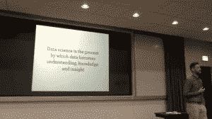

# 数据科学家？程序员？它们是互斥的吗？

> 原文：<https://www.dominodatalab.com/blog/data-scientist-programmer-mutually-exclusive>

*这篇 Domino Data Science Field Note 的博文提供了 [Hadley Wickham](https://twitter.com/hadleywickham) 的 [ACM Chicago](http://www.chicagoacm.org/meeting-topics/2018-03-07-hadley-wickham---you-can-t-do-data-science-in-a-gui) 的演讲中的亮点，“[你不能在 GUI](https://www.youtube.com/watch?v=PURtmHwk_-0) 中做数据科学”。在他的演讲中，Wickham 主张，与 GUI 不同，使用代码提供了可再现性、数据来源和跟踪变化的能力，以便数据科学家能够看到数据分析是如何发展的。作为 [ggplot2](https://en.wikipedia.org/wiki/Ggplot2) 的创造者，Wickham 也提倡将可视化和模型结合起来使用，以帮助数据科学家找到他们数据中的真实信号，这并不奇怪。这篇博文还提供了来自[原始视频](https://www.youtube.com/watch?v=PURtmHwk_-0)的剪辑，并遵循了附属于原始视频记录的[知识共享许可](https://creativecommons.org/licenses/by-sa/4.0/)。*

## 数据科学:迭代过程中的价值

RStudio 的首席科学家 Hadley Wickham 在 ACM 芝加哥会议上发表了题为“你不能在 GUI 中进行数据科学”的演讲，该演讲涵盖了数据科学的工作流程和工具。例如，Wickham 提倡使用可视化和模型来支持数据科学家在他们的数据中找到真正的信号。他还建议利用编程语言的优势，包括可再现性、数据来源和查看数据分析如何随时间演变的能力。他还谈到了他喜欢 R 编程语言的什么。从他的角度来看，使用 GUI 没有考虑到这些好处。根据本次演讲的幻灯片，他将数据科学定义为“数据成为理解、知识和洞察力的过程”，这一点尤为重要。GUI 故意混淆这个过程，因为你只能做 GUI 发明者希望你做的事情。

## 可视化和模型

在回答“为什么编程？”这个问题之前在他的演讲中，Wickham 讨论了两个“主要引擎”，这两个引擎有助于数据科学家理解数据集内正在发生的事情:[可视化](http://r4ds.had.co.nz/data-visualisation.html)和[模型](http://r4ds.had.co.nz/model-intro.html)。可视化是一种工具，使数据科学家能够迭代“模糊的问题”，并帮助他们完善它。或者提出问题并“试图让它足够精确，这样你就可以定量地回答它。”Wickham 还提倡使用可视化，因为它可能会让数据科学家感到惊讶，或者让他们看到他们没有想到会看到的东西。在演讲中，Wickham 指出“你看到的第一个可视化总是会揭示数据质量错误，如果它没有揭示数据质量错误，那就意味着你还没有发现错误。”然而，他也指出可视化并不能很好地扩展，并建议使用模型来补充可视化。当数据科学家能够使他们的问题足够精确以使用算法或汇总统计时，就使用模型。模型比可视化更具可扩展性，因为“在问题上投入更多的计算机比投入更多的大脑要容易得多。”

## 为什么编程？再现性、出处和跟踪变化

Wickham 提倡使用编程语言而不是 GUI 来进行数据科学，因为它提供了再现工作、理解数据来源(这也与再现性相关)的机会，以及查看数据分析如何随着时间的推移而发展的能力。Wickham 特别指出的两个有用的工作流程包括剪切粘贴和使用[堆栈溢出](https://stackoverflow.com/)。虽然在《幽默》中提到了这些工具，但代码是文本，很容易剪切和粘贴文本，包括错误消息到堆栈溢出中以找到解决方案。此外，理解数据来源能够实现可再现性，因为它使数据科学家能够“稍后用新数据重新运行代码，并获得您可以使用的更新结果”。使用代码还可以让数据科学家通过 GitHub 等开放方式分享他们的工作。在他演讲的这一部分，Wickham 提到了 GitHub 上的一个项目，在这个项目中，人们可以看到一系列提交，深入到提交，并看到“数据分析现在的情况，但你可以看到它是如何随着时间的推移而发展的。”他将此与 Excel 进行了对比，后者为人们提供了在不知道出处或没有回滚选项的情况下意外随机化数据的机会。

## 为什么用 R 编程？尽管有怪癖？包裹。

由于 Wickham 是 RStudio 的首席科学家，他表示，虽然他认为“Python 也很棒”，但他“特别喜欢”。吸引韦翰的几个 R 特征包括

*   它是一种函数式编程语言，允许你“通过用各种方式组合函数来解决问题”
*   R 如何提供查看代码结构的能力
*   R 如何“赋予我们这种不可思议的能力，来创建适合数据科学过程某些部分的小领域特定语言”。

这也导致了构建 [R 包](http://web.mit.edu/insong/www/pdf/rpackage_instructions.pdf)的可能性。Wickham 指出，[软件包](https://www.tidyverse.org/packages/)允许人们通过将复杂的问题分解成更小的部分来解决它们，这些更小的部分可以从一个项目中取出，然后“以不同的方式重新组合”(可再现性)，来解决一个新的问题。

### 结论

正如 Wickham 将数据科学定义为“数据成为理解、知识和洞察力的过程”，他提倡使用数据科学工具，从迭代、惊喜、可再现性和可扩展性中获得价值。特别是，他认为成为数据科学家和程序员并不相互排斥，使用编程语言有助于数据科学家理解他们数据中的真实信号。虽然这篇博客文章只涵盖了 Wickham 的 ACM 芝加哥演讲的一些关键亮点，但完整的视频可以观看。

*^(Domino 数据科学领域笔记提供数据科学研究、趋势、技术等亮点，支持数据科学家和数据科学领导者加快工作或职业发展。如果您对本博客系列中涉及的数据科学工作感兴趣，请发送电子邮件至 writeforus(at)dominodatalab(dot)com。)*