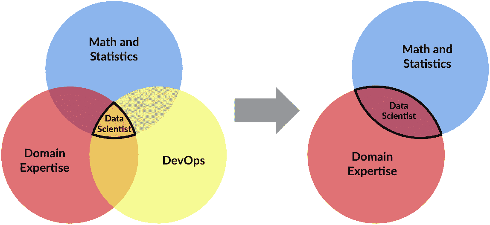

# 数据科学家:仍然是“21 世纪最性感的工作”？

> 原文：<https://www.dominodatalab.com/blog/data-scientist-still-the-sexiest-job-of-the-21st-century>

早在 2012 年，《哈佛商业评论》宣称:[“数据科学家:21 世纪最性感的工作。”](https://hbr.org/2012/10/data-scientist-the-sexiest-job-of-the-21st-century)作者 Thomas Davenport 和 D.J. Patil(现任美国白宫首席数据科学家)在他们的文章中花了很多篇幅来定义数据科学家的工作。当时，大型企业刚刚意识到数据科学在释放数据力量方面的重要性。作为一个相对较新的学科，他们指出，对数据科学家的需求远远超过了供应，“数据科学家的短缺正在成为一些行业的严重制约因素。”

结合起来，它日益增长的影响力和达文波特和帕蒂尔预测的人才短缺让数据科学有了更多的能见度，特别是在 Glassdoor 随后进行的劳动力市场调查之后。该组织广受期待的年度报告通过三个因素分析工作:1)基本工资中位数，2)美国公司的职位空缺数量，3)担任该职位的员工的总体工作满意度。不出意外，Glassdoor 在 [2016](https://www.glassdoor.com/blog/25-jobs-america-2016/) 、 [2017](https://www.glassdoor.com/List/Best-Jobs-in-America-2017-LST_KQ0,25.htm) 、 [2018](https://www.glassdoor.com/blog/best-jobs-in-america-2018/) 以及 [2019](https://www.glassdoor.com/research/best-jobs-2019/) 再次将“数据科学家”列为“全美最佳工作”。虽然在 2020 年已经滑落到第三位，但很明显，现在[仍然是成为数据科学家的大好时机](https://www.datanami.com/2020/11/16/why-data-science-is-still-a-top-job/)。

对于数据科学家来说，看到薪水、工作机会和工作满意度的上升令人兴奋。他们当然赢得了这一荣誉，因为数据科学已经成为许多财富 500 强公司的关键竞争优势，并在制定关键业务决策时为数据科学家赢得了董事会席位。但是…达文波特和帕蒂尔八年前预测的供应短缺仍然成立吗？或者，技术进步和商业环境的变化是否给了公司更多机会来大规模建立数据科学团队？

## 根据定义，数据科学家是独角兽

在我们深入探讨这些问题之前，让我们先来看看导致合格数据科学家短缺的主要因素之一。数据科学和数据科学家的定义有很多，但无论来源如何，数据科学家都需要三种非常重要的技能:

1.  **数学和统计学。**数据科学的端到端流程深深植根于数学和统计学。例如，从通常杂乱和不同的数据中创建理解需要统计分析。数据科学家应用的技术，包括所有的机器学习，在很大程度上是基于数学公式的。
2.  **领域专长。**关于特定行业或部门的知识，包括其业务挑战和各自的术语，极大地增加了数据科学家找到(然后解决)正确的业务问题的可能性。
3.  **DevOps。**数据科学家在其工作的研发阶段对数据、存储、计算等有高度专业化的需求。之后，他们需要应用重要的 DevOps 步骤来将他们的模型投入生产。

考虑到数据科学家必须掌握的各种技能，难怪公司很难找到他们！

## 更少的 DevOps =更多的合格候选人

在这个博客网站上，我们谈论了很多关于数据科学平台可以给想要扩展数据科学和机器学习的组织带来的好处。例如，我的同事大卫·布洛赫在 6 月份写了一篇很棒的博客，其中有一些关于公司如何增加其机器学习实践成功机会的指导原则。他提到了给予数据科学家实验自由的重要性，并以验证和复制新建模方法的强大流程作为支持。*但是，像 Domino 这样的数据科学平台的出现真的能帮助公司改善他们招聘和聘用合格数据科学家的方式吗？*

在数据科学平台的众多优势中，它们为数据科学家提供了对可扩展计算的自助式访问，以进行强大的实验。强大的资源，包括多核 CPU、GPU 和最新的分布式计算框架，如 Spark 和 Ray，只需点击几下，就可以轻松启动，而无需非常了解 DevOps。Domino 将自动分发所有必需的包和依赖项，这样就不会再有开发人员头疼的问题和浪费 IT 时间。

在过去的几年中，我们看到人们越来越担心数据科学模型能否将其应用到生产中，从而增加商业价值。事实上，一些估计已经将永远达不到生产的模型的数量置于高达 80-90%的位置！作为回应，任何普遍接受的安全性、可伸缩性、集成等 DevOps 实践都被应用到模型世界中。由此产生的系统和流程通常被称为 ModelOps 或 MLOps，旨在更快地将模型投入生产，并克服传统上阻止模型部署的障碍。

一些公司已经建立了单独的团队来处理[机器学习模型](https://blog.dominodatalab.com/a-guide-to-machine-learning-models)的部署，但我们也看到许多公司正在转向一个框架，让数据科学家负责端到端的过程。在这些情况下，数据科学家必须从熟悉的数据科学世界中转移出来，开始使用新型工具(例如 Kubernetes、Docker 和 EC2)、约束和技能。

数据科学平台简化了部署流程，只需点击几下鼠标即可将模型投入生产。例如，您可以使用一种简单的自助式 API 端点部署方法在 Domino 中部署和托管模型。在 Domino 中部署模型可以深入了解完整的模型谱系，以及用于创建调用模型的函数的所有软件的确切版本。它还提供了所有生产资产(API、应用程序等)的概述。)并将这些资产链接到个人、团队和项目，以便可以跟踪使用情况，并且可以在其他项目中轻松重用这些资产。

[数据科学平台](/resources/field-guide/data-science-platforms/)为扩展数据科学创造了一个理想的环境，包括面向数据科学家的各种研发选项和 MLOps，以及改进的 IT 治理。它们消除了数据科学家成为 DevOps 大师的需要，并允许他们将更多时间放在数据科学上，而不是花在克服 DevOps 麻烦和与之斗争上。数据科学家的好处显而易见，但对于人力资源招聘团队来说，使用数据科学平台消除了寻找独角兽的需求。这使得他们可以将搜索重点放在更深层次的潜在合格候选人上。

## 大规模招聘数据科学团队时的其他因素

传统上，大学在培养具有很强的数学和统计技能的人才方面做得很好。现在，随着对数据科学家的大量需求，有超过 500 所大学提供专门的数据科学学位课程。这些项目的毕业生进入职场时都有使用 Python 和 R 等语言的经验，并且通常非常熟悉许多最新的开源软件包和数据科学工具。在某些情况下，他们甚至有使用 MATLAB 或 SAS 等流行商业软件的经验。

随着时间的推移，这些毕业生在特定领域或部门与数据分析师、商业领袖和其他同事密切合作，积累了他们的专业知识。他们对数据中的细微差别有着敏锐的理解，并本能地知道该问什么问题，这样他们就能更快地开发出更好的模型。

地理位置曾经是公司招聘数据科学家能力的重要因素。总部位于旧金山或纽约等数据科学家高度集中的地区的公司拥有丰富的人才库，如果他们愿意，可以建立拥有数百名数据科学家的[数据科学团队](/resources/field-guide/managing-data-science-teams/)。但是，对于美国其他地区的公司来说，这根本不是一个可行的选择。随着公司适应新的工作环境和运营模式以应对新冠肺炎，他们对远程员工变得更加开放。我们看到农村地区的公司正在与大都市地区的跨国公司有效竞争数据科学人才。而且，生活在农村地区的数据科学家有更多的就业机会。

我们还看到数据分析师、软件开发人员和其他非传统数据科学家使用自动化机器学习和其他工具来扩展他们的技能。随着公司寻求将数据科学应用于其运营的更多方面，这些“公民数据科学家”正在尝试基本的数据科学任务。这是一个供给和需求同时增加的情况。在实践中，传统的、代码优先的数据科学家仍在从事他们一直关注的相同战略项目，但现在承担了指导公民数据科学家和刚刚进入劳动力市场的初级数据科学家的额外责任。

## 那么…供给赶上需求了吗？

自从达文波特和帕蒂尔写了关于数据科学家的开创性文章以来的八年里，我们已经看到美国数据科学工作的数量以及在 LinkedIn 上自称数据科学家的人数都有了显著增长。Job site Indeed 报道称，自 2013 年以来，[数据科学职位发布量增加了两倍多，在许多其他网站上也可以找到类似的统计数据。数据技能平台 QuantHub 在 2020 年 4 月](https://www.hiringlab.org/2019/01/17/data-scientist-job-outlook/)做了一项[深度分析，得出的结论是职位发布仍然比职位搜索快 3 倍。](https://quanthub.com/data-scientist-shortage-2020/)

当然，新冠肺炎的出现改变了几乎所有行业的就业增长预测。[数据科学和其他技术工作受到了沉重打击](https://www.informationweek.com/big-data/data-science-how-the-pandemic-has-affected-10-popular-jobs/d/d-id/1338837?page_number=1)，需求和供给之间的差距已经缩小。也就是说，我们看到许多客户在 COVID 期间增加了对数据科学的投资。一些人将数据科学视为进一步区分和创造可持续优势的一种方式，而另一些人则将其视为生存的手段。

没有人确切知道 2021 年会发生什么，也没有人知道“数据科学家”是否会再次登上“美国最佳工作”的榜首。但是，如果过去的历史和我们从客户那里看到的迹象有任何意义的话，我敢打赌是数据科学家。

 

[Twitter](/#twitter) [Facebook](/#facebook) [Gmail](/#google_gmail) [Share](https://www.addtoany.com/share#url=https%3A%2F%2Fwww.dominodatalab.com%2Fblog%2Fdata-scientist-still-the-sexiest-job-of-the-21st-century%2F&title=Data%20Scientist%3A%20Still%20the%20%E2%80%9CSexiest%20Job%20of%20the%2021st%20Century%E2%80%9D%3F)