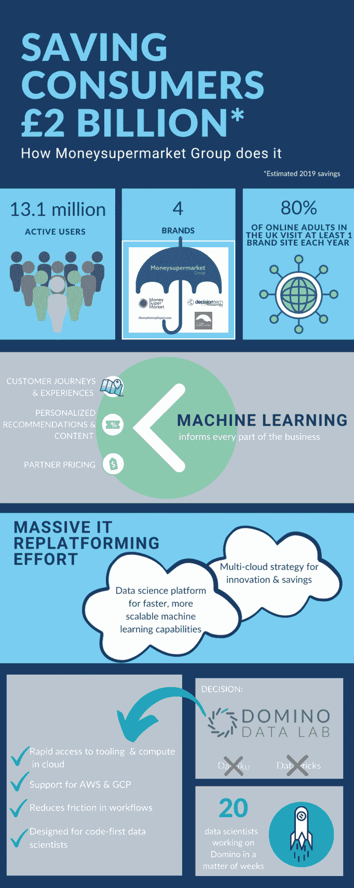

# DataOps 更快地为 Moneysupermarket 提供数据科学价值

> 原文：<https://www.dominodatalab.com/blog/dataops-a-powerful-approach-for-delivering-data-science-value-faster-1>

By Harvinder Atwal, Chief Data Officer, The Moneysupermarket Group on May 28, 2020 in [Perspective](/blog/perspective/)

编者按:这是一系列文章的一部分，分享公司在成为模型驱动的道路上的最佳实践。一些文章将包含关于他们使用 Domino 的信息。

* * *

几年前，我在 [Moneysupermarket](https://www.moneysupermarket.com/) 的团队偶然发现了 DataOps。我所说的失误是指我们没有积极着手实施 DataOps 方法，该方法作为一种更快地运营和扩展数据科学的方式已经开始获得关注。相反，出于基本需要，我们开始应用来自软件开发、产品管理和产品工程的最佳实践。

## 发生了什么事？

它始于一个简单的问题:我们能否利用数据科学，根据客户的金融需求、风险状况和态度，为他们提供个性化的沟通和内容？

Moneysupermarket 的主要使命是帮助消费者在从保险和信用卡到公用事业和旅游的所有事情上省钱。去年，我们服务了超过 1300 万活跃用户，并通过我们的四个品牌(MoneySuperMarket、TravelSupermarket、MoneySavingExpert 和 Decision Tech)为消费者节省了约 20 亿英镑。

我们有数千种产品，但当时，我们的营销团队在与客户沟通时采用了一刀切的方式。我们认为个性化是增加收入的关键。例如，营销团队可以使用数据科学来定制时间、语言和内容，向不同类型的客户发送不同版本的简讯，而不是向所有客户发送一份简讯。

商业利益相关者对这个概念很感兴趣，但是为了获得他们的全力支持和资助，我们需要向他们展示结果——而且要快。我们只有两个月的时间来证明模型驱动的个性化方法比利益相关者最初打算的假设和规则驱动的方法更好。

我们的数据科学流程没有针对速度进行优化。这种情况并不罕见。大多数数据科学团队可能会指出数据科学生命周期中的瓶颈，例如无法快速访问他们需要的数据、工具和计算资源，或者无法快速部署实验并与利益相关方进行迭代。这些瓶颈阻碍了他们实现投资的全部回报。

事实上，根据 NewVantage Partners 最近的调查，只有 7.3%的组织认为他们的数据和分析状况非常好。

## 我们必须改变我们的工作方式。

我们决定借鉴软件开发、产品工程和产品管理的最佳实践，快速创建一个最小可行的产品，用于个性化通信。我们希望整合三种基本方法:

1.  **敏捷实践，**尤其是在与商业利益相关者合作的时候。我们与营销利益相关者坐下来确定最终目标(例如，是改善客户体验还是增加收入？)，要测试哪些假设，以及哪些数据产品可以满足这些目标。通过这样做，我们可以确保我们的最终产品能够满足他们的需求，并获得他们的全力支持。我们还创建了快速反馈循环，使我们能够通过营销测试新模型，这样我们就可以看到哪些有效，哪些无效，然后快速完善我们的模型。
2.  **精益制造原则**帮助消除数据科学生命周期中的浪费和瓶颈，提高最终数据产品的质量，并监控数据流。我们还希望让数据科学家更加自给自足，并确保工作的可重复性和可重用性。例如，我们的 [Domino 平台是我们的 DataOps 生态系统](https://www.dominodatalab.com/customers/moneysupermarket/)的重要组成部分，帮助我们减少浪费，并在数据科学家构建和部署模型时实施更好的控制。
3.  **DevOps 文化，**应用版本控制、配置管理、持续集成和持续运营等概念，更快、更可靠地开发和部署模型。

## 甚至我们都对结果感到惊讶。

通过应用这些实践(所有这些都是 DataOps 的基础),我们大大缩短了开发、测试和部署新的个性化模型所需的时间。在三个月的时间里，我们在分析实验。不到六个月，我们的新个性化模型就部署完毕并开始发挥作用，这比我们最初的预期要早得多。

如今，我们有 1，400 种不同的简讯，每一种都是根据客户的金融态度和知识量身定制的。例如，我们的模型发现，积极情绪和专有名词的使用增加了客户的转化率，这些客户更懂金融，知道他们想从我们的价格比较网站上得到什么和需要什么。相比之下，不太懂金融的客户更容易对使用负面情绪和“可能”、“应该”和“会”等情态动词的内容做出反应

## 从那以后，我们更加正式地采用 DataOps 来衡量我们的成功。

这项工作为我们最终的 DataOps 之旅奠定了基础，这一旅程使我们能够使用可扩展和可重复的流程以及高度优化的工具快速前进。

通过 DataOps，我们缩短了几周、几个月甚至几年的流程，使 Moneysupermarket 能够更快地创新并释放新的市场机会。

我们现在已经生产了 50 多种型号，从优化客户旅程和客户体验，到个性化产品和内容，再到与合作伙伴协商价格，我们的运营涉及方方面面。这带来了数百万英镑的额外收入，并使我们能够在竞争激烈的市场中保持领先地位。

DataOps 需要基于收集数据和根据反馈采取行动的持续改进心态。我们不断寻求通过不断提高我们创建和迭代数据产品的速度来增加我们对客户和利益相关者的影响。

## 了解更多信息:

*   阅读关于货币超级市场的多米诺案例研究。
*   阅读哈文德在[转移到数据运营](https://www.computerweekly.com/news/252457136/Interview-Moving-to-DataOps)接受《计算机周刊》的采访
*   阅读哈文德的书，[实用数据操作:大规模交付敏捷数据科学](https://www.amazon.com/Practical-DataOps-Delivering-Agile-Science/dp/1484251032/ref=sr_1_1?keywords=practical+dataops&qid=1583869615&sr=8-1)

[Twitter](/#twitter) [Facebook](/#facebook) [Gmail](/#google_gmail) [Share](https://www.addtoany.com/share#url=https%3A%2F%2Fwww.dominodatalab.com%2Fblog%2Fdataops-a-powerful-approach-for-delivering-data-science-value-faster-1%2F&title=DataOps%3A%20A%20powerful%20approach%20for%20delivering%20data%20science%20value%20faster)