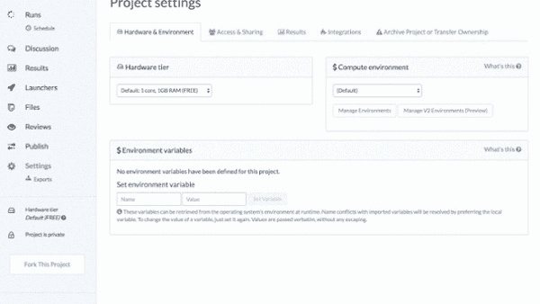
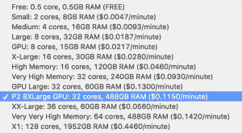
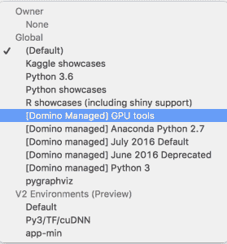

# 无需 Domino 环境设置的 GPU 深度学习

> 原文：<https://www.dominodatalab.com/blog/deep-learning-gpus-without-environment-setup>

我们已经看到数据科学家对使用 GPU 来训练深度学习模型的兴趣激增。虽然支持这一点的库(例如 keras、TensorFlow 等)已经变得非常强大，但数据科学家仍然受到限制其生产力的配置问题的困扰。

例如，最近在 keras 博客上的一篇[帖子描述了如何在 AWS 上使用 keras——它有九个步骤，其中许多涉及 DevOps 工作，例如设置端口转发。如果你没有使用深度学习 AMI，你需要安装 GPU 驱动程序，正确配置软件包以识别 GPU 设备，并处理许多其他技术细节。](https://blog.keras.io/running-jupyter-notebooks-on-gpu-on-aws-a-starter-guide.html)

[Domino](https://www.dominodatalab.com) 通过 Docker 将基础设施自动化(例如，启动 EC2 机器，包括 GPU)与“环境配置”无缝结合，让用户使用已经设置好的配置来构建和共享可重用的计算环境。我们最近构建并共享了一个安装并正确配置了通用 GPU 工具的环境，因此它们将在 AWS GPU 硬件上无缝工作。

有了这一改变，在 Domino 上使用最新的深度学习包只需两步:

1.  选择 GPU 硬件层。
2.  选择支持 GPU 处理的环境。

看起来是这样的:

Domino 可以让您轻松地将您的机器扩展到亚马逊强大的 P2 实例，该实例号称具有高达 70 万亿次单精度浮点性能！

为了让你的深度学习包利用它运行的 GPU 硬件，你必须正确地配置和构建环境。不用通读关于如何安装 [CUDA](http://docs.nvidia.com/cuda/cuda-installation-guide-linux/#axzz4aKiFufoE) 、 [cuDNN](https://developer.nvidia.com/cudnn) 以及最后你最喜欢的深度学习库的文档，Domino 让你轻松地构建你的[定制环境](//blog.dominodatalab.com/data-science-docker/)一次，并轻松地共享该环境。

为了方便云用户使用 GPU，我们提供了一个名为“[Domino 托管] GPU 工具”的公共环境如果您想将 GPU 与 Theano、Tensorflow(有或没有 Keras)或 Neon 一起使用，请随意使用该环境并跳过设置。

如果你是深度学习的新手或者仍然在学习 Domino 平台，我们最近发布了几个 Domino 项目，它们使用 GPU 和深度学习库来训练 LSTM 模型。这些项目中的演示使用 IMDB 数据集来训练 LSTM 模型，该模型根据评论的文本来预测电影评论的情感。

1.  涅槃乐队
2.  提亚诺
3.  [TensorFlow](https://www.dominodatalab.com/data-science-dictionary/tensorflow)

你可以自由地对项目进行分支，进行实验，并探索自己使用 GPU 进行深度学习的新世界。尽情享受吧！