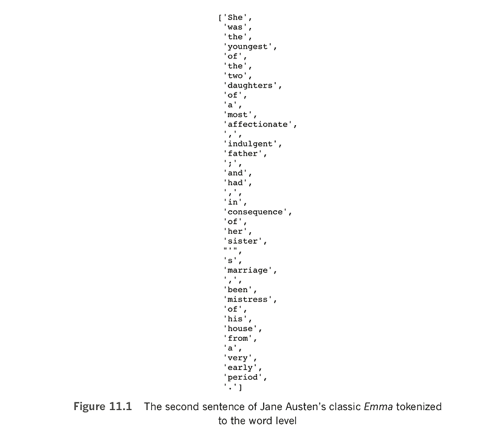

# 深度学习图解:构建自然语言处理模型

> 原文：<https://www.dominodatalab.com/blog/deep-learning-illustrated-building-natural-language-processing-models>

*非常感谢 Addison-Wesley Professional 提供了从书中摘录《自然语言处理》的权限，[深度学习图鉴](http://www.informit.com/store/deep-learning-illustrated-a-visual-interactive-guide-9780135116692?utm_source=Referral&utm_medium=DominoLabs&utm_campaign=Krohn&utm_term=DLBook)作者[克罗恩](https://www.linkedin.com/in/jonkrohn/)， [Beyleveld](https://www.linkedin.com/in/grantbey/) ，以及 [Bassens](https://twitter.com/aglaebassens) 。该摘录涵盖了如何创建单词向量并将其用作深度学习模型的输入。一个补充的 [Domino 项目是可用的](https://try.dominodatalab.com/u/domino-andrealowe/Natural-Language-Processing/overview)。*

 ## 介绍

虽然计算语言学或自然语言处理(NLP)领域已经存在了几十年，但对深度学习模型的兴趣和使用的增加也推动了 NLP 在行业内的应用。数据科学家和研究人员需要大量的技术、软件包和工具来加速核心工作流任务，包括准备、处理和分析数据。利用 NLP 有助于研究人员和数据科学家更快地完成核心任务。由于 [Domino](https://www.dominodatalab.com/?utm_source=blog&utm_campaign=referral&utm_medium=logo&utm_content=) 致力于加速数据科学工作流程，我们联系了 Addison-Wesley Professional (AWP)以获得从书中摘录大量“自然语言处理”章节的权限，*深度学习插图。*我们感谢[AWP·皮尔森](http://www.informit.com/imprint/series_detail.aspx?ser=4255387)提供摘录作品的许可，并使我们能够提供一个补充的[多米诺项目](https://try.dominodatalab.com/u/domino-andrealowe/Natural-Language-Processing/overview)。


## 第一章介绍:自然语言处理

在本书的第 2 章[[]中，我们介绍了语言的计算表示，特别强调了单词向量是一种定量捕捉单词含义的有效方法。在本章[摘录]中，我们将介绍一些代码，这些代码将使您能够创建自己的单词向量，并将其作为输入提供给深度学习模型。](http://www.informit.com/store/deep-learning-illustrated-a-visual-interactive-guide-9780135116692?utm_source=Referral&utm_medium=DominoLabs&utm_campaign=Krohn&utm_term=DLBook)

你在本章中建立的自然语言处理模型将结合我们已经应用的神经网络层:本书第五章到第九章的密集层和第十章的卷积层[。我们的 NLP 模型还将包含新的层类型——来自递归神经网络家族的层类型。rnn 本身处理自然语言等序列中出现的信息，但事实上，它们可以处理任何序列数据，如金融时间序列或给定地理位置的温度，因此它们非常通用。本章最后有一节是关于通过多个并行流处理数据的深度学习网络的，这一概念极大地拓宽了设计模型架构时的创造力范围，正如你将看到的那样，还可以提高模型的准确性。](http://www.informit.com/store/deep-learning-illustrated-a-visual-interactive-guide-9780135116692?utm_source=Referral&utm_medium=DominoLabs&utm_campaign=Krohn&utm_term=DLBook)

## 预处理自然语言数据

您可以采取一些步骤来预处理自然语言数据，这样您在下游执行的建模可能会更准确。常见的自然语言预处理选项包括:

*   *记号化:*这是将一个文档(例如一本书)拆分成一系列离散的语言元素(例如单词)，我们称之为*记号*。
*   将所有字符转换为小写字母。句首大写的单词(如*她*)和后面用在句子中的单词(*她*)意思相同。通过将语料库中的所有字符转换成小写，我们忽略了任何大写的使用。
*   去除*停用词:*这些是经常出现的词，往往包含相对较少的区别意义，如*的*、*的*、*的*、的*。对于停用词的精确列表没有普遍的共识，但是根据您的应用程序，确保某些词是(或不是)可能是明智的。)被认为是停用词。例如，在本章中，我们将建立一个模型来将电影评论分为正面或负面。一些停用词列表包括否定，如*没有*、*不是*和*不会*，这对我们的模型识别电影评论的情感可能是至关重要的，所以这些词可能不应该被删除。*
*   删除标点符号:标点符号通常不会给自然语言模型增加太多价值，因此经常被删除。
*   *词干化:*词干化是将单词截断到词干。例如，单词 house 和 housing 都有词干 house。特别是对于较小的数据集，词干分析可能会很有成效，因为它将具有相似含义的单词汇集到单个标记中。将会有更多这种词干标记的上下文的例子，使得像 word2vec 或 GloVe 这样的技术能够更准确地识别单词向量空间中标记的适当位置(参见图 2.5 和 2.6) [【书中的 ]。[注意:词汇化是词干化的一种更复杂的替代方法，需要使用参考词汇。就本书的目的而言，词干提取是将多个相关单词视为单个单词的充分方法。]
*   处理 *n-grams* :一些单词通常以这样一种方式共同出现，即单词的组合比几个单独的概念更适合被认为是一个单独的概念。举个例子，*纽约*是一个*二元模型*(一个*n*-长度为二的克数)，而*纽约*是一个*三元模型*(一个*n*-长度为三的克数)。当链接在一起时，单词 *new、* *york* 和 *city* 具有特定的含义，用单个标记(因此是单词向量空间中的单个位置)比用三个单独的标记更好地捕捉这些含义。

根据我们设计模型所针对的特定任务，以及我们要输入的数据集，我们可能会使用所有、部分或不使用这些数据预处理步骤。当您考虑将任何预处理步骤应用到您的特定问题时，您可以使用您的直觉来衡量它最终是否对您的下游任务有价值。我们已经提到了一些例子:

*   词干可能对小语料库有帮助，但对大语料库没有帮助。
*   同样，将所有字符转换为小写可能有助于处理小型语料库，但是，在包含更多单词单独使用示例的大型语料库中，*比如*、*将军*(形容词，意为“广泛传播”)与*将军*(名词，意为军队指挥官)之间的区别可能很有价值。
*   删除标点符号并不是在所有情况下都有好处。例如，考虑一下，如果您正在构建一个问答算法，它可以使用问号来帮助它识别问题。
*   例如，否定作为停用词对于一些分类器可能是有帮助的，但是对于情感分类器可能不是。在停用词列表中包含哪些词对您的特定应用程序至关重要，因此要小心使用。在许多情况下，最好只删除有限数量的停用词。

如果你不确定给定的预处理步骤是否有帮助，你可以通过合并该步骤并观察它是否影响你的深度学习模型下游的准确性，来根据经验调查这种情况。一般来说，语料库越大，有用的预处理步骤越少。有了一个小的语料库，你可能会担心遇到罕见的单词或者在你的[训练数据集](/what-is-machine-learning-model-training)的词汇之外的单词。通过将几个罕见的单词集中到一个普通的单词中，您将更有可能根据一组相关单词的含义有效地训练一个模型。然而，随着语料库变得越来越大，生僻字和未登录词变得越来越不是问题。有了一个非常大的语料库，这很可能有助于*避免*将几个单词汇集成一个单一的公共符号。这是因为将会有足够多的实例，即使是出现频率较低的单词，来有效地模拟它们的独特含义，以及模拟相关单词之间相对微妙的细微差别(否则可能会被汇集在一起)。

为了提供这些预处理步骤的实际例子，我们邀请您查看我们的*自然语言预处理* Jupyter 笔记本【或者[互补多米诺项目](https://try.dominodatalab.com/u/domino-andrealowe/Natural-Language-Processing/overview)】。

它首先加载许多依赖项:

```py
import nltk

from nltk import word_tokenize, sent_tokenize

from nltk.corpus import stopwords

from nltk.stem.porter import *

nltk.download('gutenberg')

nltk.download('punkt')

nltk.download('stopwords')

import string

import gensim

from gensim.models.phrases import Phraser, Phrases

from gensim.models.word2vec import Word2Vec

from sklearn.manifold import TSNE

import pandas as pd

from bokeh.io import output_notebook, output_file

from bokeh.plotting import show, figure

%matplotlib inline
```

这些依赖项大多来自于`nltk`(自然语言工具包)和 gensim(另一个 Python 的自然语言库)。当我们在下面的示例代码中应用它时，我们解释我们对每个独立依赖项的使用。

## 标记化

我们在本笔记本中使用的数据集是一个小型语料库，其中包含古登堡计划(Project Gutenberg)中的过版权书籍。[注:古登堡计划以印刷机发明者约翰内斯·古腾堡的名字命名，是数万本电子书的来源。这些书是来自世界各地的经典文学作品，它们的版权已经过期，可以免费获得。参见[gutenberg.org](https://www.gutenberg.org/)。]

这个语料库在 nltk 中可用，因此可以使用下面的代码轻松地加载它:

```py
from nltk.corpus import gutenberg
```

这部小小的文集只有 18 部文学作品，包括简·奥斯汀的《爱玛》，刘易斯·卡罗尔的《爱丽丝梦游仙境》，以及一个名不见经传的人威廉·莎士比亚的三部戏剧。(执行`gutenberg.fileids()`打印所有 18 个文件的名称。)通过运行`len(gutenberg.words())`，您可以看到语料库达到了 260 万个单词——这是一个易于管理的数量，意味着您可以在一台笔记本电脑上运行本节中的所有代码示例。

要将语料库标记成句子列表，一种选择是使用 nltk 的`sent_tokenize()`方法:

```py
gberg_sent_tokens = sent_tokenize(gutenberg.raw()
```

通过运行`gberg_sent_tokens[0]`访问结果列表的第一个元素，您可以看到古登堡计划语料库中的第一本书是 Emma，因为这第一个元素包含书的标题页、章节标记和第一句话，所有这些都(错误地)与换行符(\n)混合在一起:

```py
'[Emma by Jane Austen 1816]\n\nVOLUME I\n\nCHAPTER I\n\n\nEmma Wood-

house, handsome, clever, and rich, with a comfortable home\nand happy

disposition, seemed to unite some of the best blessings\nof existence;

and had lived nearly twenty-one years in the world\nwith very little to

distress or vex her.'
```

第二个元素中有一个独立的句子，可以通过执行`gberg_sent_tokens[1]`来查看:

```py
"She was the youngest of the two daughters of a most affectionate,

\nindulgent father; and had, in consequence of her sister's marriage,\nbeen

mistress of his house from a very early period."
```

您可以使用 nltk 的`word_tokenize()`方法将这个句子进一步标记到单词级别

```py
word_tokenize(gberg_sent_tokens[1])
```

这将打印一个单词列表，去掉所有空格，包括换行符(见图 11.1)。例如，单词*父亲*是第二句中的第 15 个单词，通过运行这行代码可以看到:

```py
word_tokenize(gberg_sent_tokens[1])[14]
```

虽然`sent_tokenize()`和`word_tokenize()`方法可以方便地处理您自己的自然语言数据，但有了这个古腾堡语料库项目，您可以方便地使用其内置的`sents()`方法来一步实现相同的目标:

```py
gberg_sents = gutenberg.sents()
```

这个命令产生`gberg_sents`，一个列表的标记化列表。较高级别的列表由单个句子组成，每个句子包含一个较低级别的单词列表。适当地，`sents()`方法也将标题页和章节标记分离成它们自己的单独元素，正如您通过调用`gberg_sents[0:2]:`所观察到的

```py
     [['[', 'Emma', 'by', 'Jane', 'Austen', '1816', ']'],

     ['VOLUME', 'I'],

     ['CHAPTER', 'I']]

```

正因为如此，*艾玛*的第一个实际句子现在单独作为`gberg_sents`的第四个元素，因此为了访问第二个实际句子中的第 15 个单词(父亲)，我们现在使用`gberg_sents[4][14]`。

## 将所有字符转换为小写

对于剩余的自然语言预处理步骤，我们首先将它们迭代地应用于单个句子。当我们稍后结束这一部分时，我们将在整个 18 个文档的语料库中应用这些步骤。

回头看图 11.1，我们看到这个句子以大写的单词 *She* 开头。



如果我们想忽略大小写，这样这个单词就被认为与 *she* 相同，那么我们可以使用`string`库中的 Python `lower()`方法，如例 11.1 所示。

#### 示例 11.1 将句子转换为小写

```py
[w.lower() for w in gberg_sents[4]]
```

这一行返回与图 11.1 相同的列表，除了列表中的第一个元素现在是 she 而不是`She`。

## 删除停用字词和标点符号

图 11.1 中的句子的另一个潜在的不便是，它充满了停用词和标点符号。为了处理这些，让我们使用`+`操作符将 nltk 的英语停用词列表与`string`库的标点符号列表连接在一起:

```py
stpwrds = stopwords.words('english') + list(string.punctuation)
```

如果你检查一下你创建的`stpwrds`列表，你会发现它包含了许多通常没有太多特殊含义的常用词，比如 *a* 、*a*，以及*a*。[注意，这三个特定的单词被称为*冠词*，或者*限定词*。然而，它也包含像 not 这样的词和其他负面的词，如果我们建立一个情感分类器，这些词可能是至关重要的，比如在句子中，“这部电影不好。”]

在任何情况下，为了从一个句子中去掉 stpwrds 的所有元素，我们可以使用一个[列表理解](http://bit.ly/listComp)，就像我们在例 11.2 中所做的那样，它包含了我们在例 11.1 中使用的小写。

#### 例 11.2 用列表理解删除停用词和标点符号

```py
[w.lower() for w in gberg_sents[4] if w.lower() not in stpwrds]
```

相对于图 11.1，运行这一行代码返回一个更短的列表，现在只包含每个单词都倾向于表达一点意思的单词:

```py
               ['youngest',

               'two',

               'daughters',

               'affectionate',

               'indulgent',

               'father',

               'consequence',

               'sister',

               'marriage',

               'mistress',

               'house',

               'early',

               'period']

```

## 堵塞物

要词干，可以用波特算法【注:波特，M. F. (1980)。后缀剥离算法。程序，14，130–7。]由 nltk 提供。为此，您创建一个`PorterStemmer()`对象的实例，然后将它的`stem() method`添加到您在示例 11.2 中开始的列表理解中，如示例 11.3 所示。

#### 例 11.3 在我们的列表理解中添加词干

```py
[stemmer.stem(w.lower()) for w in gberg_sents[4] if w.lower() not in stpwrds]
```

这将输出以下内容:

```py
     ['youngest',

      'two',

      'daughter',

      'affection',

      'indulg',

      'father',

      'consequ',

      'sister',

      'marriag',

      'mistress',

      'hous',

      'earli',

      'period']

```

这类似于我们之前输出的句子，除了许多单词已经被词干化:

1.  *子代*到*子代*(允许复数和单数术语被同等对待)
2.  *房屋*到*房屋*(允许类似*房屋*和*房屋*的相关词语被视为相同)
3.  *early* 到 *earli* (允许不同时态如 *early* 、*early*和 *earliest* 被视为相同)

这些词干示例对于像我们这样小的语料库可能是有利的，因为任何给定单词的示例都相对较少。通过将相似的单词汇集在一起，我们获得了汇集版本的更多出现，因此它可以被分配到向量空间中更准确的位置(图 2.6)。然而，对于一个非常大的语料库，其中有更多的罕见词的例子，区别对待一个词的复数和单数变化，将相关词视为唯一的，并保留多种时态可能是一种优势；这些细微差别可能会传达出有价值的意义。

## 搬运*n*-克

要将像 *New York* 这样的二元模型视为单个令牌而不是两个，我们可以使用 gensim 库中的`Phrases()`和`Phraser()`方法。如例 11.4 所示，我们以这种方式使用它们:

1.  `Phrases()`训练一个“检测器”来识别任意给定单词对在我们的语料库中一起出现的频率(技术术语是*二元搭配*)相对于该对中每个单词单独出现的频率
2.  `Phraser()` 获取由`Phrases()`对象检测到的二元搭配，然后使用该信息创建一个可以有效地通过我们的语料库的对象，将两个连续标记中的所有二元搭配转换为单个标记

#### 示例 11.4 检测并置二元模型

```py
phrases = Phrases(gberg_sents)

bigram = Phraser(phrases)
```

通过运行`bigram.phrasegrams`，我们输出每个二元模型的计数和*分数*的字典。图 11.2 提供了本词典最上面的几行。

图 11.2 中的每个二元模型都有一个计数和一个与之相关的分数。例如，在我们的古腾堡语料库中，二元组*两个女儿*只出现了 19 次。这个二元模型的得分相当低(12.0)，这意味着相对于分开出现的频率而言，*两个*和*的女儿*这两个词出现的频率并不高。相比之下，二元模型 Miss Taylor 出现的频率更高(48 次)，术语 *Miss* 和 *Taylor* 一起出现的频率远远高于它们单独出现的频率(得分为 453.8)。

浏览图 11.2 中的二元模型，注意它们被大写单词和标点符号破坏了。我们将在下一节解决这些问题，但同时让我们探索如何使用我们创建的`bigram`对象将两个连续的二元模型转换成一个。让我们通过对一串有空格的字符使用`split()`方法来标记一个短句，如下所示:

```py
tokenized_sentence = "Jon lives in New York City".split()
```

如果我们打印`tokenized_sentence`，我们只输出一个单字列表:`['Jon', 'lives', 'in', 'New', 'York', 'City']`。然而，如果我们通过使用`bigram[tokenized_sentence]`将列表传递给 gensim bigram 对象，那么列表就包含了 bigram*:`['Jon', 'lives', 'in', 'New_York', 'City']`。*

 *在您通过运行 bigram 对象在您的语料库中识别出 bigram 之后，您可以通过将这个新的、填充了 bigram 的语料库通过`Phrases()`和`Phraser()`方法来检测三元模型(例如 *New York Cit* y)。这可以再次重复以识别 4-gram(然后再次识别 5-gram，等等)；然而，这样做的回报是递减的。二元模型(或至多三元模型)应该足以满足大多数应用。顺便说一下，如果你继续用古腾堡语料库项目检测三元组，*纽约州*不太可能被检测到。我们的古典文学文集并没有经常提到它。

在对单个句子的预处理步骤进行了一些示例之后，我们现在编写一些代码来预处理整个古腾堡语料库项目。这也将使我们能够在一个清理过的不再包含大写字母或标点符号的语料库上并置二元模型。

在本章的后面，我们将使用斯坦福大学的安德鲁·马斯和他的同事整理的电影评论语料库，用 NLP 模型预测评论的情绪。[注:马斯等人(2011 年)。学习用于情感分析的词向量。计算语言学协会第 49 届年会会议录，142-50。]在他们的数据预处理步骤中，马斯和他的同事决定留下停用词，因为它们是“情绪的象征”[注意:这符合我们的想法，正如我们在本章前面提到的。]他们还决定不词干化，因为他们觉得他们的语料库足够大，以至于他们基于词向量的 NLP 模型“在数据表明时，学习相同词干的词的相似表示。”换句话说，在模型训练期间，具有相似含义的单词应该在单词向量空间(图 2.6)[中找到它们到相似位置的方法。](http://www.informit.com/store/deep-learning-illustrated-a-visual-interactive-guide-9780135116692?utm_source=Referral&utm_medium=DominoLabs&utm_campaign=Krohn&utm_term=DLBook)

在他们的带领下，我们也将在预处理古腾堡语料库时放弃停用词去除和词干提取，如例 11.5。

#### 示例 11.5 从古登堡计划语料库中删除大写和标点符号

```py
lower_sents = []

for s in gberg_sents:

    lower_sents.append([w.lower() for w in s if w.lower()not in list(string.punctuation)])
```

在这个例子中，我们从一个名为`lower_sents`的空列表开始，然后使用 for 循环将预处理过的句子添加到这个列表中。[注意:如果您正在预处理一个大型语料库，我们建议使用可优化和可并行的函数式编程技术来代替我们的简单(因此也容易理解)for 循环。]为了预处理循环中的每个句子，我们使用了例 11.2 中的列表理解的变体，在这种情况下，仅删除标点符号，同时将所有字符转换为小写。

去掉标点符号和大写字母后，我们可以重新开始检测语料库中的搭配二元模型:

```py
lower_bigram = Phraser(Phrases(lower_sents))
```

相对于示例 11.4，这次我们通过将`Phrases()`和`Phraser()`方法链接在一起，在一行中创建了 gensim lower_bigram 对象。图 11.3 显示了对`lower_bigram.phrasegrams`的调用输出的顶部:将这些二元模型与图 11.2 中的进行比较，我们确实观察到它们都是小写的(例如*泰勒小姐*)，而包含标点符号的二元模型是看不到的。


然而，进一步检查图 11.3 中的结果，似乎计数和分数的默认最小阈值都太宽松了。也就是说，像*两个女儿*和*她的妹妹*这样的词对不应该被认为是双字词。为了获得我们认为更合理的二元模型，我们试验了更保守的计数和分数阈值，将它们增加 2 的幂。按照这种方法，我们通常满足于将可选的`Phrases()`参数设置为 32 的 *min(imum) count* 和 64 的 score *threshold* ，如示例 11.6 所示。

#### 示例 11.6 用更保守的阈值检测并置二元模型

```py
lower_bigram = Phraser(Phrases(lower_sents,

    min_count=32, threshold=64))
```

虽然并不完美，[注:这些当然是统计近似值！]因为仍然有一些有问题的二元模型，如*大交易*和*几分钟*，对`lower_bigram.phrasegrams`的调用的输出现在基本上是合理的，如图 11.4 所示。


有了例 11.6 中指定的`lower_bigram`对象，我们终于可以使用一个 for 循环来迭代地为自己添加一个清理过的句子语料库，如例 11.7 所示。

#### 示例 11.7 创建包含二元模型的“干净”语料库

```py
clean_sents = []

for s in lower_sents:

    clean_sents.append(lower_bigram[s])
```


## 用 word2vec 创建单词嵌入

有了自然语言 clean_sents 的干净语料库，我们可以很好地将语料库中的单词嵌入到单词向量空间中(图 2.6)。正如您将在本节中看到的，这样的单词嵌入可以用一行代码生成。然而，这一行代码不应该盲目执行，它有相当多的可选参数需要仔细考虑。考虑到这一点，在深入研究示例代码之前，我们将讨论单词向量背后的基本理论。

## word2vec 背后的基本理论

在第二章中，我们提供了对什么是词向量的直观理解。我们还讨论了潜在的想法，因为你可以“通过一个单词的朋友来了解它”，那么一个给定单词的意思可以很好地表示为它周围出现的单词的平均值。word2vec 是一种无监督的学习技术——也就是说，它应用于自然语言的语料库，而不使用任何可能或可能不存在于该语料库的标签。这意味着任何自然语言的数据集都适合作为 word2vec 的输入。[注:Mikolov，t .等人(2013 年)。向量空间中单词表示的有效估计。arXiv:1301.3781]

当运行 word2vec 时，您可以在两种底层模型架构之间进行选择— *skip-gram* (SG)或连续单词包(CBOW 发音为 see-bo)，尽管从“相反”的角度最大化了概率，但这两种方法通常都会产生大致相当的结果。为了理解这一点，请重新考虑图 2.5 中玩具大小的语料库:

```py
you shall know a word by the company it keeps
```

在其中，我们认为单词是目标单词，它右边的三个单词和左边的三个单词都被认为是上下文单词。(这对应于三个单词的窗口大小——这是我们在应用 word2vec 时必须考虑的主要超参数之一。)利用 SG 架构，给定目标单词，预测上下文单词。[注意:用更专业的机器学习术语来说，skip-gram 架构的成本函数是在给定当前目标单词的情况下，最大化来自语料库的任何可能的上下文单词的对数概率。]对于 CBOW，情况正好相反:基于上下文单词预测目标单词。[注意:同样，在 ML 技术术语中，CBOW 的成本函数是在给定当前上下文单词的情况下，最大化来自语料库的任何可能的目标单词的对数概率。]

为了更具体地理解 word2vec，让我们更详细地关注 CBOW 架构(尽管我们同样可以关注 SG)。使用 CBOW，目标单词被预测为所有上下文单词的平均值，所有上下文单词被共同考虑为*。“共同地”意味着“一次全部”:不考虑上下文单词的特定位置，也不考虑上下文单词是出现在目标单词之前还是之后。CBOW 架构具有这种属性，就在它名字的“单词包”部分:*

 **   我们取目标单词左右两边窗口中的所有上下文单词。
*   我们(形象地说！)把所有这些上下文单词扔进一个袋子里。如果这有助于你记住单词的顺序是不相关的，你甚至可以想象摇动袋子。
*   我们计算包中包含的所有上下文单词的平均值，使用该平均值来估计目标单词可能是什么。

```py
If we were concerned about syntax—the grammar of language (see Figure 2.9 for

a refresher on the elements of natural language)—then word order would matter.

But because with word2vec we’re concerned only with semantics—the *meaning* of

words— it turns out that the order of context words is, on average, irrelevant.
```

考虑到 CBOW 名字的“BOW”组件的直观性，让我们也考虑一下它的“连续”部分:目标单词和上下文单词窗口从语料库的第一个单词一直到最后一个单词连续地滑动*一次一个单词。在沿途的每个位置，给定上下文单词，估计目标单词。通过随机梯度下降，词在向量空间中的位置可以被移动，从而这些目标词估计可以被逐渐改进。*


实际上，如表 11.1 所总结的，当你处理一个小语料库时，SG 架构是一个更好的选择。它很好地代表了词向量空间中的稀有词。相比之下，CBOW 的计算效率要高得多，因此当您处理非常大的语料库时，它是更好的选择。相对于 SG 来说，CBOW 也代表了出现频率稍好的词。[注意:无论您使用 SG 还是 CBOW 体系结构，在运行 word2vec 时，您还有一个额外的选择，那就是训练方法。为此，你有两种不同的选择:*分层 softmax* 和*负采样*。前者涉及规范化，更适合生僻字。另一方面，后者放弃了规范化，使其更适合普通单词和低维单词向量空间。就本书的目的而言，这两种训练方法之间的差异是微不足道的，我们不会进一步讨论它们。]

尽管 word2vec 是将自然语言语料库中的单词嵌入到向量空间中最广泛使用的方法，但它绝不是唯一的方法。word2vec 的一个主要替代品是 GloVe——单词表示的全局向量——它是由杰出的自然语言研究人员 Jeffrey Pennington、Richard Socher 和 Christopher Manning 引入的。【注:15。Pennington 等人(2014 年)。GloVe:单词表示的全局向量。*自然语言处理经验方法会议论文集*。]当时——2014 年——三人是斯坦福大学的同事。

GloVe 和 word2vec 的基本方法不同:word2vec 使用预测模型，而 GloVe 是基于计数的。最终，这两种方法都倾向于产生在下游 NLP 应用中表现相似的向量空间嵌入，一些研究表明，word2vec 在选择的情况下可能会提供稍微更好的结果。GloVe 的一个潜在优势是，它被设计为在多个处理器甚至多个机器上并行化，因此如果您希望创建一个包含许多独特单词和非常大的语料库的单词向量空间，它可能是一个不错的选择。

word2vec 和 GloVe 的当代领先替代品是 fastText。[注:开源 fastText 库可在 fasttext.cc. Joulin，a .等人(2016)处获得。高效文本分类的窍门。arXiv: 1607.01759。Bojanowski，p .等人(2016 年)。用子词信息丰富词向量。arXiv: 1607.04606。请注意，具有里程碑意义的 word2vec 论文的主要作者托马斯·米科洛夫是这两篇具有里程碑意义的 fastText 论文的最终作者。这种方法是由脸书大学的研究人员开发的。fastText 的一个主要优点是它在子单词级别上操作——它的“单词”向量实际上是单词的子组件。这使得 fastText 能够解决与本章开始的预处理部分中提到的稀有单词和词汇表外单词相关的一些问题。

## 评估单词向量

无论你如何创建你的词向量——无论是用 word2vec 还是其他方法——在评估词向量的质量时，有两个广泛的角度可以考虑:*内在*和*外在*评估。

外部评估包括评估你的词向量在你感兴趣的下游 NLP 应用中的性能——比如，你的情感分析分类器，或者你的命名实体识别工具。虽然外部评估可能需要更长的时间来执行，因为它们需要您执行所有的下游处理步骤-可能包括训练一个计算密集型深度学习模型-如果它们与 NLP 应用程序的准确性的明显改善有关，那么您可以确信值得保留对您的词向量的更改。

相比之下，内在评估包括评估你的词向量的性能，而不是在你的最终 NLP 应用上，而是在一些特定的中间子任务上。一个常见的任务是评估你的单词向量是否与图 2.7 所示的算术类比很好地对应。例如，如果您从 king 的单词向量位置开始，减去`man`和`add woman`，您会在 queen 的单词向量位置附近结束吗？[注:托马斯·米科洛夫和他的同事在他们 2013 年的 word2vec 论文中开发了一个包含 19500 个此类类比的测试集。这套测试设备在 download.tensorflow.org/data/questions-words.txt 的[有售。]](http://download.tensorflow.org/data/questions-words.txt)

相对于外在评估，内在测试更快。它们还可以帮助您更好地理解(从而解决)更广泛的 NLP 过程中的中间步骤。然而，内在评估的局限性在于，它们可能不会最终提高下游 NLP 应用程序的准确性，除非您已经确定了中间测试和 NLP 应用程序的性能之间可靠的、可量化的关系。

## 运行 word2vec

如前所述，如示例 11.8 所示，word2vec 可以在一行代码中运行——尽管有相当多的参数。

#### 示例 11.8 运行 word2vec

```py
model = Word2Vec(sentences=clean_sents, size=64,

    sg=1, window=10, iter=5,

    min_count=10, workers=4)
```

下面是我们从 gensim 库中传递给 Word2Vec()方法的每个参数的明细:

*   `sentences`:传入一个类似 clean_sents 的列表列表作为语料库。较高级列表中的元素是句子，而较低级列表中的元素可以是单词级标记。
*   `size`:运行 word2vec 将产生的单词向量空间中的维数。这是一个可以从外部或内部变化和评估的超参数。像本书中的其他超参数一样，也有一个金发女孩的最佳点。比如说，通过指定 32 个维度并以 2 的幂来改变这个值，您可以找到一个最佳值。维度数量加倍将使下游深度学习模型的计算复杂性加倍，但如果这样做会导致明显更高的[模型准确性](https://www.dominodatalab.com/blog/4-ways-to-maintain-model-accuracy-with-model-monitoring)，那么这种外在评估表明，额外的复杂性可能是值得的。另一方面，将维数减半将下游的计算复杂度减半:如果这可以在不明显降低 NLP 模型精度的情况下完成，那么就应该这样做。通过执行一些内在检查(我们很快就会看到)，我们发现对于这种特殊情况，64 维比 32 维提供了更合理的单词向量。然而，将这一数字增加一倍至 128，并没有带来明显的改善。
*   `sg`:设置为 1 选择跳格结构，或保留默认值 0 选择 CBOW。如表 11.1 所总结的，SG 通常更适合像古腾堡语料库这样的小数据集。
*   对于 SG 来说，窗口大小为 10(总共 20 个上下文单词)是一个很好的选择，所以我们将这个超参数设置为 10。如果我们使用 CBOW，那么窗口大小 5(总共 10 个上下文单词)可能接近最佳值。在任一情况下，这个超参数都可以从外部或内部进行试验和评估。然而，对这个超参数的微小调整可能没有明显的影响。
*   `iter`:默认情况下，gensim `Word2Vec()`方法在输入的语料库上迭代五次(即，滑过所有单词)。word2vec 的多次迭代类似于训练深度学习模型的多个时期。对于像我们这样的小语料库，单词向量经过几次迭代后会得到改进。另一方面，对于一个非常大的语料库，即使运行两次迭代，在计算上也可能是极其昂贵的——而且，因为在一个非常大的语料库中有如此多的单词示例，单词向量可能不会更好。
*   `min_count`:这是一个单词在语料库中出现的最少次数，以适应单词向量空间。如果给定的目标单词只出现一次或几次，则需要考虑的上下文单词的例子数量有限，因此它在单词向量空间中的位置可能不可靠。因此，大约 10 的最小计数通常是合理的。计数越高，可用于下游 NLP 任务的词汇就越少。这是另一个可以调整的超参数，外部评估可能比内部评估更有启发性，因为您必须处理的词汇表的大小可能会对您的下游 NLP 应用程序产生相当大的影响。
*   `workers`:这是您希望专门用于培训的处理核心的数量。如果您机器上的 CPU 有八个内核，那么八个内核就是您可以拥有的最大并行工作线程数。在这种情况下，如果您选择使用少于八个内核，您会将计算资源留给其他任务。

在我们的 GitHub 存储库中，我们使用 word2vec 对象的 save()方法保存我们的模型:

```py
model.save('clean_gutenberg_model.w2v')
```

不用自己运行 word2vec，您可以使用下面的代码加载我们的单词向量:

```py
model = gensim.models.Word2Vec.load('clean_gutenberg_model.w2v')
```

如果您选择我们创建的单词 vectors，那么下面的例子将产生相同的输出。[注意:每次运行 word2vec 时，词汇中每个单词在单词向量空间中的初始位置都是随机分配的。因此，提供给 *Word2Vec()* 的相同数据和参数每次都会产生唯一的单词向量，但是语义关系应该是相似的。]我们可以通过调用`len(model.wv.vocab)`来看自己词汇量的大小。这告诉我们，在我们的 clean_sents 语料库中，有 10，329 个单词(更确切地说，是标记)至少出现了 10 次。[注意:词汇大小等于我们的语料库中出现至少 10 次的标记的数量，因为我们在示例 11.8 中调用`Word2Vec()`时设置了`min_count=10`。[英语背诵文选我们的词汇中有一个词是 dog。如图 11.6 所示，我们可以通过运行`model.wv['dog']`输出它在 64 维词向量空间中的位置。


作为对我们的单词向量质量的基本内在评估，我们可以使用 most_similar()方法来确认在我们的单词向量空间中的相似位置找到具有相似含义的单词。[注意:从技术上讲，两个给定单词之间的相似度是通过计算余弦相似度来计算的。]例如，要输出单词向量空间中与父亲最相似的三个单词，我们可以运行以下代码:

```py
model.wv.most_similar('father', topn=3)
```

这将输出以下内容:

```py
[('mother', 0.8257375359535217),
('brother', 0.7275018692016602),
('sister', 0.7177823781967163)]
```

这个输出表明*母亲*、*兄弟*和*姐妹*是我们的词向量空间中与父亲最相似的词。换句话说，在我们的 64 维空间中，最接近的词。[注意:即，在那个 64 维向量空间中具有最短的欧几里德距离。[英语背诵文选对父亲来说就是母亲这个词。表 11.2 提供了一些额外的单词示例，这些单词与我们从单词向量词汇表中挑选的特定单词最相似(即最接近)，考虑到我们的小型古腾堡语料库，这五个单词看起来都非常合理。[注意，表 11.2 中的最后一个测试词“夫人”是因为二元搭配才可用的(见例 11.6 和 11.7)。]

假设我们运行下面一行代码:

```py
model.wv.doesnt_match("mother father sister brother dog".split())
```

我们得到输出 dog，表明 dog 相对于所有其他可能的单词对是最不相似的。我们还可以使用下面的行来观察父亲和狗之间的相似性得分仅为 0.44:

```py
model.wv.similarity('father', 'dog')
```


这个 0.44 的相似性分数远低于*父亲*和*母亲、哥哥*或*妹妹*中的任何一个之间的相似性，因此毫不奇怪的是*狗*在我们的词向量空间中相对远离其他四个词。

作为最后一个小的内在测试，我们可以计算如图 2.7 所示的词向量类比。例如，我们可以执行以下代码:

```py
model.wv.most_similar(positive=['father', 'woman'], negative=['man'])
```

得分最高的词出来是母亲，这是类比的正确答案。

假设我们同样执行以下代码:

```py
model.wv.most_similar(positive=['husband', 'woman'], negative=['man'])
```

在这种情况下，得分最高的单词是 wife，也是正确的答案，因此
表明我们的单词向量空间可能总体上是正确的。

```py
A given dimension within an n-dimensional word-vector space does not necessarily

represent any specific factor that relates words. For example, although the real-world

differences in meaning of gender or verb tense are represented by some vector direction

(i.e., some movement along some combination of dimensions) within the vector space,

this meaningful vector direction may only by chance be aligned—or perhaps correlated—with

a particular axis of the vector space.
```

这与涉及 n 维向量空间的一些其他方法形成对比，在 n 维向量空间中，轴旨在表示一些特定的解释变量。许多人熟悉的一种方法是主成分分析(PCA)，这是一种用于识别对给定数据集中的方差有贡献的线性不相关(即正交)向量的技术。PCA 和词向量空间中以点的形式存储的信息之间的这种差异的必然结果是，在 PCA 中，第一个主成分贡献了大部分方差，因此您可以专注于它们而忽略后面的主成分；但是在词向量空间中，所有的维度都可能是重要的，并且需要被考虑。这样，像 PCA 这样的方法对于维数减少是有用的，因为我们不需要考虑所有的维度。

## 绘制单词向量

人类的大脑不太适合在大于三维的空间中想象任何东西。因此，以其原始格式绘制单词向量(可能有几十甚至几百个维度)是不可能的。令人欣慰的是，我们可以使用降维技术将高维单词向量空间中的单词位置近似映射到二维或三维空间中。我们推荐的降维方法是*t-分布式随机邻居嵌入*(t-SNE；发音为 tee-SNE)，由 Laurens van der Maaten 与 Geoff Hinton 合作开发(图 1.16)。[注:范德马滕，l .，&辛顿，G. (2008)。使用 t-SNE 可视化数据。机器学习研究杂志，9，2579–605。]

示例 11.9 提供了来自我们的自然语言预处理笔记本*的代码，用于将我们的 64 维古腾堡项目导出的词向量空间降低到二维，然后将得到的 *x* 和 *y* 坐标存储在熊猫数据帧中。对于`TSNE()`方法(来自 *scikit-learn* 库),我们需要关注两个参数:*

*   `n_components`是应该返回的维数，因此将其设置为 2 会产生二维输出，而设置为 3 会产生三维输出。
*   `n_iter` 是输入数据的迭代次数。与 word2vec(示例 11.8)一样，迭代类似于与训练神经网络相关的时期。更多的迭代对应于更长的训练时间，但是可以改善结果(尽管只是在一定程度上)。

#### 示例 11.9 用于降维的 t-SNE

```py
tsne = TSNE(n_components=2, n_iter=1000)

X_2d = tsne.fit_transform(model.wv[model.wv.vocab])

coords_df = pd.DataFrame(X_2d, columns=['x','y'])

coords_df['token'] = model.wv.vocab.keys()
```

运行示例 11.9 中的 t-SNE 可能会在您的机器上花费一些时间，所以如果您对运行以下代码感到不耐烦，欢迎使用我们的结果:

```py
coords_df = pd.read_csv('clean_gutenberg_tsne.csv')
```

[注意:我们在使用以下命令对我们的单词向量运行 t-SNE 之后创建了这个 CSV:`coords_df.to_csv('clean_gutenberg_tsne.csv'`，`index=False`)。请注意，因为 t-SNE 是随机的，所以每次运行它都会得到一个唯一的结果。]

无论你是自己运行 t-SNE 来生成`coords_df`还是加载我们的，你都可以通过使用`head() method`来检查数据帧的前几行:

```py
coords_df.head()
```

执行 head()的输出如图 11.7 所示。例 11.10 提供了用 t-SNE(例 11.9)创建二维数据的静态散点图(图 11.8)的代码。

#### 示例 11.10 词向量空间的静态二维散点图

```py
_ = coords_df.plot.scatter('x', 'y', figsize=(12,12),
marker='.', s=10, alpha=0.2)
```


就其本身而言，图 11.8 中显示的散点图可能看起来很有趣，但是我们几乎不能从中获得可操作的信息。相反，我们建议使用*散景*库来创建一个高度互动的——且可操作的——绘图，如示例 11.11 中提供的代码。[注意:在示例 11.11 中，我们使用 Pandas sample()方法将数据集减少到 5，000 个标记，因为我们发现在交互使用散景图时，使用比这更多的数据会导致用户体验不佳。]

#### 示例 11.11 二维字向量数据的交互式散景图

```py
output_notebook()

subset_df = coords_df.sample(n=5000)

p = figure(plot_width=800, plot_height=800)

_ = p.text(x=subset_df.x, y=subset_df.y, text=subset_df.token)

show(p)
```

示例 11.11 中的代码使用 t-SNE 生成的`x`和`y`坐标生成了图 11.9 中的交互式散点图。


通过切换图右上角的*滚轮缩放*按钮，您可以使用鼠标放大云内的位置，以便文字变得清晰可见。例如，如图 11.10 所示，我们确定了一个主要由衣服组成的区域，附近有相关的聚类，包括人体解剖、颜色和面料类型。以这种方式探索提供了一种很大程度上主观的内在评估，即相关术语(尤其是同义词)是否如您所期望的那样聚集在一起。进行类似的操作时，您可能还会注意到自然语言预处理步骤的特定缺点，例如包含标点符号、双字母或其他您可能不希望包含在单词向量词汇表中的标记。

## ROC 曲线下的面积

我们很抱歉打断了有趣的，互动的文字矢量绘图。我们需要在这里从特定于自然语言的内容中短暂休息一下，引入一个将在本章的下一节中派上用场的度量，届时我们将评估深度学习 NLP 模型的性能。

到目前为止，我们的大多数模型都涉及到多类输出:例如，当处理 MNIST 数字时，我们用 10 个输出神经元来表示输入图像可能代表的 10 个数字中的每一个。然而，在本章的剩余部分，我们的深度学习模型将是*二元分类器*:它们将只区分两个类别。更具体地说，我们将建立二元分类器来预测电影评论的自然语言是对应于好评还是差评。

与处理多类问题的人工神经网络不同，人工神经网络需要与类一样多的输出神经元，而作为二元分类器的人工神经网络只需要一个输出神经元。这是因为没有与具有两个输出神经元相关的额外信息。如果向二元分类器提供某个输入 x，并且它为其中一个类计算某个输出[latex]\hat{y}[/latex]，那么另一个类的输出就是 1 - [latex]\hat{y}[/latex]。例如，如果我们将一个电影评论输入到一个二进制分类器中，它输出该评论是正面评论的概率是 0.85，那么该评论是负面评论的概率一定是 1 0.85 = 0.15。

因为二元分类器具有单一输出，所以我们可以利用相对于主导多类问题的过度黑白准确性度量而言复杂的度量来评估我们的模型的性能。例如，典型的精度计算会认为，如果[latex]\hat{y}[/latex] > 0.5，则模型预测输入 x 属于一个类，而如果它输出小于 0.5 的值，则它属于另一个类。为了说明为什么像这样具有特定的二进制阈值是过于简单的，考虑这样一种情况，其中输入电影评论导致二进制分类器输出[latex]\hat{y}[/latex] = 0.48:典型的准确度计算阈值将保持这一点-因为这个[latex]\hat{y}[/latex]低于 0.5 -它被分类为负面评论。如果第二次电影检查对应于[latex]\hat{y}[/latex] = 0.51 的输出，则该模型几乎不再有信心认为该检查相对于第一次检查是正面的。然而，因为 0.51 大于 0.5 的准确度阈值，所以第二次评论被归类为正面评论。

准确性度量阈值的严酷性可以隐藏我们的模型输出质量的细微差别，因此在评估二元分类器的性能时，我们更喜欢称为接收器工作特性曲线下面积的度量。ROC AUC，作为度量标准的简称，起源于第二次世界大战，当时它被开发用于评估雷达工程师在试图识别敌方目标时的判断性能。

我们喜欢 ROC AUC 有两个原因:

1.  它将两个有用的指标——真阳性率和假阳性率——混合成一个汇总值。
2.  它使我们能够在从 0.0 到 1.0 的整个[latex]\hat{y}[/latex]范围内评估我们的二元分类器的输出性能。这与准确性度量形成对比，准确性度量仅在单个阈值评估二元分类器的性能，通常为[latex]\hat{y}[/latex] = 0.50。

## 混乱矩阵

理解如何计算 ROC AUC 指标的第一步是理解所谓的*混乱矩阵*，正如您将看到的，它实际上并不那么混乱。相反，该矩阵是一个简单的 2 × 2 表格，显示了一个模型(或者，就像二战时的一个人)在试图充当二元分类器时有多混乱。你可以在表 11.3 中看到一个混淆矩阵的例子。


为了用一个例子来说明混淆矩阵，让我们回到热狗/非热狗二进制分类器，我们在前面的许多章节中用它来构造愚蠢的例子:

当我们向一个模型提供一些输入 x，并且它*预测*该输入代表一个热狗，那么我们正在处理表格的第一行，因为*预测* y = 1。在这种情况下，

*   真正:如果输入是*实际上*一个热狗(即*实际上* y = 1)，那么模型正确地对输入进行了分类。
*   假阳性:如果输入是*实际上*不是热狗(即*实际* y = 0)，那么模型是*混淆了。*
*   假阴性:如果输入实际上是一个热狗(即 *actual* y = 1)，那么模型在这种情况下也是混淆的。
*   True negative:如果输入实际上不是热狗(即 *actual* y = 0)，则模型正确地对输入进行了分类。当我们向一个模型提供一些输入 x，并且它预测该输入确实*而不是*代表一个热狗时，那么我们正在处理表格的第二行，因为*预测* y = 0。在这种情况下，

## 计算 ROC AUC 指标

简单介绍了混淆矩阵后，我们现在可以使用一个玩具大小的例子来计算 ROC AUC 指标本身。假设，如表 11.4 所示，我们为二元分类模型提供了四个输入。


这些输入中有两个实际上是热狗(y = 1)，有两个不是热狗(y = 0)。对于这些输入中的每一个，模型输出一些预测的[latex]\hat{y}[/latex]，所有四个都在表 11.4 中提供。


为了计算 ROC AUC 指标，我们依次将模型输出的每个[latex]\hat{y}[/latex]值视为二元分类阈值。先从最低的[latex]\hat{y}[/latex]开始，为 0.3(见表 11.5 中“0.3 阈值”一栏)。在此阈值，只有第一个输入被分类为非热狗，而第二个到第四个输入(所有[latex]\hat{y}[/latex] > 0.3)都被分类为热狗。我们可以将这四种预测分类与表 11.3 中的混淆矩阵进行比较:

1.  真阴性(TN):这实际上不是热狗(y = 0)，并被正确预测为热狗。
2.  真阳性(TP):这实际上是一个热狗(y = 1)，并被正确预测。
3.  假阳性(FP):这实际上不是一个热狗(y = 0)，但它被错误地预测为一个。
4.  真阳性(TP):像输入 2 一样，这实际上是一个热狗(y = 1)，并被正确预测。

将分类阈值设置为 0.5，再次将阈值设置为 0.6，重复相同的过程，允许我们填充表 11.5 的剩余列。作为一个练习，仔细阅读这两列可能是明智的，将每个阈值的分类与实际 y 值和混淆矩阵(表 11.3)进行比较，以确保您很好地掌握了这些概念。最后，请注意，最高的[latex]\hat{y}[/latex]值(在本例中为. 09)可以作为潜在的阈值跳过，因为在这样高的阈值下，我们会认为所有四个实例都不是热狗，使其成为上限而不是分类边界。

计算 ROC AUC 指标的下一步是计算三个阈值的真阳性率(TPR)和假阳性率(FPR)。等式 11.1 和 11.2 使用“0.3 阈值”栏来分别提供如何计算真阳性率和假阳性率的示例。


为了方便起见，在表 11.5 的底部还提供了计算阈值 0.5 和 0.6 的 TPR 和 FPR 的算法的简写版本。同样，也许你应该测试一下你是否可以用自己的时间来计算这些值。

计算 ROC AUC 的最后一步是创建一个图，如图 11.11 所示。构成受试者工作特性(ROC)曲线形状的点是表 11.5 中每个可用阈值(在本例中为 3 个)的假阳性率(横坐标，x 轴坐标)和真阳性率(纵坐标，y 轴坐标)，加上图的左下角和右上角的两个额外点。具体来说，这五个点(在图 11.11 中显示为橙色点)是:

1.  (0，0)为左下角
2.  (0，0.5)从 0.6 开始
3.  (0.5，0.5)从 0.5 开始
4.  (0.5，1)从 0.3 开始
5.  (1，1)用于右上角

在这个玩具大小的示例中，我们只使用了四个不同的[latex]\hat{y}[/latex]值，因此只有五个点决定 ROC 曲线的形状，使曲线更像阶梯形。当有许多可用的预测提供许多不同的[latex]\hat{y}[/latex]值时——这是现实世界中的典型情况 ROC 曲线有更多的点，因此它不那么呈阶梯状，而更呈曲线状。ROC 曲线的曲线下面积(AUC)正是它听起来的样子:在图 11.11 中，我们用橙色标出了该区域，在本例中，AUC 占所有可能面积的 75%，因此 ROC AUC 指标为 0.75。

与 chance 一样有效的二元分类器将生成一条从图的左下角到右上角的直线对角线，因此 ROC AUC 为 0.5 表示该分类器与掷硬币一样有效。完美的 ROC AUC 为 1.0，这是通过在所有可用的[latex]\hat{y}[/latex]阈值中 FPR = 0 和 TPR = 1 来实现的。当您设计二元分类器以在 ROC AUC 指标上表现良好时，目标是在[latex]\hat{y}[/latex]阈值范围内最小化 FPR 和最大化 TPR。也就是说，对于您遇到的大多数问题，达到完美的 ROC AUC 1.0 是不可能的:在数据中通常有一些噪音——也许是很多噪音——使得完美无法实现。因此，当您处理任何给定的数据集时，都会有一些(通常是未知的！)最大 ROC AUC 分数，因此无论你的模型作为问题的二元分类器有多理想，都有一个 ROC AUC 上限，没有模型可以突破。

在本章的剩余部分，我们使用具有启发性的 ROC AUC 指标，以及您已经熟悉的更简单的准确性和成本指标，来评估我们设计和训练的二进制分类深度学习模型的性能。


## 基于相似网络的自然语言分类

在本节中，我们将本章中介绍的概念(自然语言预处理最佳实践、词向量的创建和 ROC AUC 度量)与前几章的深度学习理论联系在一起。正如我们之前已经提到的，在本章的剩余部分，你将实验的自然语言处理模型将是一个二元分类器，它预测一个给定的电影评论是正面的还是负面的。我们首先使用您已经熟悉的神经网络类型(密集和卷积)对自然语言文档进行分类，然后转向专门处理序列中出现的数据的网络。

## 加载 IMDb 电影评论

作为性能基线，我们将首先训练和测试一个相对简单的密集网络。完成这项工作的所有代码都在我们的*密集情感分类器* Jupyter 笔记本【或者[互补多米诺项目](https://try.dominodatalab.com/u/domino-andrealowe/Natural-Language-Processing/overview)】中提供。

示例 11.12 提供了我们的密集情感分类器所需的依赖性。这些依赖关系中的许多都可以从前面的章节中识别出来，但其他一些(例如，加载电影评论的数据集，在我们训练时保存模型参数，计算 ROC AUC)是新的。像往常一样，我们将在稍后应用这些依赖项时详细介绍它们。

#### 示例 11.12 加载情感分类器依赖性

```py
import keras

from keras.datasets import imdb # new!

from keras.preprocessing.sequence import pad_sequences # new!

from keras.models import Sequential

from keras.layers import Dense, Flatten, Dropout

from keras.layers import Embedding # new!

from keras.callbacks import ModelCheckpoint # new!

import os # new!

from sklearn.metrics import roc_auc_score, roc_curve # new! 

import pandas as pd

import matplotlib.pyplot as plt # new!

%matplotlib inline
```

将尽可能多的超参数放在文件的顶部是一个很好的编程实践。这使得试验这些超参数变得更加容易。这也使你(或者，事实上，你的同事)在稍后(可能更多)返回文件时，更容易理解你在文件中做了什么。考虑到这一点，我们将所有的超参数放在 Jupyter 笔记本的一个单元格中。示例 11.13 中提供了代码。

#### 示例 11.13 设置密集情感分类器超参数

```py
# output directory name:

output_dir = 'model_output/dense'

# training:

epochs = 4

batch_size = 128

# vector-space embedding:

n_dim = 64

n_unique_words = 5000

n_words_to_skip = 50

max_review_length = 100

pad_type = trunc_type = 'pre'

# neural network architecture:

n_dense = 64

dropout = 0.5
```

让我们来分解一下这些变量的用途:

加载电影评论数据是一行程序，如例 11.14 所示。

#### 示例 11.14 加载 IMDb 电影评论数据

```py
(x_train, y_train), (x_valid, y_valid) = \

imdb.load_data(num_words=n_unique_words, skip_top=n_words_to_skip)
```

来自 Maas 等人(2011)的这个数据集由来自公开可用的互联网电影数据库(IMDb；[imdb.com](http://imdb.com)。它由 50，000 条评论组成，其中一半在训练数据集`(x_train)`中，一半用于模型验证`(x_valid)`。当提交他们对给定电影的评论时，用户还提供一个星级，最多 10 颗星。根据这些星级标准，`(y_train and y_valid)`的标签是二元的:

*   得分为四星或更低的评论被视为负面评论(y = 0)。
*   与此同时，得分为 7 星或以上的评论被归类为正面评论(y = 1)。
*   中等评论——五星或六星的评论——不包括在数据集中，这使得二元分类任务对于任何模型都更容易。

通过在调用`imdb.load_data()`时指定参数`num_words`和`skip_top`的值，我们分别限制了单词向量词汇表的大小并删除了最常见的(停止)单词。

```py
In our Dense Sentiment Classifier notebook, we have the convenience of loading our IMDb

film-review data via the Keras imdb.load_data() method. When you’re working with your own natural language data, you’ll likely need to preprocess many aspects of the data yourself. In addition to the general preprocessing guidance we provided earlier in this chapter, Keras provides a number of convenient text preprocessing utilities, as documented online at keras.io/preprocessing/text. In particular, the Tokenizer() class may enable you to carry out all of the preprocessing steps you need in a single line of code, including - Tokenizing a corpus to the word level (or even the character level) - Setting the size of your word-vector vocabulary (with num_words) - Filtering out punctuation Converting all characters to lowercase - Converting tokens into an integer index
```

## 检查 IMDb 的数据

执行`x_train[0:6]`，我们可以检查来自训练数据集的前六个评论，其中前两个如图 11.12 所示。这些评论本身采用整数索引格式，数据集中的每个唯一标记都由一个整数表示。前几个整数是特殊情况，遵循 NLP 中广泛使用的通用约定:

*   0:保留作为填充标记(我们很快会将它添加到比`max_review_length`短的评论中)。
*   1:将是开始标记，它将指示审查的开始。但是，按照下一个要点，起始标记是前 50 个最常见的标记之一，因此显示为“未知”
*   2:在语料库中非常频繁出现(即，它们在前 50 个最常见的单词中)或很少出现(即，它们在前 5050 个最常见的单词之下)的任何记号将在我们的单词向量词汇表之外，因此用这个未知记号来替换。
*   3:语料库中出现频率最高的词。
*   4:出现频率第二高的单词。
*   5:出现频率第三高的，依此类推。

使用示例 11.15 中的以下代码，我们可以看到训练数据集中前六个评论的长度。

#### 示例 11.15 打印六个评论中的令牌数

```py
for x in x_train[0:6]:

    print(len(x))
```

它们是相当可变的，范围从 43 个令牌到 550 个令牌。简而言之，我们将处理这些差异，将所有评论标准化为相同的长度。


电影评论以图 11.12 中的整数索引格式输入到我们的神经网络模型中，因为这是一种存储令牌信息的高效内存方式。例如，将标记作为字符串输入，这将需要更多的内存。然而，对于我们人类来说，以整数索引的形式来检查评论是没有意义的(坦率地说，也是无趣的)。为了将评论视为自然语言，我们创建了如下单词索引，其中`PAD`、`START`和`UNK`习惯上分别表示填充、开始和未知标记:

```py
word_index = keras.datasets.imdb.get_word_index()

word_index = {k:(v+3) for k,v in

word_index.items()} word_index["PAD"] = 0

word_index["START"] = 1

word_index["UNK"] = 2

index_word = {v:k for k,v in word_index.items()}
```

然后，我们可以使用示例 11.16 中的代码来查看我们选择的电影评论—在这种情况下，是来自训练数据的第一个评论。

#### 示例 11.16 以字符串形式打印评论

```py
' '.join(index_word[id] for id in x_train[0])
```

得到的字符串应该与图 11.13 所示的输出相同。


记住图 11.13 中的评论包含了输入到我们神经网络中的标记，我们可能会发现阅读没有所有`UNK`标记的完整评论是令人愉快的。在调试模型结果的某些情况下，能够查看完整的审查甚至可能是实际可行的。例如，如果我们在`n_unique_words`或`n_words_to_skip`阈值上过于激进或保守，通过比较图 11.13 中的回顾和完整的回顾，这可能会变得明显。有了我们的词汇索引`(index_words)`，我们只需下载完整的评论:

```py
(all_x_train,_),(all_x_valid,_) = imdb.load_data()
```

然后我们修改例 11.16，在我们选择的全检查列表上执行`join()`(即`all_x_train`或`all_x_valid`)，如例 11.17 所述。

#### 示例 11.17 以字符串形式打印完整审核

```py
' '.join(index_word[id] for id in all_x_train[0])
```

执行此操作将输出我们选择的评估的全文——同样，在本例中，是第一次培训评估——如图 11.14 所示。


## 标准化审查的长度

通过执行前面的示例 11.15，我们发现电影评论的长度存在可变性。为了运行 Keras 创建的 TensorFlow 模型，我们需要指定在训练期间将流入模型的输入的大小。这使得 TensorFlow 能够优化内存和计算资源的分配。Keras 提供了一个方便的`pad_sequences()`方法，使我们能够在一行中填充和截断文本文档。这里我们用这种方法标准化我们的训练和验证数据，如例 11.18 所示。

#### 示例 11.18 通过填充和截断标准化输入长度

```py
x_train = pad_sequences(x_train, maxlen=max_review_length,

    padding=pad_type, truncating=trunc_type, value=0)

x_valid = pad_sequences(x_valid, maxlen=max_review_length,

    padding=pad_type, truncating=trunc_type, value=0)
```

现在，当打印评论(例如，用`x_train[0:6]`或它们的长度(例如，用例子 11.15 的代码)，我们看到所有的评论都有相同的长度 100(因为我们设置了`max_review_length = 100`)。用类似于示例 11.16 的代码检查 x _ train[5]——它以前只有 43 个标记——我们可以观察到审查的开始被填充了 57 个`PAD`标记(见图 11.15)。


## 密集网络

有了足够的 NLP 理论，以及我们加载和预处理的数据，我们终于准备好利用神经网络架构来根据电影评论的情感对其进行分类。例 11.19 给出了这项任务的基线密集网络模型。

#### 示例 11.19 密集情感分类器架构

```py
model = Sequential()

model.add(Embedding(n_unique_words, n_dim,

    input_length=max_review_length))

model.add(Flatten())

model.add(Dense(n_dense, activation='relu')) model.add(Dropout(dropout))

# model.add(Dense(n_dense, activation='relu'))

# model.add(Dropout(dropout))

model.add(Dense(1, activation='sigmoid'))
```

让我们一行一行地分解架构:

*   我们使用一个 Keras `Sequential()`方法来调用一个顺序模型，就像我们在本书中对所有模型所做的那样。
*   与 word2vec 一样，`Embedding()`层使我们能够从文档语料库中创建单词向量——在本例中，是 IMDb 训练数据集的 25，000 条电影评论。相对于用 word2vec(或 GloVe 等)独立创建单词向量。)正如我们在本章前面所做的，通过反向传播训练你的单词向量作为你的更广泛的 NLP 模型的一个组成部分有一个潜在的优势:单词在向量空间内被分配的位置不仅反映了单词的相似性，还反映了单词与模型的最终特定目的的相关性(例如，通过情感对 IMDb 评论的二元分类)。单词向量词汇表的大小和向量空间的维数分别由 n_unique_words 和 n_dim 指定。因为嵌入层是我们网络中的第一个隐藏层，所以我们还必须将输入层的形状传递给它:我们使用 input_length 参数来实现这一点。
*   正如在第 10 章中一样，`Flatten()`层使我们能够将多维输出(这里是来自嵌入层的二维输出)传递到一维密集层。
*   说到`Dense()`层，我们在这个架构中使用了一个由 relu 激活组成的层。
*   我们为基线模型选择了一个相当浅的神经网络架构，但是您可以通过添加更多的`Dense()`层来稍微加深它(参见注释掉的行)。/李>
*   最后，因为只有两个类要分类，所以我们只需要一个输出神经元(因为，正如本章前面所讨论的，如果一个类的概率为 p，那么另一个类的概率为 1p)。这个神经元是 sigmoid，因为我们希望它输出 0 到 1 之间的概率(参见图 6.9)。

```py
In addition to training word vectors on natural language data alone

(e.g., with word2vec or GloVe) or training them with an embedding layer

as part of a deep learning model, pretrained word vectors are also

available online.
```

正如使用在 ImageNet(第 10 章)中的数百万幅图像上训练的 ConvNet 一样，这种自然语言迁移学习是强大的，因为这些词向量可能已经在极大的语料库(例如，所有维基百科或英语互联网)上训练过，这些语料库提供了大量细微差别的词汇，训练自己将是昂贵的。预训练单词向量的示例可在[本报告](http://github.com/Kyubyong/wordvectors)和[本报告](http://nlp.stanford.edu/projects/glove)中找到。快速文本库还提供 157 种语言的子词嵌入；这些可以从 fasttext.cc 下载。

在本书中，我们不涵盖用预训练的单词向量(无论它们是下载的还是从你的深度学习模型中单独训练的，就像我们在本章前面的`Word2Vec()`中所做的那样)代替嵌入层，因为你可能会喜欢如何做这一点有许多不同的排列。请看 Keras 的创造者 françois·乔莱的这个简洁的教程。

执行`model.summary()`，我们发现我们相当简单的 NLP 模型有相当多的参数，如图 11.16 所示:

*   在嵌入层，320，000 个参数来自 5，000 个单词，每个单词在 64 维单词向量空间中指定一个位置(64 × 5，000 = 320，000)。
*   6，400 个值从嵌入层流出，通过展平层进入密集层:我们的每个电影评论输入由 100 个标记组成，每个标记由 64 个词向量空间坐标指定(64 × 100 = 6，400)。
*   密集隐藏层中的 64 个神经元中的每一个都从扁平化层流出的 6400 个值中的每一个接收输入，总共 64×6400 = 409600 个权重。当然，64 个神经元中的每一个都有一个偏差，这一层总共有 409，664 个参数。
*   最后，输出层的单个神经元有 64 个权重——前一层中每个神经元的激活输出一个权重——加上其偏置，总共有 65 个参数。
*   总结每一层的参数，我们总共有 730，000 个。


如例 11.20 所示，我们用一行在最近的章节中应该已经熟悉的代码来编译我们的密集情感分类器，除了——因为我们在二进制分类器中有单个输出神经元——我们使用`binary_crossentropy`成本来代替我们用于多类 MNIST 分类器的`categorical_crossentropy`成本。

#### 示例 11.20 编译我们的情感分类器

```py
model.compile(loss='binary_crossentropy', optimizer='adam',
metrics=['accuracy'])
```

使用示例 11.21 中提供的代码，我们创建了一个`ModelCheckpoint()`对象，该对象允许我们在训练期间的每个时期后保存我们的模型参数。通过这样做，我们可以在稍后的模型评估中返回到我们选择的时期的参数，或者在生产系统中进行推断。如果`output_dir`目录不存在，我们使用`makedirs()`方法来创建它。

#### 示例 11.21 在每个时期后为检查点模型参数创建对象和目录

```py
modelcheckpoint = ModelCheckpoint(filepath=output_dir+ "/weights.{epoch:02d}.hdf5") if not os.path.exists(output_dir):

    os.makedirs(output_dir) ###Insert Figure
```

像编译步骤一样，我们的情感分类器的模型拟合步骤(例 11.22)应该是熟悉的，也许除了我们使用回调参数传入`modelcheckpoint`对象。[注意:这不是我们第一次使用回调参数。我们以前使用过这个参数，它可以接受多个不同的`callbacks`的列表，向 TensorBoard 提供关于模型训练进度的数据(参见第 9 章)。

#### 示例 11.22 拟合我们的情感分类器

```py
model.fit(x_train, y_train,

    batch_size=batch_size, epochs=epochs, verbose=1,

    validation_data=(x_valid, y_valid),

    callbacks=[modelcheckpoint])
```

如图 11.17 所示，在第二个时期，我们实现了最低的验证损失(0.349)和最高的验证准确性(84.5%)。在第三个和第四个时期，模型严重过拟合，训练集的精度远远高于验证集。到第四个时期，训练准确率达到 99.6%，而验证准确率低得多，为 83.4%。


为了更彻底地评估最佳历元的结果，我们使用 Keras `load_ weights()`方法将第二个历元(`weights.02.hdf5`)的参数加载回我们的模型，如例 11.23 所示。[注意:虽然该方法被称为`load_weights()`，但它加载了所有模型参数，包括偏差。因为权重通常构成模型中的绝大多数参数，所以深度学习实践者通常将参数文件称为“权重”文件。Keras 的早期版本对纪元使用零索引，但是最近的版本从 1 开始索引。]

#### 示例 11.23 加载模型参数

```py
model.load_weights(output_dir+"/weights.02.hdf5"
```

然后，我们可以通过在`x_valid`数据集上传递`predict_proba()`方法来计算最佳历元的验证集 y_hat 值，如示例 11.24 所示。

#### 示例 11.24 预测所有验证的 y_hat

```py
y_hat = model.predict_proba(x_valid)
```

例如，使用 y_hat[0]，我们现在可以看到模型对验证集中第一个电影评论的情绪的预测。对于此评论，[latex]\hat{y}[/latex] = 0.09，表明模型估计有 9%的几率评论是正面的，因此有 91%的几率是负面的。执行 y_valid[0]通知我们，此评论的[latex]\hat{y}[/latex]= 0—也就是说，它实际上是一个负面评论—因此模型的[latex]\ hat { y }[/latex]相当不错！如果你对负面评论的内容感到好奇，你可以对例 11.17 稍加修改以访问`all_x_valid[0]`列表项的全文，如例 11.25 所示。

#### 示例 11.25 打印完整的验证审查

```py
' '.join(index_word[id] for id in all_x_valid[0])
```

检查单个分数可能会很有趣，但是通过查看所有的验证结果，我们可以更好地了解模型的性能。通过运行示例 11.26 中的代码，我们可以绘制所有验证[latex]\hat{y}[/latex]值的直方图。

#### 示例 11.26 绘制验证数据[latex]\hat{y}[/latex]值的直方图

```py
plt.hist(y_hat)
_ = plt.axvline(x=0.5, color='orange')
```

直方图输出如图 11.18 所示。


该图显示，该模型通常对给定评论的情绪有强烈的意见:25，000 个评论中的约 8，000 个评论(其中约 32%)被赋予小于 0.1 的[latex]\hat{y}[/latex]，约 6，500 个评论(约 26%)被赋予大于 0.9 的[latex]\hat{y}[/latex]。

图 11.18 中的橙色垂直线标志着 0.5 的阈值，通过简单的准确性计算，高于该阈值的评论被认为是正面的。正如本章前面所讨论的，这样一个简单的阈值可能会产生误导，因为相对于[latex]\hat{y}[/latex]刚刚超过 0.5 的评论而言，模型预测 yˇjust be-low 0.5 的评论在情感上不会有太大差异。为了更细致地评估我们的模型作为二元分类器的性能，我们可以使用 *scikit-learn* 度量库中的`roc_auc_score()`方法直接计算验证数据的 ROC AUC 得分，如示例 11.27 所示。

#### 实施例 11.27 计算验证数据的 ROC AUC

```py
pct_auc = roc_auc_score(y_valid, y_hat)*100.0

"{:0.2f}".format(pct_auc)
```

使用`format()`方法以易读的格式打印输出，我们看到接收器工作特性曲线下的面积百分比是(相当高的)92.9%。

为了了解模型在哪里崩溃，我们可以使用示例 11.28 中的代码创建一个 y 和[latex]\hat{y}[/latex]验证集值的数据框架。

#### 示例 11.28 创建 y 和 y 值的 ydf 数据帧

```py
float_y_hat = [] for y in y_hat:

float_y_hat.append(y[0])

ydf = pd.DataFrame(list(zip(float_y_hat, y_valid)),

columns=['y_hat', 'y'])

```

用`ydf.head(10)`打印得到的`ydf`数据帧的前 10 行，我们看到如图 11.19 所示的输出。


像我们在示例 11.29 和 11.30 中所做的那样查询`ydf`数据框架，然后通过改变示例 11.25 中的列表索引来检查这些查询表面的各个评论，您可以了解导致模型产生最大错误的评论的种类。

#### 示例 11.29 具有高[latex]\hat{y}[/latex]分数的十个负面验证审查案例

```py
ydf[(ydf.y == 0) & (ydf.y_hat > 0.9)].head(10)
```

#### 示例 11.30 十个低[latex]\hat{y}[/latex]分数的阳性验证审查案例

```py
ydf[(ydf.y == 0) & (ydf.y_hat > 0.9)].head(10)
```

在图 11.20 中提供了一个假阳性的例子——一个具有非常高的模型分数([latex]\hat{y}[/latex] = 0.97)的负面评论(y = 0)，它是通过运行示例 11.29 中的代码来识别的。[注意:我们通过运行下面的代码来输出这个特定的评论——验证数据集中的第 387 个评论:`' '.join(index_word[id]` for `id in all_x_valid[386])`。]图 11.21 提供了一个假阴性的示例，即一个模型得分非常低([latex]\hat{y}[/latex] = 0.06)的阳性综述(y = 1)，它是通过运行示例 11.30 中的代码识别的。[注:R `un ' '.join(index_word[id] for id in all_x_valid[224]`)自己打印出同样的评论。]


对我们的模型进行这种事后分析，一个潜在的缺点是，我们的密集分类器不是专门用于检测可能预测电影评论情绪的序列中出现的多个标记的模式。例如，像标记对不好这样的模式很容易被模型检测出来，作为负面情绪的预测，这可能很方便。

## 卷积网络

如第 10 章所述，卷积层尤其擅长检测空间模式。在这一节中，我们使用它们来检测单词之间的空间模式——如*不好的*序列——并看看它们是否可以改善我们的密集网络在根据情感对电影评论进行分类方面的性能。这个 ConvNet 的所有代码都可以在我们的*卷积情感分类器*笔记本中找到。

该模型的依赖关系与我们的密集情感分类器的依赖关系相同(见示例 11.12)，除了它有三个新的 Keras 层类型，如示例 11.31 中所提供的。

#### 示例 11.31 其他 CNN 依赖项

```py
from keras.layers import Conv1D, GlobalMaxPooling1D

from keras.layers import SpatialDropout1D
```

例 11.32 中提供了我们的卷积情感分类器的超参数。

#### 示例 11.32 卷积情感分类器超参数

```py
# output directory name:

output_dir = 'model_output/conv'
# training:

epochs = 4

batch_size = 128

# vector-space embedding:

n_dim = 64

n_unique_words = 5000

max_review_length = 400

pad_type = trunc_type = 'pre'

drop_embed = 0.2 # new!

# convolutional layer architecture:

n_conv = 256 # filters, a.k.a. kernels

k_conv = 3 # kernel length

# dense layer architecture:

n_dense = 256

dropout = 0.2
```

相对于来自我们的密集情感分类器的超参数(参见示例 11.13):

*   我们有一个新的、唯一的目录名(“`conv`”)，用于在每个训练时期之后存储模型参数。
*   我们的时代数和批量大小保持不变。
*   我们的向量空间嵌入超参数保持不变，除了
    *   我们翻了两番，达到 400 人。我们这样做是因为，尽管输入量有了相当大的增加，并且我们的隐藏层数也有所增加，但是我们的卷积分类器相对于我们的密集情感分类器来说仍然具有少得多的参数。
    *   使用`drop_embed`，我们将在嵌入层中添加 dropout。
*   我们的卷积情感分类器在嵌入层之后将具有两个隐藏层:
    *   具有 256 个滤波器(`n_conv`)的卷积层，每个滤波器的单个维度(长度)为 3 ( `k_conv`)。当在第 10 章中处理二维图像时，我们的卷积层有二维过滤器。自然语言——无论是书面语言还是口头语言——只有一个与之相关的维度(时间维度),因此本章中使用的卷积层将具有一维滤波器。
    *   具有 256 个神经元(`n_dense`)和 20%脱落的密集层。

加载 IMDb 数据和标准化评论长度的步骤与我们的*密集情感分类笔记本*中的步骤相同(参见示例 11.14 和 11.18)。模型结构当然是相当不同的，并在例 11.33 中给出。

#### 示例 11.33 卷积情感分类器架构

```py
model = Sequential()

# vector-space embedding:

model.add(Embedding(n_unique_words, n_dim,

    input_length=max_review_length))

model.add(SpatialDropout1D(drop_embed))

# convolutional layer:

model.add(Conv1D(n_conv, k_conv, activation='relu'))

# model.add(Conv1D(n_conv, k_conv, activation='relu'))

model.add(GlobalMaxPooling1D())

# dense layer:

model.add(Dense(n_dense, activation='relu'))

model.add(Dropout(dropout))

# output layer:

model.add(Dense(1, activation='sigmoid'))
```

分解模型:

*   我们的嵌入层和以前是一样的，除了它现在应用了 dropout。
*   我们不再需要`Flatten()`，因为`Conv1D()`层接受嵌入层输出的两个维度。
*   我们在一维卷积层中使用`relu`激活。该层有 256 个独特的过滤器，每个过滤器都可以在通过特定的三令牌序列时自由地专门激活。对于 256×398 的输出形状，256 个滤波器中的每个滤波器的激活图具有 398 的长度。[注:如第 10 章所述，当二维滤波器在图像上卷积时，如果不先填充图像，我们会丢失周边的像素。在这个自然语言模型中，我们的一维卷积过滤器的长度为 3，因此，在电影评论的最左侧，它以第二个标记为中心开始，在最右侧，它以倒数第二个标记为中心结束。因为在将电影评论送入卷积层之前，我们没有在两端填充电影评论，因此我们从两端丢失了相当于 40011 = 398 的信息。我们对这次失败并不难过。
*   如果你喜欢，欢迎你添加额外的卷积层，例如，取消第二个`Conv1D()`的注释
*   *全局最大池*常见于深度学习 NLP 模型中的降维。我们在这里用它把激活图从 256 × 398 压扁到 256 × 1。通过应用它，最大值计算操作仅保留了给定卷积滤波器的最大激活的幅度，并且我们丢失了滤波器可能已经输出到其 398 元素长的激活图的任何时间位置特定的信息。
*   因为来自全局最大池层的激活输出是一维的，所以它们可以被直接馈送到密集层，该密集层(再次)由 relu 神经元组成，并且应用了丢弃。
*   输出层保持不变。
*   该模型总共有 435，000 个参数(见图 11.22)，比我们的密集情感分类器少几十万个。尽管如此，在每个时期，该模型将花费更长的时间来训练，因为卷积运算在计算上相对昂贵。


关于该模型架构，需要注意的一个关键事项是，卷积滤波器并不检测简单的三个一组的*字*。相反，他们正在检测单词向量的三元组。根据我们在第 2 章中的讨论，将离散的、一个热点的单词表示与在高维空间中逐渐模糊含义的单词向量表示进行对比(见表 2.1)，本章中的所有模型都变得专门将单词*的含义*与评论情绪相关联——而不是仅仅将单个单词与评论情绪相关联。例如，如果网络得知标记对“不好”与负面评论相关联，那么它也应该将该对“不好”与负面评论相关联，因为*好*和*好*具有相似的含义(因此应该在词向量空间中占据相似的位置)。

编译、检查点和模型拟合步骤与我们的密集情感分类器相同(分别参见示例 11.20、11.21 和 11.22)。模型拟合过程如图 11.23 所示。具有最低验证损失(0.258)和最高验证准确度(89.6%)的时期是第三个时期。将该时期的模型参数加载回来(使用示例 11.23 中的代码，但指定了`weights.03.hdf5`)，然后我们为所有验证数据预测[latex]\hat{y}[/latex](与示例 11.24 中完全一样)。创建这些[latex]\hat{y}[/latex]值的直方图(图 11.24)(使用与示例 11.26 中相同的代码)，我们可以直观地看到，我们的 CNN 比我们的密集网络具有更强的评论情感意见(参见图 11.18):大约有一千多个[latex]\hat{y}[/latex] < 0.1 的评论，还有几千个[latex]\hat{y}[/latex] > 0.9 的评论。计算 ROC AUC(使用示例 11.27 中的代码)，我们输出了 96.12%的高分，表明 CNN 的信心没有放错地方:这是对密集网络已经高达 93%的分数的显著改进。


## 为顺序数据设计的网络

我们的 ConvNet 分类器优于我们的密集网络——可能在很大程度上是因为它的卷积层擅长学习预测某些结果的单词模式，例如电影评论是正面还是负面。卷积层中的过滤器往往擅长学习短序列，如三个一组的单词(回想一下，我们在示例 11.32 中设置了`k = 3`)，但自然语言的文档，如电影评论，可能包含更长的单词序列，当考虑在一起时，将使模型能够准确预测一些结果。为了处理像这样的长数据序列，存在一系列深度学习模型，称为递归神经网络(RNNs)，其中包括专门的层类型，如长短期记忆单元(LSTMs)和*门控递归单元* (GRUs)。在这一节中，我们将介绍 RNNs 的基本理论，并将它们的几种变体应用于我们的电影评论分类问题。我们还介绍了*注意力*——一种特别复杂的自然语言数据建模方法，为 NLP 应用程序设定了新的基准。

正如本章开始时提到的，RNN 家族，包括 LSTMs 和 GRUs，不仅非常适合处理自然语言数据，还非常适合处理任何出现在一维序列中的输入数据。这包括价格数据(例如，金融时间序列、股票价格)、销售数字、温度和发病率(流行病学)。虽然除了 NLP 之外的 RNN 应用超出了本教材的范围，但是我们在标题*时间序列预测*下整理了在 jonkrohn.com/resources 随着时间建模定量数据的资源。

## 递归神经网络

考虑下面的句子:

乔恩和格兰特正在一起写一本书。他们真的很喜欢写它。

人类的大脑可以很容易地理解第二句话中的概念。你已经知道第二句中的“他们”指的是你的作者，“它”指的是我们正在写的书。虽然这个任务对你来说很容易，但是，对一个神经网络来说却不是那么简单。

我们在上一节中构建的卷积情感分类器只能在一个单词两侧的两个单词的上下文中考虑这个单词(`k_conv = 3`，如示例 11.32 所示)。在这么小的文本窗口中，神经网络没有能力评估“他们”或“它”可能指的是什么。我们人类的大脑可以做到这一点，因为我们的思想相互循环，我们重温早期的想法，以形成我们对当前环境的理解。在这一节中，我们介绍了递归神经网络的概念，它就是这样做的:它们的结构中内置了环路，允许信息随着时间的推移而持续存在。

递归神经网络(RNN)的高级结构如图 11.25 所示。在左边，紫色的线表示在网络的步骤之间传递信息的环路。正如在一个密集的网络中，每个输入都有一个神经元一样，这里的每个输入也有一个神经元。我们可以在右边更容易地观察到这一点，这里是打开的 RNN 示意图。句子中的每个单词都有一个递归模块(为了简洁起见，这里只显示了前四个单词)。[注意:这也是为什么我们必须在预处理过程中填充较短的句子:RNN 期望一个特定长度的序列，因此如果序列不够长，我们添加填充标记来弥补差异。然而，每个模块接收来自前一模块的额外输入，并且这样做时，网络能够传递来自序列中较早时间步长的信息。在图 11.25 的例子中，每个单词由 RNN 序列中不同的时间步长表示，因此网络可能知道“乔恩”和“格兰特”正在写书，从而将这些术语与序列中后来出现的单词“他们”联系起来。


从计算上来说，递归神经网络比专门的“前馈”神经网络(如我们在本书中使用的密集网络和 CNN)更复杂。如图 8.6 所示，前馈网络包括从输出层向输入层反向传播成本。如果网络包括一个递归层(如`SimpleRNN`、`LSTM`或`GRU`)，那么成本不仅要反向传播到输入层，还要反向传播到递归层的时间步长(从后面的时间步长返回到前面的时间步长)。请注意，当我们从后面的隐藏层反向传播到前面的隐藏层时，学习的梯度会消失(见图 8.8)，同样，当我们从递归层中后面的时间步长反向传播到前面的隐藏层时，学习的梯度也会消失。因此，序列中较晚的时间步长比较早的时间步长在模型中有更大的影响。[注意:如果您怀疑序列的开头(例如，电影评论开头的单词)通常比结尾(评论结尾的单词)与您使用模型(情感分类)解决的问题更相关，您可以在将序列作为输入传递到网络之前反转序列。这样，在网络的循环层中，序列的开始将在结束之前反向传播。]

## 在喀拉斯实施 RNN

在 Keras 中，向神经网络架构添加递归层以创建 RNN 是很简单的，正如我们在我们的 *RNN 情感分类器* Jupyter notebook【或[互补多米诺项目](https://try.dominodatalab.com/u/domino-andrealowe/Natural-Language-Processing/overview)中所阐述的那样。为了简洁和可读性，请注意以下代码单元在本章的所有 Jupyter 笔记本中都是相同的，包括我们已经介绍过的*密集和卷积情感分类器*笔记本:

*   加载依赖项(例 11.12)，除了在给定的笔记本中通常有一个或两个附加的依赖项。
*   我们将分别记录这些添加内容——通常在我们介绍笔记本电脑的神经网络架构时。
*   加载 IMDb 电影评论数据(示例 11.14)。
*   标准化审查长度(示例 11.18)。
*   编译模型(例 11.20)。
*   创建`ModelCheckpoint()`对象和目录(例 11.21)。
*   拟合模型(示例 11.22)。
*   从最佳历元加载模型参数(例 11.23)，关键例外是我们选择加载的特定历元根据哪个历元具有最低验证损失而变化。
*   为所有验证数据预测[latex]\hat{y}[/latex](示例 11.24)。
*   绘制[latex]\hat{y}[/latex]的直方图(例 11.26)。
*   计算 ROC AUC(例 11.27)。

变化的代码单元是那些我们:

1.  设置超参数
2.  设计神经网络架构

我们的 RNN 的超参数如例 11.34 所示。

#### 示例 11.34 RNN 情感分类器超参数

```py
# output directory name:

output_dir = 'model_output/rnn'

# training:

epochs = 16 # way more!

batch_size = 128

# vector-space embedding:

n_dim = 64

n_unique_words = 10000

max_review_length = 100 # lowered due to vanishing gradient over time pad_type = trunc_type = 'pre'

drop_embed = 0.2

# RNN layer architecture:

n_rnn = 256

drop_rnn = 0.2
```

相对于我们以前的情感分类器笔记本的变化是:

*   我们将训练的时期翻了两番，达到 16 个，因为在早期的时期没有出现过度适应。
*   我们将`max_review_length`降低到 100，尽管这对一个简单的 RNN 来说已经太多了。在学习的梯度完全消失之前，我们可以用 LSTM 反向传播大约 100 个时间步长(即，自然语言模型中的 100 个标记或单词)(在下一节中讨论),但是在普通的旧 RNN 中的梯度在大约 10 个时间步长之后完全消失。因此，在我们注意到这个模型的性能降低之前，max_review_length 可能会降低到小于 10。
*   对于本章中的所有 RNN 家族架构，我们尝试将单词向量词汇增加一倍，达到 10000 个令牌。这似乎为这些架构提供了改进的结果，尽管我们没有严格测试它。
*   我们设置了`n_rnn = 256`，所以我们可以说这个循环层有 256 个*单元*，或者，我们可以说它有 256 个*单元*。同样，256 个卷积过滤器使我们的 CNN 模型能够专门检测 256 个独特的单词含义三元组，43 这种设置使我们的 RNN 能够检测 256 个独特的单词含义序列，这些序列可能与评论情绪相关。[注意:“单词含义”在这里是指单词向量空间中的位置]

例 11.35 提供了我们的 RNN 模型结构。

#### 示例 11.35 RNN 情感分类器架构

```py
from keras.layers import SimpleRNN

model = Sequential()

model.add(Embedding(n_unique_words, n_dim,

    input_length=max_review_length))

model.add(SpatialDropout1D(drop_embed))

model.add(SimpleRNN(n_rnn, dropout=drop_rnn))

model.add(Dense(1, activation='sigmoid'))
```

在这个模型的隐藏层中，我们用一个 Keras `SimpleRNN()`层来代替一个卷积层或一个密集层(或两者都有),它有一个 dropout 参数；因此，我们不需要在单独的代码行中添加 dropout。与将密集层放在卷积层之后不同，在递归层之后添加密集层相对不常见，因为它提供的性能优势很小。无论如何，你都可以尝试添加一个`Dense()`隐藏层。

运行这一模型的结果(在我们的 *RNN 情感分类器*笔记本中完整显示)并不令人鼓舞。我们发现，训练损失在前六个时期稳步下降后，在那之后开始跳跃。这表明，即使在训练数据中，模型也很难学习模式，相对于验证数据，它应该很容易做到这一点。事实上，到目前为止，本书中适合的所有模型都有训练损失，可靠地衰减了一个又一个时期。

随着培训损失的反弹，验证损失也在反弹。我们在第七个时期观察到最低的验证损失(0.504)，这对应于 77.6%的验证准确性和 84.9%的 ROC AUC。对于情感分类器模型来说，这三个指标都是最差的。这是因为，正如我们在本节前面提到的，在梯度减小到参数更新小到可以忽略不计之前，rnn 只能反向传播大约 10 个时间步长。因此，简单的 rnn 在实践中很少使用:更复杂的递归层类型，如 LSTMs，可以反向传播约 100 个时间步长，更为常见。[注意:我们能想到的简单 RNN 实用的唯一情况是，您的序列只有 10 个或更少的连续时间步长的信息，这些信息与您用模型解决的问题相关。对于某些时间序列预测模型，或者如果您的数据集中只有很短的自然语言字符串，可能会出现这种情况。]

## 长短期记忆单位

如前一节末尾所述，如果相关信息和需要它的上下文之间的空间很小(少于 10 个时间步长)，简单的 rnn 就足够了；然而，如果任务需要更广泛的背景(在 NLP 任务中经常是这样)，有另一种循环层类型非常适合它:长短期记忆单位，或 LSTMs。

LSTMs 是由塞普·霍克雷特和 jürgen·施密德胡伯在 1997 年提出的[注:霍克雷特，s .，&施密德胡伯，J. (1997)。长短期记忆。神经计算，9，1735-80。]但如今它们在 NLP 深度学习应用中的应用比以往任何时候都更广泛。LSTM 层的基本结构与图 11.25 中的简单重现层相同。

LSTMs 接收来自数据序列的输入(例如，来自自然语言文档的特定标记)，并且它们还接收来自序列中的前一时间点的输入。不同的是，在一个简单的递归层(例如，Keras 中的`SimpleRNN()`)的每个细胞内，你会发现一个单一的神经网络激活函数，如双曲正切函数，它转换 RNN 细胞的输入，以生成其输出。相比之下，LSTM 层的细胞包含更复杂的结构，如图 11.26 所示。


这个示意图可能会让人望而生畏，不可否认的是，我们同意，对 LSTM 细胞内部的每个组件的完整的一步一步的分解对于本书来说是不必要的详细。[注:要想彻底了解 LSTM 细胞，我们推荐克里斯托弗·奥拉的高度可视化的《解释者》,这本书在 bit.ly/colahLSTM.大学有售]也就是说，有几个关键点我们还是应该在这里涉及一下。第一个是横跨 LSTM 单元顶部的*单元状态*。注意，细胞状态不通过任何非线性激活函数。事实上，细胞状态只经历了一些微小的线性转换，但除此之外，它只是从一个细胞传递到另一个细胞。这两个线性变换(乘法和加法运算)是 LSTM 层中的像元可以向像元状态添加信息的点，这些信息将被传递到该层中的下一个像元。在任一情况下，在信息被添加到单元状态之前，都有一个 sigmoid 激活(在图中由σ表示)*。因为 sigmoid 激活产生 0 和 1 之间的值，所以这些 sigmoid 充当“门”,决定是否将新信息(来自当前时间步长)添加到单元状态。*

当前时间步的新信息是当前时间步的输入和前一时间步的隐藏状态的简单连接。这种连接有两次机会被合并到细胞状态中，要么是线性的，要么是在非线性 tanh 激活之后，无论是哪种情况，都是这些 sigmoid 门决定信息是否被合并。

在 LSTM 确定了将什么信息添加到单元状态之后，另一个 sigmoid 门决定是否将来自当前输入的信息添加到最终单元状态，并且这产生当前时间步长的输出。请注意，在不同的名称(“隐藏状态”)下，输出也被发送到下一个 LSTM 模块(它代表序列中的下一个时间步)，在那里它与下一个时间步的输入组合，再次开始整个过程，并且(与隐藏状态一起)最终的单元状态也被发送到代表下一个时间步的模块。

我们知道这可能很难处理。另一种提取 LSTM 含量的方法是:

*   通过给定 LSTM 单元中的每个时间步长，单元状态使得信息能够沿着序列的长度持续存在。这是 LSTM 最长的记忆。
*   隐藏状态类似于简单 RNN 中的循环连接，代表 LSTM 的短期记忆。
*   每个模块代表数据序列中的特定点(例如，来自自然语言文档的特定标记)。
*   在每个时间步长，做出关于序列中特定时间步长的信息是否与局部(隐藏状态)和全局(单元状态)上下文相关的几个决定(使用那些 sigmoid 门)。
*   前两个 sigmoid 门确定来自当前时间步长的信息是否与全局上下文(单元状态)相关，以及它将如何组合到该流中。
*   最终的 sigmoid 门确定来自当前时间步长的信息是否与本地上下文相关(即，它是否被添加到隐藏状态，其兼作当前时间步长的输出)。

我们建议花点时间重新考虑图 11.26，看看你是否能理解信息是如何通过 LSTM 细胞的。如果你记住，乙状结肠门决定信息是否通过，这个任务应该更容易。无论如何，本节的主要要点是:

*   简单的 RNN 单元在时间步长之间只传递一种类型的信息(隐藏状态),并且只包含一个激活函数。
*   LSTM 细胞明显更复杂:它们在时间步长之间传递两种类型的信息(隐藏状态和细胞状态)，并包含五种激活功能。

## 使用 Keras 实现 LSTM

尽管有额外的计算复杂性，正如我们在 *LSTM 情感分类器*笔记本中展示的，用 Keras 实现 LSTMs 是轻而易举的事情。如例 11.36 所示，我们为 LSTM 选择了与简单 RNN 相同的超参数，除了:

*   我们更改了输出目录名。
*   我们将变量名更新为`n_lstm`和`drop_lstm`。
*   我们将训练的历元数减少到 4，因为 LSTM 比简单的 RNN 更早地开始过度适应训练数据。

#### 示例 11.36 LSTM 情感分类器超参数

```py
# output directory name:

output_dir = 'model_output/LSTM'

# training:

epochs = 4

batch_size = 128

# vector-space embedding:

n_dim = 64

n_unique_words = 10000

max_review_length = 100

pad_type = trunc_type = 'pre'

drop_embed = 0.2

# LSTM layer architecture:

n_lstm = 256

drop_lstm = 0.2
```

我们的 LSTM 模型架构也和我们的 RNN 架构一样，只是我们把`SimpleRNN()`层换成了`LSTM()`；见例 11.37。

#### 示例 11.37 LSTM 情感分类器架构

```py
from keras.layers import LSTM

model = Sequential()

model.add(Embedding(n_unique_words, n_dim,

    input_length=max_review_length))

model.add(SpatialDropout1D(drop_embed))

model.add(LSTM(n_lstm, dropout=drop_lstm))

model.add(Dense(1, activation='sigmoid'))
```

我们的 *LSTM 情感分类器*笔记本中提供了训练 LSTM 的完整结果。总之，训练损失随着时代的推移而稳步下降，这表明模型拟合比我们简单的 RNN 进行得更常规。然而，结果并不是一帆风顺的。尽管它相对复杂，我们的 LSTM 只执行以及我们的基线密集模型。验证损失最小的 LSTM 纪元是第二个纪元(0.349)；它的验证准确率为 84.8%，ROC AUC 为 92.8%。

## 双向 LSTMs

双向 lstm(或简称为 Bi-lstm)是标准 lstm 的巧妙变体。后者涉及仅在一个方向上的反向传播(通常在时间步长上向后，例如从电影评论的结尾向开头)，而双向 LSTMs 涉及在一些一维输入上在两个方向上的反向传播(在时间步长上向后*和向前*)。这种额外的反向传播使计算复杂度加倍，但是如果准确性对您的应用程序至关重要，那么它通常是值得的:Bi-lstm 是现代 NLP 应用程序中的一种流行选择，因为它们能够在输入文档中的给定标记之前和之后学习模式，这有助于实现高性能的模型。

将我们的 LSTM 体系结构(例 11.37)转换成双 LSTM 体系结构是没有痛苦的。我们只需要在`Bidirectional()`包装器中包装我们的`LSTM()`层，如例 11.38 所示。

**示例 11.38 双向 LSTM 情感分类器架构**

```py
from keras.layers import LSTM

from keras.layers.wrappers import Bidirectional # new!

model = Sequential()

model.add(Embedding(n_unique_words, n_dim,

    input_length=max_review_length))

model.add(SpatialDropout1D(drop_embed))

model.add(Bidirectional(LSTM(n_lstm, dropout=drop_lstm)))

model.add(Dense(1, activation='sigmoid'))
```

从 LSTM 到双 LSTM 的直接转换产生了巨大的性能收益，正如模型拟合的结果所示(在我们的*双 LSTM 情感分类器*笔记本中提供了完整的信息)。具有最低验证损失(0.331)的纪元是第四个，其验证准确率为 86.0%，ROC AUC 为 93.5%，使其成为我们迄今为止第二好的模型，仅次于我们的卷积架构。

## 堆叠递归模型

堆叠多个 RNN 家族层(无论是`SimpleRNN()`、`LSTM`还是其他类型)并不像在 Keras 中堆叠密集层或卷积层那样简单，尽管这并不困难:它只需要在定义层时指定一个额外的参数。

正如我们所讨论的，递归图层接受有序的输入序列。这些层的循环性质来自于它们对序列中每个时间步长的处理，以及将隐藏状态作为输入传递给序列中的下一个时间步长。在到达序列中的*最终*时间步长时，循环层的输出是最终隐藏状态。

所以为了堆叠循环层，我们使用参数`return_sequences=True`。这要求递归层返回层序列中每个步骤的隐藏状态。结果输出现在有三个维度，与输入序列的维度相匹配。递归层的默认行为是只将*最终*隐藏状态传递给下一层。如果我们将这些信息传递到一个密集的层，这种方式非常有效。然而，如果我们希望网络中的后续层是另一个循环层，那么该后续循环层必须接收一个序列作为其输入。因此，为了将来自序列中所有单个时间步长的隐藏状态数组(而不是只有单个最终隐藏状态值)传递给这个后续的递归层，我们将可选的`return_sequences`参数设置为`True`。[注意:还有一个 return_state 参数(和 return_sequences 一样，默认为 False)要求网络除了返回最终的隐藏状态之外，还要返回最终的单元格状态。这个可选参数不经常使用，但是当我们想要用另一个层的单元状态初始化一个循环层的单元状态时，它很有用，就像我们在“编码器-解码器”模型中所做的那样(在下一节中介绍)

为了观察这一点，我们来看看例 11.39 中所示的双层双 LSTM 模型。(注意，在这个例子中，我们仍然保留最终递归层的缺省值`return_sequences=False`,以便仅返回这个最终递归层的最终隐藏状态，用于网络中的进一步下游。)

#### 示例 11.39 堆叠递归模型架构

```py
from keras.layers import LSTM

from keras.layers.wrappers import Bidirectional

model = Sequential()

model.add(Embedding(n_unique_words, n_dim,

    input_length=max_review_length))

model.add(SpatialDropout1D(drop_embed))

model.add(Bidirectional(LSTM(n_lstm_1, dropout=drop_lstm,

    return_sequences=True))) # new!

model.add(Bidirectional(LSTM(n_lstm_2, dropout=drop_lstm)))

model.add(Dense(1, activation='sigmoid'))
```

从本书第一章开始，你已经多次发现，神经网络模型中的附加层可以使它学习越来越复杂和抽象的表示。在这种情况下，由辅助双 LSTM 层促成的抽象转化为性能增益。堆叠的 Bi-LSTM 以显著的优势胜过其非堆叠的表亲，其 ROC AUC 为 94.9%，验证准确性在其最佳时期为 87.8%(第二，其验证损失为 0.296)。完整的结果在我们的*堆栈式 Bi LSTM 情感分类器*笔记本中提供。

尽管我们的堆叠式双 LSTM 架构比我们的卷积架构复杂得多，尽管我们的堆叠式双架构专为处理自然语言等顺序数据而设计，但其性能仍落后于我们的 ConvNet 模型的精度。也许一些超参数实验和微调会产生更好的结果，但最终我们的假设是，因为 IMDb 电影评论数据集如此之小，我们的 LSTM 模型没有机会展示它们的潜力。我们认为，更大的自然语言数据集将有助于在与 LSTM 层相关的许多时间步长上进行有效的反向传播。[注意:如果你想自己测试我们的假设，我们在第 14 章提供了适当的情感分析数据集建议。]

RNNs 家族中 LSTM 的一个亲戚是门控循环单位(GRU)。gru 的计算强度略低于 lstm，因为它们仅涉及三个激活函数，但它们的性能通常接近 lstm 的性能。如果多一点计算能力对你来说不是一个障碍，我们认为选择 GRU 而不是 LSTM 没有什么优势。如果您有兴趣尝试 Keras 中的 GRU，只需导入 GRU()图层类型并将其放入模型架构中即可，否则您可能需要放置 LSTM()图层。查看我们的 *GRU 情感分类器*笔记本，获取实际操作示例。[注:Cho，k .等人(2014 年)。使用统计机器翻译的 RNN 编码器-解码器学习短语表示。arXiv:1406.1078。]

## Seq2seq 和注意

涉及所谓的*序列到序列*(seq 2 seq；发音为“查找到查找”)模型接受一个输入序列并生成一个输出序列作为它们的乘积。*神经机器翻译* (NMT)是 seq2seq 模型的典型类别，谷歌翻译的机器翻译算法是 NMT 在生产系统中使用的一个例子。【注:谷歌翻译自 2016 年起纳入 NMT。你可以在 bit.ly/translateNMT.了解更多信息]

NMTs 由一个*编码器-解码器*结构组成，其中编码器处理输入序列，解码器生成输出序列。编码器和解码器都是 RNN，因此在编码步骤中存在隐藏状态，该隐藏状态在 RNN 的单元之间传递。在编码阶段结束时，最终的隐藏状态被传递给解码器；这个最终状态可以被称为“上下文”这样，解码器*以输入序列中正在发生的内容开始*。尽管这个想法在理论上是合理的，但是上下文常常是一个瓶颈:模型很难处理真正长的序列，因此上下文失去了它的影响力。

*注意力*是为了克服与上下文相关的计算瓶颈而开发的。[注:Bahdanau 等人(2014 年)。通过联合学习对齐和翻译的神经机器翻译。arXiv:1409.0473】。简而言之，我们将隐藏状态的完整序列传递给解码器，而不是将单个隐藏状态向量(最后一个)从编码器传递给解码器。这些隐藏状态中的每一个都与输入序列中的单个步骤相关联，尽管解码器可能需要来自输入中多个步骤的上下文来告知其在解码期间任何给定步骤的行为。为了实现这一点，对于序列中的每一步，解码器计算来自编码器的每个隐藏状态的分数。每个编码器隐藏状态乘以其分数的 softmax。[注意:回想一下第 6 章，softmax 函数采用一个实数向量，并生成一个概率分布，其类别数与输入向量相同。]

这有助于放大最相关的上下文(它们会有较高的分数，因此有较高的 softmax 概率),同时屏蔽不相关的上下文；本质上，注意力对给定时间步长的可用上下文进行加权。加权的隐藏状态被求和，并且这个新的上下文向量被用于预测解码器序列中每个时间步长的输出。

按照这种方法，模型有选择地检查它所知道的关于输入序列的信息，并且只使用必要的相关信息来通知输出。是*关注*整个句子最相关的元素！如果这本书专门讨论 NLP，我们至少会有一章讨论 seq2seq 和注意力。就目前情况而言，我们必须让您来进一步探索这些技术，这些技术提高了许多 NLP 应用程序的性能。

## 自然语言处理中的迁移学习

机器视觉从业者多年来一直受益于已经在大型、丰富的数据集上进行了预训练的细微差别模型的现成可用性。正如第 10 章末尾的“迁移学习”一节所述，临时用户可以下载具有预训练权重的模型架构，并快速将其特定的视觉应用扩展到最先进的模型。最近，这种迁移学习也很容易应用于 NLP。[注意:当我们在本章前面介绍 Keras Embedding()层时，我们谈到了单词向量的迁移学习。本节涵盖的迁移学习方法(ULMFiT、ELMo 和 BERT)在精神上更接近于机器视觉的迁移学习，因为(类似于由深层 CNN 表示的分层视觉特征；见图 1.17)它们允许自然语言元素的层次化表示(例如，子词、单词和上下文，如图 2.9 所示)。相比之下，单词向量没有等级；它们只捕捉语言的单词层次。]

首先是 ULMFiT(通用语言模型微调)，其中工具被描述和开源，使其他人能够使用模型在预训练期间学习的很多东西。[注:霍华德，j .，和鲁德，S. (2018)。用于文本分类的通用语言模型微调。arXiv:1801.06146]通过这种方式，可以根据特定任务的数据对模型进行微调，从而需要更少的训练时间和更少的数据来获得高精度的结果。

此后不久，ELMo(来自语言模型的嵌入)被公之于众。【注:彼得斯，M.E .等人(2018)。深层语境化的词语表达。arXiv:1802.05365。]在本章介绍的标准单词向量的更新中，单词嵌入不仅依赖于单词本身，还依赖于单词出现的上下文。ELMo 不是为字典中的每个单词嵌入一个固定的单词，而是在为每个单词分配特定的嵌入之前查看句子中的每个单词。ELMo 模型是在一个非常大的语料库上进行预训练的；如果您必须自己训练它，它可能会占用您的计算资源，但是您现在仍然可以在自己的 NLP 模型中使用它作为一个组件。

我们要提到的最后一个迁移学习开发是来自 Google 的 BERT(来自 transformers 的双向编码器表示)的发布。[注:Devlin，j .等人(2018 年)。BERT:用于语言理解的深度双向转换器的预训练。arXiv: 0810.04805。]与 ULMFiT 和 ELMo 相比，针对特定 NLP 任务调整的预训练 BERT 模型可能更有助于在广泛的应用中实现新的最先进的基准，同时需要更少的训练时间和更少的数据。

## 非顺序架构:Keras 功能 API

为了解决给定的问题，有无数种方法可以将我们在本书中已经讨论过的层类型重新组合，以形成深度学习模型架构。例如，参见我们的*conv·LSTM 堆栈情感分类器*笔记本，其中我们特别创造性地设计了一个模型，该模型涉及一个卷积层将其激活传递到一个双 LSTM 层。57 然而，到目前为止，我们的创造力受到了我们使用 Keras `Sequential()`模型的限制，该模型要求每一层直接流入下一层。

虽然顺序模型构成了深度学习模型的绝大部分，但有时非顺序架构——允许无限的模型设计可能性，并且通常更复杂——可能是有保证的。58 在这种情况下，我们可以利用 Keras *functional API* ,它利用模型类而不是我们在本书中迄今为止使用的顺序模型。

作为一个非顺序架构的例子，我们决定重复使用我们性能最高的情感分类器——卷积模型，看看我们能否从众所周知的柠檬中挤出更多的果汁。如图 11.27 所示，我们的想法是有三个并行的卷积层流，每个卷积层从一个`Embedding()`层接收字向量。


在我们的*卷积情感分类器*笔记本中，这些流中的一个将具有三个令牌的过滤器长度。其中一个过滤器的长度为 2，因此它将专门学习似乎与将电影评论分类为积极或消极情绪相关的词向量对。第三个卷积流将具有四个令牌的过滤器长度，因此它将专门检测单词含义的相关四元组。

我们的三卷积流模型的超参数在示例 11.40 以及我们的*多 ConvNet 情感分类器* Jupyter 笔记本【或[互补多米诺项目](https://try.dominodatalab.com/u/domino-andrealowe/Natural-Language-Processing/overview)中提供。

#### 示例 11.40 多 ConvNet 情感分类器超参数

```py
# output directory name:

output_dir = 'model_output/multiconv'

# training:

epochs = 4

batch_size = 128

# vector-space embedding:

n_dim = 64

n_unique_words = 5000

max_review_length = 400

pad_type = trunc_type = 'pre'

drop_embed = 0.2

# convolutional layer architecture:

n_conv_1 = n_conv_2 = n_conv_3 = 256

k_conv_1 = 3

k_conv_2 = 2

k_conv_3 = 4

# dense layer architecture:

n_dense = 256

dropout = 0.2
```

新的超参数与三个卷积层相关联。所有三个卷积层都有 256 个滤波器，但如图 11.27 所示，这些层形成并行流，每个层都有一个唯一的滤波器长度`(k)`，范围从 2 到 4。

例 11.41 中提供了我们的多 ConvNet 模型架构的 Keras 代码。

#### 示例 11.41 多 ConvNet 情感分类器架构

```py
from keras.models import Model

from keras.layers import Input, concatenate

# input layer:

input_layer = Input(shape=(max_review_length,),

    dtype='int16', name='input')

# embedding:

embedding_layer = Embedding(n_unique_words, n_dim,

    name='embedding')(input_layer)

drop_embed_layer = SpatialDropout1D(drop_embed,

    name='drop_embed')(embedding_layer)

# three parallel convolutional streams:

conv_1 = Conv1D(n_conv_1, k_conv_1,

activation='relu', name='conv_1')(drop_embed_layer)

maxp_1 = GlobalMaxPooling1D(name='maxp_1')(conv_1)

conv_2 = Conv1D(n_conv_2, k_conv_2,

    activation='relu', name='conv_2')(drop_embed_layer)

maxp_2 = GlobalMaxPooling1D(name='maxp_2')(conv_2)

conv_3 = Conv1D(n_conv_3, k_conv_3,

    activation='relu', name='conv_3')(drop_embed_layer)

maxp_3 = GlobalMaxPooling1D(name='maxp_3')(conv_3)

# concatenate the activations from the three streams:

concat = concatenate([maxp_1, maxp_2, maxp_3])

# dense hidden layers:

dense_layer = Dense(n_dense,

    activation='relu', name='dense')(concat)

drop_dense_layer = Dropout(dropout, name='drop_dense')(dense_layer)

dense_2 = Dense(int(n_dense/4),activation='relu', name='dense_2')(drop_dense_layer)

dropout_2 = Dropout(dropout, name='drop_dense_2')(dense_2)

# sigmoid output layer:

predictions = Dense(1, activation='sigmoid', name='output')(dropout_2)

# create model:

model = Model(input_layer, predictions)
```

如果您以前没有见过 Keras 模型类，这种架构可能看起来有点令人担忧，但是当我们在这里逐行分解它时，它应该会失去它可能具有的任何令人生畏的方面:

*   使用`Model`类，我们独立地指定`Input()`层，而不是将其指定为第一个隐藏层的 shape 参数。我们明确指定了数据类型(`dtype`):16 位整数(`int16`)的范围可以达到 32，767，这将容纳我们输入的单词的最大索引。59 与该模型中的所有层一样，我们指定了一个可识别的名称参数，这样当我们稍后打印该模型时(使用`model.summary()`)将很容易理解所有的内容。
*   每一层都被赋予一个唯一的变量名，如`input_layer`、`embedding_layer`和`conv_2`。我们将使用这些变量名来指定模型中的数据流。
*   使用 Model 类最值得注意的方面是任何层调用后第二对括号中的变量`name`,使用函数式编程语言的开发人员对此会很熟悉。
*   这指定哪个层的输出流入给定层。比如`embedding_layer`的第二组括号中的(`input_layer`)表示输入层的输出流入嵌入层。
*   `Embedding()`和`SpatialDropout1D`层采用本章前面相同的参数。
*   `SpatialDropout1D`层的输出(带有一个名为`drop_embed_layer`的变量)是三个独立的并行卷积层的输入:`conv_1, conv_2, and conv_3`。
*   如图 11.27 所示，三个卷积流中的每一个都包括一个 Conv1D 层(具有唯一的`k_conv`滤波器长度)和一个`GlobalMaxPooling1D`层。
*   由三个卷积流的每一个的`GlobalMaxPooling1D`层输出的激活由`concatenate()`层连接成激活值的单个阵列，该阵列接受输入列表([ `maxp_1, maxp_2, maxp_3` ])作为其唯一的参数。
*   级联的卷积流激活作为输入提供给两个`Dense()`隐藏层，每个隐藏层都有一个与之相关联的`Dropout()`层。(根据`n_dense/4`的说法，第二个致密层的神经元数量是第一个致密层的四分之一。)
*   由 sigmoid 输出神经元([latex]\hat{y}[/latex])输出的激活被分配给变量名预测。
*   最后，模型类通过两个参数将模型的所有层联系在一起:输入层的变量名(即`input_layer`)和输出层的变量名(即`predictions`)。

我们精心设计的并行网络架构最终为我们提供了一个适度的能力提升，使我们在本章中获得了性能最佳的情感分类器(见表 11.6)。正如我们在 *Multi ConvNet 情感分类器*笔记本中详细描述的那样，最低的验证损失出现在第二个时期(0.262)，这个时期的验证准确率为 89.4%，ROC AUC 为 96.2%，比我们的`Sequential`卷积模型好 0.1%。


## 摘要

在这一章中，我们讨论了预处理自然语言数据的方法、从自然语言语料库中创建单词向量的方法，以及计算接收机工作特性曲线下面积的过程。在本章的后半部分，我们将这些知识应用于各种深度学习 NLP 模型的实验，以将电影评论分为好评或差评。其中一些模型涉及您在前面章节中熟悉的层类型(即密集层和卷积层)，而后面的模型涉及 RNN 家族的新层类型(LSTMs 和 GRUs)，并且在本书中首次涉及非顺序模型架构。

表 11.6 总结了我们的情感分类实验的结果。我们假设，如果我们的自然语言数据集更大，双 LSTM 架构可能会优于卷积架构。

Domino 编辑提示:我们已经将“脚注”嵌入到叙述中，以增加在线可读性。**