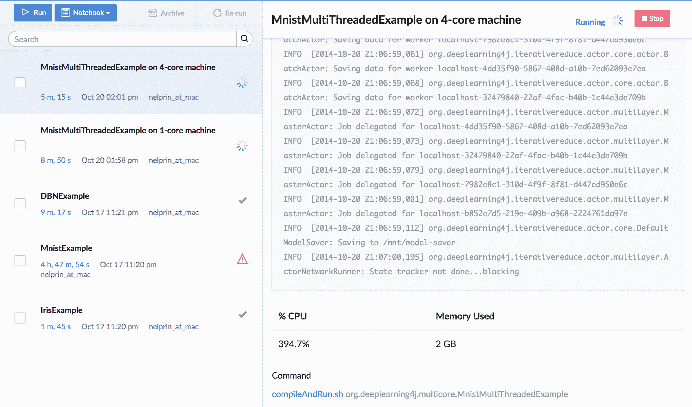

# 用 DL4J 和 Domino 进行深度学习

> 原文：<https://www.dominodatalab.com/blog/deep-learning-with-dl4j-and-domino>

The screenshot above shows several different "Runs" of the dl4j code on Domino, each one executing a different dl4j example. The selected run is the multi-core MNIST example, running on a 4-core machine.

## 面向 Java 的深度学习

[深度学习](/deep-learning-introduction)是机器学习的一个热门子领域，已被证明可以有效地学习通常只能由人类“解释”的数据集中的抽象表示。比如图像处理(人脸识别、图像搜索)、音频分类、文本分析。

[Deeplearning4j](https://en.wikipedia.org/wiki/Deeplearning4j) 是一个“商业级、开源的深度学习库...旨在用于商业环境，而不是作为一种研究工具。”因为我们正在构建 Domino 来处理相同的商业级分析用例，所以我们迫不及待地想了解关于这个库的更多信息。

因此，昨晚我们很兴奋地参加了 [SF 数据挖掘会议](http://www.meetup.com/Data-Mining/events/212445872/)，在那里 dl4j 的创造者 Adam Gibson 谈到了深度学习。有一点他说得非常清楚——一遍又一遍——深度学习不是万能的，也不是解决所有问题的好办法。具体来说，他的建议是将其用于媒体(图像、视频、音频、文本)和时间序列分析(例如，传感器数据馈送)。昨晚，当一名观众问及使用它进行欺诈检测(在这种情况下，检查分类逻辑至关重要)时，亚当说了类似这样的话:“我甚至不想在这里看到你。”=)我们欣赏这种诚实和直率。

虽然对 dl4j 的了解越来越多，但让我们更兴奋的是让 dl4j 在 Domino 上运行起来=)

尽管许多 Domino 用户使用 Python、R 和其他脚本语言，但从本质上来说，Domino 是一个任意代码执行器，因此它可以运行您想使用的任何语言的任何代码。因此，启动并运行一个 java 示例是小菜一碟。

## 为什么这很有用

dl4j 功能强大且灵活，但并不是所有的数据科学家和机器学习从业者都是软件工程师和基础设施专家。Domino 为您省去基础设施设置和配置的麻烦。例如，您不必担心如何为 AWS 机器设置所有需要的库，以及如何获得所有 maven 依赖项来编译 dl4j 示例代码。

通过使用 Domino，所有的设置都是为您处理的，您只需点击一下鼠标就可以在任何硬件上运行您的代码。同时，Domino 跟踪您的代码的每次运行，包括您的结果，因此您可以复制过去的工作并与其他人共享。或者您可以将您的模型打包成一个自助式 webform，以便非技术利益相关者可以使用它。