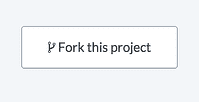
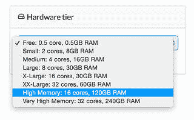
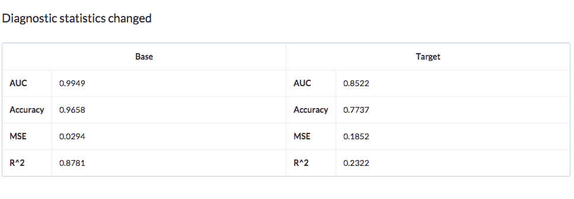

# 用 h2o.ai 进行深度学习

> 原文：<https://www.dominodatalab.com/blog/deep-learning-with-h2o-ai>

这篇文章提供了深度学习的简要历史教训和概述，以及使用 [H2O.ai](https://h2o.ai/) 将脚趾浸入水中的快速“如何”指南。然后，我描述了 Domino 如何让我们在可扩展的硬件上轻松运行 H2O，并跟踪我们深度学习实验的结果，以将分析提升到下一个级别。

## 重复过去会有回报

“深度学习”这两个词最近成了风险投资的时髦用语，也成了讨论即将到来的机器人末日的新闻素材。尽管深度学习不是我们想要的机器学习银弹，但谷歌、脸书、易贝和其他公司已经创建了许多令人印象深刻的深度学习应用程序，可以访问海量数据集。例如，在最近的 [Re。在波士顿举行的工作深度学习峰会](https://www.re-work.co/events/deep-learning-boston-2015)上，谷歌的凯文·墨菲讨论了一个新项目，该项目使用[深度学习来自动计算食物图像中的卡路里](https://www.popsci.com/google-using-ai-count-calories-food-photos)。这个消息像病毒一样在 T4 传播开来，就像一个会议上关于深度学习的幻灯片一样！当天晚些时候，在同一场会议上，亚历杭德罗·杰米斯(Alejandro Jaimes)展示了雅虎是如何超越仅仅给图片加标签，而对照片的“趣味性”等概念进行分级的。换句话说，深度学习可以用来学习创造力吗？

然而，在我们深入研究之前，让我们退后一步，问一问“为什么突然出现了深度学习炒作？”深度学习并不新鲜。事实上，深度学习的基础主要是一种更性感的方式，即使用梯度下降的反向传播和更大量的隐藏神经网络层。对于那些上过机器学习课程的人来说，backprop 可能是一个熟悉的术语。当我们大多数人都想知道为什么艾迪·墨菲认为一直发布“[Party](https://www.youtube.com/watch?v=S9pxgv6NTps)是个好主意的时候，一位著名的心理学家(大卫·鲁梅尔哈特)和未来的深度学习之父(杰弗里·辛顿)发表了开创性的、被高度引用的论文“[通过反向传播错误学习表征](https://www.iro.umontreal.ca/~vincentp/ift3395/lectures/backprop_old.pdf)”。

不幸的是，backprop 在 90 年代和 2000 年代过时了，但由于 2010 年代的一些关键发展，它又回来了(就像 80 年代的其他东西一样):1)大大增加的计算能力，2)大得多的数据集，以及 3)一些关键的算法调整(即 dropout，AdaGrad/AdaDelta 等。)来提高准确率。摩尔定律和互联网允许反向传播模型使用更大的训练集，具有不止一个隐藏的“神经元”层。然后，在 2006 年，Hinton 发表了另一篇被广泛引用的论文，“一种深度信念网络的快速学习算法”，它在很大程度上恢复了神经网络的合理使用。

如果你想知道深度学习算法的许多变体如何工作的细节，有几十种优秀的资源可供使用。以下是我最喜欢的几个:

*   https://deeplearning.net/tutorial/
*   [https://www.youtube.com/watch?v=n1ViNeWhC24](https://www.youtube.com/watch?v=n1ViNeWhC24)
*   [https://www.youtube.com/watch?v=S75EdAcXHKk](https://www.youtube.com/watch?v=S75EdAcXHKk)

## 和 H2O 一起深度学习

这篇文章的其余部分将展示如何使用 [h2o.ai](https://h2o.ai/) 在 Domino 中启动并运行深度学习实现。有[许多其他可用的包](https://www.kdnuggets.com/2015/06/top-20-python-machine-learning-open-source-projects.html)可以运行你的深度学习分析，但为了简单起见，让我们坚持以 h2o 作为一个好的起点。h2o 是用 Java 编写的，但是它绑定了 R 和 Python，这使得它非常灵活。

让我们开始吧。引用某人的话:“从本地考虑。全球行动。”换句话说，从在本地机器上安装 h2o 开始。Python 和 R 的安装都非常简单，除了一个小问题，这似乎是许多 Mac 用户在 Java 方面经常遇到的问题。即使您下载了最新版本的 Java，它仍可能在终端窗口中显示为 1.6 版。解决方法是将 JAVA_HOME 改为 1.8 版路径。

首先，进入 h2o 下载页面，下载 zip 文件。然后打开一个终端并运行:

```py
cd ~/Downloads

unzip h2o-3.0.0.16.zip

cd h2o-3.0.0.16

java -jar h2o.jar

```

好了，现在让我们直接在 R 中安装 h2o。将以下命令复制并粘贴到 R 中，一次一个，以查看每个命令的输出:

```py
# The following two commands remove any previously installed H2O packages for R.
if ("package:h2o" %in% search()) { detach("package:h2o", unload=TRUE) }
if ("h2o" %in% rownames(installed.packages())) { remove.packages("h2o") }

# Next, we download packages that H2O depends on.
if (! ("methods" %in% rownames(installed.packages()))) { install.packages("methods") }
if (! ("statmod" %in% rownames(installed.packages()))) { install.packages("statmod") }
if (! ("stats" %in% rownames(installed.packages()))) { install.packages("stats") }
if (! ("graphics" %in% rownames(installed.packages()))) { install.packages("graphics") }
if (! ("RCurl" %in% rownames(installed.packages()))) { install.packages("RCurl") }
if (! ("rjson" %in% rownames(installed.packages()))) { install.packages("rjson") }
if (! ("tools" %in% rownames(installed.packages()))) { install.packages("tools") }
if (! ("utils" %in% rownames(installed.packages()))) { install.packages("utils") }

# Now we download, install and initialize the H2O package for R.
install.packages("h2o", type="source", repos=(c("https://h2o-release.s3.amazonaws.com/h2o/rel-shannon/16/R")))

library(h2o)
localH2O = h2o.init()

# Finally, let's run a demo to see H2O at work.
demo(h2o.kmeans)
```

好了，现在让我们用 Python 安装。注意这只适用于 Python 2.7！

```py
pip install requests

pip install tabulate

pip uninstall h2o

pip install https://h2o-release.s3.amazonaws.com/h2o/rel-shannon/16/Python/h2o-3.0.0.16-py2.py3-none-any.whl

```

一旦你完成了全新的 h2o 安装，你可以在 GitHub 上克隆[我的教程。](https://github.com/seanlorenz/deep-domino.git)



现在，如果你在 deep-domino 文件夹中，我们准备打开`dl_h2o.r`(或`dl_h2o.py`)，你会看到这个特定的例子使用的是俄亥俄州立大学综合癌症中心的 Donn Young 博士收集的前列腺癌数据集。分析的目的是确定基线检查时测量的变量是否可用于预测肿瘤是否已穿透前列腺包膜。所提供的数据是以胶囊为基础的主要研究中变量的子集。

在加载数据并做了一些预处理后，H2O 使得只用一行代码运行深度学习算法成为可能。在 R 中:

```py
model = h2o.deeplearning(x = setdiff(colnames(prostate.hex),

   c("ID","CAPSULE")),

   y = "CAPSULE",

   training_frame = prostate.hex,

   activation = "RectifierWithDropout",

   hidden = c(10, 10, 10),

   epochs = 10000)
```

或者在 Python 中:

```py
model = h2o.deeplearning(x=prostate[list(set(prostate.col_names()) - set(["ID", "CAPSULE"]))],

y = prostate["CAPSULE"],

training_frame=prostate,

activation="Tanh",

hidden=[10, 10, 10],

epochs=10000)
```

让我们快速分解一下 [h2o.deeplearning 论点](https://h2o-release.s3.amazonaws.com/h2o/rel-shannon/12/docs-website/h2o-docs/index.html#Data%20Science%20Algorithms-Deep%20Learning):

*   `x`是我们的特性列表减去`ID`和`CAPSULE`列，因为我们将使用，
*   `CAPSULE`作为我们的`y`变量，
*   `training_frame`是，嗯，我们的火车数据帧(触目惊心！),
*   `activation`表示当信号乘以网络中某个神经元的权重时使用的非线性激活函数的类型，
*   `hidden`表示，在本例中，我们希望使用三层，每层 10 个神经元，并且
*   `epochs`设置要执行的训练数据集的遍数。

就是这样！现在，我们简单地在模型上运行预测，然后检查我们的深度学习分类器的表现如何，如下所示:

```py
predictions = model.predict(prostate)

predictions.show()

performance = model.model_performance(prostate)

performance.show()
```

## Domino 中更好的 H2O 分析

在 Domino 中运行我们的 Python 脚本之前，有一点需要注意。h2o 喜欢安装在`/usr/local`中，而默认情况下 Python 会在`/usr`中寻找它。这可不是什么好事。你会在`dl_h2o.py`的前几行看到我们的修正:

```py
import sys
sys.prefix = "/usr/local"

import h2o
h2o.init(start_h2o=True)
```

### 更多动力

如果还没有，在 Python 或 R 脚本上点击 **Run** 来查看 Domino 中的输出。向下滚动到底部的“最大指标”，您会看到我们获得了 98.4%的准确率。还不错！不幸的是，用 Domino 的免费 0.5 内核& 0.5GB RAM 层和
引用 Homer Simpson 的话[我现在就要！](https://www.youtube.com/watch?v=c9EBhaULToU)“Domino 可以轻松扩展您的硬件，以便更快地看到结果。我继续在 R 中运行深度学习演示，以查看不同层的持续时间。

| 硬件层 | 持续时间 |
| 免费(0.5 个内核，1GB) | 4m，20s |
| 小型(双核，8GB) | 1 米，11 秒 |
| 中型(4 核，16GB) | 38s |
| 大型(8 核，30GB) | 34s |

### 简单的实验跟踪和比较

最后，像所有其他机器学习方法一样，您需要改变参数，如隐藏神经元(和层)的数量或激活函数，以查看在特定数据集上什么效果最好。为了让生活更简单，我强烈推荐使用 Domino 的[诊断统计](https://support.dominodatalab.com/hc/en-us/articles/204348169-Run-Diagnostic-Statistics)特性来快速浏览关键性能指标。在我们的 R 演示脚本中，我们可以提取关键统计数据，并将其添加到一个 *dominostats.json* 文件中，如下所示:

```py
r2 <- performance@metrics$r2

mse <- performance@metrics$MSE

auc <- performance@metrics$AUC

accuracy <- performance@metrics$max_criteria_and_metric_scores$value[4]

diagnostics = list("R^2"=r2, "MSE"=mse, "AUC"=auc, "Accuracy"=accuracy)

library(jsonlite)
fileConn <- file("dominostats.json")
writeLines(toJSON(diagnostics), fileConn)
close(fileConn)
```

Python 以稍微不同的方式处理这些指标的输出，并且具有稍微简单一些的格式:

```py
r2 = performance.r2()

mse = performance.mse()

auc = performance.auc()

accuracy = performance.metric('accuracy')[0][1]

import json

with open('dominostats.json', 'wb') as f:

    f.write(json.dumps({"R^2": r2, "MSE": mse, "AUC": auc, "Accuracy": accuracy}))
```

Domino 在项目中检查这个文件，然后将这些 JSON 元素添加到 Runs 输出屏幕。

现在让我们回过头来，将激活函数从 tanh 修改为 converterwithdropolito，并再次运行分析。同样，我们在底部得到了我们关键指标的一个很好的概要，但是现在这里还有一个额外的项目。如果我们选择两次运行并点击“Compare ”,下面的屏幕截图让我们以一个漂亮的表格格式并排看到我们的关键指标。



哎哟。看起来 converterwithdropoligo 不是这里正确的激活函数。

## 结论

现在，您知道了如何开始使用 H2O 的 Domino 来运行和比较深度学习分析。我们仅仅触及了 H2O 深度学习能力的皮毛。目前有 *49 个不同的输入参数*可以用 h2o.deeplearing 进行修改，所以即使一行代码让你自己编写了一个深度学习神经网络，你仍然需要学习很多东西，以获得最大的回报。谢天谢地，现在有很多令人惊叹的深度学习资源。快乐学习！