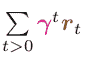

# 深度强化学习

> 原文：<https://www.dominodatalab.com/blog/deep-reinforcement-learning>

*本文提供了《深度强化学习》一书的节选，[深度学习图鉴](http://www.informit.com/store/deep-learning-illustrated-a-visual-interactive-guide-9780135116692?utm_source=Referral&utm_medium=DominoLabs&utm_campaign=Krohn&utm_term=DLBook)作者[克罗恩](https://www.linkedin.com/in/jonkrohn/)，[贝维尔德](https://www.linkedin.com/in/grantbey/)，以及[巴森斯](https://twitter.com/aglaebassens)。本文包括强化学习理论的概述，重点是深度 Q 学习。它还包括使用 Keras 构建一个深度 Q 学习网络，在模拟视频游戏环境中学习。非常感谢 Addison-Wesley Professional 允许摘录这一章。一个补充的 [Domino 项目是可用的](https://try.dominodatalab.com/u/domino-johnjoo/Deep-Reinforcement-Learning/overview)。*

## 介绍

机器学习领域的最新成就，如开发一个在围棋比赛中击败人类的程序，都是由强化学习推动的。强化学习是通过结合奖励和惩罚来激励程序，训练程序通过试错来达到目标的过程。一个*代理人*在一个*环境*的限制下工作，以最大化其报酬。从游戏到模拟进化，强化学习一直被用作探索突现行为的工具。在 Domino 寻求帮助数据科学家加速他们的工作时，我们联系了 AWP·皮尔森，请求他允许我们从克罗恩、贝维尔德和巴森斯所著的《深度学习图解:人工智能的可视化互动指南》一书中摘录“深度强化学习”一章。非常感谢 AWP·皮尔逊提供了摘录作品的许可，并使我们能够提供一个补充的 Domino 项目。

这个项目解决了经典的车杆问题，也就是平衡一根连接在可移动车上的杆。内容包括

*   使用 Keras 和 OpenAI Gym 创建深度学习模型并提供训练环境
*   定义代理
*   代理和环境之间的交互建模


## 深度强化学习

在第 4 章的[中，我们介绍了强化学习的范例(区别于监督和非监督学习)，其中一个代理(例如，一个算法)在一个环境中采取顺序动作。环境——无论是模拟的还是真实的世界——都可能极其复杂且瞬息万变，需要老练的代理人能够适当地适应，以便成功地实现他们的目标。今天，许多最多产的*强化学习*代理都涉及人工神经网络，使它们成为深度强化学习算法。](http://www.informit.com/store/deep-learning-illustrated-a-visual-interactive-guide-9780135116692?utm_source=Referral&utm_medium=DominoLabs&utm_campaign=Krohn&utm_term=DLBook)

在本章中，我们将

*   涵盖强化学习的基本理论，特别是称为深度 Q 学习的深度强化学习模型
*   使用 Keras 构建深度 Q 学习网络，学习如何在模拟的视频游戏环境中脱颖而出
*   讨论优化深度强化学习代理性能的方法
*   介绍深度 Q 学习之外的深度 RL 代理系列

## 强化学习的基本理论

回想一下第 4 章，[具体来说，图 4.3](http://www.informit.com/store/deep-learning-illustrated-a-visual-interactive-guide-9780135116692?utm_source=Referral&utm_medium=DominoLabs&utm_campaign=Krohn&utm_term=DLBook) 表明*强化学习*是一种机器学习范例，包括:

*   一个*代理*在一个*环境*中采取一个*动作*(假设该动作在某个时间步长 *t* 发生)。
*   环境向代理返回两种类型的信息:
    *   *奖励:*这是一个标量值，提供代理在时间步长 *t* 采取的行动的量化反馈。例如，这可以是 100 点，作为在视频游戏“吃豆人”中获得樱桃的奖励。代理的目标是最大化它积累的奖励，因此奖励是*加强*代理在特定环境条件下发现的生产行为。
    *   *状态*:这是环境如何响应代理的动作而变化。在接下来的时间步( *t* + 1)中，这些将是代理选择动作的条件。
*   循环重复上述两个步骤，直到达到某个终端状态。例如，可以通过获得最大可能的奖励、获得一些特定的期望结果(例如自动驾驶汽车到达其编程目的地)、用完分配的时间、用完游戏中允许的最大移动次数或者游戏中的代理死亡来达到这种最终状态。

强化学习问题是顺序决策问题。在第 4 章的[中，我们讨论了一些特殊的例子，包括:](http://www.informit.com/store/deep-learning-illustrated-a-visual-interactive-guide-9780135116692?utm_source=Referral&utm_medium=DominoLabs&utm_campaign=Krohn&utm_term=DLBook)

*   Atari 视频游戏，如吃豆人、乒乓和突围
*   自动驾驶车辆，如自动驾驶汽车和空中无人机
*   棋盘游戏，如围棋、国际象棋和日本象棋
*   机器人手臂操作任务，如用锤子移除钉子

## 车杆游戏

在这一章中，我们将使用 open ai Gym——一个流行的强化学习环境库(图 4.13 中提供了示例)[int the book]——来训练一个代理玩 Cart-Pole，这是在控制理论领域工作的学者之间的一个经典问题。在推车杆游戏中:

*   目标是平衡推车顶部的杆子。柱子在一个紫色点处与手推车相连，该点作为一个销，允许柱子沿水平轴旋转，如图 13.1 所示。[注意:图 4.13a 中提供了一个推车杆游戏的实际屏幕截图。]


*   手推车本身只能水平移动，要么向左，要么向右。在任何给定的时刻——在任何给定的时间步长——购物车必须向左或向右移动；它不能保持静止。
*   游戏的每一集开始时，手推车被放置在屏幕中心附近的随机点上，杆子处于接近垂直的随机角度。


*   如图 13.2 所示，当出现以下任一情况时，一集结束
    *   杆子在推车上不再平衡——也就是说，当
        杆子的角度从垂直方向向水平方向移动得太远时
    *   购物车触及边界——屏幕的最右边或最左边
*   在你将在本章中玩的游戏版本中，每集的最大时间步数是 200。因此，如果这一集没有提前结束(由于失去平衡或离开屏幕)，那么游戏将在 200 个时间步后结束。
*   每集的每一个时间点都有一点奖励，所以最高奖励是 200 点。

车杆游戏是一个流行的入门强化学习问题，因为它非常简单。对于自动驾驶汽车，实际上有无限多种可能的环境状态:当它沿着道路行驶时，它的无数传感器——相机、雷达、激光雷达、加速度计、麦克风等等——以每秒千兆字节的数据量级，从车辆周围的世界传输大量的状态信息。[注:与雷达原理相同，但使用激光代替[声音](https://www.linkedin.com/pulse/20130502024505-9947747-google-s-self-driving-car-gathers-nearly-1-gb-per-second/)。与之形成鲜明对比的是，车杆游戏只有四条状态信息:

1.  购物车沿一维水平轴的位置
2.  2.手推车的速度
3.  极点的角度
4.  极点的角速度

同样，自动驾驶汽车可能会做出一些相当细微的动作，比如加速、刹车和左右转向。在推车杆游戏中，在任何给定的时间步长 *t* ，只能从两个可能的动作中选择一个动作:向左移动或向右移动。

## 马尔可夫决策过程

强化学习问题在数学上可以定义为一种叫做马尔可夫决策过程的东西。MDP 的特点是所谓的*马尔可夫属性*——假设当前时间步长包含来自先前时间步长的关于环境状态的所有相关信息。对于手推车-杆子游戏，这意味着我们的代理将通过仅考虑手推车的属性(例如，它的位置)和杆子的属性(例如，它的角度)来选择在给定的时间步长 *t* 向右或向左移动。[注意:马尔可夫属性在许多金融交易策略中被假定。例如，交易策略可能会考虑给定交易日结束时在给定交易所上市的所有股票的价格，而不会考虑前一天的股票价格。]


如图 13.3 所示，MDP 由五个部分定义:

1.  *S* 是所有可能*状态*的集合。按照集合论惯例，每个单独的可能状态(即小车位置、小车速度、极角和角速度的特定组合)由小写的 *s* 表示。即使当我们考虑相对简单的车杆游戏时，其四个状态维度的可能重组数量也是巨大的。举几个粗略的例子，手推车可以在屏幕的最右边缓慢移动，杆子垂直平衡，或者手推车可以在杆子以大角度顺时针转动的情况下快速移动到屏幕的左边。
2.  *A* 是所有可能动作的集合。在车杆游戏中，这套只有两个元素(*左*和*右*)；其他环境有更多。每个单独的可能动作被表示为 *a* 。
3.  *R* 是给定一个*状态-动作*对——某个特定状态与某个特定动作配对——的奖励分配，记为( *s，a* )。这是一种概率分布:完全相同的状态-行为对( *s，a* )可能在不同的场合随机产生不同数量的奖励 *r* 。[注意:虽然这在一般的强化学习中是正确的，但车杆游戏是一个相对简单的完全确定的环境。在推车杆游戏中，完全相同的状态-动作对( *s，a* )实际上每次都会产生相同的回报。为了说明强化学习的一般原理，我们在本节中使用了一些例子，这些例子暗示了车杆游戏比它实际上更不确定。]奖励分配的细节*R*——它的形状，包括它的均值和方差——对代理人来说是隐藏的，但可以通过在环境中采取行动来瞥见。例如，在图 13.1 中，您可以看到购物车在屏幕中居中，柱子稍微向左倾斜。【注:为了简单起见，这个例子我们忽略大车速度和极角速度，因为我们无法从这个静态图像中推断出这些状态方面。]我们预计，相对于将向右移动的动作与此状态配对而言，将向左移动的动作与此状态 *s* 配对平均来说会对应于更高的预期奖励 *r* :在此状态下向左移动 *s* 会导致杆子更加直立，增加杆子保持平衡的时间步长数，从而倾向于导致更高的奖励 *r* 。另一方面，在这种状态下向右移动 *s* 会增加杆子朝水平方向倒下的可能性，从而倾向于游戏提前结束，并获得较小的奖励 *r* 。
4.  p 和 *R* 一样，也是概率分布。在这种情况下，它表示在当前时间步 *t* 中给定特定状态-动作对( *s，a* )的下一个状态(即 *st+1* )的概率。像 *R* 一样， *P* 分布对代理是隐藏的，但是它的各个方面可以通过在环境中采取行动来推断。例如，在推车杆游戏中，代理学习*向左*动作直接对应于推车向左移动是相对简单的。[注意:与本书中的所有其他人工神经网络一样，深度强化学习代理中的 ann 是用随机起始参数初始化的。这意味着，在任何学习之前(例如，通过玩几集推车游戏)，代理人甚至不知道某个状态-动作对 *(s，a)* 和下一个状态 *st+1* 之间最简单的关系。例如，尽管对于玩车杆游戏的人来说，向左的动作应该导致车向左移动可能是直观和明显的，但是对于随机初始化的神经网络来说，没有什么是“直观”或“明显”的，因此所有的关系必须通过游戏来学习。]更复杂的关系——例如，图 13.1 中捕捉到的状态 s 中的左动作往往对应于下一个状态 *st+1* 中更垂直取向的极点——将更难学习，因此需要更多的游戏性。
5.  *γ* (gamma)是一个超参数，称为*贴现因子*(也称为*衰变*)。为了解释它的意义，让我们暂时离开推车杆子游戏，回到吃豆人。同名的 Pac-Man 角色探索一个二维表面，收集水果可以获得奖励点数，如果被追逐他的鬼魂之一抓住就会死去。如图 13.4 所示，当代理人考虑预期奖励的价值时，它应该将可以立即获得的奖励(比如，获得距离吃豆人只有一个像素的樱桃的 100 分)看得比需要更多时间才能获得的同等奖励(距离 20 个像素的樱桃的 100 分)更高。眼前的奖励比遥远的奖励更有价值，因为我们不能指望遥远的奖励:一个幽灵或其他危险可能会妨碍吃豆人。【注:γ贴现因子类似于会计中常见的贴现现金流计算:一年后的预期收入相对于今天的预期收入进行贴现。在这一章的后面，我们将介绍价值函数(V)和 Q 值函数(Q)的概念。V 和 Q 都包含了γ，因为它防止了它们在具有无限可能的未来时间步长的游戏中变得无界(从而在计算上不可能)。]如果我们设置 *γ* = 0.9，那么一个时间步长之外的樱桃将被认为值 90 分，[注意:100 ×γt = 100 × 0.91 = 90]而 20 个时间步长之外的樱桃将被认为仅值 12.2 分。[注:100×γt =100×0.920 =12.16 ]

## 最优策略

MDP 的最终目标是找到一个函数，使得代理在遇到所有可能的环境状态 *S* 中的任何特定状态 S 时，能够采取适当的动作 *a* (从所有可能的动作 *A* 的集合中)。换句话说，我们希望我们的代理学习一个函数，使它能够*映射* *S* 到 *A* 。如图 13.5 所示，这样的函数用π表示，我们称之为*策略函数*。

用通俗的语言来说，政策函数π的高级思想是这样的:不管代理人发现自己处于什么样的特定环境，它应该遵循什么样的*政策*才能使其报酬最大化？对于这种回报最大化思想的更具体的定义，欢迎你仔细阅读:


在这个等式中:


*   J(π)被称为目标函数。这是一个我们可以应用机器学习技术来实现回报最大化的功能。[注:本书中提到的成本函数(又称损失函数)是目标函数的例子。成本函数返回一些成本值 C，而目标函数 J(π)返回一些回报值 r。对于成本函数，我们的目标是最小化成本，因此我们对它们应用梯度下降(如图 8.2 中的山谷下降三叶虫所示)。相比之下，对于函数 J(π)，我们的目标是最大化回报，因此我们在技术上对其应用梯度上升(想象图 8.2 的图像，想象一只三叶虫徒步旅行以识别山峰)，即使数学与梯度下降相同。]
*   π表示将 *S* 映射到 *A* 的任何策略函数。
*   π∫表示将 S 映射到 a 的特定最优策略(在所有潜在的π策略中)。也就是说，π∫是一个函数，它将返回一个动作 a，该动作将导致代理获得最大可能的未来折扣奖励。
    
*   计算贴现的未来报酬

在所有未来时间步长(即 t>0)，我们执行以下操作。

通过将它们全部相加(使用σ)。

## 深度 Q 学习网络的基本理论

在上一节中，我们将强化学习定义为马尔可夫决策过程。在本节的最后，我们指出，作为 MDP 的一部分，我们希望我们的代理——当它在任何给定的时间步长 *t* 遇到任何给定的状态 s 时——遵循某个最优策略π∫，这将使它能够选择一个行动 a，使它能够获得的贴现未来报酬最大化。问题是——即使是像车杆游戏这样相当简单的强化学习问题——也很难计算出(或者至少计算效率非常低)最终计算出最大的累积未来折扣奖励

因为所有可能的未来状态 *S* 和所有可能的行动 *A* 在这些未来状态下可能采取的行动，有太多可能的未来结果需要考虑。因此，作为一种计算捷径，我们将描述 Q- *学习*方法，用于*估计*在给定情况下最优行动 a 可能是什么。

## 价值函数

Q-learning 的故事最容易通过解释*值函数*来描述。价值函数由 V π ( *s* 定义。它向我们提供了一个指示，即如果我们的代理从一个给定的状态 s 开始遵循它的策略π，那么该状态的价值有多大。

作为一个简单的例子，再考虑一下图 13.1 中的状态。[注意:正如我们在本章前面所做的，我们只考虑大车位置和杆子位置，因为我们不能从这个静止图像推测大车速度或杆子角速度。假设我们的代理人已经有一些合理合理的政策π来平衡极点，那么我们期望它在这种状态下获得的累积贴现未来回报可能相当大，因为极点接近垂直。于是，这个特定状态 s 的值 V π ( *s* )为高。

另一方面，如果我们想象极点角度接近水平的状态 *s* h，它的值——Vπ(*s*h)——更低，因为我们的代理已经失去了对极点的控制，因此该事件很可能在接下来的几个时间步长内终止。

## q 值函数

Q- *价值函数*建立在价值函数的基础上，不仅考虑状态:它还考虑特定动作与给定状态配对时的效用——也就是说，它重新组合了我们的老朋友，即由(s，a)表示的状态-动作对。因此，在价值函数由 V π (s)定义的情况下，Q 值函数由 Qπ定义( *s，a* )。[注意:Q 值中的“Q”代表质量，但是你很少听到从业者称之为“质量-价值函数”]

让我们再次回到图 13.1。将动作*左*(姑且称之为*a1*)与状态 *s* 配对，然后从那里遵循一个极点平衡策略π，通常应该对应于一个较高的累积贴现未来回报。因此，这个状态-动作对( *s，aL* )的 Q 值是高的。

相比之下，让我们考虑将图 13.1 中的动作*右*(我们可以称之为 *aR* )与状态 s 配对，然后从那里遵循极点平衡策略π。尽管这可能不会被证明是一个惊人的错误，但相对于采取*左*行动，累积的贴现未来回报可能会稍微低一些。在这种状态下 *s* ，向左*的动作通常会使竿子变得更加垂直(使竿子能够更好地控制和平衡)，而向右的动作通常会使竿子变得更加水平——因此，控制更少，并且该事件更有可能提前结束。总而言之，我们期望( *s，aL* )的 Q 值高于 *(s，aR* )的 Q 值。*

## 估计最佳 Q 值

当我们的代理遇到某个状态 *s* 时，我们希望它能够计算出*最优 Q 值*，记为*Q∫(s，a)* 。我们可以考虑所有可能的行动，具有最高 Q 值的行动——最高的累积贴现未来回报——将是最佳选择。

同样，即使对于相对简单的强化学习问题，最终计算最优策略π∫(方程 13.1)在计算上也是困难的，因此，最终计算最优 Q 值 Q∫(s，a)在计算上也是困难的。通过深度 Q 学习的方法(如第 4 章中介绍的；见图 4.5)，但是，我们可以利用人工神经网络来估计最佳 Q 值可能是多少。这些深度 Q 学习网络(简称 dqn)依赖于这个等式:


在这个等式中:

*   最佳 Q 值*(Q∫(s，a)* )正在被逼近。
*   Q 值近似函数除了其通常的状态 s 和动作 a 输入之外，还结合了神经网络模型参数(由希腊字母 theta，θ表示)。这些参数是我们从第 6 章开始熟悉的常用人工神经元权重和偏差。

在推车杆游戏的环境中，装备有等式 13.2 的 DQN 代理人可以在遇到特定状态 s 时，计算将动作 a(左或右)与该状态配对是否对应于更高的预测累积折扣未来奖励。比方说，如果预测左与更高的累积贴现未来回报相关，那么这就是应该采取的行动。在下一节中，我们将编写一个 DQN 代理，它包含一个 Keras 构建的密集神经网络，以演示如何实现这一点。

```py
For a thorough introduction to the theory of reinforcement learning,

including deep Q-learning networks, we recommend the recent edition of

Richard Sutton (Figure 13.6) and Andrew Barto’s Reinforcement Learning:

An Introduction,15 which is available free of charge at bit.ly/SuttonBarto.

```


## 定义 DQN 代理

在我们的 *Cartpole DQN* Jupyter 笔记本中提供了我们的代码，用于定义一个学习如何在环境中行动的 DQN 智能体——在这个特定的例子中，它恰好是来自 OpenAI Gym 环境库的 Cart-Pole 游戏。[注意:我们的 DQN 代理直接基于 Keon Kim 的，可从他在 bit.ly/keonDQN.的 GitHub 库获得]它的依赖关系如下:

```py
import random
import gym
import numpy as np
from collections import deque
from keras.models import Sequential from keras.layers import Dense
from keras.optimizers
import Adam
import os
```

名单中最重要的新成员是`gym`，开放式人工智能健身房本身。像往常一样，我们在应用时会更详细地讨论每个依赖项。我们在笔记本顶部设置的超参数在示例 13.1 中提供。

### 示例 13.1 大车极 DQN 超参数

```py
env = gym.make("CartPole-v0")
state_size = env.observation_space.shape[0]
action_size = env.action_space.n
batch_size = 32
n_episodes = 1000
output_dir = "model_output/cartpole/"
if not os.path.exists(output_dir):
    os.makedirs(output_dir)
```

让我们一行一行地看看这段代码:

*   我们使用开放式人工智能健身房`make()`方法来指定我们希望我们的代理与之交互的特定环境。我们选择的环境是车杆游戏的零版本(v0)，我们把它赋给变量`env`。在你自己的时间里，你可以选择一个替代的开放人工智能健身房环境，如图 4.13 所示。

从环境中，我们提取两个参数:

示例 13.2 中提供了创建 DQN 代理 Python 类的大量代码，称为`DQNAgent`。

### 示例 13.2 深度 Q 学习代理

```py
class DQNAgent:
    def __init__(self, state_size, action_size):
        self.state_size = state_size
        self.action_size = action_size
        self.memory = deque(maxlen=2000)
        self.gamma = 0.95
        self.epsilon = 1.0
        self.epsilon_decay = 0.995
        self.epsilon_min = 0.01
        self.learning_rate = 0.001
        self.model = self._build_model()

    def _build_model(self):
        model = Sequential() 
        model.add(Dense(32, activation="relu",
                        input_dim=self.state_size))
        model.add(Dense(32, activation="relu"))
        model.add(Dense(self.action_size, activation="linear"))
        model.compile(loss="mse",
                     optimizer=Adam(lr=self.learning_rate))
        return model

    def remember(self, state, action, reward, next_state, done): 
        self.memory.append((state, action,
                            reward, next_state, done))

    def train(self, batch_size):
         minibatch = random.sample(self.memory, batch_size)
            for state, action, reward, next_state, done in minibatch:
                target = reward # if done 
            if not done:
                target = (reward +
                          self.gamma *
                          np.amax(self.model.predict(next_state)[0]))
            target_f = self.model.predict(state)
            target_f[0][action] = target
            self.model.fit(state, target_f, epochs=1, verbose=0) 
        if self.epsilon &amp;gt; self.epsilon_min:
                self.epsilon *= self.epsilon_decay

    def act(self, state):
        if np.random.rand() &amp;lt;= self.epsilon:
                return random.randrange(self.action_size) 
        act_values = self.model.predict(state)
            return np.argmax(act_values[0])

    def save(self, name): 
        self.model.save_weights(name)
```

## 初始化参数

我们从示例 13.2 开始，用一些参数初始化该类:

*   `state_size`和`action_size`是特定于环境的，但是在车杆游戏中分别是 4 和 2，如前所述。
*   `memory`用于存储*记忆*，这些记忆可以随后*回放*，以便训练我们 DQN 的神经网络。内存被存储为一个名为 *deque* (读作“deck”)的数据结构的元素，它与一个列表相同，只是——因为我们指定 maxlen = 2000——它只保留 2000 个最近的内存。也就是说，每当我们试图将第 2001 个元素追加到 deque 上时，它的第一个元素就会被删除，总是留给我们一个包含不超过 2000 个元素的列表。
*   `gamma`是我们在本章前面介绍的贴现因子(又称衰变率)γ(见图 13.4)。此代理超参数在未来时间步长中贴现预期奖励。有效γ值通常接近 1(例如，0.9、0.95、0.98 和 0.99)。越接近 1，我们对未来回报的折现就越少。[注意:事实上，如果你设定γ = 1(我们不建议这样)，你根本不会贴现未来的回报。]调整强化学习模型(如γ)的超参数可能是一个复杂的过程；在本章快结束时，我们将讨论一个叫做 SLM Lab 的工具，它可以有效地实现这一目标。
*   `epsilon`——用希腊字母ε表示——是另一个强化学习超参数，叫做*探索率*。它代表了我们的代理的随机行动(使它能够探索这样的行动对下一个状态 *st+1* 的影响和环境返回的回报 *r* 的影响)相对于我们允许它的行动*利用*它的神经网络通过游戏积累的现有“知识”的频率的比例。在玩任何一集之前，代理人都没有游戏经验可利用，所以最常见的做法是 100%的时间开始探索；这就是我们设置`epsilon = 1.0`的原因。
*   随着代理获得游戏经验，我们非常缓慢地*衰减*它的探索速度，以便它可以逐渐利用它所学到的信息(希望使它能够获得更多的奖励，如图 13.7 所示)。也就是说，在代理播放的每一集的结尾，我们用它的ε乘以`epsilon_decay`。此超参数的常见选项为 0.990、0.995 和 0.999。[注意:类似于设置γ = 1，设置`epsilon_decay` = 1 将意味着ε根本不会衰减——也就是说，以连续的速率探索。对于这个超参数来说，这是一个不寻常的选择。]
*   `epsilon_min`是勘探率ε可以*衰减*到多低的下限(最小值)。该超参数通常设置为接近零值，例如 0.001、0.01 或 0.02。我们将它设置为 0.01，这意味着在ε衰减到 0.01 之后(在我们的案例中，到第 911 集时将会如此)，我们的代理将只探索它所采取的 1%的动作——在其他 99%的时间里利用它的游戏体验。[注意:如果在这个阶段这个探索率的概念有些不清楚，当我们稍后检查我们代理的逐集结果时，它会变得更清楚。]
*   `learning_rate`是我们在第 8 章中介绍的相同的随机梯度下降超参数。
*   最后， `_build_model()`——通过包含其前导下划线——被建议作为一个*私有*方法。这意味着这个方法只推荐在“内部”使用——也就是说，只由类`DQNAgent`的实例使用。

## 建立智能体的神经网络模型

例 13.2 的`_build_model()`方法致力于构建和编译一个 Keras 指定的神经网络，该网络将环境状态 s 映射到每个可用动作 a 的智能体 Q 值。一旦通过游戏训练，智能体将能够使用预测的 Q 值来选择它应该采取的特定动作，给定它遇到的特定环境状态。在这个方法中，没有你在这本书里没见过的东西:

*   我们指定一个顺序模型。
*   我们在模型中添加了以下几层神经元。
*   第一个隐藏层是致密的，由 32 个 ReLU 神经元组成。使用`input_dim`参数，我们指定网络输入层的形状，它是环境状态信息 *s* 的维度。在 cart-pole 环境中，这个值是一个长度为 4 的数组，每个元素对应一个 Cart 位置、Cart 速度、Pole 角度和 Pole 角速度。[注意:在 Cart-Pole 以外的环境中，状态信息可能要复杂得多。例如，对于像 Pac-Man 这样的 Atari 视频游戏环境，状态 s 将由屏幕上的像素组成，这将是二维或三维输入(分别用于单色或全色)。在这种情况下，第一个隐藏层的更好选择是卷积层，如`Conv2D`(见第 10 章)。]
*   第二隐层也很密集，有 32 个 ReLU 神经元。如前所述，我们将通过在本章后面讨论 SLM 实验室工具来探索超参数选择——包括我们如何专注于特定的模型架构。
    *   输出层具有对应于可能动作数量的维度。[注:本书中任何先前只有两种结果的模型(如第 11 和 12 章)都使用了单个乙状结肠神经元。在这里，我们为每个结果指定单独的神经元，因为我们希望我们的代码能够超越车杆游戏。虽然 Cart-Pole 只有两个动作，但许多环境有两个以上的动作。]在推车杆游戏中，这是一个长度为 2 的数组，一个元素代表左边的*，另一个元素代表右边的*。与回归模型一样(见示例 9.8)，使用 DQNs，直接从神经网络输出 *z* 值，而不是转换成 0 到 1 之间的概率。为了做到这一点，我们指定了`linear`激活函数，而不是 sigmoid 或 softmax 函数，否则这本书将占主导地位。**

***   正如我们在编译回归模型(示例 9.9)时所指出的，当我们在输出层使用线性激活时，均方差是成本函数的合适选择，因此我们将`compile()`方法的 loss 参数设置为`mse`。我们回到我们的日常优化选择，`Adam`。**

 **## 记忆游戏

在任何给定的时间步长 t，也就是说，在强化学习循环的任何给定迭代过程中(参见图 13.3)，DQN 代理的`remember()`方法运行，以便在其`memory`队列的末尾添加一个内存。该队列中的每个存储器由关于时间步长 *t* 的五条信息组成:

1.  代理遇到的状态 *s*[t]
2.  代理采取的动作*a*T2
3.  环境返还给代理人的报酬*r*T2
4.  next_state *s*[t+1] 环境也返回给代理
5.  如果时间步长 t 是剧集的最后一次迭代，则布尔标志 done 为真，否则为`false`

## 通过记忆回放进行训练

DQN 代理的神经网络模型通过*回放游戏的记忆*来训练，如例 13.2 的`train()`方法所示。该过程从从`memory`队列(最多可容纳 2000 个内存)中随机抽取 32 个`minibatch`(根据代理的`batch_size`参数)内存开始。从一个更大的主体经历集合中抽取一小部分记忆样本，可以提高模型训练的效率:比如说，如果我们使用 32 个最近的记忆来训练我们的模型，那么这些记忆中的许多状态会非常相似。为了说明这一点，考虑一个时间步长 *t* ,其中小车位于某个特定位置，杆接近垂直。相邻的时间步长(例如，*t*-1， *t* + 1， *t* + 2)也可能处于几乎相同的位置，极点处于接近垂直的方向。通过从大范围的记忆中取样，而不是从时间上最接近的记忆中取样，模型将在每一轮训练中获得更丰富的经验来学习。

对于 32 个采样的记忆中的每一个，我们进行如下一轮模型训练:如果`done is True`——也就是说，如果记忆是一集的最后一个时间步——那么我们明确地知道，从这个时间步可以获得的最高可能的奖励等于`reward` *r*[t] 。因此，我们可以设置`target`奖励等于`reward`。

否则(即`if done is False`)我们会尝试估计`target`的回报——最大的未来贴现回报——可能是多少。我们从已知的`reward` *r*[t] 开始进行估算，然后加上贴现因子γ。]最大未来 Q 值。通过将下一个(即*未来*)状态 *s*[t+1] 传递到模型的`predict()`方法中来估计可能的未来 Q 值。在 Cart-Pole 游戏的上下文中这样做将返回两个输出:一个输出用于左操作，另一个输出用于右操作。这两个输出中较高的一个(由 NumPy `amax`函数确定)是最大的预测未来 Q 值。

无论`target`是明确已知的(因为时间步长是一集的最后一步)还是使用最大未来 Q 值计算来估计的，我们都在`train()`方法的`for loop`中继续前进:

*   我们再次运行`predict()`方法，传入*当前*状态 st。和以前一样，在推车杆游戏的上下文中，这返回两个输出:一个用于左边的动作，一个用于右边的动作。我们将这两个输出存储在变量`target_f`中。
*   无论代理在这个内存中实际采取了什么动作，我们都使用`target_f[0][action] = target`来用目标回报替换那个`target_f`输出。[注意:我们这样做是因为我们只能根据代理人实际采取的行动来训练 Q 值估计值:我们根据`next_state` *s*[t+1] 来估计目标值，并且我们只知道代理人在时间步长 *t* 实际采取的 *s*[t+1] 是多少。我们不知道如果代理采取了不同于它实际采取的行动，环境可能会返回到什么下一个状态。]

我们通过调用`fit()`方法来训练模型。

*   模型输入是*当前*状态*s*t 并且它的输出是`target_f`，它包含了我们对最大未来贴现回报的近似。通过调整模型的参数(由方程 13.2 中的 *θ* 表示)，我们因此提高了其准确预测在任何给定状态下更有可能与未来报酬最大化相关的行为的能力。
*   在很多强化学习问题中，`epochs`可以设置为`1`。我们不需要多次循环利用现有的训练数据集，而是可以廉价地参与更多集的车杆游戏(例如)来生成我们想要的尽可能多的新训练数据。
*   我们设置`verbose=0`是因为我们在这个阶段不需要任何模型拟合输出来监控模型训练的进度。正如我们稍后演示的，我们将逐集监控代理的性能。

## 选择要采取的行动

为了在给定的时间步长 *t* 选择要采取的特定动作*a*t[t]，我们使用代理的`act()`方法。在此方法中，NumPy `rand`函数用于对 0 到 1 之间的随机值进行采样，我们称之为 v。结合我们代理的`epsilon`、`epsilon_decay`和`epsilon_min`超参数，此`v`值将为我们确定代理是采取探索性行动还是剥削性行动:

*   如果随机值 *v* 小于或等于探索速率ε，则使用`randrange`功能选择随机探索动作。在早期情节中，当ε较高时，大多数动作将是探索性的。在以后的剧集中，随着ε越来越衰减(根据 epsilon_decay 超参数)，代理采取的探索动作会越来越少。
*   否则——也就是说，如果随机值 v 大于ε——代理选择一个动作，该动作利用模型通过记忆重放学习的“知识”。为了利用这一知识，将`state` *s*[t] 传递给模型的`predict()`方法，该方法为代理理论上可能采取的每个可能的动作返回一个激活输出。我们使用 NumPy `argmax`函数来选择与最大激活输出相关联的动作*a*t。[注意:回想一下，激活是线性的，因此输出不是概率；相反，它是对这一行动的贴现的未来回报。]

{注意:在前面讨论我们的`DQNAgent`类的初始化参数时，我们介绍了探索性和开发性的行为模式，它们在图 13.7 中被有趣地展示出来。]

## 保存和加载模型参数

最后，`save()`和`load()`方法是一行程序，使我们能够保存和加载模型的参数。特别是对于复杂的环境，代理的性能可能是不稳定的:在很长一段时间内，代理可能在给定的环境中表现得非常好，但后来似乎完全失去了它的能力。由于这种剥落，明智的做法是定期保存我们的模型参数。然后，如果代理的性能在后面的剧集中下降，则可以从一些早期剧集中加载较高性能的参数。

## 与开放的健身房环境互动

创建了我们的 DQN 代理类之后，我们可以用下面这行代码初始化该类的一个实例，我们将其命名为`agent`:

```py
agent = DQNAgent(state_size, action_size)
```

例 13.3 中的代码使我们的`agent`能够与一个开放的健身房环境交互，在我们的特殊情况下，这是一个推车杆游戏。

```py
Example 13.3 DQN agent interacting with an OpenAI Gym environment
```

```py
for e in range(n_episodes):
    state = env.reset()
    state = np.reshape(state, [1, state_size])

done = False 
time = 0
while not done:
    #env.render()
    action = agent.act(state)
    next_state, reward, done, _ = env.step(action)
    reward = reward if not done else -10
    next_state = np.reshape(next_state, [1, state_size]) 
    agent.remember(state, action, reward, next_state, done)
    state = next_state
    if done:
        print("episode: {}/{}, score: {}, e: {:.2}"
              .format(e, n_episodes-1, time, agent.epsilon))
    time += 1
if len(agent.memory) > batch_size:
    agent.train(batch_size) 
if e % 50 == 0:
    agent.save(output_dir + "weights_"
               + "{:04d}".format(e) + ".hdf5")
```

回想一下，我们已经将超参数`n_episodes`设置为 1000，示例 13.3 包含一个大 for 循环，允许我们的代理参与这 1000 轮游戏。游戏的每一集都由变量 e 计算，包括:

*   我们用随机的`state`*[t]来用`env.reset()`开始这一集。为了按照模型期望的方向将状态传递给我们的 Keras 神经网络，我们使用`reshape`将其从列转换为行。[注意:我们之前在示例 9.11 中出于同样的原因进行了这种换位。]*
**   我们使用代理的`remember()`方法将这个时间步的所有方面(`state` *s*[t] ,在该处采取的动作，奖励 *r*[t] ，下一个`state` *s*[t+1] ，以及标志完成)保存到内存中。
    我们设置`state`等于`next_state`，为循环的下一次迭代做准备，这将是时间步长 *t* + 1。*   如果剧集结束，我们将在剧集上打印汇总指标(输出示例见图 13.8 和 13.9)。*   给我们的时间步计数器`time`加 1。*   如果使用代理的`train()` 方法，通过重放其游戏记忆来训练其神经网络参数。[注意:您可以选择将此训练步骤上移，使其位于 while 循环内。每一集将会花费更长的时间，因为你将会更频繁地训练代理人，但是你的代理人将会在更少的几集内解决车杆游戏。]*   每 50 集，我们使用代理的`save()` 方法存储神经网络模型的参数。*

 *如图 13.8 所示，在我们代理的前 10 集的车杆游戏中，得分很低。它没能让游戏持续超过 42 个时间步(即 41 分)。


在这些初期阶段，勘探率ε从 100%开始。到第 10 集时，ε已经衰减到 96 %,这意味着代理在大约 4%的时间步长上处于开发模式(参考图 13.7)。然而，在训练的早期阶段，这些剥削行为中的大部分可能实际上是随机的。

如图 13.9 所示，到第 991 集时，我们的代理已经掌握了车杆游戏。


在最后的 10 集里，它每一集都保持了 200 个时间步长，取得了 199 的满分。到了第 911 集，28 探索率ε已经达到了 1%的最小值，所以在所有这些最后一集里，代理人在大约 99%的时间步长里都处于开发模式。从这些最后几集的完美表现来看，很明显，这些剥削行为是由一个神经网络指导的，这个神经网络受到了前几集游戏经验的良好训练。

正如本章前面提到的，深度强化学习代理经常表现出挑剔的行为。当你训练你的 DQN 代理玩推车游戏时，你可能会发现它在后来的几集里表现很好(比如说，在第 850 集或第 900 集左右连续出现 200 次每集)，但在最后一集(第 1000 集)时表现很差。如果最终是这种情况，您可以使用 load()方法从一个更早的、更高性能的阶段恢复模型参数。

## SLM 实验室的超参数优化

在本章的许多地方，我们一口气介绍了一个超参数，然后在下一口气中我们指出，我们稍后将介绍一个名为 SLM Lab 的工具，用于调整该超参数。好了，那一刻已经到来！[注:“SLM”是奇怪回路机器的缩写，奇怪回路概念与关于人类意识经验的想法有关。参见 Hofstadter，R. (1979 年)。Gödel，埃舍尔，巴赫。纽约:基础书籍。]

SLM Lab 是由 Wah Loon Keng 和 Laura Graesser 开发的深度强化学习框架，他们是加州的软件工程师(分别在移动游戏公司 MZ 和谷歌大脑团队工作)。该框架在本[报告](http://github.com/kengz/SLM-Lab)中可用，并具有与深度强化学习相关的广泛实施和功能:

*   它允许使用许多类型的深度强化学习代理，包括 DQN 和其他人(即将在本章中)。
*   它提供了模块化的代理组件，允许你设计出你自己的新型深层 RL 代理。
*   你可以直接把代理放到许多不同环境库中的环境中，比如 OpenAI Gym 和 Unity(见第 4 章)。
*   代理可以同时在多个环境中接受培训。例如，单个 DQN 代理可以同时解决 OpenAI 健身房推车杆游戏和 Unity 平衡球游戏 Ball2D。
*   您可以将您的代理在给定环境中的表现与其他人的努力进行比较。

至关重要的是，对于我们的目的，SLM 实验室还提供了一种无痛的方法来试验各种代理超参数，以评估它们在给定环境中对代理性能的影响。例如，考虑图 13.10 所示的实验曲线图。在这个特殊的实验中，一名 DQN 特工被训练在一系列不同的试验中玩推车杆子游戏。每一次试验都是一种药剂的实例，具有为多次发作训练的特定的、不同的超参数。试验之间的一些超参数变化如下。


*   密集网络模型体系结构
    *   [32]:单个隐藏层，具有 32 个神经元
    *   [64]:也是一个单独的隐藏层，这次有 64 个神经元
    *   [32，16]:两个隐藏层；第一组有 32 个神经元，第二组有 16 个
    *   [64，32]:也有两个隐藏层，这次第一个隐藏层有 64 个神经元，第二个隐藏层有 32 个神经元
*   跨所有隐藏层的激活功能
    *   乙状结肠的
    *   双曲正切
    *   热卢
*   优化器学习率(η)，范围从零到 0.2
*   探索率(ε)退火，其范围从 0 到 100[注:退火是ε衰变的替代物，用于相同的目的。在ε和ε_ min 超参数设置为固定值(分别为 1.0 和 0.01)的情况下，退火中的变化将调整ε_ decay，使得在指定的情节中将达到 0.01 的ε。例如，如果退火设置为 25，那么ε将以一定的速率衰减，使得它从第一集的 1.0 均匀降低到 25 集之后的 0.01。如果退火设置为 50，那么ε将以这样的速率衰减，即从第一集的 1.0 均匀降低到 50 集后的 0.01。]

SLM 实验室提供了许多用于评估模型性能的指标(其中一些可以沿着图 13.10 的纵轴看到):

1.  *实力*:这是对代理获得的累积奖励的衡量。
2.  *速度*:这是代理能够
    多快达到它的强度(也就是多少集)。
3.  *稳定性*:在代理解决了如何在环境中表现良好的问题后，这是对它在后续事件中如何保持其解决方案的度量。
4.  *一致性*:这是一种在具有相同超参数设置的试验中药剂性能重现性的度量。

*Fitness* :同时考虑上述四个
指标的总体概要指标。使用图 13.10 捕获的实验中的适合度度量，似乎以下超参数设置对于玩推车杆游戏的 DQN 代理是最优的:

*   一种单隐层神经网络架构，单层中有 64 个神经元，性能优于 32 个神经元的模型。
*   隐层神经元的双曲正切激活函数。
*   大约 0.02 的低学习率(η)。
*   退火超过 10 集的探索率(ε)试验优于退火超过 50 或 100 集的试验。

运行 SLM 实验室的细节超出了本书的范围，但是这个库在 https://github.com/kengz/SLM-Lab.有很好的记录

## DQN 以外的代理人

在深度强化学习的世界中，像我们在本章中构建的深度 Q 学习网络相对简单。值得称赞的是，DQNs 不仅(相对而言)简单，而且相对于许多其他深度 RL 代理，它们还能有效地利用可用的训练样本。也就是说，DQN 代理商确实有缺点。最值得注意的是:

1.  如果在给定的环境中，状态-动作对的可能数量很大，那么 Q 函数会变得非常复杂，因此估计最佳 Q 值 Q *变得很难。
2.  即使在计算上很容易找到 Q *的情况下，相对于其他一些方法，DQN 也不擅长探索，因此 DQN 无论如何也不会收敛到 Q *上。

因此，即使 dqn 是样本有效的，它们也不适用于解决所有问题。
为了结束这一深度强化学习章节，让我们简单介绍一下 DQNs 之外的代理类型。如图 13.11 所示，深层 RL 代理的主要类别包括:

*   *价值优化*:这些包括 DQN 智能体及其衍生物(如双 DQN、决斗 QN)以及通过优化价值函数(包括 Q 值函数)解决强化学习问题的其他类型智能体。
*   *模仿学习*:这一类别的代理(例如，行为克隆和条件模仿学习算法)旨在模仿通过演示教给他们的行为，例如，向他们展示如何将餐盘放在碗架上或如何将水倒入杯中。虽然模仿学习是一种迷人的方法，但它的应用范围相对较小，我们在本书中不做进一步讨论。
*   *模型优化*:这类智能体学习在给定的时间步长内，根据( *s，a* )预测未来状态。这种算法的一个例子是蒙特卡罗树搜索(MCTS)，我们在第四章中介绍了 AlphaGo。
*   *策略优化*:这类 Agents 直接学习策略*，即直接学习图 13.5 所示的策略函数π。我们将在下一节更详细地讨论这些。*

 *

## 策略梯度和强化算法

回想一下图 13.5，强化学习代理的目的是学习一些将状态空间 S 映射到动作空间 a 的策略函数π。使用 DQNs，实际上使用任何其他值优化代理，π是通过估计一个值函数间接学习的，例如最优 Q 值 Q*。对于策略优化代理，π是直接学习的。
策略梯度(PG)算法可以直接在π上执行梯度 ascent32，例如一种特别著名的强化学习算法，称为“强化”。33 像“强化”这样的 PG 算法的优势在于，它们可能会收敛到一个相当最优的解决方案，34 因此它们比 DQN 这样的价值优化算法更适用。代价是 PGs 的一致性较低。也就是说，相对于 DQN 等价值优化方法，它们的性能差异更大，因此 PGs 往往需要更多的训练样本。

## 演员-评论家算法

如图 13.11 所示，行动者-批评家算法是一个 RL 代理，它结合了价值优化和策略优化方法。更具体地说，如图 13.12 所示，演员-评论家结合了 Q-学习和 PG 算法。在高层次上，所得到的算法包括一个循环，该循环在以下各项之间交替:

*   Actor:决定采取行动的 PG 算法。
*   批评家:一种 Q 学习算法，它批评演员选择的动作，提供如何调整的反馈。它可以利用 Q-learning 中的效率技巧，如记忆回放。


从广义上讲，行动者-批评家算法让人想起第 12 章的生成性敌对网络。GANs 在环路中有一个发电机网络和一个鉴别器网络，前者产生假图像，后者对其进行评估。actor-critic 算法在一个循环中有一个 actor 和一个 critic，前者采取由后者评估的动作。

actor-critic 算法的优点是，与 DQN 相比，它可以解决更广泛的问题，而相对于增强算法，它的性能差异更小。也就是说，由于 PG 算法的存在，演员-评论家仍然有些样本效率低下。

虽然实现增强和 actor-critic 算法超出了本书的范围，但是您可以使用 SLM Lab 自己应用它们，并检查它们的底层代码。

## 摘要

在这一章中，我们介绍了强化学习的基本理论，包括马尔可夫决策过程。我们利用这些信息构建了一个深度 Q 学习代理，解决了 Cart-Pole 环境。最后，我们介绍了 DQN 之外的深度强化学习算法，比如强化和演员评论。我们还描述了 SLM Lab——一个深度 RL 框架，具有现有的算法实现以及用于优化代理超参数的工具。

本章结束了本书的第三部分，第三部分提供了机器视觉(第 10 章)、自然语言处理(第 11 章)、艺术生成模型(第 12 章)和顺序决策代理的实际应用。在第四部分，也是本书的最后一部分，我们将为你提供一些松散的指导，让这些应用适应你自己的项目和爱好。****