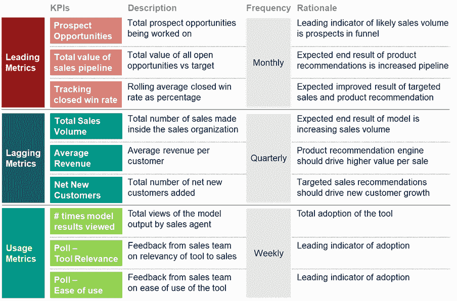
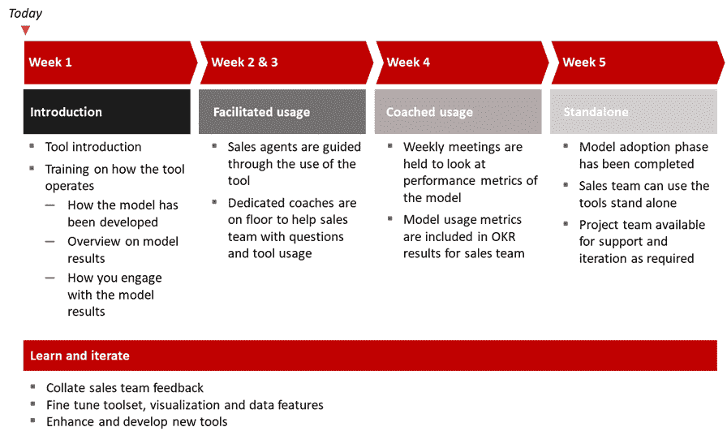

# 定义指标以推动机器学习模型的采用和价值

> 原文：<https://www.dominodatalab.com/blog/defining-clear-metrics-to-drive-model-adoption-and-value-creation>

企业数据科学最大的讽刺之一是，尽管数据科学团队擅长使用概率模型和诊断分析来预测收入或确定资产的潜在价值流，但在大多数情况下，很少有分析技术应用于他们衡量数据科学计划价值的方式。人们常说，企业内部没有任何变化，因为你已经建立了一个模型。

在某些情况下，数据科学确实会产生直接创收的模型，例如针对人们提供可以立即兑现的优惠的情境交易引擎。但是在大多数情况下，模型是价值创造的推动者，通过转变过程来创造新的效率或收入，或者通过实现更好的决策。

这是挑战的一部分，评估一个好决策的价值是困难的。

事后回顾糟糕决策对资产负债表的影响实在是太容易了。尽管如此，我们经常会失去关于可能影响底线结果的输入、假设和外部因素的背景。但是好的决策呢？我们如何跟踪通过更好的决策支持(如机器学习模型或诊断可视化)实现的价值，而不是由经验丰富的经理做出决策？

## 在数据科学项目的启动阶段，根据关键成功指标进行调整

数据科学家需要更好地在组织内部推销他们自己的成功。展示这些成功的一个关键要素是在任何项目启动阶段为利益相关者设定明确的期望。当你在设计你的问题陈述和与现有数据相关的初始假设时，开始解释你可以用什么指标来衡量有意义的成功。

这些指标可以分为三个主要类别

*   **领先指标**
    *   把这些看作是一个好的迹象，表明你正在采取的行动和活动将会带来积极的结果。这些信息可以是销售队列中处理的机会总量，或者是基于建议和提示记录在职业安全平台中的潜在健康和安全风险数量。
*   **滞后指标**
    *   这些指标只能在完整的预测阶段结束时进行测量；也就是说，如果我们预测某种商品的价格将会上涨，并且我们采取了行动，比如设定一个期货合约来创造一个固定价格，那么我们只能在商品价格刷新时衡量这种预测是否成功。这为我们提供了识别模型性能的真实指标。
*   **使用/健康指标**
    *   跟踪模型的总体使用情况和运行状况对于将更多数据科学项目转化为数据科学产品至关重要，数据科学产品是最终用户用来帮助转变业务运营和改进决策的工具。这些常常被数据科学团队遗忘，但最终会导致理解任何摩擦点。模型结果可能需要迭代，以便在业务中更有影响力。

从数据科学项目的开始[开始获取这些指标的过程应该被视为编写问题陈述和对该问题进行探索性数据分析的自然补充。作为一名数据科学家，您在分析数据时发现的许多诊断见解可用于确定关键的顶线指标，这些指标将指示模型将对业务部门产生切实影响的领域。](https://www.dominodatalab.com/resources/field-guide/managing-data-science-projects/)

## 如何创建简明的指标来设定更清晰的预期

就像在工作描述中写关键绩效指标一样，清晰、简洁、精确的指标非常重要。

评估模型的良好指标应包括以下内容:

*   指标类型(领先/滞后/使用)
*   度量名称
*   指标的描述
*   可以评估指标的频率
*   该指标为何重要的基本原理

就指标的基本原理达成一致，并确定可以跟踪该指标的频率，这是与您的业务利益相关者设定明确预期的一个重要阶段。

通过与您的利益相关者就可以使用哪些指标来评估可能的性能达成一致，意味着您不必等待一个完整的预测周期来评估模型的影响，反过来也意味着您能够确定在模型的初始构建中可能没有确定的其他重要因素。

如果我们只跟踪落后的绩效指标，那么我们就不能根据领先指标积极地影响一个模型将如何产生结果，我们可以以更快的节奏来衡量这些领先指标。

例如，许多销售组织每季度跟踪销售情况。这是因为完成一项销售活动需要很长时间。如果我们只在销售周期结束时审查模型的性能，我们可能会错过可以帮助我们改进或迭代模型本身以取得更大成功的主要元素。

我们可能会通过对问题的探索性分析来确定与成功的良好结果相关的度量。

Metric examples for a model optimizing sales results

假设我们已经建立了一个模型，根据人口统计分析和下一个最佳行动风格的产品推荐来识别具有最高成交率的潜在机会。我们还利用这种模式通过数字营销活动锁定潜在客户，因此，我们现在希望看到我们的机会渠道会显著扩大。

我们的愿望是通过更好地使产品符合他们的要求，并考虑捆绑销售等其他策略，来提高我们在渠道中的机会总量，并增加这些机会的价值。

我们可以通过查看我们渠道中的潜在机会总数、这些机会的交易得分(即销售人员认为交易可能完成的可能性)以及我们的机会相对于销售目标的总价值来跟踪这一点。

因为这些指标不需要我们是否成功完成销售的最终结果，我们可以以更高的频率跟踪它们，并使用它们来确定我们的模型结果对绩效产生的积极影响。

相反，如果我们没有看到对这些指标的积极影响，我们需要改进我们的模型运行方式以创造更好的结果，在这种情况下，我们将根据模型结果的真实测试所产生的新见解来迭代模型。

跟踪这些指标有助于我们理解我们的模型在初始阶段是否成功。它们还通过让销售团队更好地了解模型的表现，帮助我们推动采用。

## 利用使用/健康指标推动模型最终用户采用

正如 Gartner、Harvard 和其他组织提醒我们的那样，大多数模型无法在现代企业组织中投入生产。虽然许多人认为这个问题是技术部署挑战的问题，[我们最近与 DataIQ](https://www.dominodatalab.com/resources/dataiq-survey-how-to-scale-data-science/) 进行的一项调查指出，最终用户对模型的采用是主要的绊脚石。

越来越需要从产品管理原则中抽出一页来部署数据科学项目。

*   数据科学项目可以被认为是代码、计算和某种接口。
*   在数据科学产品中，我们开始考虑终端用户参与、模型结果和与之交互的工具的迭代设计，以及持续的[管理、监控和模型价值的测量](/resources/field-guide/machine-learning-model-management)。

考虑到这一点，我们必须确定健康和使用指标，使我们能够了解我们的模型结果如何被我们的最终用户采用，这些最终用户对该工具的看法如何，以及我们应该考虑进行哪些潜在的更改以使模型结果更具影响力。

再次使用我们的销售示例，我们确定了以下指标来跟踪我们的模型结果的使用情况/健康状况

*   销售代理查看模型结果的次数。
*   一项调查，旨在确定销售代理认为该模型与其销售流程的相关性。
*   通过投票来确定任何潜在的改进或迭代，从而改进工具。

这些指标允许我们比模型成功的指标更深入。它们支持数据科学团队和模型最终用户之间的双向交流。任何与模型性能相关的怪癖或者任何模型没有被采用的地方都可以被识别出来，并包含在一个整体的入职框架中。

Example model adoption framework for end-users

使用这些指标来制定推广计划有助于我们获得一致的早期反馈，这不依赖于我们评估模型是否有效的漫长销售周期。

包括对我们的用户进行投票，以了解他们如何看待模型以及他们可能做出的任何更改，这使我们进一步了解我们可能无法单独获得结果指标，并确保他们有一种方式来传达他们的想法，并感受到他们参与了数据科学产品本身的整体成功。

在采用的各个阶段，这些指标有助于保持业务部门的参与，并了解模型如何帮助推动其部门的成果，同时也意味着，在确定数据科学部门产生的价值时，我们有了更清晰的途径来确定我们的模型在业务的不同部分实现的商业价值。

## 结论

许多企业数据科学团队认为在个人层面跟踪数据科学项目的价值是一件棘手的事情。这通常是因为数据科学使业务部门能够更好地做出决策或改变他们的运营方式，这意味着直接的价值并不总是容易找到。

确保所有数据科学计划都包括成功的措施和指标，这是与业务部门保持一致并对模型结果如何实现价值产生明确预期的关键部分。尽管如此，这些度量标准不能仅仅依赖于最终结果——比如基于模型推荐的成功销售。

将这些指标整合到您的模型采用框架中有助于在业务最终用户和数据科学家之间建立更好的一致性。这有助于确保更多的模型投入生产，不仅仅是技术生产，还包括最终用户对模型结果的采纳。