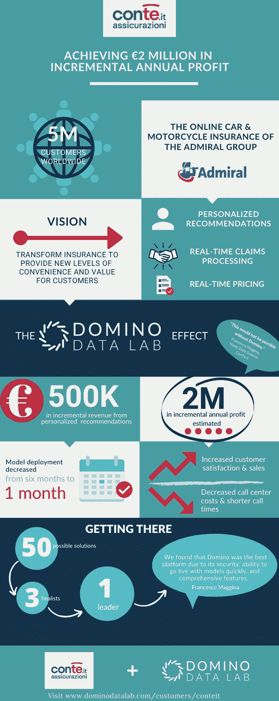

# 从模型驱动的保险产品推荐中实现 200 万欧元的年利润增量

> 原文：<https://www.dominodatalab.com/blog/delivering-2-million-in-incremental-annual-profit-from-model-driven-insurance-product-recommendations>

## ConTe.it 和 Admiral Group Europe 的数据科学

在全球范围内，保险公司面临着消费者对便利性、速度和服务的日益增长的期望。许多人转向数据科学和实时分析来推动创新服务和能力。

以 ConTe.it 为例。总部位于罗马的 [ConTe.it](https://www.conte.it/) 是专门从事汽车和摩托车保险的直接保险公司 [Admiral Group](https://admiralgroup.co.uk/) 的意大利品牌。Admiral Group 及其品牌在全球拥有 500 多万客户，在竞争激烈的保险业中，创新、便利和客户满意度已经成为他们的标志。

ConTe.it 数据科学主管 Francesco Maggina 预计，在未来五年内，机器学习将成为公司 DNA 的一部分，并改变一切，从他们如何为客户定价到他们处理索赔的速度。为此，他和来自该公司西班牙(Admiral Seguros 品牌)和法国(L'olivier 品牌)品牌的数据科学领导者采用了 [Domino 数据科学平台](/product/domino-enterprise-mlops-platform)来加速算法模型的开发和部署，这将有助于他们更好地了解和服务他们的客户。在 Domino 上构建和部署的一个新的推荐引擎已经使 ConTe.it 能够更快地引导客户找到他们需要的产品。它提高了客户满意度，并有望增加 200 万欧元的利润，通过这些有针对性的客户建议已经获得了超过 50 万欧元的额外收入。

下面的信息图表总结了他们的故事。点击阅读案例研究[了解更多详情。](/customers/conteit)

[Twitter](/#twitter) [Facebook](/#facebook) [Gmail](/#google_gmail) [Share](https://www.addtoany.com/share#url=https%3A%2F%2Fwww.dominodatalab.com%2Fblog%2Fdelivering-2-million-in-incremental-annual-profit-from-model-driven-insurance-product-recommendations%2F&title=Delivering%20%E2%82%AC2%20Million%20in%20Incremental%20Annual%20Profit%20from%20Model-driven%20Insurance%20Product%20Recommendations)