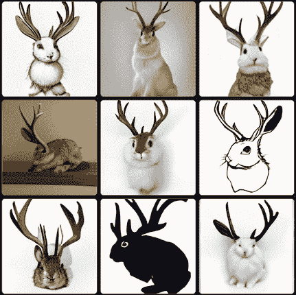
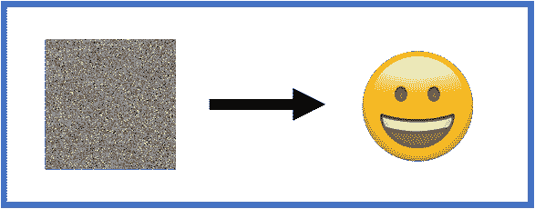
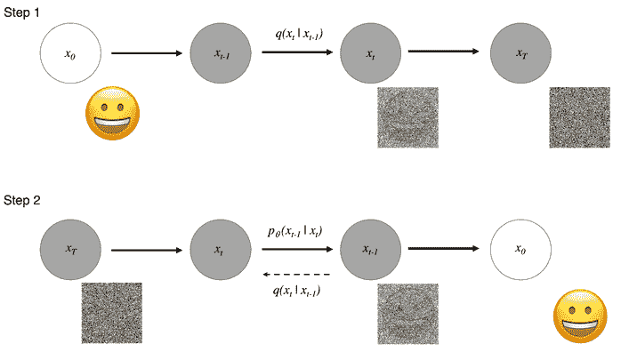

# 扩散模型——不仅仅是增加噪音

> 原文：<https://www.dominodatalab.com/blog/diffusion-models-more-than-adding-noise>

进入你最喜欢的社交媒体网站，使用搜索功能寻找 DALL-E。你可以查看 [此链接](https://twitter.com/search?q=%23Dall-E&src=typed_query&f=top) 查看 Twitter 中的一些例子。上下滚动一点，你会看到一些乍一看很容易辨认的图像。根据所描绘的场景，如果你多注意一点，你可能会发现在某些情况下图像有些不太对劲。在最好的情况下，可能会有一点(或很多)失真，在其他一些情况下，场景是完全古怪的。不，艺术家并不打算包括这种扭曲或古怪，就此而言，很可能这位艺术家甚至不是人。毕竟，DALL-E 是一个计算机模型，之所以这么叫，是因为它是受人喜爱的皮克斯机器人 Wall-E 和超现实主义艺术家 [萨瓦尔多·达利](https://en.wikipedia.org/wiki/Salvador_Dal%C3%AD) 的混合体。

你看到的图像是由文本输入数字生成的。换句话说，你提供你感兴趣的场景的描述，机器学习模型创建图像。我们生活在怎样的未来，对吗？DALL-E 模型于 2021 年 1 月由 [OpenAI](https://openai.com) ，宣布，最近 DALL-E 2 于 2022 年 7 月下旬进入测试阶段。2022 年 8 月下旬，OpenAI 推出了 [超涂](https://openai.com/blog/dall-e-introducing-outpainting/)——一种将图像延续到其原始边界之外的方法。不同的实现已经发布，您可以使用各种各样的实现。例如，看看[Cr**ai**yon](https://www.craiyon.com/)从文本中获得你自己的 AI 图像创作。

下面是我请求获取 jackalopes 图像的一些例子——你可能知道我把它们称为数据科学家的寓言……有关更多信息，请查看 [使用 Python 的数据科学和分析。](http://bit.ly/DataSciencePython) 在任何情况下，你都可以看到获得的一些描绘相当不错，例如第二行的第三个条目显示了一幅貌似真实的图画，很明显是一只长着鹿一样鹿角的野兔。在其他情况下，结果并没有那么好，例如，看看第 1 行和第 2 行的第二个条目——头部的尺寸与所选的身体明显不匹配，一个太小，另一个太大。无论如何，在克雷永(原名 [DALL-E mini](https://wandb.ai/dalle-mini/dalle-mini/reports/DALL-E-mini-Generate-Images-from-Any-Text-Prompt--VmlldzoyMDE4NDAy#:~:text=The%20Story%20Behind%20DALL·E%20mini) )创建这些例子的短暂时间内，我不会如此快速地创建这些例子。

OpenAI 发布的最初的 DALL-E 实现使用了 GPT-3 的版本，如果你需要了解更多，请查看我在这个网站上的帖子，标题为 [“变形金刚-自我关注救援”](https://www.dominodatalab.com/blog/transformers-self-attention-to-the-rescue) 。结合对比语言-图像预训练，或简称为 [剪辑](https://github.com/openai/CLIP) 和扩散建模，DALL-E 能够生成多种风格和排列的图像。这篇博文的重点是探索扩散模型背后的东西。让我们开始吧。

## 什么是扩散模型？

像许多伟大的概念扩展一样，扩散模型的灵感来自物理学，在这种情况下，使用的名称并不羞于显示其根源。扩散是一个过程，其中一些东西-原子、分子、能量、像素-从一个较高浓度的区域移动到另一个较低浓度的区域。当你把糖溶解在一杯咖啡里时，你会很熟悉这一点。起初，糖粒集中在你杯子顶部的一个特定位置，如果任其自然，它们会随机移动并自行分布。如果你通过搅拌来帮助这个过程，浓度梯度会加快，你可以一边享受你的加糖咖啡，一边保持清醒。

正如我们上面提到的，机器学习中的扩散模型从非平衡热力学中的扩散中获得灵感，其中该过程增加了系统的熵。这意味着扩散过程是自发的、不可逆的，换句话说，粒子(原子、像素等。)通过过程展开，但不会自发地重新排序。根据信息论，这相当于由于添加了额外的噪声而丢失了信息。

在 Sohl-Dickstein 等人题为 [“使用非平衡热力学的深度无监督学习”](https://arxiv.org/abs/1503.03585) 的论文中，非平衡统计物理学提供的动机是他们方法的核心。这个想法是通过慢慢地扰乱和破坏手边的数据分布结构来利用扩散的影响。与物理过程不同，目的是学习反向扩散(那应该叫做集中吗？)过程来恢复和生成数据中的结构。

像在热力学方法中一样，我们定义了扩散步骤的马尔可夫链，以将系统随机噪声添加到我们的数据中。反向扩散过程的学习使我们能够从噪声中构建具有所需属性的数据样本，在这种情况下，就像下图中从嘈杂的图像到笑脸表情符号。

简而言之，我们正在讨论一个两步过程:

1.  前向扩散步骤，其中系统地添加高斯噪声，直到数据实际上是噪声；和
2.  一个重建步骤，我们通过使用神经网络学习条件概率密度来“去噪”数据。

考虑上面的图表，我们已经概述了两个步骤。对于来自真实数据分布\(x_0 \simeq q(x) \)的数据点，前向扩散过程以$T$步向样本添加小的高斯噪声。步长由方差调度控制，使得\((0，1) \}^T_{t=1}中的\，并且我们得到\(q(x _ t | x _ { t-1 } = n(x _ t；\sqrt{1-\beta_t} x_{t-2}，\beta_t I) \)。在我们的图表中，对于步骤 1，我们从\( x_0 \)处的笑脸表情符号开始。当我们在每一步添加噪声时，我们洗掉了原始图像。在\(T \到\infty \)点，我们有一个各向同性的高斯分布。

在我们的第二步，我们采取了一个嘈杂的图像，我们感兴趣的是重建我们的笑脸表情。这是基于这样的假设，即如果我们可以逆转步骤 1 中的过程，我们就可以从高斯噪声输入中重建真实样本。遗憾的是，我们不能容易地估计\( q(x_{t-1} | x_t) \，因此需要学习一个模型\( p_{\theta} \)来逆转扩散过程。这就是图像生成的神奇之处。该模型所基于的马尔可夫公式确保了给定的反向扩散转移分布仅依赖于先前的时间步长，从而允许我们发展该过程。

当训练我们的扩散模型时，我们实际上是在寻找使训练数据的可能性最大化的反向马尔可夫转移。

## 使用不同方法生成图像

如果生成图像是游戏的名称，那么可能存在上述扩散模型的其他替代方案。让我们来看一些选择，并将它们与扩散模型进行比较和对比。

我们的图像生成的一种可能性是使用变分自动编码器(VAEs ),它通过将输入缩减到更低维度的潜在空间来进行编码。当我们解码结果时，模型试图重建输入，从而生成我们的图像。注意，vae 不仅被要求生成我们的图像，而且被要求以更紧凑的方式来表示它们(维度减少)。这意味着模型正在有效地学习生成训练数据的概率分布的基本特征。在某些情况下，这可能是一个缺点。

在这种情况下，通常提到的另一种可能性是使用基于流量的模型。在这种情况下，我们不使用编码器和解码器。相反，我们使用一系列可逆变换来直接模拟概率分布。我们不是对输入进行编码，而是对数据使用由神经网络参数化的函数\( f \)。当检索结果时，我们只需使用函数的反函数，即(f^{-1} \)。我们可以看到这是如何成为一个问题。

第三种可能性是使用甘斯。生成对抗网络(GAN)是一种使用深度学习的生成建模方法。实际上，它包括学习输入数据中的模式，从而可以使用该模型来生成新的示例，这些示例很可能是从原始数据中提取的。在 GAN 架构中，我们有两个神经网络，它们相互竞争来生成数据的合成实例。在本博客之前的一篇文章中，我们已经讨论了使用 GANs 的优势。为了用 GAN 从噪声中生成图像，我们的出发点是有用的条件变量的噪声。图像由所谓的生成器生成，结果由鉴别器判断是(或不是)从训练集中提取的良好的似是而非的数据。使用 GANs 时需要我们注意的一些方面是:在鉴别器太好的情况下，梯度消失的可能性；或者在生成器学习只产生特定输出的情况下模型崩溃，迫使鉴别器拒绝任何东西和一切。在 2021 年发表的一篇论文中[扩散模型在图像合成上击败了 GANs](https://arxiv.org/abs/2105.05233)，Dhariwal 等人展示了“扩散模型如何能够实现优于当前最先进的生成模型的图像样本质量。”

扩散模型似乎在生成图像方面占了上风，然而，它们也不是没有问题。在最近的一篇由两部分组成的文章([第一部分](https://developer.nvidia.com/blog/improving-diffusion-models-as-an-alternative-to-gans-part-1/)和[第二部分](https://developer.nvidia.com/blog/improving-diffusion-models-as-an-alternative-to-gans-part-2/))中，NVIDIA 的研究人员认为，尽管扩散模型实现了高样本质量和多样性，但它们在采样速度方面并不出色，这限制了它们在实际日常应用中的采用。然后，他们继续介绍 NVIDA 开发的解决这一问题的三种技术，即:

*   [潜在空间扩散模型](https://nvlabs.github.io/LSGM/)通过首先将数据嵌入平滑的潜在空间来简化数据，在该空间中可以训练更有效的扩散模型。
*   [临界阻尼朗之万扩散](https://nv-tlabs.github.io/CLD-SGM/)，一种改进的前向扩散过程，非常适合更简单、更快速的去噪和生成。
*   [去噪扩散 GANs](https://nvlabs.github.io/denoising-diffusion-gan/) 通过表达性多模态去噪分布直接学习显著加速的反向去噪过程。

扩散建模已经被证明是图像生成中非常稳健的方法。更重要的是，基于相同方法制作的[音频](https://arxiv.org/abs/2009.09761v1)和[视频](https://arxiv.org/abs/2204.03458)的进步已经得到了展示。下一次，当你看到一个嘈杂的画面或听到一些对你来说听起来像噪音的东西时，停下来想一想，这可能是一个美丽的场景、一部感人的电影或一首美妙的交响乐的开始。谁能想到！